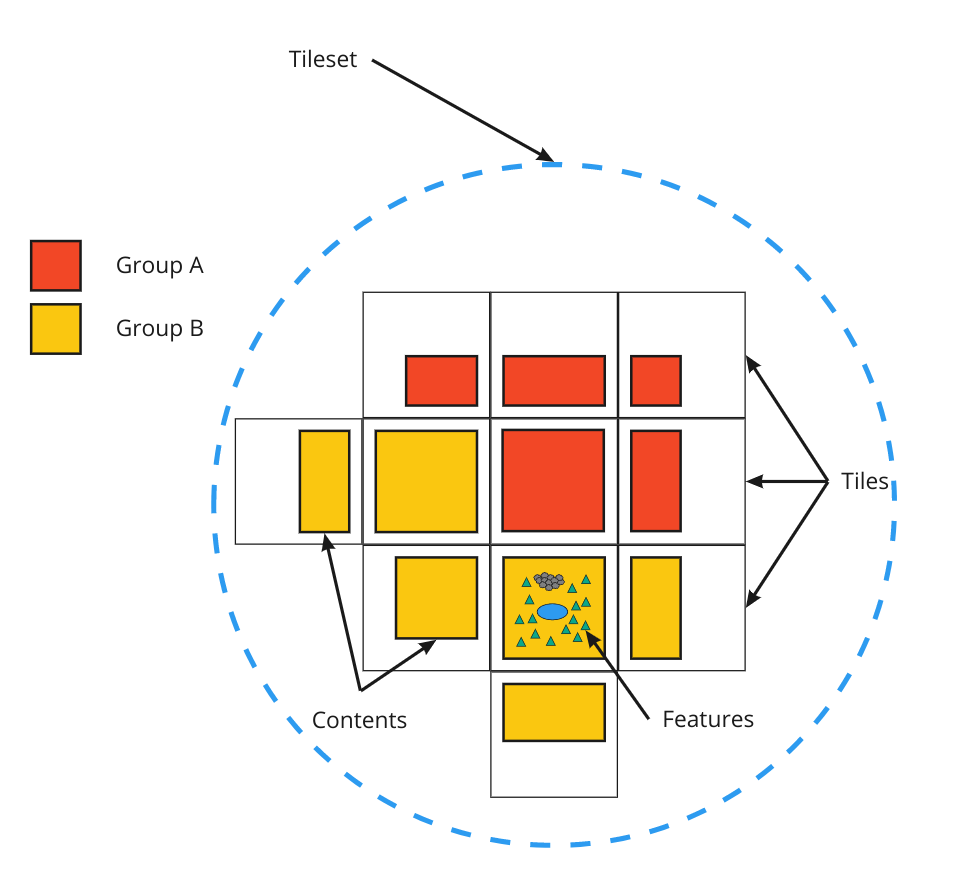
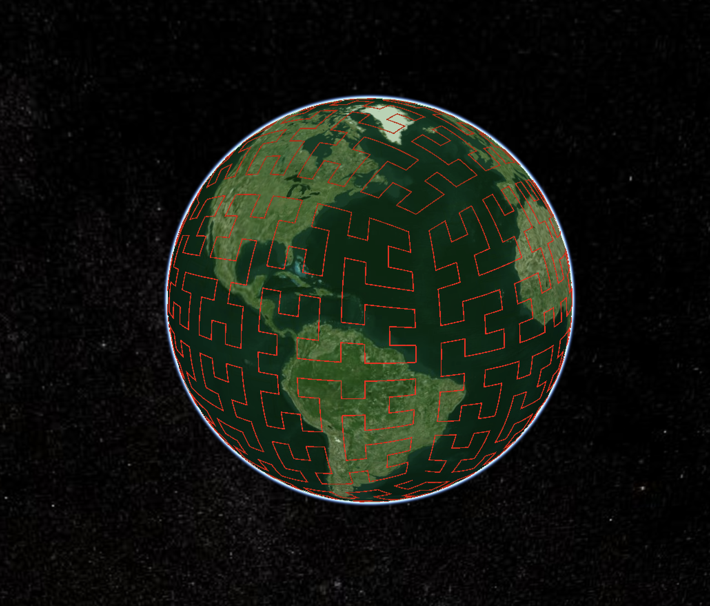

# 3D Tiles Next

**3D Tiles Next** is a set of capabilities for the future of 3D Tiles. Currently, they take the form of extensions to the [3D Tiles 1.0](./specification) specification. In the future, these extensions may be incorporated into 3D Tiles 2.0.

The 3D Tiles Next extensions add capabilities to 3D Tiles on a number of fronts:

3D Tiles Next **enables new methods for storing metadata.** Metadata can now be stored at different levels of granularity: tileset, tile, group, feature, and texture. Texture metadata allows for fine-grained storage of metadata down to individual texels. Feature metadata is similar to the existing Batch Table format, but allows for additional types such as enumerated types (enums). Tileset, tile and group metadata provide standardized methods to store coarse-grained metadata about a tileset.

**Implicit Tiling** is an alternate method for describing a tileset that **enables new algorithms and optimizations**. This compact tree representation allows for new tree traversal algorithms, raycasting, and faster spatial queries. It also **provides interoperability** with several geospatial formats such as CDB, TMS, WMTS, and S2.

**S2 Bounding Volumes** provide a tiling scheme that is **suited for global scale tilesets**. Cells at the same level of detail have approximately equal area. Furthermore, the [S2 tiling scheme](http://s2geometry.io/) is designed to **minimize distortion near the poles**.

**glTF is the future of 3D Tiles**. 3D Tiles Next provides an extension to support glTF models directly in a tileset. In the future, even 3D Tiles 1.0 formats (such as B3DM) will be rephrased as glTF models.

**Multiple Contents allows storing more than one content model per tile**. This enables storing more than one content in a single region of space. Contents can be organized in several ways (layers, arbitrary groupings), especially when combined with group metadata.

## Specifications

### [`3DTILES_content_gltf`](./extensions/3DTILES_content_gltf) (3D Tiles 1.0 extension)

This extension simply allows glTF models (`.gltf` `.glb`) directly in `tile.content`. This allows for easier integration with software that may produce glTF files, but not 3D Tiles 1.0 formats (such as B3DM).

### [`3DTILES_implicit_tiling`](./extensions/3DTILES_implicit_tiling) (3D Tiles 1.0 extension)

This extension introduces a more compact representation of quadtree and octree tilesets. It defines subtree files, which are binary files that represent which tiles and contents exist for a fixed-sized portion of the tree. This is more compact than explicitly listing bounding volumes for every tile.

Subtree files are designed to facilitate fast tree traversals, as each tile can be uniquely identified by its tile coordinates. It also makes it possible to use alternate traversal algorithms, or perform ray tracing.

### Metadata

#### [Cesium 3D Metadata Specification](./specification/Metadata)

This specification defines a standard metadata format for 3D data. This format is shared by two other extensions, `3DTILES_metadata` in 3D Tiles and `EXT_feature_metadata` in glTF.

3D Tiles Metadata defines key concepts such as schemas, property types, and storage formats.

#### [`3DTILES_metadata`](./extensions/3DTILES_metadata) (3D Tiles 1.0 extension)

This extension defines several granularities of metadata:

* Tileset Metadata
* Group Metadata
* Tile Metadata 

`3DTILES_metadata` also interacts with other extensions to add metadata capability:

* `3DTILES_implicit_tiling` - tile metadata can be stored in binary subtree files.
* `3DTILES_multiple_contents` - Each content in a tile can independently be added to groups for group metadata. This allows for more complex grouping behavior, such as organizing contents into layers. It also makes it easier to style and filter content using the group ID.

#### [`EXT_feature_metadata`](https://github.com/CesiumGS/glTF/tree/3d-tiles-next/extensions/2.0/Vendor/EXT_feature_metadata) (glTF 2.0 extension)

This extension adds 3D Tiles Metadata to glTF models. This can be used both in the context of 3D Tiles, as well as individual 3D models. The following levels of granularity are defined for feature metadata:

* **Per-feature metadata** - Vertices can be grouped into features; each feature has metadata. This works in a similar fashion to the Batch Table works in 3D Tiles 1.0
* **Per-vertex metadata** - features can be as fine-grained as individual vertices
* **Feature ID textures** - Textures allow very fine-grained metadata storage. Texels are grouped into features, each feature has metadata. This is essentially the texture equivalent of per-feature metadata. 
* **Feature Textures** - Each texel stores a value of a metadata property.

See the [Examples section](https://github.com/CesiumGS/glTF/tree/3d-tiles-next/extensions/2.0/Vendor/EXT_feature_metadata#examples) of the `EXT_feature_metadata` specification for several examples of how feature metadata can be used.

### [`3DTILES_bounding_volume_S2`](./extensions/3DTILES_bounding_volume_S2) (3D Tiles 1.0 extension)

This extension enables usage of S2 cells as bounding volumes for tiles. S2 cells can create tiles of roughly equal area all over the globe, with minimal distortion at the poles, and may be combined with 3DTILES_implicit_tiling to efficiently represent global scale tilesets.