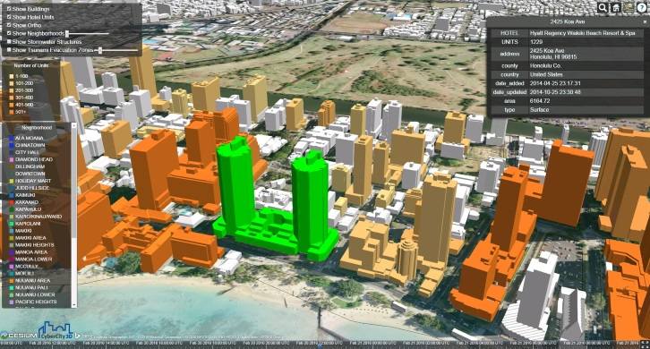
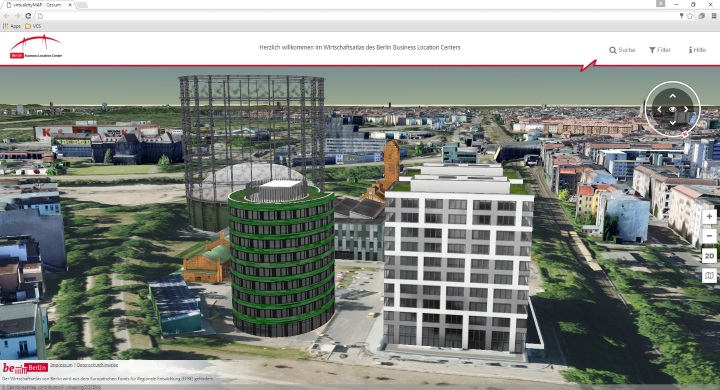
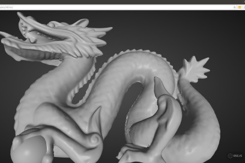
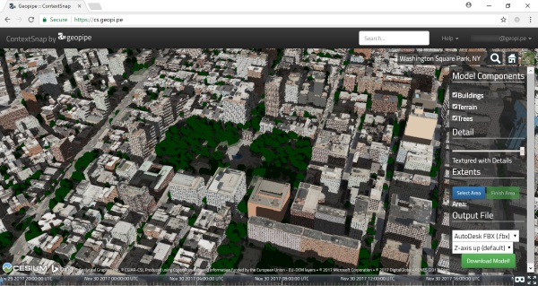

## Who's using 3D Tiles?

 [Cesium ion](https://www.cesium.com/) converters |  [Cesium](http://cesiumjs.org/) |
|:---:|:---:|
 [CyberCity3D](http://www.cybercity3d.com/) |  [virtualcitySYSTEMS](http://www.virtualcitysystems.de/en/)  |
 [Cityzenith](http://www.cityzenith.com/) |  [Fraunhofer](http://www.fraunhofer.de/en.html)  |
 [Vricon](http://www.vricon.com/) |  Federal Office of Topography   [swisstopo](https://map.geo.admin.ch)  |
 [Bentley ContextCapture](https://www.linkedin.com/pulse/contextcapture-web-publishing-cesium-aude-camus) |  [Bentley MicroStation](https://www.bentley.com/en/products/brands/microstation) (in progress) |
 [aero3Dpro](http://aero3dpro.com.au/) |  [Entwine](http://cesium.entwine.io/) |
 [GeoRocket](https://georocket.io/) 3DPS |  [OSGJS](http://osgjs.org/) (in progress) |
 [CSIRO Data61](https://www.data61.csiro.au/) |  [GameSim Conform](https://www.gamesim.com/3d-geospatial-conform/) |
 [SiteSee](http://www.sitesee.com.au/) (using three.js) | [Safe FME](https://www.safe.com/how-it-works/) |
[Peaxy](https://peaxy.net/) |  [Prototype Point Cloud Converter](https://github.com/mattshax/cesium_pnt_generator) |
 [VirtualGIS](https://www.virtualgis.io/) |  [LOPoCS ](https://github.com/Oslandia/lopocs) and [py3dtiles](https://github.com/Oslandia/py3dtiles)
 [iTowns 2](https://github.com/iTowns/itowns) |  [osm-cesium-3d-tiles](https://github.com/kiselev-dv/osm-cesium-3d-tiles) |
 [geopipe](https://geopi.pe/) |  [3D Digital Territory Lab](https://cesiumjs.org/demos/grandlyon/) |
 [Çeşme 3D City Model](https://cesiumjs.org/demos/Cesme3DCityModel/) |

## Live apps

* [NYC](https://cesiumjs.org/NewYork/index.html) by AGI
* [3D Swiss Federal Geoportal with 3 million buildings](https://map.geo.admin.ch/?topic=ech&lang=en&bgLayer=ch.swisstopo.pixelkarte-farbe&layers_visibility=false,false,false,false&layers_timestamp=18641231,,,&lon=8.82169&lat=47.21822&elevation=1213&heading=20.819&pitch=-37.770&layers=ch.swisstopo.zeitreihen,ch.bfs.gebaeude_wohnungs_register,ch.bav.haltestellen-oev,ch.swisstopo.swisstlm3d-wanderwege) by Swisstopo and AGI
* Bentley **ContextCapture**
   * [Orlando](https://d3h9zulrmcj1j6.cloudfront.net/Orlando_Cesium/App/index.html)
   * [Marseille](https://d3h9zulrmcj1j6.cloudfront.net/Marseille_Cesium/App/index.html)
* **aero3Dpro**
   * [Impact Of Coastal Erosion in NightCliff, Darwin](https://sample.aero3dpro.com.au/NightCliffe_2016/App/index.html), [Adelaide](https://adelaide.aero3d.com.au/App/index.html)
   * [Future buildings in Melbourne](https://sample.aero3dpro.com.au/Melbourne/App/index_kml.html)
* **virtualcityMAP** by virtualcitySYSTEMS
   * [10.1 million buildings](http://nrw.virtualcitymap.de/) in North Rhine-Westphalia (34.098 km²)
   * [Textured buildings](http://demo.virtualcitymap.de/?lang=en&layerToActivate=buildings&layerToDeactivate=buildings_untextured)
   * [Textured buildings + point clouds](http://demo.virtualcitymap.de/?lang=en&layerToActivate=buildings&layerToActivate=pointcloud&layerToDeactivate=buildings_untextured&cameraPosition=13.36091%2C52.50023%2C1614.17078&groundPosition=13.36085%2C52.51388%2C33.22668&distance=2192.72&pitch=-46.14&heading=359.84&roll=360.00)
   * [building solar potential](https://t.co/o2P6FXcW7L)
   * [Berlin Atlas of Economy](http://www.businesslocationcenter.de/wab/maps/main/) (switch to 3D and zoom in)
* [Downtown Miami](http://cybercity3d.s3-website-us-east-1.amazonaws.com/?city=Miami) by CyberCity3D and AGI
* [Entwine demos](http://cesium.entwine.io/), including [~4.7 billion points in NYC](http://cesium.entwine.io/?resource=nyc)
* AEROmetrex
   * [Impact Of Coastal Erosion in NightCliff, Darwin](https://sample.aero3dpro.com.au/NightCliffe_2016/App/index.html)
   * [10cm Melbourne, Australia metro](http://sample.aero3dpro.com.au/Melbourne/App/index.html)
   * [Gold Coast, Australia](http://sample.aero3dpro.com.au/Gold_Coast_Cesium/App/index.html)
   * [10cm Sydney, Australia](http://sample.aero3dpro.com.au/Sydney/App/index.html)
   * [Philadelphia](https://sample.aero3dpro.com.au/PHL_Cesium/App/index.html)
   * [10cm Brisbane](https://sample.aero3dpro.com.au/BrisbaneCBD/App/index.html)
* **VirtualGIS**: [2200 Miles of Pipeline](http://kxldemo.virtualgis.io)
* [UrbISOnline: 230,000 buildings Brussels](https://urbisonline.brussels/) ([article](http://bric.brussels/en/news_publications/news/urbis-adm-3d?set_language=en))

Also see the [3D Tiles Showcases video on YouTube](https://youtu.be/KoGc-XDWPDE).
