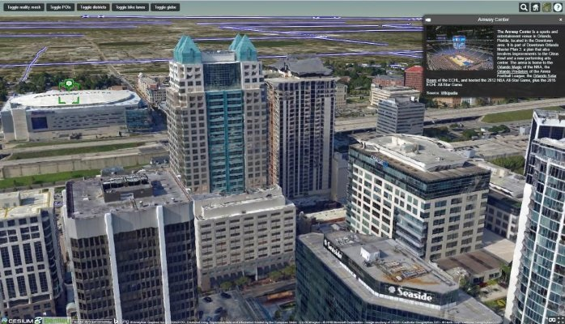
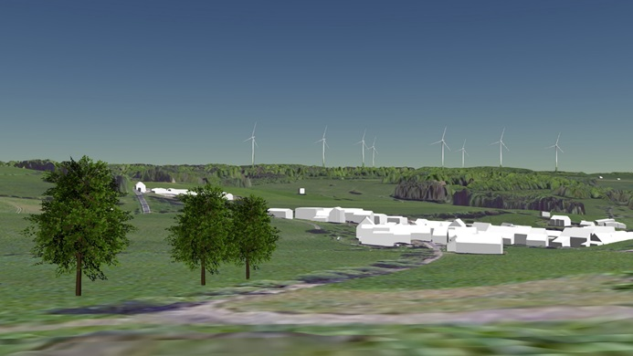
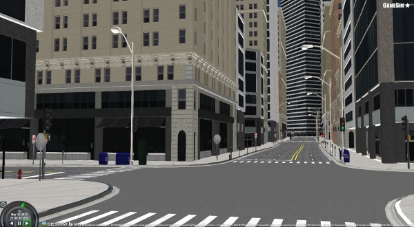
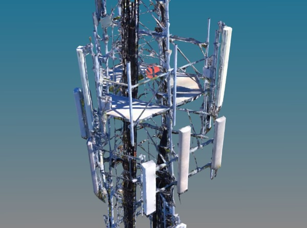
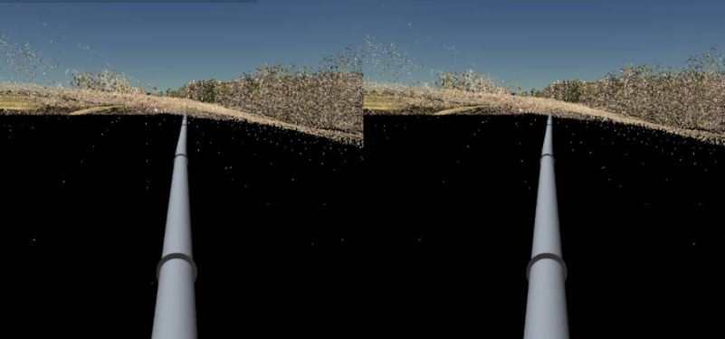
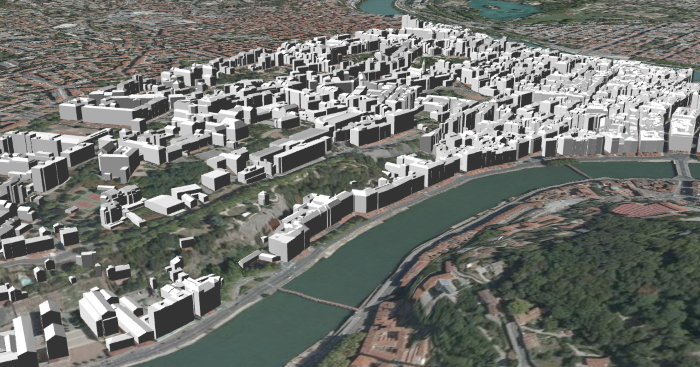
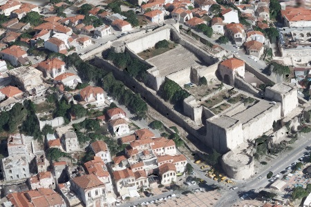

## Who's using 3D Tiles?

 [Cesium ion](https://www.cesium.com/) converters |  [Cesium](http://cesiumjs.org/) |
|:---:|:---:|
 [Vricon](http://www.vricon.com/) |  Federal Office of Topography   [swisstopo](https://map.geo.admin.ch)  |
 [Bentley ContextCapture](https://www.linkedin.com/pulse/contextcapture-web-publishing-cesium-aude-camus) |  [Bentley MicroStation](https://www.bentley.com/en/products/brands/microstation) (in progress) |
 [CyberCity3D](http://www.cybercity3d.com/) |  [virtualcitySYSTEMS](http://www.virtualcitysystems.de/en/)  |
 [Cityzenith](http://www.cityzenith.com/) |  [Fraunhofer](http://www.fraunhofer.de/en.html)  |  [aero3Dpro](http://aero3dpro.com.au/) |
 [GeoRocket](https://georocket.io/) 3DPS |  [OSGJS](http://osgjs.org/) (in progress) |
 [CSIRO Data61](https://www.data61.csiro.au/) |  [GameSim Conform](https://www.gamesim.com/3d-geospatial-conform/) |
 [SiteSee](http://www.sitesee.com.au/) (using three.js) | [Peaxy](https://peaxy.net/)  |
 [VirtualGIS](https://www.virtualgis.io/) |  [LOPoCS ](https://github.com/Oslandia/lopocs) and [py3dtiles](https://github.com/Oslandia/py3dtiles)
 [iTowns 2](https://github.com/iTowns/itowns) |  [osm-cesium-3d-tiles](https://github.com/kiselev-dv/osm-cesium-3d-tiles) |
 [geopipe](https://geopi.pe/) |  [3D Digital Territory Lab](https://cesiumjs.org/demos/grandlyon/) |
 [Çeşme 3D City Model](https://cesiumjs.org/demos/Cesme3DCityModel/) |
