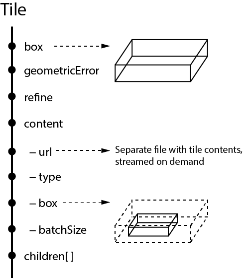
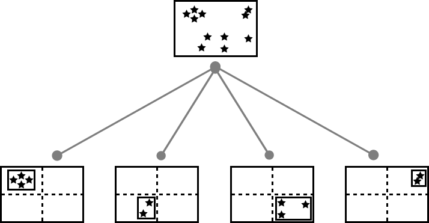
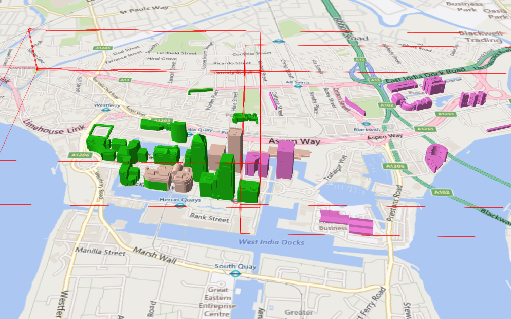
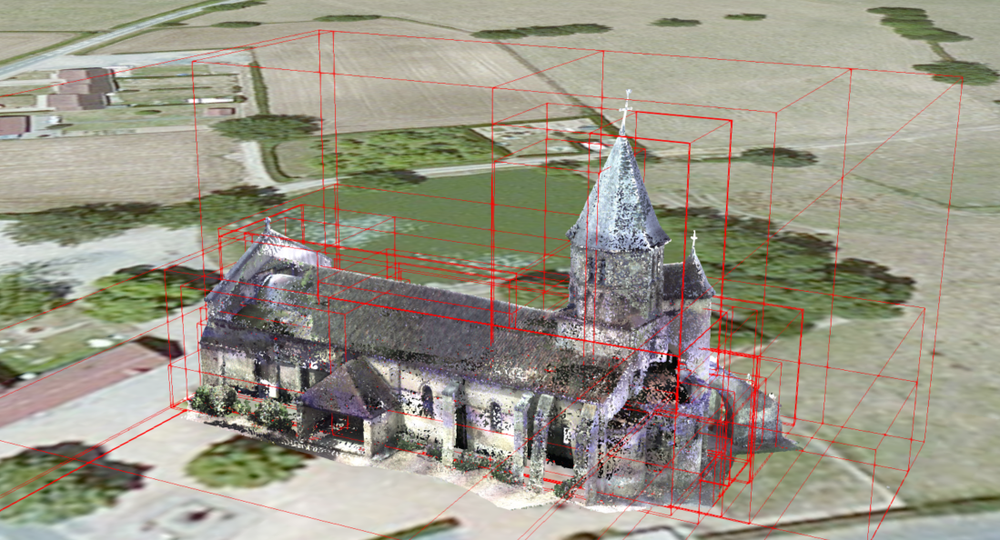
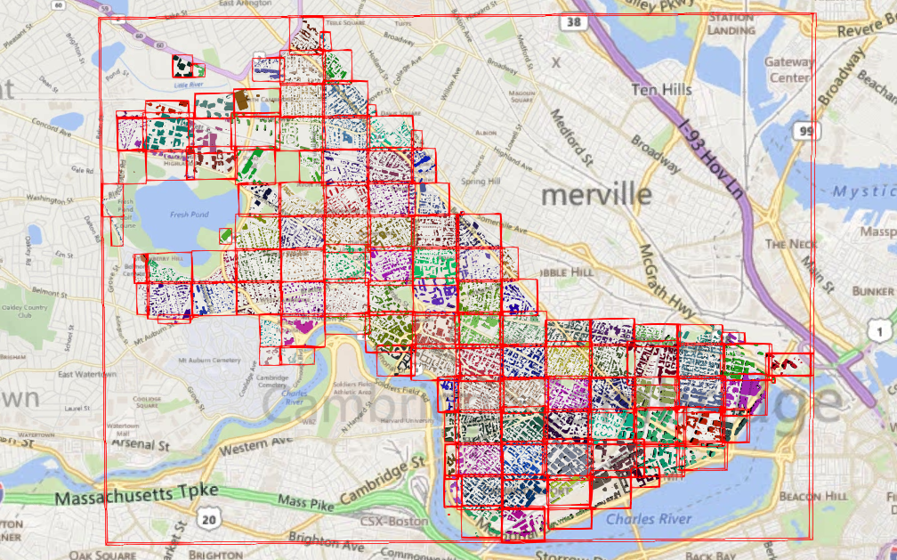

<p align="center"></p>

Specification for streaming massive heterogeneous **3D** geospatial datasets.

Contents:

* [Spec status](#status)
* [Introduction](#introduction)
* [Tile metadata](#Tile-Metadata)
* [tiles.json](#tiles.json)
   * [Creating spatial data structures](#Creating-Spatial-Data-Structures)
      * [K-d trees](#K-d-trees)
      * [Quadtrees](#Quadtrees)
      * [Octrees](#Octrees)
      * [Grids](#Grids)
* [Tile formats](#tileFormats)
* [Roadmap Q&A](#qa)
* [Data credits](#DataCredits)

<p align="center">
Created by the <a href="http://cesiumjs.org/">Cesium team</a> and built on <a href="https://www.khronos.org/gltf">glTF</a>.<br/>

<a href="http://cesiumjs.org/"></a> <a href="https://www.khronos.org/gltf"></a>
</p>

Discuss 3D Tiles on the [Cesium forum](http://cesiumjs.org/forum.html) or contact Patrick Cozzi, [@pjcozzi](https://twitter.com/pjcozzi).

---

<a name="status" />
## Spec status

The 3D Tiles spec is pre-1.0.  We expect it and the [Cesium implementation](https://github.com/AnalyticalGraphicsInc/cesium/compare/3d-tiles) to stabilize in the spring of 2016.

Topic  | Status
---|---
[tiles.json](#tiles.json)  | :white_check_mark: **Good starting point**, will expand as we add new tile formats
[Batched 3D Model](b3dm/README.md) (b3dm)  | :white_check_mark: **Solid base**, only minor changes expected
[Point Cloud](pnts/README.md) (pnts)  | :rocket: **Prototype**, needs compression and additional attributes
[Composite](TileFormats/Composite/README.md)  | :white_circle: **Not started**
[Instanced 3D Model](TileFormats/Instanced3DModel/README.md)  | :white_circle: **Not started**
[Vector Data](TileFormats/VectorData/README.md)  | :white_circle: **Not started**
[OpenStreetMap](TileFormats/OpenStreetMap/README.md)  | :white_circle: **Not started**
[Massive Model](TileFormats/MassiveModel/README.md)  | :white_circle: **Not started**
Terrain  | :white_circle: **Not started**, [quantized-mesh](https://cesiumjs.org/data-and-assets/terrain/formats/quantized-mesh-1.0.html) is a good starting point
Imposters  | :white_circle: **Not started**, could be covered by Vector Data
Stars  | :white_circle: **Not started**

For spec work in progress, [watch this repo](https://github.com/AnalyticalGraphicsInc/3d-tiles/subscription) and browse the [issues](https://github.com/AnalyticalGraphicsInc/3d-tiles/issues).

<a name="introduction" />
## Introduction

For an introduction to the motivation for and principles of 3D Tiles, see [Introducing 3D Tiles](http://cesiumjs.org/2015/08/10/Introducing-3D-Tiles/) on the Cesium blog.  Here, we cover the format itself.

In 3D Tiles, a _tileset_ is a set of _tiles_ organized in a spatial data structure, the _tree_.  Each tile has a bounding volume completely enclosing its contents.  The tree has spatial coherence; the bounding volume for child tiles are completely inside the parent's bounding volume.  To allow flexibility, the tree can be any spatial data structure with spatial coherence, including k-d trees, quadtrees, octrees, and grids.


Currently, the bounding volume is a "box" defined by minimum and maximum longitude, latitude, and height.  We expect 3D Tiles will eventually support different bounding volumes; see the [Q&A below](#What-bounding-volume-do-tiles-use).

A tile usually references a _model_ or set of _models_, e.g., 3D buildings.  These models may be batched together into essentially a single model to reduce client-side load time and WebGL draw call overhead.

<a name="Tile-Metadata" />
## Tile metadata

The metadata for each tile - not the actual contents - are defined in JSON.  For example:
```json
{
  "box": [
    -1.2419052957251926,
    0.7395016240301894,
    -1.2415404171917719,
    0.7396563300150859,
    0,
    20.4
  ],
  "geometricError": 43.88464075650763,
  "refine" : "add",
  "content": {
    "url": "2/0/0.b3dm",
    "type": "b3dm",
    "box": [
      -1.2418882438584018,
      0.7395016240301894,
      -1.2415422846940714,
      0.7396461198389616,
      0,
      19.4
    ],
    "batchSize": 29
  },
  "children": [...]
}
```
The top-level `box` property is an array of six numbers that define the bounding volume with the order `[west, south, east, north, minimum height, maximum height]`.  Longitudes and latitudes are in radians, and heights are in meters above (or below) the WGS84 ellipsoid.

The `geometricError` property is a nonnegative number that defines the error, in meters, introduced if this tile is rendered and its children are not.  At runtime, the geometric error is used to compute _Screen-Space Error_ (SSE), i.e., the error measured in pixels.  The SSE determines _Hierarchical Level of Detail_ (HLOD) refinement, i.e., if a tile is sufficiently detailed for the current view or if its children should be considered.

The `refine` property is an optional string that is either `"replace"` for replacement refinement or `"add"` for additive refinement.  When `refine` is omitted, it defaults to `"add"`.

The `content` property is an object that contains metadata about the tile's content and a link to the content.  `content.type` is a string that defines the [tile format](#tileFormats) and `content.url` is a string that points to the tile's contents with an absolute or relative url.  In the example above, the url, `2/0/0.b3dm`, has a TMS tiling scheme, `{z}/{y}/{x}.extension`, but this is not required; see the [roadmap Q&A](#How-do-I-request-the-tiles-for-Level-n).

`content.batchSize` is a nonnegative integer that defines the number of models batched in the tile, e.g., in the example above, there are 29 buildings in the tile.

`content.box` defines an optional bounding volume similar to the top-level `box` property. But unlike the top-level `box` property, `content.box` is a tightly fit box enclosing just the tile's contents.  This is used for replacement refinement; `box` provides spatial coherence and `content.box` enables tight view frustum culling. The screenshot below shows the bounding volumes for the root tile for [Canary Wharf](http://cesiumjs.org/CanaryWharf/).  `box`, shown in red, and encloses the entire area of the tileset; `content.box` shown in blue, encloses just the four models in the root tile.


`content` is optional.  When it is not defined, the tile's bounding volume is still used for culling (see [Grids](#Grids)).

`children` is an array of objects that define child tiles.  See the [section below](#tiles.json).



<a name="tiles.json" />
## tiles.json

_tiles.json_ defines a tileset.  Here is a subset of the tiles.json used for [Canary Wharf](http://cesiumjs.org/CanaryWharf/) (also see the complete [tiles.json](examples/tiles.json)):
```json
{
  "properties": {
    "Height": {
      "minimum": 1,
      "maximum": 241.6
    }
  },
  "geometricError": 494.50961650991815,
  "root": {
    "box": [
      -0.0005682966577418737,
      0.8987233516605286,
      0.00011646582098558159,
      0.8990603398325034,
      0,
      241.6
    ],
    "geometricError": 268.37878244706053,
    "content": {
      "url": "0/0/0.b3dm",
      "type": "b3dm",
      "box": [
        -0.0004001690908972599,
        0.8988700116775743,
        0.00010096729722787196,
        0.8989625664878067,
        0,
        241.6
      ],
      "batchSize": 4
    },
    "children": [..]
  }
}
```
The top-level object in tiles.json has three properties: `propertes`, `geometricError`, and `root`.

`propertes` is an object containing objects for each per-model property in the tileset.  This tiles.json snippet is for 3D buildings, so each tile has building models, and each building model has a `Height` property (see the _Batch Table_ in the [Batched 3D Model](b3dm/README.md) tile format).  The name of each object in `properties` matches the name of a per-model property, and defines its `minimum` and `maximum` numeric values, which are useful, for example, for creating color ramps for styling.

`geometricError` is a nonnegative number that defines the error, in meters, when the tileset is not rendered.

`root` is an object that defines the root tile using the JSON described in the [above section](#Tile-Metadata).  `root.geometricError` is not the same as tile.json's top-level `geometricError`.  tile.json's `geometricError` is the error when the entire tileset is not rendered; `root.geometricError` is the error when only the root tile is rendered.

`root.children` is an array of objects that define child tiles.  Each child tile has a `box` fully enclosed by its parent tile's `box` and, generally, a `geometricError` less than its parent tile's `geometricError`.  For leaf tiles, the length of this array is zero, and `children` may not be defined.

See the [Q&A below](#Will-tiles.json-be-part-of-the-final-3D-Tiles-spec) for how tiles.json will scale to a massive number of tiles. 

<a name="Creating-Spatial-Data-Structures" />
### Creating spatial data structures

The tree defined in tiles.json by `root` and, recursively, its `children`, can define different types of spatial data structures.  In addition, any combination of tile formats and refinement approach (replacement or additive) can be used, enabling a lot of flexibility to support heterogeneous datasets.

It is up to the conversion tool that generates tiles.json to define an optimal tree for the dataset.  A runtime engine, such as Cesium, is generic and will render any tree defined by tiles.json.  Here's a brief descriptions of how 3D Tiles can represent various spatial data structures.

<a name="K-d-trees" />
#### K-d trees

A k-d tree is created when each tile has two children separated by a _splitting plane_ parallel to the x, y, or z axis (or longitude, latitude, height).  The split axis is often round-robin rotated as levels increase down the tree, and the splitting plane may be selected using the median split, surface area heuristics, or other approaches.

<p align="center">
  <br />
  Example k-d tree.  Note the non-uniform subdivision.
</p>

Note that a k-d tree does not have uniform subdivision like typical 2D geospatial tiling schemes and, therefore, can create a more balanced tree for sparse and non-uniformly distributed datasets.

3D Tiles enable variations on k-d trees such as [multi-way k-d trees](http://www.crs4.it/vic/cgi-bin/bib-page.cgi?id=%27Goswami:2013:EMF%27) where, at each leaf of the tree, there are multiple splits along an axis.  Instead of having two children per tile, there are `n` children.

<a name="Quadtrees" />
#### Quadtrees

A quadtree is created when each tile has four uniformly subdivided children (e.g., using the center longitude and latitude) similar to typical 2D geospatial tiling schemes.  Empty child tiles can be omitted.

<p align="center">
  <br />
  Classic quadtree subdivision.
</p>

3D Tiles enable quadtree variations such as non-uniform subdivision and tight bounding volumes (as opposed to bounding, for example, the full 25% of the parent tile, which is wasteful for sparse datasets).

<p align="center">
  <br />
  Quadtree with tight bounding volumes around each child.
</p>

For example, here is the root tile and its children for Canary Wharf.  Note the bottom left, where the bounding volume does not include the water on the left where no buildings will appear:


3D Tiles also enable other quadtree variations such as [loose quadtrees](http://www.tulrich.com/geekstuff/partitioning.html), where child tiles overlap but spatial coherence is still preserved, i.e., a parent tile completely encloses all of its children.  This approach can be useful to avoid splitting models across tiles.

<p align="center">
  <br />
  Quadtree with non-uniform and overlapping tiles.
</p>

Below, the green buildings are in the left child and the purple buildings are in the right child.  Note that the tiles overlap so the two green and one purple building in the center are not split.



<a name="Octrees" />
#### Octrees

An octree extends a quadtree by using three orthogonal splitting planes to subdivide a tile into eight children.  Like quadtrees, 3D Tiles allow variations to octrees such as non-uniform subdivision, tight bounding volumes, and overlapping children.

<p align="center">
  <br />
  Traditional octree subdivision.
</p>

<p align="center">
  <br />
  Non-uniform octree subdivision for a point cloud using additive refinement. Point Cloud of <a href="http://robotics.cs.columbia.edu/~atroccol/ijcv/chappes.html">the Church of St Marie at Chappes, France</a> by Prof. Peter Allen, Columbia University Robotics Lab. Scanning by Alejandro Troccoli and Matei Ciocarlie
</p>

<a name="Grids" />
#### Grids

3D Tiles enable uniform, non-uniform, and overlapping grids by supporting an arbitrary number of child tiles.  For example, here is a top-down view of a non-uniform overlapping grid of Cambridge:



3D Tiles take advantage of empty tiles: those tiles that have a bounding volume, but no content. Since a tile's `content` property does not need to be defined, empty non-leaf tiles can be used to accelerate non-uniform grids with hierarchical culling. This essentially creates a quadtree or octree without hierarchical levels of detail (HLOD).

<a name="tileFormats" />
## Tile Formats

Each tile's `content.url` property points to a tile that is one of the following formats; see the [Status section](#status) for planned formats.

* [Batched 3D Model](b3dm/README.md) (b3dm) - 3D cities
* [Point Cloud](pnts/README.md) (pnts) - point clouds

A tileset can contain any combination of tile formats.  3D Tiles may also support different formats in the same tile; see the [roadmap Q&A](#How-do-3D-Tiles-support-heterogeneous-datasets).

<a name="qa" />
## Roadmap Q&A

* [General Q&A](#General-qa)
   * [Can I use 3D Tiles today?](#Can-I-use-3D-Tiles-today)
   * [Are 3D Tiles specific to Cesium?](#Are-3D-Tiles-specific-to-Cesium)
   * [What is the relationship between 3D Tiles and glTF?](#What-is-the-relationship-between-3D-Tiles-and-glTF)
   * [Do 3D Tiles support runtime editing?](#Do-3D-Tiles-support-runtime-editing)
   * [Will 3D Tiles include terrain?](#Will-3D-Tiles-include-terrain)
   * [Will 3D Tiles include imagery?](#Will-3D-Tiles-include-imagery)
   * [Will 3D Tiles replace KML?](#Will-3D-Tiles-replace-KML)
* [Technical Q&A](#Technical-qa)
   * [How do 3D Tiles support heterogeneous datasets?](#How-do-3D-Tiles-support-heterogeneous-datasets)
   * [Will tiles.json be part of the final 3D Tiles spec?](#Will-tiles.json-be-part-of-the-final-3D-Tiles-spec)
   * [How do I request the tiles for Level `n`?](#How-do-I-request-the-tiles-for-Level-n)
   * [What bounding volume do tiles use?](#What-bounding-volume-do-tiles-use)
   * [Will 3D Tiles support horizon culling?](#Will-3D-Tiles-support-horizon-culling)
   * [Is screen-space error the only metric used to drive refinement?](#Is-screen-space-error-the-only-metric-used-to-drive-refinement)
   * [How are cracks between tiles with vector data handled?](#How-are-cracks-between-tiles-with-vector-data-handled)
   * [When using replacement refinement, can multiple children be combined into one request?](#When-using-replacement-refinement-can-multiple-children-be-combined-into-one-request)
   * [How can additive refinement be optimized?](#How-can-additive-refinement-be-optimized)
   * [What compressed texture formats do 3D Tiles use?](#What-texture-compression-do-3D-Tiles-use)

<a name="General-qa" />
### General Q&A

<a name="Can-I-use-3D-Tiles-today" />
#### Can I use 3D Tiles today?

We expect the initial 3D Tiles spec to evolve until spring 2016.  If you are OK with things changing, then yes, jump in.  The Cesium implementation is in the [3d-tiles](https://github.com/AnalyticalGraphicsInc/cesium/tree/3d-tiles) branch.

<a name="Are-3D-Tiles-specific-to-Cesium" />
#### Are 3D Tiles specific to Cesium?

No, 3D Tiles are a general spec for streaming massive heterogeneous 3D geospatial datasets.  The Cesium team started this initiative because we need an open format optimized for streaming 3D content to Cesium.  [AGI](http://www.agi.com/), the founder of Cesium, is also developing tools for creating 3D Tiles.  We expect to see other visualization engines and conversion tools use 3D Tiles.

<a name="What-is-the-relationship-between-3D-Tiles-and-glTF" />
#### What is the relationship between 3D Tiles and glTF?

[glTF](https://www.khronos.org/gltf), the runtime asset format for WebGL, is an emerging open standard for 3D models from Khronos (the same group that does WebGL and COLLADA).  Cesium uses glTF as its 3D model format, and the Cesium team contributes heavily to the glTF spec and open-source COLLADA2GLTF converter.  We recommend using glTF in Cesium for individual assets, e.g., an aircraft, a character, or a 3D building.

We created 3D Tiles for streaming massive geospatial datasets where a single glTF model would be prohibitive.  Given that glTF is optimized for rendering, that Cesium has a well-tested glTF loader, and that there are existing conversion tools for glTF, 3D Tiles use glTF for some tile formats such as [b3dm](b3dm/README.md) (used for 3D buildings).  We created a binary glTF extension ([CESIUM_binary_glTF](https://github.com/KhronosGroup/glTF/blob/new-extensions/extensions/CESIUM_binary_glTF/README.md)) in order to embed glTF into binary tiles and avoid base64-encoding or multiple file overhead.

Taking this approach allows us to improve Cesium, glTF, and 3D Tiles at the same time, e.g., when we add mesh compression to glTF, it benefits 3D models in Cesium, the glTF ecosystem, and 3D Tiles.

<a name="Do-3D-Tiles-support-runtime-editing" />
#### Does 3D Tiles support runtime editing?

A common use case for 3D buildings is to stream a city dataset, color each building based on one or more properties (e.g., the building's height), and then hide a few buildings and replace them with high-resolution 3D buildings.  With 3D Tiles, this type of editing can be done at runtime.

The general case runtime editing of geometry on a building, vector data, etc., and then efficiently saving those changes in a 3D Tile will be possible, but is not the initial focus.  However, styling is much easier since it can be applied at runtime without modification to the 3D Tiles tree and is part of the initial work.

<a name="Will-3D-Tiles-include-terrain" />
#### Will 3D Tiles include terrain?

Yes, a [quantized-mesh](https://cesiumjs.org/data-and-assets/terrain/formats/quantized-mesh-1.0.html)-like tile would fit well with 3D Tiles and allow Cesium to use the same streaming code (we say _quantized-mesh-like_ because some of the metadata, e.g., for bounding volumes and horizon culling, may be organized differently or moved to tiles.json).

However, since Cesium already streams terrain well, we are not focused on this in the short-term.

<a name="Will-3D-Tiles-include-imagery" />
#### Will 3D Tiles include imagery?

Yes, there is an opportunity to provide an optimized base layer of terrain and imagery (similar to how a 3D model contains both geometry and textures).  There is also the open research problem of how to tile imagery for 3D.  In 2D, only one LOD (`z` layer) is used for a given view.  In 3D, especially when looking towards the horizon, tiles from multiple LODs are adjacent to each other.  How do we make the seams look good?  This will likely require tool and runtime support.

As with terrain, since Cesium already streams imagery well, we are not focused on this in the short-term.

<a name="Will-3D-Tiles-replace-KML" />
#### Will 3D Tiles replace KML?

In many cases, yes.  KML regions and network links are a clunky approach to streaming massive 3D geospatial datasets on the web.  3D Tiles are built for the web and optimized for streaming; true HLOD is used; polygons do not need to be triangulated; and so on.

<a name="Technical-qa" />
### Technical Q&A

<a name="How-do-3D-Tiles-support-heterogeneous-datasets" />
#### How do 3D Tiles support heterogeneous datasets?

Geospatial datasets are heterogeneous: 3D buildings are different from terrain, which is different from point clouds, which are different from vector data, and so on.

3D Tiles support heterogeneous data by allowing different tile formats in a tileset, e.g., a tileset may contain tiles for 3D buildings, tiles for instanced 3D trees, and tiles for point clouds, all using different tile formats.

We expect 3D Tiles will also support heterogeneous datasets by concatenating different tile formats into one tile, a _composite_; in the example above, a tile may have a short header followed by the content for the 3D buildings, instanced 3D trees, and point clouds.

Supporting heterogeneous datasets with both inter-tile (different tile formats in the same tileset) and intra-tile (different tile formats in the same tile) options will allow conversion tools to make trade-offs between number of requests, optimal type-specific subdivision, and how visible/hidden layers are streamed.

<a name="Will-tiles.json-be-part-of-the-final-3D-Tiles-spec" />
#### Will tiles.json be part of the final 3D Tiles spec?

Yes.  There will always be a need to know metadata about the tileset and about tiles that are not yet loaded, e.g., so only visible tiles can be requested.  However, when scaling to millions of tiles, a single tiles.json with metadata for the entire tree would be prohibitively large.

There's a few ways we may solve this:
* Trees of trees.  A `content.type` of `"3dtile"` is planned and will allow conversion tools to chunk up a tileset into any number of tiles.json files that reference each other.
* Moving subtree metadata to the tile payload instead of tiles.json.  Each tile would have a header with, for example, the bounding volumes of each child, and perhaps grandchildren, and so on.
* Explicit tile layout like those of traditional tiling schemes (e.g., TMS's `z/y/x`).  The challenge is that this implicitly assumes a spatial subdivision, whereas 3D Tiles are general enough to support quadtrees, octrees, k-d trees, and so on.  There is likely to be a balance where two or three explicit tiling schemes can cover common cases to complement the generic spatial data structures. 

<a name="How-do-I-request-the-tiles-for-Level-n" />
#### How do I request the tiles for Level `n`?

More generally, how do 3D Tiles support the use case for when the viewer is zoomed in very close to terrain, for example, and we do not want to load all the parent tiles toward the root of the tree; instead, we want to skip right to the high-resolution tiles needed for the current 3D view?

This 3D Tiles topic needs additional research, but the answer is basically the same as above: either the skeleton of the tree can be quickly traversed to find the desired tiles or an explicit layout scheme will be used for specific subdivisions.

<a name="What-bounding-volume-do-tiles-use" />
#### What bounding volume do tiles use?

Currently, tiles use a box defined by minimum and maximum longitude, latitude, and height (relative to the WGS84 ellipsoid).  Note that this is not actually a box in WGS84 Cartesian coordinates since the planes perpendicular to the ground are along the geodetic surface normal.

This bounding volume works OK for the general case, but 3D Tiles will likely support other bounding volumes such as bounding spheres and oriented bounding boxes defined in Cartesian coordinates.  The latter will allow, for example, BSP trees and better fit bounding volumes for cities not aligned with a line of longitude or latitude, and for arbitrary point clouds.

For example, consider the wasted space in the root bounding volume below and how it could be reduced by rotating it:


<a name="Will-3D-Tiles-support-horizon-culling" />
#### Will 3D Tiles support horizon culling?

Since [horizon culling](http://cesiumjs.org/2013/04/25/Horizon-culling/) is useful for terrain, 3D Tiles will likely support the metadata needed for it.  We haven't considered it yet since our initial work with 3D Tiles is for 3D buildings where horizon culling is not effective.

<a name="Is-screen-space-error-the-only-metric-used-to-drive-refinement" />
#### Is Screen-Space Error the only metric used to drive refinement?

At runtime, a tile's `geometricError` is used to compute the Screen-Space Error (SSE) to drive refinement.  We expect to expand this, for example, by using the [_Virtual Multiresolution Screen Space Error_](http://www.dis.unal.edu.co/profesores/pierre/MyHome/publications/papers/vmsse.pdf) (VMSSE), which takes occlusion into account.  This can be done at runtime without streaming additional tile metadata.

However, we do anticipate other metadata for driving refinement.  SSE may not be appropriate for all datasets; for example, points of interest may be better served with on/off distances and a label collision factor computed at runtime.  Note that the viewer's height above the ground is rarely a good metric for 3D since 3D supports arbitrary views.

<a name="How-are-cracks-between-tiles-with-vector-data-handled" />
#### How are cracks between tiles with vector data handled?

Unlike 2D, in 3D, we expect adjacent tiles to be from different LODs so, for example, in the distance, lower resolution tiles are used.  Adjacent tiles from different LODs can lead to an artifact called _cracking_ where there are gaps between tiles.  For terrain, this is generally handled by dropping _skirts_ slightly angled outward around each tile to fill the gap.  For 3D buildings, this is handled by extending the tile boundary to fully include buildings on the edge; [see above](#Quadtrees).  For vector data, this is an open research problem that we need to solve.  This could invole boundary-aware simplification or runtime stitching. 

<a name="When-using-replacement-refinement-can-multiple-children-be-combined-into-one-request" />
#### When using replacement refinement, can multiple children be combined into one request?

Often when using replacement refinement, a tile's children are not rendered until all children are downloaded (an exception, for example, is unstructured data such as point clouds, where clipping planes can be used to mask out parts of the parent tile where the children are loaded; naively using the same approach for terrain or an arbitrary 3D model results in cracking or other artifacts between the parent and child).

We may design 3D Tiles to support downloading all children in a single request by allowing tiles.json to point to a subset of a file for a tile's content similiar to glTF [buffer](https://github.com/KhronosGroup/glTF/blob/master/specification/buffer.schema.json) and [bufferView](https://github.com/KhronosGroup/glTF/blob/master/specification/bufferView.schema.json).  [HTTP/2](http://chimera.labs.oreilly.com/books/1230000000545/ch12.html#_brief_history_of_spdy_and_http_2) will also make the overhead of multiple requests less important.

<a name="How-can-additive-refinement-be-optimized" />
#### How can additive refinement be optimized?

Compared to replacement refinement, additive refinement has a size advantage because it doesn't duplicate data in the original dataset.  However, it has a disadvantage when there are expensive tiles to render near the root and the view is zoomed in close.  In this case, for example, the entire root tile may be rendered, but perhaps only one model or even no models are visible.

3D Tiles can optimize this by storing an optional spatial data structure in each tile.  For example, a tile could contain a simple 2x2 grid, and if the tile's bounding volume is not completely inside the view frustum, each box in the grid is checked against the frustum, and only those inside or intersecting are rendered.

<a name="What-texture-compression-do-3D-Tiles-use" />
#### What compressed texture formats do 3D Tiles use?

3D Tiles will support the same texture compression that glTF [will support](https://github.com/KhronosGroup/glTF/issues/59).  In addition, we need to consider how well GPU formats compress compared to, for example, jpeg.  Some desktop game engines stream jpeg, then decompress and recompress to a GPU format in a thread.  The CPU overhead for this approach may be too high for JavaScript and Web Workers.

<a name="DataCredits" />
## Data credits

The screenshots in this spec use awesome [CyberCity3D](http://www.cybercity3d.com/) buildings and the [Bing Maps](https://www.microsoft.com/maps/choose-your-bing-maps-API.aspx) base layer.
