<p align="center"></p>

Specification for streaming massive heterogeneous **3D** geospatial datasets.

3D Tiles has entered the Open Geospatial Consortium (OGC) [Community Standard](https://cesium.com/blog/2016/09/06/3d-tiles-and-the-ogc/) process.

---

Created by the <a href="http://cesiumjs.org/">Cesium team</a> and built on <a href="https://www.khronos.org/gltf">glTF</a>.<br/>

<a href="http://cesiumjs.org/"></a> <a href="https://www.khronos.org/gltf"></a>

Editor: Patrick Cozzi, [@pjcozzi](https://twitter.com/pjcozzi), [pcozzi@agi.com](mailto:pcozzi@agi.com).

## Who's using 3D Tiles?

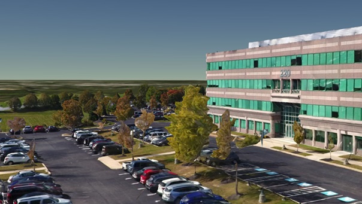 [Cesium Composer](https://www.cesium.com/) converters | 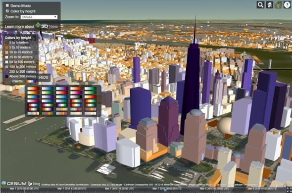 [Cesium](http://cesiumjs.org/) |
|:---:|:---:|
 [CyberCity3D](http://www.cybercity3d.com/) |  [virtualcitySYSTEMS](http://www.virtualcitysystems.de/en/)  |
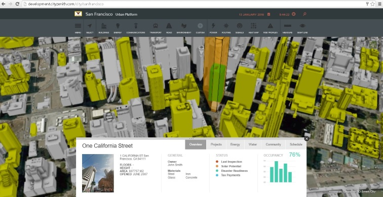 [Cityzenith](http://www.cityzenith.com/) |  [Fraunhofer](http://www.fraunhofer.de/en.html)  |
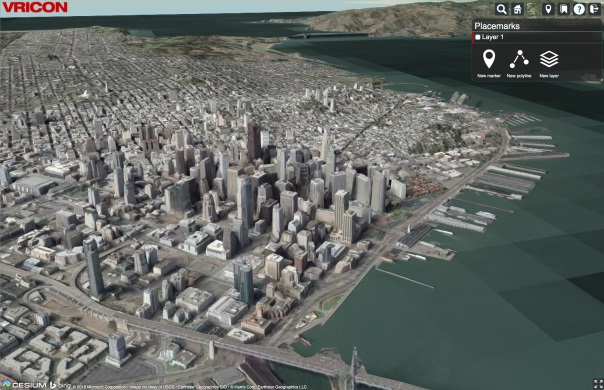 [Vricon](http://www.vricon.com/) | 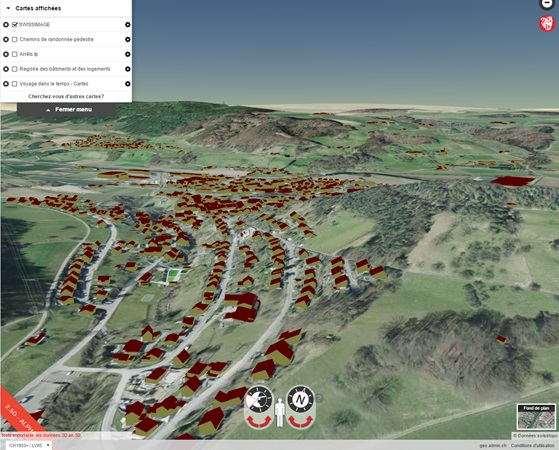 Federal Office of Topography <br/> [swisstopo](https://map.geo.admin.ch)  |
 [Bentley ContextCapture](https://www.linkedin.com/pulse/contextcapture-web-publishing-cesium-aude-camus) |  [Bentley MicroStation](https://www.bentley.com/en/products/brands/microstation) (in progress) |
 [aero3Dpro](http://aero3dpro.com.au/) | 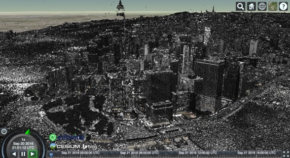 [Entwine](http://cesium.entwine.io/) |
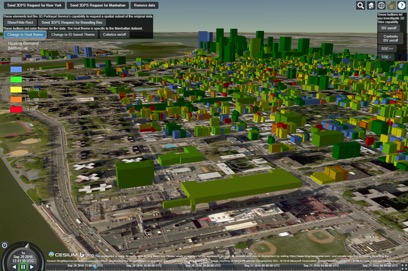 [GeoRocket](https://georocket.io/) 3DPS |  [OSGJS](http://osgjs.org/) (in progress) |
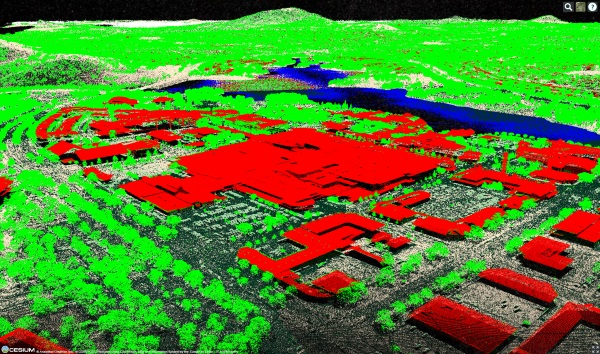 [CSIRO Data61](https://www.data61.csiro.au/) |  [GameSim Conform](https://www.gamesim.com/3d-geospatial-conform/) |
 [SiteSee](http://www.sitesee.com.au/) (using three.js) | [Safe FME](https://www.safe.com/how-it-works/) |
[Peaxy](https://peaxy.net/) |  [Prototype Point Cloud Converter](https://github.com/mattshax/cesium_pnt_generator) |
 [VirtualGIS](https://www.virtualgis.io/) | 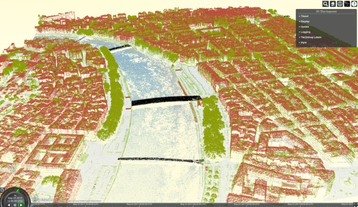 [LOPoCS ](https://github.com/Oslandia/lopocs) and [py3dtiles](https://github.com/Oslandia/py3dtiles)
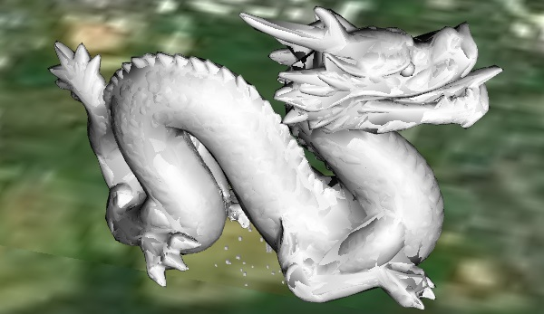 [iTowns 2](https://github.com/iTowns/itowns) | 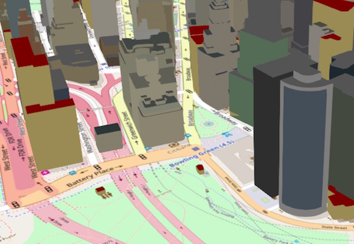 [osm-cesium-3d-tiles](https://github.com/kiselev-dv/osm-cesium-3d-tiles) |
 [geopipe](https://geopi.pe/) | 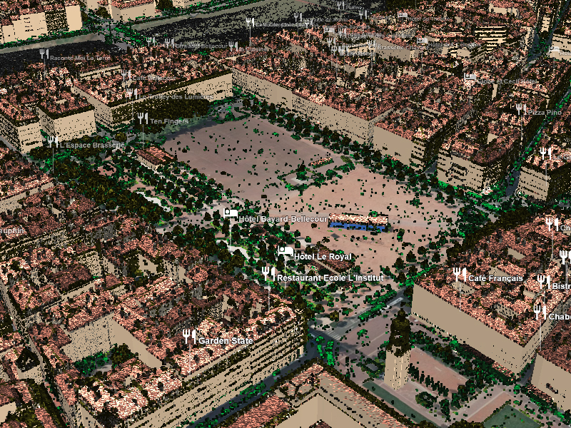 [3D Digital Territory Lab](https://cesiumjs.org/demos/grandlyon/) |  
 [Çeşme 3D City Model](https://cesiumjs.org/demos/Cesme3DCityModel/) |

## Live apps

* [NYC](https://cesiumjs.org/NewYork/index.html) by AGI
* [3D Swiss Federal Geoportal with 3 million buildings](https://map.geo.admin.ch/?topic=ech&lang=en&bgLayer=ch.swisstopo.pixelkarte-farbe&layers_visibility=false,false,false,false&layers_timestamp=18641231,,,&lon=8.82169&lat=47.21822&elevation=1213&heading=20.819&pitch=-37.770&layers=ch.swisstopo.zeitreihen,ch.bfs.gebaeude_wohnungs_register,ch.bav.haltestellen-oev,ch.swisstopo.swisstlm3d-wanderwege) by Swisstopo and AGI
* Bentley **ContextCapture**
   * [Orlando](https://d3h9zulrmcj1j6.cloudfront.net/Orlando_Cesium/App/index.html)
   * [Marseille](https://d3h9zulrmcj1j6.cloudfront.net/Marseille_Cesium/App/index.html)
* **aero3Dpro**
   * [Impact Of Coastal Erosion in NightCliff, Darwin](https://sample.aero3dpro.com.au/NightCliffe_2016/App/index.html), [Adelaide](https://adelaide.aero3d.com.au/App/index.html)
   * [Future buildings in Melbourne](https://sample.aero3dpro.com.au/Melbourne/App/index_kml.html)
* **virtualcityMAP** by virtualcitySYSTEMS
   * [10.1 million buildings](http://nrw.virtualcitymap.de/) in North Rhine-Westphalia (34.098 km²)
   * [Textured buildings](http://demo.virtualcitymap.de/?lang=en&layerToActivate=buildings&layerToDeactivate=buildings_untextured)
   * [Textured buildings + point clouds](http://demo.virtualcitymap.de/?lang=en&layerToActivate=buildings&layerToActivate=pointcloud&layerToDeactivate=buildings_untextured&cameraPosition=13.36091%2C52.50023%2C1614.17078&groundPosition=13.36085%2C52.51388%2C33.22668&distance=2192.72&pitch=-46.14&heading=359.84&roll=360.00)
   * [building solar potential](https://t.co/o2P6FXcW7L)
   * [Berlin Atlas of Economy](http://www.businesslocationcenter.de/wab/maps/main/) (switch to 3D and zoom in)
* [Downtown Miami](http://cybercity3d.s3-website-us-east-1.amazonaws.com/?city=Miami) by CyberCity3D and AGI
* [Entwine demos](http://cesium.entwine.io/), including [~4.7 billion points in NYC](http://cesium.entwine.io/?resource=nyc)
* AEROmetrex
   * [Impact Of Coastal Erosion in NightCliff, Darwin](https://sample.aero3dpro.com.au/NightCliffe_2016/App/index.html)
   * [10cm Melbourne, Australia metro](http://sample.aero3dpro.com.au/Melbourne/App/index.html)
   * [Gold Coast, Australia](http://sample.aero3dpro.com.au/Gold_Coast_Cesium/App/index.html)
   * [10cm Sydney, Australia](http://sample.aero3dpro.com.au/Sydney/App/index.html)
   * [Philadelphia](https://sample.aero3dpro.com.au/PHL_Cesium/App/index.html)
   * [10cm Brisbane](https://sample.aero3dpro.com.au/BrisbaneCBD/App/index.html)
* **VirtualGIS**: [2200 Miles of Pipeline](http://kxldemo.virtualgis.io)
* [UrbISOnline: 230,000 buildings Brussels](https://urbisonline.brussels/) ([article](http://bric.brussels/en/news_publications/news/urbis-adm-3d?set_language=en))

Also see the [3D Tiles Showcases video on YouTube](https://youtu.be/KoGc-XDWPDE).

---

## Contents

* [Resources](#resources)
* [Spec status](#spec-status)
* [Introduction](#introduction)
* [File extensions and MIME types](#file-extensions-and-mime-types)
* [JSON encoding](#json-encoding)
* [URIs](#uris)
* [Units](#units)
* [Coordinate reference system (CRS)](#coordinate-reference-system-crs)
* [Tiles](#tiles)
   * [Bounding volumes](#bounding-volumes)
      * [Region](#region)
      * [Box](#box)
      * [Sphere](#sphere)
   * [Coordinate system and units](#coordinate-system-and-units)
   * [Tile transform](#tile-transform)
   * [Viewer request volume](#viewer-request-volume)
* [Tileset JSON file](#tileset-json-files)
   * [External tilesets](#external-tilesets)
   * [Bounding volume spatial coherence](#bounding-volume-spatial-coherence)
   * [Creating spatial data structures](#creating-spatial-data-structures)
      * [K-d trees](#k-d-trees)
      * [Quadtrees](#quadtrees)
      * [Octrees](#octrees)
      * [Grids](#grids)
    * [Geometric error](#geometric-error)
* [Tile formats](#tile-formats)
* [Specifying extensions and application specific extras](#specifying-extensions-and-application-specific-extras)
* [Declarative styling](#declarative-styling)
* [Roadmap Q&A](#roadmap-qa)
* [Acknowledgments](#acknowledgments)
* [Data credits](#data-credits)

## Resources

* [Introducing 3D Tiles](https://cesium.com/blog/2015/08/10/introducing-3d-tiles/) - the motivation for and principles of 3D Tiles.  Read this first if you are new to 3D Tiles.
* [The Next Generation of 3D Tiles](https://cesium.com/blog/2017/07/12/the-next-generation-of-3d-tiles/) - future plans for 3D Tiles.
* **Cesium implementation**
   * Download [Cesium 1.35 or later](https://cesiumjs.org/downloads/) and check out the [Sandcastle examples labeled '3D Tiles'](http://cesiumjs.org/Cesium/Build/Apps/Sandcastle/index.html?src=3D%20Tiles%20BIM.html&label=3D%20Tiles).
   * [Roadmap](https://github.com/AnalyticalGraphicsInc/cesium/issues/3241).
* **Sample data**
   * [3d-tiles-samples](https://github.com/AnalyticalGraphicsInc/3d-tiles-samples) - sample tilesets for learning how to use 3D Tiles
   * [Simple 3D tilesets](https://github.com/AnalyticalGraphicsInc/cesium/tree/master/Specs/Data/Cesium3DTiles) used in the Cesium unit tests.
* **Tools**
   * [3d-tiles-tools](https://github.com/AnalyticalGraphicsInc/3d-tiles-tools) - upcoming tools for debugging, analyzing, and validating 3D Tiles tilesets.
* **Selected Talks**
   * _3D Tiles in Action_ ([pdf](https://cesium.com/presentations/files/3DTilesInAction.pdf)) at FOSS4G 2017.
   * _Point Clouds with 3D Tiles_ ([pdf](https://cesium.com/presentations/files/PointCloudsWith3DTiles.pdf)) at the OGC Technical Committee Meeting (June 2017).
   * _The Open Cesium 3D Tiles Specification: Bringing Massive Geospatial 3D Scenes to the Web_ ([pptx](https://cesium.com/presentations/files/Web3D-2016-3DTilesTutorial.pptx), [example tilesets](https://github.com/AnalyticalGraphicsInc/3d-tiles-samples)) at Web3D 2016.  90-minute technical tutorial.
   * _3D Tiles: Beyond 2D Tiling_ ([pdf](https://cesium.com/presentations/files/FOSS4GNA2016/3DTiles.pdf), [video](https://www.youtube.com/watch?v=I1vYCrMKKEE)) at FOSS4G NA 2016.
   * _3D Tiles motivation and ecosystem update_ ([pdf](https://cesium.com/presentations/files/3D-Tiles-OGC-DC.pdf)) at the OGC Technical Committee Meeting (March 2016).
   * _3D Tiles intro_ ([pdf](https://cesium.com/presentations/files/SIGGRAPH2015/Cesium3DTiles.pdf)) at the Cesium BOF at SIGGRAPH 2015.
* **Selected Articles**
   * [OneSky Using Cesium / 3D Tiles For Volumetric Airspace Visualization](https://onesky.blog/2018/04/16/onesky-using-cesium-3dtiles-for-volumetric-airspace-visualization/). April 2018.
   * [Draco Compressed Meshes with glTF and 3D Tiles](https://cesium.com/blog/2018/04/09/draco-compression/). April 2018.
   * [OGC Testbed-13: 3D Tiles and I3S Interoperability and Performance ER](http://docs.opengeospatial.org/per/17-046.html). March 2018.
   * [Historic Pharsalia Cabin Point Cloud Using Cesium & 3D Tiles](https://cesium.com/blog/2018/02/05/historic-pharsalia-cabin-point-cloud/). February 2018.
   * [Cesium's Participation in OGC Testbed 13](https://cesium.com/blog/2018/02/06/citygml-testbed-13/). February 2018.
   * [Adaptive Subdivision of 3D Tiles](https://cesium.com/blog/2017/08/11/Adaptive-Subdivision-of-3D-Tiles/). August 2017.
   * [Aerometrex and 3D Tiles](https://cesium.com/blog/2017/07/26/aerometrex-melbourne/). July 2017.
   * [Duke Using 3D Tiles for Excavation in Vulci](https://cesium.com/blog/2017/05/22/duke-vulci-photogrammetry/). May 2017.
   * [GERST Engineers, Agisoft PhotoScan, and 3D Tiles](https://cesium.com/blog/2017/05/19/gerst-engineers/). May 2017.
   * [Skipping Levels of Detail](https://cesium.com/blog/2017/05/05/skipping-levels-of-detail/). May 2017.
   * [Infrastructure Visualisation using 3D Tiles](http://www.sitesee.com.au/news/3dtiles). April 2017.
   * [SiteSee Photogrammetry and 3D Tiles](https://cesium.com/blog/2017/04/12/site-see-3d-tiles/). April 2017.
   * [Optimizing Spatial Subdivisions in Practice](https://cesium.com/blog/2017/04/04/spatial-subdivision-in-practice/). April 2017.
   * [Optimizing Subdivisions in Spatial Data Structures](https://cesium.com/blog/2017/03/30/spatial-subdivision/). March 2017.
   * [What's new in 3D Tiles?](https://cesium.com/blog/2017/03/29/whats-new-in-3d-tiles/) March 2017.
   * [Streaming 3D Capture Data using 3D Tiles](https://cesium.com/blog/2017/03/06/3d-scans/). March 2017.
   * [Visualizing Massive Models using 3D Tiles](https://cesium.com/blog/2017/02/21/massive-models/). February 2017.
   * [Bringing City Models to Life with 3D Tiles](https://medium.com/@CyberCity3D/bringing-city-models-to-life-with-3d-tiles-620d5884edf3#.mqxuj7kqd). September 2016.
   * [Using Quantization with 3D Models](https://cesium.com/blog/2016/08/08/cesium-web3d-quantized-attributes/). August 2016.
* **News**
   * [3D Tiles thread on the Cesium forum](https://groups.google.com/forum/#!topic/cesium-dev/tCCooBxpZFU) - get the latest 3D Tiles news and ask questions here.

## Spec status

The 3D Tiles spec is pre-1.0 (indicated by `"version": "0.0"` in the tileset JSON).  We expect a draft 1.0 version and the Cesium implementation to stabilize in 2017; see the [remaining items](https://github.com/AnalyticalGraphicsInc/3d-tiles/issues?q=is%3Aopen+is%3Aissue+label%3A1.0).

**Draft 1.0 Plans**

Topic  | Status
---|---
[Tileset JSON](#tileset-json-files)<br /><br />The tileset's spatial hierarchy  | :white_check_mark: **Solid base**, will add features as needed
[Batched 3D Model](TileFormats/Batched3DModel/README.md) (*.b3dm)<br /><br />Textured terrain and surfaces, 3D building exteriors and interiors, massive models, ...  | :white_check_mark: **Solid base**, only minor, if any, changes expected
[Instanced 3D Model](TileFormats/Instanced3DModel/README.md) (*.i3dm)<br /><br />Trees, windmills, bolts, ... | :white_check_mark: **Solid base**, only minor, if any, changes expected
[Point Cloud](TileFormats/PointCloud/README.md) (*.pnts)<br /><br />Massive number of points | :white_check_mark: **Solid base**, only minor, if any, changes expected
[Vector Data](TileFormats/VectorData/README.md) (*.vctr)<br /><br />Polygons, polylines, and placemarks | :white_circle: **In progress**, [#124](https://github.com/AnalyticalGraphicsInc/3d-tiles/pull/124/files)
[Composite](TileFormats/Composite/README.md) (*.cmpt)<br /><br />Combine heterogeneous tile formats | :white_check_mark: **Solid base**, only minor, if any, changes expected
[Declarative styling](Styling/README.md)<br/><br/>Style features using per-feature metadata  | :white_check_mark: **Solid base**, will add features/functions as needed, [#2](https://github.com/AnalyticalGraphicsInc/3d-tiles/issues/2)

**Post Draft 1.0 Plans**

Topic  | Status
---|---
Terrain v2  | :white_circle: **Not started**, [quantized-mesh](https://github.com/AnalyticalGraphicsInc/quantized-mesh/blob/master/README.md) is a good starting point; in the meantime, folks are using [Batched 3D Model](TileFormats/Batched3DModel/README.md)
[OpenStreetMap](TileFormats/OpenStreetMap/README.md)  | :white_circle: **Not started** Currently folks are using [Batched 3D Model](TileFormats/Batched3DModel/README.md)
Stars  | :white_circle: **Not started**

For spec work in progress, [watch this repo](https://github.com/AnalyticalGraphicsInc/3d-tiles/subscription) and browse the [issues](https://github.com/AnalyticalGraphicsInc/3d-tiles/issues).

## Introduction

In 3D Tiles, a _tileset_ is a set of _tiles_ organized in a spatial data structure, the _tree_.  Each tile has a bounding volume completely enclosing its contents.  The tree has spatial coherence; the content for child tiles are completely inside the parent's bounding volume.  To allow flexibility, the tree can be any spatial data structure with spatial coherence, including k-d trees, quadtrees, octrees, and grids.


To support tight fitting volumes for a variety of datasets&mdash;from regularly divided terrain to cities not aligned with a line of latitude or longitude to arbitrary point clouds&mdash;the bounding volume may be an oriented bounding box, a bounding sphere, or a geographic region defined by minimum and maximum latitudes, longitudes, and heights.

| Bounding box | Bounding sphere | Bounding region |
|:---:|:---:|:---:|
| 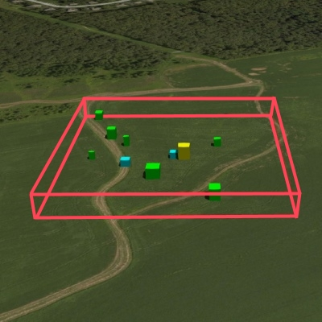 | 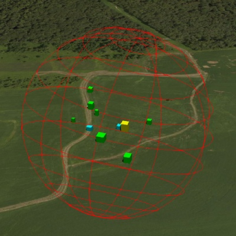 | 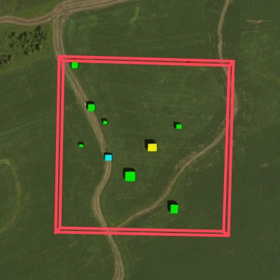 |


A tile references a _feature_ or set of _features_, such as 3D models representing buildings or trees, points in a point cloud, or polygons, polylines, and points in a vector dataset.  These features may be batched together into essentially a single feature to reduce client-side load time and rendering draw call overhead.

A 3D tileset consists of at least one tileset JSON file specifying the metadata and the tree of tiles, as well as any referenced tile content files which may be any valid tile format, defined in JSON as described below. 

Optionally, a separate 3D Tile Style may be applied to a tileset. 

## File extensions and MIME types
 
* Tileset files use the `.json` extension and the `application/json` MIME type.
* A tile's referenced content may be an external tileset JSON file (`application/json`), or the file type and MIME format specific to the [tile format](#tile-formats).
* Tileset style files use the `.json` extension and the `application/json` MIME type.

Explicit file extensions are optional for tileset and tile content files. Valid implementations may ignore it and identify a content's format by the `magic` field in its header.

## JSON encoding

3D Tiles has the following restrictions on JSON formatting and encoding.

  1. JSON must use UTF-8 encoding without BOM.
  2. All strings defined in this spec (properties names, enums) use only ASCII charset and must be written as plain text.
  3. Names (keys) within JSON objects must be unique, i.e., duplicate keys aren't allowed.

## URIs

3D Tiles use URIs to reference tile content. These URIs may point to [relative external references (RFC3986)] or be data URIs that embed resources in the JSON. Embedded resources use [the "data" URI scheme (RFC2397)](https://tools.ietf.org/html/rfc2397). 

When the URI is relative, its base is always relative to the referring tileset JSON file.

Client implementations are required to support relative external references and embedded resources. Optionally, client implementations may support other schemes (such as `http://`). All URIs must be valid and resolvable.

## Units

The unit for all linear distances is meters.

All angles are in radians.

## Coordinate reference system (CRS)

3D Tiles uses a global and local coordinate systems. Coordinates for top-level tileset and tile properties defined by bounding volumes are specified using a **global** coordinate system, the coordinate system for which depends on the type of [bounding volume](#bounding-volumes) used. A tileset's global coordinate system will often be [WGS84 ellipsoidal coordinate system](http://earth-info.nga.mil/GandG/publications/tr8350.2/wgs84fin.pdf), but it doesn't have to be.

Tile content uses a [**local** coordinate system](#local-coordinate-systems) independent of the global tileset coordinate system. An additional [tile transform](#tile-transform) may be applied to transform a tile's local coordinate system to the parent tile's coordinate system.

## Tiles

Tiles consist of content, metadata used to render the tile, and any children tiles. The following example shows one non-leaf tile.

```json
{
  "boundingVolume": {
    "region": [
      -1.2419052957251926,
      0.7395016240301894,
      -1.2415404171917719,
      0.7396563300150859,
      0,
      20.4
    ]
  },
  "geometricError": 43.88464075650763,
  "refine" : "ADD",
  "content": {
    "boundingVolume": {
      "region": [
        -1.2418882438584018,
        0.7395016240301894,
        -1.2415422846940714,
        0.7396461198389616,
        0,
        19.4
      ]
    },
    "url": "2/0/0.b3dm"
  },
  "children": [...]
}
```

The `boundingVolume` defines a volume enclosing the tile content, and is used to determine which tiles to render at runtime. The above example uses a `region` volume, but other [bounding volumes](#bounding-volumes), such as `box` or `sphere`, may be used.

The `geometricError` property is a nonnegative number that defines the error, in meters, introduced if this tile is rendered and its children are not.  At runtime, the geometric error is used to compute _Screen-Space Error_ (SSE), i.e., the error measured in pixels.  The SSE determines _Hierarchical Level of Detail_ (HLOD) refinement, i.e., if a tile is sufficiently detailed for the current view or if its children should be considered, see [Geometric error](#geometric-error).

The optional `viewerRequestVolume` property (not shown above) defines a volume, using the same schema as `boundingVolume`, that the viewer must be inside of before the tile's content will be requested and before the tile will be refined based on `geometricError`.  See the [Viewer request volume](#viewer-request-volume) section.

The `refine` property is a string that is either `"REPLACE"` for replacement refinement or `"ADD"` for additive refinement.  It is required for the root tile of a tileset; it is optional for all other tiles.  When `refine` is omitted, it is inherited from the parent tile.

The `content` property is an object that contains metadata about the tile's content and a link to the content.  `content.url` is a string that points to the tile's contents with an absolute or relative uri.  In the example above, the url, `2/0/0.b3dm`, has a TMS tiling scheme, `{z}/{y}/{x}.extension`, but this is not required; see the [Roadmap Q&A](#How-do-I-request-the-tiles-for-Level-n).

The uri can be another tileset JSON to create a tileset of tilesets.  See [External tilesets](#external-tilesets).

A file extension is not required for `content.url`.  A content's [tile format](#tile-formats) can be identified by the `magic` field in its header, or else as an external tileset if the content is JSON.

The `content.boundingVolume` property defines an optional [bounding volume](#bounding-volumes) similar to the top-level `boundingVolume` property. But unlike the top-level `boundingVolume` property, `content.boundingVolume` is a tightly fit bounding volume enclosing just the tile's contents.  `boundingVolume` provides spatial coherence and `content.boundingVolume` enables tight view frustum culling.  When it is not defined, the tile's bounding volume is still used for culling (see [Grids](#grids)). 

The screenshot below shows the bounding volumes for the root tile for [Canary Wharf](http://cesiumjs.org/CanaryWharf/).  `boundingVolume`, shown in red, encloses the entire area of the tileset; `content.boundingVolume` shown in blue, encloses just the four features (models) in the root tile.

 

The optional `transform` property (not shown above) defines a 4x4 affine transformation matrix that transforms the tile's `content`, `boundingVolume`, and `viewerRequestVolume` as described in the [Tile transform](#tile-transform) section.

The `children` property is an array of objects that define child tiles.  See the [tileset.json section below](#tilesetjson).


### Bounding volumes

Bounding volume objects are used to defined an enclosing volume, and must specify exactly one of the following properties. 

#### Region

The `boundingVolume.region` property is an array of six numbers that define the bounding geographic region in [EPSG:4326](http://spatialreference.org/ref/epsg/wgs-84/) coordinates with the order `[west, south, east, north, minimum height, maximum height]`.  Latitudes and longitudes are in radians, and heights are in meters above (or below) the [WGS84 ellipsoid](http://earth-info.nga.mil/GandG/publications/tr8350.2/wgs84fin.pdf).  

```JSON
"boundingVolume": {
  "region": [
    -1.3197004795898053,
    0.6988582109,
    -1.3196595204101946,
    0.6988897891,
    0,
    20
  ]
}
```


#### Box

The `boundingVolume.box` property is an array of 12 numbers that define an oriented bounding box in a right-handed 3-axis (x, y, z) Cartesian coordinate system where the _z_-axis is up. The first three elements define the x, y, and z values for the center of the box. The next three elements (with indices 3, 4, and 5) define the _x_-axis direction and half-length.  The next three elements (indices 6, 7, and 8) define the _y_-axis direction and half-length.  The last three elements (indices 9, 10, and 11) define the _z_-axis direction and half-length.

```JSON
"boundingVolume": {
  "box": [
    0,   0,   10,
    100, 0,   0,
    0,   100, 0,
    0,   0,   10
  ]
}
```


#### Sphere

The `boundingVolume.sphere` property is an array of four numbers that define a bounding sphere.  The first three elements define the x, y, and z values for the center of the sphere in a right-handed 3-axis (x, y, z) Cartesian coordinate system where the _z_-axis is up.  The last element (with index 3) defines the radius in meters.

```JSON
"boundingVolume": {
  "sphere": [
    0,
    0,
    10,
    141.4214
  ]
}
```


### Local coordinate systems

3D Tiles local coordinate systems use a right-handed 3-axis (x, y, z) Cartesian coordinate system; that is, the cross product of _x_ and _y_ yields _z_. 3D Tiles defines the _z_ axis as up for local Cartesian coordinate systems (additionally, see the [Tile transform](#tile-transform) section).

Some tile content types such as [Batched 3D Model](TileFormats/Batched3DModel/README.md) and [Instanced 3D Model](TileFormats/Instanced3DModel/README.md) embed glTF. According to the [glTF spec](https://github.com/KhronosGroup/glTF/tree/master/specification/2.0#coordinate-system-and-units), glTF uses a right-handed coordinate system and defines the _y_ axis as up. By default, the vertex positions of embedded models are defined according toto a right-handed coordinate system where the _y_-axis is up. 

In order to support a variety of source data, including models defined with geographical coordinate systems, vertex positions may be defined in a coordinate system where the _z_axis is up by specifying the [`CESIUM_z_up` glTF extension](TODO) in the embedded glTF.

> Implementation note: Using the `CESIUM_z_up` extension is preferred to transforming the vertex positions to a _z_-up coordinate system at runtime. 

If the `CESIUM_z_up` glTF extension is not used, model vertex positions must be transformed to be consistent with 3D Tiles' coordinate system. To transform coordinates from a glTF _y_-up system to a 3D Tiles' _z_-up system, rotate the positions about the _x_-axis by &piv;/2 radians. Equivalently, apply the following matrix transform:
```json
[
1.0, 0.0,  0.0, 0.0,
0.0, 0.0, -1.0, 0.0,
0.0, 1.0,  0.0, 0.0,
0.0, 0.0,  0.0, 1.0
]
```

Tile transforms are applied after the conversion between coordinate systems is resolved.

### Tile transform

To support local coordinate systems&mdash;e.g., so a building tileset inside a city tileset can be defined in its own coordinate system, and a point cloud tileset inside the building could, again, be defined in its own coordinate system&mdash;each tile has an optional `transform` property.

The `transform` property is a 4x4 affine transformation matrix, stored in column-major order, that transforms from the tile's local coordinate system to the parent tile's coordinate system&mdash;or the tileset's coordinate system in the case of the root tile.

The `transform` property applies to
* `tile.content`
   * Each feature's position.
   * Each feature's normal should be transformed by the top-left 3x3 matrix of the inverse-transpose of `transform` to account for [correct vector transforms when scale is used](http://www.realtimerendering.com/resources/RTNews/html/rtnews1a.html#art4).
   * `content.boundingVolume`, except when `content.boundingVolume.region` is defined, which is explicitly in EPSG:4326 coordinates.
* `tile.boundingVolume`, except when `tile.boundingVolume.region` is defined, which is explicitly in EPSG:4326 coordinates.
* `tile.viewerRequestVolume`, except when `tile.viewerRequestVolume.region` is defined, which is explicitly in EPSG:4326 coordinates.

The `transform` property does not apply to `geometricError`&mdash;i.e., the scale defined by `transform` does not scale the geometric error&mdash;the geometric error is always defined in meters.

When `transform` is not defined, it defaults to the identity matrix:
```json
[
1.0, 0.0, 0.0, 0.0,
0.0, 1.0, 0.0, 0.0,
0.0, 0.0, 1.0, 0.0,
0.0, 0.0, 0.0, 1.0
]
```

The transformation from each tile's local coordinate to the tileset's global coordinate system is computed by a top-down traversal of the tileset and by post-multiplying a child's `transform` with its parent's `transform` like a traditional scene graph or node hierarchy in computer graphics.

The following JavaScript code shows how to compute this using Cesium's [Matrix4](https://github.com/AnalyticalGraphicsInc/cesium/blob/master/Source/Core/Matrix4.js) and [Matrix3](https://github.com/AnalyticalGraphicsInc/cesium/blob/master/Source/Core/Matrix3.js) types.

```javascript
function computeTransforms(tileset) {
    var t = tileset.root;
    var transformToRoot = defined(t.transform) ? Matrix4.fromArray(t.transform) : Matrix4.IDENTITY;

    computeTransform(t, transformToRoot);
}

function computeTransform(tile, transformToRoot) {
    // Apply 4x4 transformToRoot to this tile's positions and bounding volumes

    var inverseTransform = Matrix4.inverse(transformToRoot, new Matrix4());
    var normalTransform = Matrix4.getRotation(inverseTransform, new Matrix3());
    normalTransform = Matrix3.transpose(normalTransform, normalTransform);
    // Apply 3x3 normalTransform to this tile's normals

    var children = tile.children;
    var length = children.length;
    for (var i = 0; i < length; ++i) {
        var child = children[i];
        var childToRoot = defined(child.transform) ? Matrix4.fromArray(child.transform) : Matrix4.clone(Matrix4.IDENTITY);
        childToRoot = Matrix4.multiplyTransformation(transformToRoot, childToRoot, childToRoot);
        computeTransform(child, childToRoot);
    }
}
```

For an example of the computed transforms (`transformToRoot` in the code above) for a tileset, consider:


The computed transform for each tile is:
* `TO`: `[T0]`
* `T1`: `[T0][T1]`
* `T2`: `[T0][T2]`
* `T3`: `[T0][T1][T3]`
* `T4`: `[T0][T1][T4]`

The positions and normals in a tile's content may also have tile-specific transformations applied to them _before_ the tile's `transform` (before indicates post-multiplying for affine transformations).  Some examples are:
* `b3dm` and `i3dm` tiles embed glTF, which defines its own node hierarchy, where each node has a transform.  These are applied before `tile.transform`.
* `i3dm`'s Feature Table defines per-instance position, normals, and scales.  These are used to create per-instance 4x4 affine transform matrices that are applied to each instance before `tile.transform`.
* Compressed attributes, such as `POSITION_QUANTIZED` in the Feature Tables for `i3dm`, `pnts`, and `vctr`, and `NORMAL_OCT16P` in `pnts` should be decompressed before any other transforms.

Therefore, the full computed transforms for the above example are:
* `TO`: `[T0]`
* `T1`: `[T0][T1]`
* `T2`: `[T0][T2][pnts-specific Feature Table properties-derived transform]`
* `T3`: `[T0][T1][T3][b3dm-specific transform, including the glTF node hierarchy]`
* `T4`: `[T0][T1][T4][i3dm-specific transform, including per-instance Feature Table properties-derived transform and the glTF node hierarchy]`

### Viewer request volume

A tile's `viewerRequestVolume` can be used for combining heterogeneous datasets, and can be combined with [external tilesets](#external-tilesets).

The following example has a building in a `b3dm` tile and a point cloud inside the building in a `pnts` tile.  The point cloud tile's `boundingVolume` is a sphere with a radius of `1.25`.  It also has a larger sphere with a radius of `15` for the `viewerRequestVolume`.  Since the `geometricError` is zero, the point cloud tile's content is always rendered (and initially requested) when the viewer is inside the large sphere defined by `viewerRequestVolume`.

```javascript
"children": [{
  "transform": [
     4.843178171884396,   1.2424271388626869, 0,                  0,
    -0.7993325488216595,  3.1159251367235608, 3.8278032889280675, 0,
     0.9511533376784163, -3.7077466670407433, 3.2168186118075526, 0,
     1215001.7612985559, -4736269.697480114,  4081650.708604793,  1
  ],
  "boundingVolume": {
    "box": [
      0,     0,    6.701,
      3.738, 0,    0,
      0,     3.72, 0,
      0,     0,    13.402
    ]
  },
  "geometricError": 32,
  "content": {
    "url": "building.b3dm"
  }
}, {
  "transform": [
     0.968635634376879,    0.24848542777253732, 0,                  0,
    -0.15986650990768783,  0.6231850279035362,  0.7655606573007809, 0,
     0.19023066741520941, -0.7415493329385225,  0.6433637229384295, 0,
     1215002.0371330238,  -4736270.772726648,   4081651.6414821907, 1
  ],
  "viewerRequestVolume": {
    "sphere": [0, 0, 0, 15]
  },
  "boundingVolume": {
    "sphere": [0, 0, 0, 1.25]
  },
  "geometricError": 0,
  "content": {
    "url": "points.pnts"
  }
}]
```

_TODO: screenshot showing the request vs. bounding volume_

For more on request volumes, see the [sample tileset](https://github.com/AnalyticalGraphicsInc/3d-tiles-samples/tree/master/tilesets/TilesetWithRequestVolume) and [demo video](https://www.youtube.com/watch?v=PgX756Yzjf4).

## Tileset JSON Files

3D Tiles use one main tileset JSON file as the entry point to define a tileset. Both entry and external tileset JSON files are not required to follow a specific naming convention.

See the [schema](schema) for the detailed tileset JSON schema.

Here is a subset of the tileset file used for [Canary Wharf](http://cesiumjs.org/CanaryWharf/) (also see the complete file, [`tileset.json`](examples/tileset.json)):
```json
{
  "asset" : {
    "version": "0.0",
    "tilesetVersion": "e575c6f1-a45b-420a-b172-6449fa6e0a59",
    "gltfUpAxis": "Y"
  },
  "properties": {
    "Height": {
      "minimum": 1,
      "maximum": 241.6
    }
  },
  "geometricError": 494.50961650991815,
  "root": {
    "boundingVolume": {
      "region": [
        -0.0005682966577418737,
        0.8987233516605286,
        0.00011646582098558159,
        0.8990603398325034,
        0,
        241.6
      ]
    },
    "geometricError": 268.37878244706053,
    "content": {
      "url": "0/0/0.b3dm",
      "boundingVolume": {
        "region": [
          -0.0004001690908972599,
          0.8988700116775743,
          0.00010096729722787196,
          0.8989625664878067,
          0,
          241.6
        ]
      }
    },
    "children": [..]
  }
}
```

The top-level object in the tileset JSON has four properties: `asset`, `properties`, `geometricError`, and `root`.

`asset` is an object containing properties with metadata about the entire tileset. The `asset.version` property is a string that defines the 3D Tiles version, which specifies the JSON schema for the tileset file and the base set of tile formats.  The `tilesetVersion` property is an optional string that defines an application-specific version of a tileset, e.g., for when an existing tileset is updated. The `gltfUpAxis` property is an optional string that specifies the up-axis of glTF models contained in the tileset.

`properties` is an object containing objects for each per-feature property in the tileset.  This tileset file snippet is for 3D buildings, so each tile has building models, and each building model has a `Height` property (see [Batch Table](TileFormats/BatchTable/README.md)).  The name of each object in `properties` matches the name of a per-feature property, and its value defines its `minimum` and `maximum` numeric values, which are useful, for example, for creating color ramps for styling.

`geometricError` is a nonnegative number that defines the error, in meters, when the tileset is not rendered, see [Geometric error](#geometric-error).

`root` is an object that defines the root tile using the JSON described in the [above section](#tile-content).  `root.geometricError` is not the same as the tileset's top-level `geometricError`.  tileset. The tileset's `geometricError` is the error when the entire tileset is not rendered; `root.geometricError` is the error when only the root tile is rendered.

`root.children` is an array of objects that define child tiles.  Each child tile's `content.boundingVolume` is fully enclosed by its parent tile's `boundingVolume` and, generally, a `geometricError` less than its parent tile's `geometricError`.  For leaf tiles, the length of this array is zero, and `children` may not be defined.

See the [Q&A below](#will-a-tileset-file-be-part-of-the-final-3d-tiles-spec) for how a tileset file will scale to a massive number of tiles.

### External tilesets

To create a tree of trees, a tile's `content.url` can point to an external tileset (the uri of another tileset JSON file).  This enables, for example, storing each city in a tileset and then having a global tileset of tilesets.

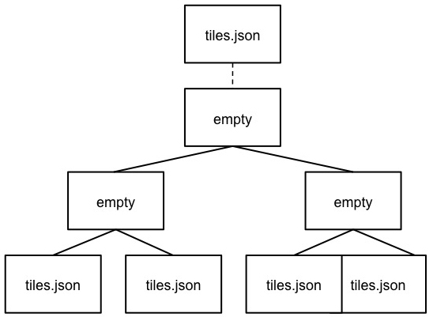

When a tile points to an external tileset, the tile:

* Cannot have any children; `tile.children` must be `undefined` or an empty array.
* Cannot be used to create cycles, for example, by pointing to the same tileset file containing the tile or by pointing to another tileset file that then points back to the initial file containing the tile.
* Will be transformed by both the tile's `transform` and root tile's `transform`.  For example, in the following tileset referencing an external tileset, the computed transform for `T3` is `[T0][T1][T2][T3]`.


### Bounding volume spatial coherence

As described above, the tree has spatial coherence; each tile has a bounding volume completely enclosing its contents, and the content for child tiles are completely inside the parent's bounding volume.  This does not imply that a child's bounding volume is completely inside its parent's bounding volume.  For example:

<p align="center">
  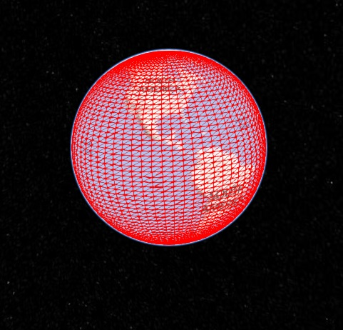<br />
  Bounding sphere for a terrain tile.
</p>

<p align="center">
  <br />
  Bounding spheres for the four child tiles.  The children's content is completely inside the parent's bounding volume, but the children's bounding volumes are not since they are not tightly fit.
</p>

### Creating spatial data structures

The tree defined in a tileset by `root` and, recursively, its `children`, can define different types of spatial data structures.  In addition, any combination of tile formats and refinement approach (replacement or additive) can be used, enabling a lot of flexibility to support heterogeneous datasets.

It is up to the conversion tool that generates tileset file to define an optimal tree for the dataset.  A runtime engine, such as Cesium, is generic and will render any tree defined by the tileset file.  Here's a brief description of how 3D Tiles can represent various spatial data structures.

#### K-d trees

A k-d tree is created when each tile has two children separated by a _splitting plane_ parallel to the _x_, _y_, or _z_ axis (or latitude, longitude, height).  The split axis is often round-robin rotated as levels increase down the tree, and the splitting plane may be selected using the median split, surface area heuristics, or other approaches.

<p align="center">
  <br />
  Example k-d tree.  Note the non-uniform subdivision.
</p>

Note that a k-d tree does not have uniform subdivision like typical 2D geospatial tiling schemes and, therefore, can create a more balanced tree for sparse and non-uniformly distributed datasets.

3D Tiles enables variations on k-d trees such as [multi-way k-d trees](http://www.crs4.it/vic/cgi-bin/bib-page.cgi?id=%27Goswami:2013:EMF%27) where, at each leaf of the tree, there are multiple splits along an axis.  Instead of having two children per tile, there are `n` children.

#### Quadtrees

A quadtree is created when each tile has four uniformly subdivided children (e.g., using the center latitude and longitude), similar to typical 2D geospatial tiling schemes.  Empty child tiles can be omitted.

<p align="center">
  <br />
  Classic quadtree subdivision.
</p>

3D Tiles enable quadtree variations such as non-uniform subdivision and tight bounding volumes (as opposed to bounding, for example, the full 25% of the parent tile, which is wasteful for sparse datasets).

<p align="center">
  <br />
  Quadtree with tight bounding volumes around each child.
</p>

For example, here is the root tile and its children for Canary Wharf.  Note the bottom left, where the bounding volume does not include the water on the left where no buildings will appear:


3D Tiles also enable other quadtree variations such as [loose quadtrees](http://www.tulrich.com/geekstuff/partitioning.html), where child tiles overlap but spatial coherence is still preserved, i.e., a parent tile completely encloses all of its children.  This approach can be useful to avoid splitting features, such as 3D models, across tiles.

<p align="center">
  <br />
  Quadtree with non-uniform and overlapping tiles.
</p>

Below, the green buildings are in the left child and the purple buildings are in the right child.  Note that the tiles overlap so the two green and one purple building in the center are not split.


#### Octrees

An octree extends a quadtree by using three orthogonal splitting planes to subdivide a tile into eight children.  Like quadtrees, 3D Tiles allows variations to octrees such as non-uniform subdivision, tight bounding volumes, and overlapping children.

<p align="center">
  <br />
  Traditional octree subdivision.
</p>

<p align="center">
  <br />
  Non-uniform octree subdivision for a point cloud using additive refinement. Point Cloud of <a href="http://robotics.cs.columbia.edu/~atroccol/ijcv/chappes.html">the Church of St Marie at Chappes, France</a> by Prof. Peter Allen, Columbia University Robotics Lab. Scanning by Alejandro Troccoli and Matei Ciocarlie.
</p>

#### Grids

3D Tiles enables uniform, non-uniform, and overlapping grids by supporting an arbitrary number of child tiles.  For example, here is a top-down view of a non-uniform overlapping grid of Cambridge:


3D Tiles takes advantage of empty tiles: those tiles that have a bounding volume, but no content. Since a tile's `content` property does not need to be defined, empty non-leaf tiles can be used to accelerate non-uniform grids with hierarchical culling. This essentially creates a quadtree or octree without hierarchical levels of detail (HLOD).

### Geometric error

Geometric error is a nonnegative number that defines the error, in meters, introduced if this tile is rendered and its children are not.  At runtime, the geometric error is used to compute _Screen-Space Error_ (SSE), i.e., the error measured in pixels.  The SSE determines _Hierarchical Level of Detail_ (HLOD) refinement, i.e., if a tile is sufficiently detailed for the current view or if its children should be considered. 

The geometric error is determined when creating the tileset and based on a metric like point density, tile sizes in meters, or another factor specific to that tileset. In general, a higher geometric error means a tile will be refined more aggressively, and children tiles will be loaded and rendered sooner. 

> Implementation note: Typically, a property of the root tile, such as size, is used to determine a geometric error. Then each successive level of children uses a lower geometric error, with leaf tiles generally having a geometric error of 0.

## Tile formats

Each tile's `content.url` property points to a tile that is one of the formats listed in the [Status section](#spec-status) above.

A tileset can contain any combination of tile formats.  3D Tiles may also support different formats in the same tile using a [Composite](TileFormats/Composite/README.md) tile.

## Specifying extensions and application specific extras

3D Tiles defines extensions to allow the the base specification to have extensibility for new features, as well as extras to allow for application specific metadata.

### Extensions

Extensions allow the base specification to be extended with new features. The optional `extensions` dictionary property may be added to a 3D Tiles JSON object, which contains the name of the extensions and the extension specific objects. The following example shows a tile object with a hypothetical vendor extension which specifies a separate collision volume.
```JSON
{
  "transform": [
     4.843178171884396,   1.2424271388626869, 0,                  0,
    -0.7993325488216595,  3.1159251367235608, 3.8278032889280675, 0,
     0.9511533376784163, -3.7077466670407433, 3.2168186118075526, 0,
     1215001.7612985559, -4736269.697480114,  4081650.708604793,  1
  ],
  "boundingVolume": {
    "box": [
      0,     0,    6.701,
      3.738, 0,    0,
      0,     3.72, 0,
      0,     0,    13.402
    ]
  },
  "geometricError": 32,
  "content": {
    "url": "building.b3dm"
  },
  "extensions": {
    "VENDOR_collision_volume": {
      "box": [
        0,     0,    6.8,
        3.8,   0,    0,
        0,     3.8,  0,
        0,     0,    13.5
      ]
    }
  }
}
```

All extensions used in a tileset or any descendent external tilesets must be listed in the tileset file in the top-level `extensionsUsed` array property, e.g.,

```JSON
{
    "extensionsUsed": [
        "VENDOR_collision_volume"
    ]
}
```

All extensions required to load and render a tileset or any descendent external tilesets must also be listed in the tileset file in the top-level `extensionsRequired` array property, such that `extensionsRequired` is a subset of `extensionsUsed`. All values in `extensionsRequired` must also exist in `extensionsUsed`.

### Extras

The `extras` property allows application specific metadata to be added to a 3D Tiles JSON object. The following example shows a tile object with an additional application specific name property.
```JSON
{
  "transform": [
     4.843178171884396,   1.2424271388626869, 0,                  0,
    -0.7993325488216595,  3.1159251367235608, 3.8278032889280675, 0,
     0.9511533376784163, -3.7077466670407433, 3.2168186118075526, 0,
     1215001.7612985559, -4736269.697480114,  4081650.708604793,  1
  ],
  "boundingVolume": {
    "box": [
      0,     0,    6.701,
      3.738, 0,    0,
      0,     3.72, 0,
      0,     0,    13.402
    ]
  },
  "geometricError": 32,
  "content": {
    "url": "building.b3dm"
  },
  "extras": {
    "name": "Empire State Building"
  }
}
```

## Declarative styling

<p align="center">
  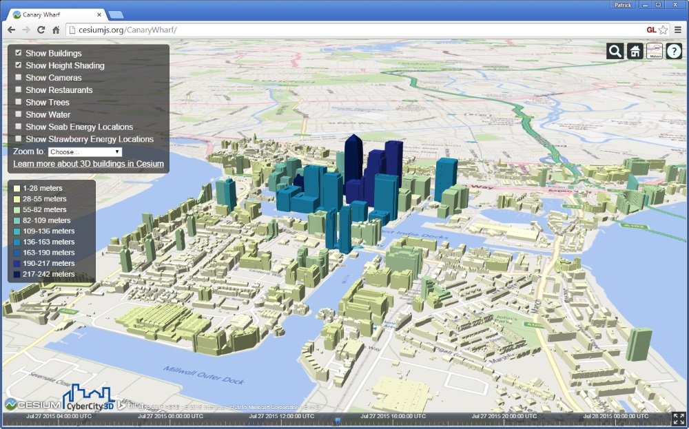<br />
  Buildings colored by height using declarative styling.
</p>

3D Tiles includes concise declarative styling defined with JSON and expressions written in a small subset of JavaScript augmented for styling.

Styles generally define a feature's `show` and `color` (RGB and translucency) using an expression based on a feature's properties, for example:
```json
{
    "color" : "(${Temperature} > 90) ? color('red') : color('white')"
}
```

This colors features with a temperature above 90 as red and the others as white.

For complete details, see the [Declarative Styling](Styling/README.md) spec.

## Roadmap Q&A

* [General Q&A](#general-qa)
   * [Can I use 3D Tiles today?](#can-i-use-3d-tiles-today)
   * [Are 3D Tiles specific to Cesium?](#are-3d-tiles-specific-to-cesium)
   * [What is the relationship between 3D Tiles and glTF?](#what-is-the-relationship-between-3d-tiles-and-gltf)
   * [Do 3D Tiles support runtime editing?](#does-3d-tiles-support-runtime-editing)
   * [Will 3D Tiles include terrain?](#will-3d-tiles-include-terrain)
   * [Will 3D Tiles include imagery?](#will-3d-tiles-include-imagery)
   * [Will 3D Tiles replace KML?](#will-3d-tiles-replace-kml)
* [Technical Q&A](#technical-qa)
   * [How do 3D Tiles support heterogeneous datasets?](#how-do-3d-tiles-support-heterogeneous-datasets)
   * [Will a tileset file be part of the final 3D Tiles spec?](#will-a-tileset-file-be-part-of-the-final-3d-tiles-spec)
   * [How do I request the tiles for Level `n`?](#how-do-i-request-the-tiles-for-level-n)
   * [Will 3D Tiles support horizon culling?](#will-3d-tiles-support-horizon-culling)
   * [Is screen-space error the only metric used to drive refinement?](#is-screen-space-error-the-only-metric-used-to-drive-refinement)
   * [How are cracks between tiles with vector data handled?](#how-are-cracks-between-tiles-with-vector-data-handled)
   * [When using replacement refinement, can multiple children be combined into one request?](#when-using-replacement-refinement-can-multiple-children-be-combined-into-one-request)
   * [How can additive refinement be optimized?](#how-can-additive-refinement-be-optimized)
   * [What compressed texture formats do 3D Tiles use?](#what-compressed-texture-formats-do-3d-tiles-use)

### General Q&A

#### Can I use 3D Tiles today?

We expect the initial 3D Tiles spec to evolve until fall 2016.  If you are OK with things changing, then yes, jump in.

#### Is 3D Tiles specific to Cesium?

No, 3D Tiles is a general spec for streaming massive heterogeneous 3D geospatial datasets.  The Cesium team started this initiative because we need an open format optimized for streaming 3D content to Cesium.  [AGI](http://www.agi.com/), the founder of Cesium, is also developing tools for creating 3D Tiles.  We expect to see other visualization engines and conversion tools use 3D Tiles.

#### What is the relationship between 3D Tiles and glTF?

[glTF](https://www.khronos.org/gltf) is an open standard for 3D models from Khronos (the same group that does WebGL and COLLADA).  Cesium uses glTF as its 3D model format, and the Cesium team contributes heavily to the glTF spec and open-source COLLADA2GLTF converter.  We recommend using glTF in Cesium for individual assets, e.g., an aircraft, a character, or a 3D building.

We created 3D Tiles for streaming massive geospatial datasets where a single glTF model would be prohibitive.  Given that glTF is optimized for rendering, that Cesium has a well-tested glTF loader, and that there are existing conversion tools for glTF, 3D Tiles use glTF for some tile formats such as [b3dm](TileFormats/Batched3DModel/README.md) (used for 3D buildings). We created a binary glTF extension ([KHR_binary_glTF](https://github.com/KhronosGroup/glTF/tree/master/extensions/Khronos/KHR_binary_glTF)) in order to embed glTF into binary tiles and avoid base64-encoding or multiple file overhead.

Taking this approach allows us to improve Cesium, glTF, and 3D Tiles at the same time, e.g., when we add mesh compression to glTF, it benefits 3D models in Cesium, the glTF ecosystem, and 3D Tiles.

#### Does 3D Tiles support runtime editing?

A common use case for 3D buildings is to stream a city dataset, color each building based on one or more properties (e.g., the building's height), and then hide a few buildings and replace them with high-resolution 3D buildings.  With 3D Tiles, this type of editing can be done at runtime.

The general case runtime editing of geometry on a building, vector data, etc., and then efficiently saving those changes in a 3D Tile will be possible, but is not the initial focus.  However, styling is much easier since it can be applied at runtime without modification to the 3D Tiles tree and is part of the initial work.

#### Will 3D Tiles include terrain?

Yes, a [quantized-mesh](https://github.com/AnalyticalGraphicsInc/quantized-mesh/blob/master/README.md)-like tile would fit well with 3D Tiles and allow Cesium to use the same streaming code (we say _quantized-mesh-like_ because some of the metadata, e.g., for bounding volumes and horizon culling, may be organized differently or moved to the tileset file).

However, since Cesium already streams terrain well, we are not focused on this in the short-term.

#### Will 3D Tiles include imagery?

Yes, there is an opportunity to provide an optimized base layer of terrain and imagery (similar to how a 3D model contains both geometry and textures).  There is also the open research problem of how to tile imagery for 3D.  In 2D, only one LOD (`z` layer) is used for a given view.  In 3D, especially when looking towards the horizon, tiles from multiple LODs are adjacent to each other.  How do we make the seams look good?  This will likely require tool and runtime support.

As with terrain, since Cesium already streams imagery well, we are not focused on this in the short-term.

#### Will 3D Tiles replace KML?

In many cases, yes.  KML regions and network links are a clunky approach to streaming massive 3D geospatial datasets on the web.  3D Tiles is built for the web and optimized for streaming; uses true HLOD; does not need to triangulate polygons; and so on.

### Technical Q&A

#### How does 3D Tiles support heterogeneous datasets?

Geospatial datasets are heterogeneous: 3D buildings are different from terrain, which is different from point clouds, which are different from vector data, and so on.

3D Tiles supports heterogeneous data by allowing different tile formats in a tileset, e.g., a tileset may contain tiles for 3D buildings, tiles for instanced 3D trees, and tiles for point clouds, all using different tile formats.

3D Tiles also supports heterogeneous datasets by concatenating different tile formats into one tile using the [Composite](TileFormats/Composite/README.md) tile format.  In the example above, a tile may have a short header followed by the content for the 3D buildings, instanced 3D trees, and point clouds.

Supporting heterogeneous datasets with both inter-tile (different tile formats in the same tileset) and intra-tile (different tile formats in the same Composite tile) options allows conversion tools to make trade-offs between number of requests, optimal type-specific subdivision, and how visible/hidden layers are streamed.

#### Will a tileset file be part of the final 3D Tiles spec?

Yes.  There will always be a need to know metadata about the tileset and about tiles that are not yet loaded, e.g., so only visible tiles can be requested.  However, when scaling to millions of tiles, a single tileset file with metadata for the entire tree would be prohibitively large.

3D Tiles already supports trees of trees. `content.url` can point to another tileset JSON file, which enables conversion tools to chunk up a tileset into any number of JSON files that reference each other.

There's a few other ways we may solve this:
* Moving subtree metadata to the tile payload instead of the tileset file.  Each tile would have a header with, for example, the bounding volumes of each child, and perhaps grandchildren, and so on.
* Explicit tile layout like those of traditional tiling schemes (e.g., TMS's `z/y/x`).  The challenge is that this implicitly assumes a spatial subdivision, whereas 3D Tiles is general enough to support quadtrees, octrees, k-d trees, and so on.  There is likely to be a balance where two or three explicit tiling schemes can cover common cases to complement the generic spatial data structures. 

#### How do I request the tiles for Level `n`?

More generally, how do 3D Tiles support the use case for when the viewer is zoomed in very close to terrain, for example, and we do not want to load all the parent tiles toward the root of the tree; instead, we want to skip right to the high-resolution tiles needed for the current 3D view?

This 3D Tiles topic needs additional research, but the answer is basically the same as above: either the skeleton of the tree can be quickly traversed to find the desired tiles or an explicit layout scheme will be used for specific subdivisions.

#### Will 3D Tiles support horizon culling?

Since [horizon culling](https://cesium.com/blog/2013/04/25/horizon-culling/) is useful for terrain, 3D Tiles will likely support the metadata needed for it.  We haven't considered it yet since our initial work with 3D Tiles is for 3D buildings where horizon culling is not effective.

#### Is screen space error the only metric used to drive refinement?

At runtime, a tile's `geometricError` is used to compute the screen space error (SSE) to drive refinement.  We expect to expand this, for example, by using the [_virtual multiresolution screen space error_](http://www.dis.unal.edu.co/profesores/pierre/MyHome/publications/papers/vmsse.pdf) (VMSSE), which takes occlusion into account.  This can be done at runtime without streaming additional tile metadata.  Similarly, fog can also be used to tolerate increases to the SSE in the distance.

However, we do anticipate other metadata for driving refinement.  SSE may not be appropriate for all datasets; for example, points of interest may be better served with on/off distances and a label collision factor computed at runtime.  Note that the viewer's height above the ground is rarely a good metric for 3D since 3D supports arbitrary views.

See [#15](https://github.com/AnalyticalGraphicsInc/3d-tiles/issues/15).

#### How are cracks between tiles with vector data handled?

Unlike 2D, in 3D, we expect adjacent tiles to be from different LODs so, for example, in the distance, lower resolution tiles are used.  Adjacent tiles from different LODs can lead to an artifact called _cracking_ where there are gaps between tiles.  For terrain, this is generally handled by dropping _skirts_ slightly angled outward around each tile to fill the gap.  For 3D buildings, this is handled by extending the tile boundary to fully include buildings on the edge; [see above](#Quadtrees).  For vector data, this is an open research problem that we need to solve.  This could invole boundary-aware simplification or runtime stitching. 

#### When using replacement refinement, can multiple children be combined into one request?

Often when using replacement refinement, a tile's children are not rendered until all children are downloaded (an exception, for example, is unstructured data such as point clouds, where clipping planes can be used to mask out parts of the parent tile where the children are loaded; naively using the same approach for terrain or an arbitrary 3D model results in cracking or other artifacts between the parent and child).

We may design 3D Tiles to support downloading all children in a single request by allowing the tileset to point to a subset of a payload for a tile's content similiar to glTF [buffers and buffer views](https://github.com/KhronosGroup/glTF/tree/master/specification/2.0#buffers-and-buffer-views).  [HTTP/2](http://chimera.labs.oreilly.com/books/1230000000545/ch12.html#_brief_history_of_spdy_and_http_2) will also make the overhead of multiple requests less important.

See [#9](https://github.com/AnalyticalGraphicsInc/3d-tiles/issues/9).

#### How can additive refinement be optimized?

Compared to replacement refinement, additive refinement has a size advantage because it doesn't duplicate data in the original dataset.  However, it has a disadvantage when there are expensive tiles to render near the root and the view is zoomed in close.  In this case, for example, the entire root tile may be rendered, but perhaps only one feature or even no features are visible.

3D Tiles can optimize this by storing an optional spatial data structure in each tile.  For example, a tile could contain a simple 2x2 grid, and if the tile's bounding volume is not completely inside the view frustum, each box in the grid is checked against the frustum, and only those inside or intersecting are rendered.

See [#11](https://github.com/AnalyticalGraphicsInc/3d-tiles/issues/11).

#### What compressed texture formats does 3D Tiles use?

3D Tiles will support the same texture compression that glTF [will support](https://github.com/KhronosGroup/glTF/issues/59).  In addition, we need to consider how well GPU formats compress compared to, for example, jpeg.  Some desktop game engines stream jpeg, then decompress and recompress to a GPU format in a thread.  The CPU overhead for this approach may be too high for JavaScript and Web Workers.

## Acknowledgments

* [Erik Andersson](https://github.com/e-andersson)
* [Sarah Chow](https://cesium.com/team/SarahChow/)
* [Kevin Ring](http://www.kotachrome.com/kevin/)
* [Dylan Brown](http://www.github.com/Dylan-Brown)
* [Leesa Fini](http://www.github.com/LeesaFini)

## Data credits

The screenshots in this spec use awesome [CyberCity3D](http://www.cybercity3d.com/) buildings and the [Bing Maps](https://www.microsoft.com/maps/choose-your-bing-maps-API.aspx) base layer.
