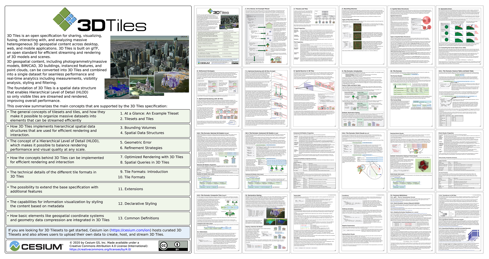

# 3D Tiles
[https://cesium.com/](https://cesium.com/)

_A building CAD model is fused with photogrammetry data using 3D Tiles, data courtesy of Bentley Systems._

## Overview

3D Tiles is an open specification for sharing, visualizing, fusing, and interacting with massive heterogenous 3D geospatial content across desktop, web, and mobile applications.

#### Open and interoperable

As an open specification with an open-source runtime implementation, 3D Tiles allows data providers and app developers to make massive and complex 3D information more accessible, interoperable, and useful across all kinds of tools and applications.

#### Heterogeneous

With a defined set of file formats, multiple types of 3D geospatial content including photogrammetry/massive models, BIM/CAD, 3D buildings, instanced features, and point clouds can be converted into 3D Tiles and combined into a single dataset.

#### Designed for 3D

Bringing techniques from the field of 3D graphics and built on [glTF](https://github.com/KhronosGroup/glTF), 3D Tiles defines a spatial hierarchy for fast streaming and precision rendering, balancing performance and visual quality at any scale from global to building interiors.

#### Semantic, interactive, and styleable

3D Tiles preserve per-feature metadata to allow interaction such as selecting, querying, filtering, and styling efficiently at runtime.

## Specification

* [3D Tiles Format Specification](./specification/)
* [3D Tiles Extension Registry](./extensions/)

Please provide spec feedback by [submitting issues](https://github.com/CesiumGS/3d-tiles/issues). For questions on implementation, generating 3D Tiles, or to showcase your work, join the [Cesium community forum](https://community.cesium.com/). A list of resources for developers, including blog posts and presentations that explain the concepts and applications of 3D Tiles, can be found on the [3D Tiles Resources](./RESOURCES.md) page.

### Upcoming

[3D Tiles Next](./next) is a set of new capabilities for the future of 3D Tiles. Provided as draft extensions to the [3D Tiles 1.0](../specification) specification, these features may be incorporated into 3D Tiles 2.0 in the future.

- [Tile Content](./next#tile-content): glTF 2.0 assets may be used directly as tile content, without intermediate formats, improving interoperability with 3D content and tooling ecosystems. Tiles may reference multiple contents — for organization, styling, and filtering — and contents may be collected into groups similar to map layers in mapping applications.
- [Implicit Tiling](./next#implicit-tiling): Common subdivision schemes and spatial index patterns may be declared without listing bounding volumes exhaustively. Reduces tileset size, and enables new optimizations including faster traversal, raycasting, random access, and spatial queries.
- [Metadata](./next#metadata): Metadata in 3D Tiles gains more expressiveness and flexibility, with a well-defined type system, new encoding options (e.g. JSON or binary), and a range of granularity options. Metadata may be associated with high-level objects like tilesets, tiles, or tile content groups, or with individual vertices and texels on glTF 2.0 geometry.

A curated list of resources for developers can be found on the [3D Tiles Next Resources](./next/RESOURCES.md) page.

## 3D Tiles Ecosystem

The [3D Tiles Resources](./RESOURCES.md) page contains a list of implementations of the 3D Tiles standard, as well as viewers, generators, data providers, and demos. The page also includes developer resources, blog posts, and presentations that explain the concepts and applications of 3D Tiles.

## 3D Tiles Reference Card

The [**3D Tiles Reference Card**](./3d-tiles-reference-card.pdf) is an approachable and concise guide to learning about the main concepts in 3D Tiles and designed to help integrate 3D Tiles into runtime engines for visualization and analysis of massive heterogeneous 3D geospatial content.

This guide augments the fully detailed 3D Tiles specification with coverage of key concepts to help developers jumpstart adopting 3D Tiles.

## Contributing

3D Tiles is an open specification and contributions including specification fixes, new tile formats, and extensions are encouraged. See our guidelines for contributing in [CONTRIBUTING.md](./CONTRIBUTING.md).

---

Created by the <a href="https://cesium.com/">Cesium team</a> and built on <a href="https://www.khronos.org/gltf">glTF</a>. 

 
