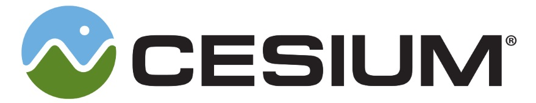

# 3D Tiles
[https://cesium.com/](https://cesium.com/)

_A building CAD model is fused with photogrammetry data using 3D Tiles, data courtesy of Bentley Systems._

## Overview

3D Tiles is an open specification for sharing, visualizing, fusing, and interacting with massive heterogenous 3D geospatial content across desktop, web, and mobile applications.

#### Open and interoperable

As an open specification with an open-source runtime implementation, 3D Tiles allows data providers and app developers to make massive and complex 3D information more accessible, interoperable, and useful across all kinds of tools and applications.

#### Heterogeneous

With a defined set of file formats, multiple types of 3D geospatial content including photogrammetry/massive models, BIM/CAD, 3D buildings, instanced features, and point clouds can be converted into 3D Tiles and combined into a single dataset.

#### Designed for 3D

Bringing techniques from the field of 3D graphics and built on [glTF](https://github.com/KhronosGroup/glTF), 3D Tiles defines a spatial hierarchy for fast streaming and precision rendering, balancing performance and visual quality at any scale from global to building interiors.

#### Semantic, interactive, and styleable

3D Tiles preserve per-feature metadata to allow interaction such as selecting, querying, filtering, and styling efficiently at runtime.

## 3D Tiles Ecosystem

| Tool | Description |
| :--- | :--- |
| [Cesium ion](https://cesium.com/ion/) | Sign up for an account to to upload and convert content to 3D Tiles. Supports: <ul><li>glTF (.gltf, .glb)</li><li>CityGML (.citygml, .xml, .gml)</li><li>KML/COLLADA (.kml, .kmz)</li><li>LASer (.las, .laz)</li><li>COLLADA (.dae)</li><li>Wavefront OBJ (.obj)</li></ul> |
| [CesiumJS](http://cesiumjs.org/) | Open source JavaScript runtime engine for visualizing 3D Tiles |
| [3D Tiles Validator](https://github.com/AnalyticalGraphicsInc/3d-tiles-tools/tree/master/validator) | Open source Node.js library and command-line tools for validating 3D Tiles |
| [3D Tiles Samples](https://github.com/AnalyticalGraphicsInc/3d-tiles-tools/tree/master/samples-generator) | Open source command-line tools for generating sample 3D Tiles  |
| [Safe FME](https://hub.safe.com/packages/safe/cesiumion) | Desktop application for transforming data. The `CesiumIonConnector` converts data to 3D Tiles via Cesium ion. |
| [Bentley ContextCapture](https://www.bentley.com/en/products/product-line/reality-modeling-software/contextcapture) | Desktop application for converting photographs and/or point clouds to 3D Tiles. |

See the [3D Tiles Ecosystem](./ECOSYSTEM.md) for examples of who's using 3D Tiles.

## Specification

* [3D Tiles Format Specification](./specification/)
* [3D Tiles Extension Registry](./extensions/)

## Future Work

Additional tile formats are under development, including Vector Data (`vctr`) [[#124](https://github.com/AnalyticalGraphicsInc/3d-tiles/tree/3d-tiles-next/TileFormats/VectorData)] for geospatial features such as points, lines, and polygons.

See the full roadmap issue for plans post version 1.0 [[#309](https://github.com/AnalyticalGraphicsInc/3d-tiles/issues/309)], as well as issues marked as **3D Tiles [Next](https://github.com/AnalyticalGraphicsInc/3d-tiles/issues?q=is%3Aissue+is%3Aopen+label%3Anext)**.

## Contributing

3D Tiles is an open specification and contributions including specification fixes, new tile formats, and extensions are encouraged. See our guidelines for contributing in [CONTRIBUTING.md](./CONTRIBUTING.md).

---

Created by the <a href="http://cesiumjs.org/">Cesium team</a> and built on <a href="https://www.khronos.org/gltf">glTF</a>. 

 
