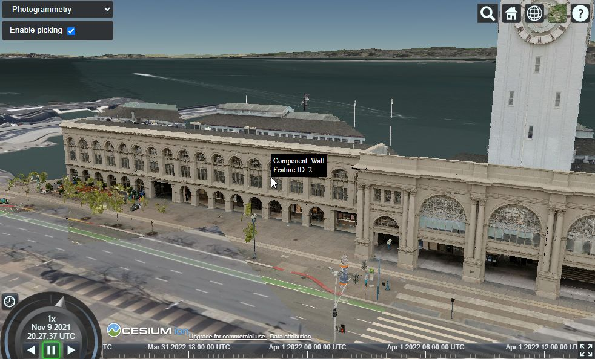
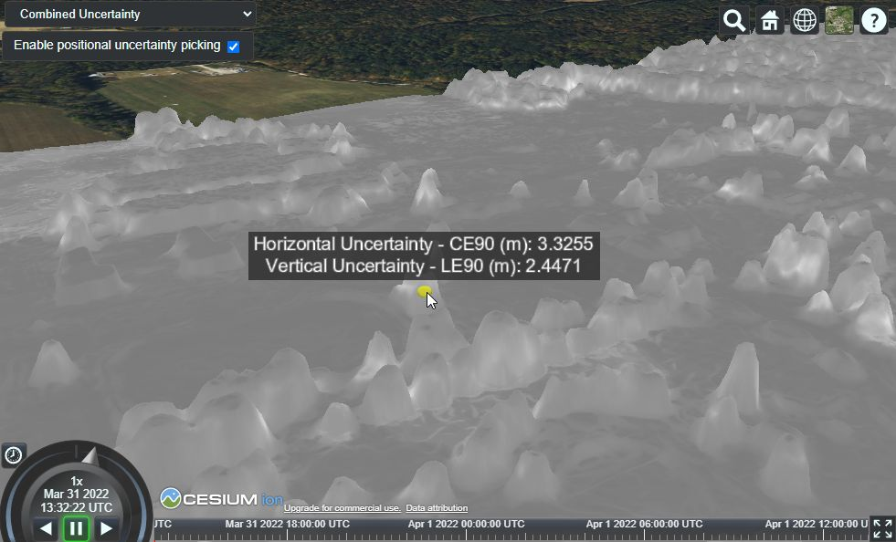
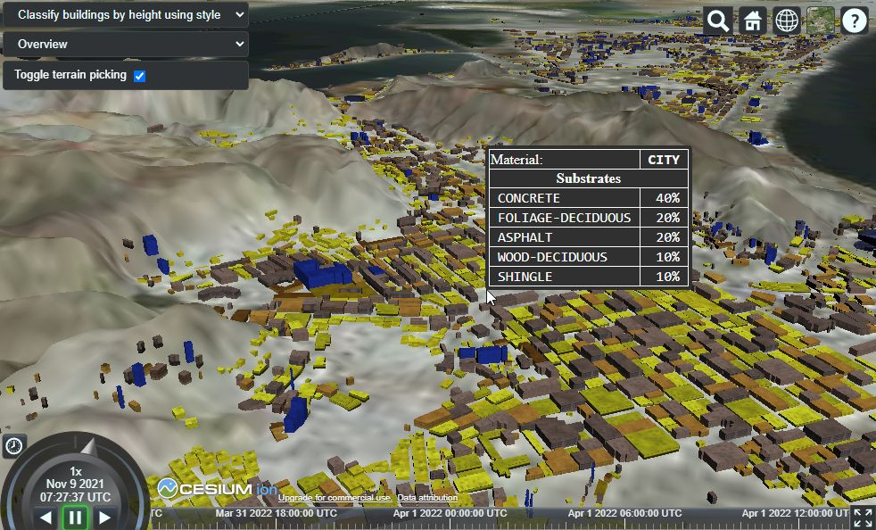
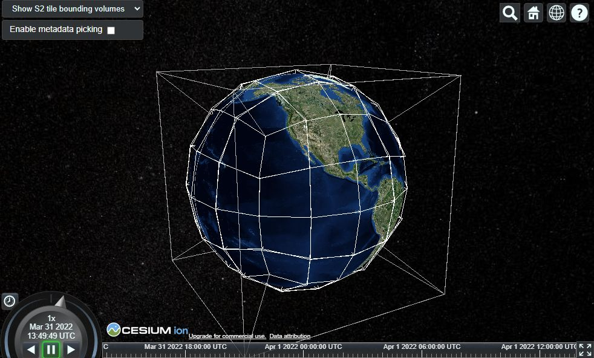

## 3D Tiles Resources

- [**Introducing 3D Tiles**](https://cesium.com/blog/2015/08/10/introducing-3d-tiles/) - the motivation for and principles of 3D Tiles.  Read this first if you are new to 3D Tiles.
- [**Introducing 3D Tiles Next, Streaming Geospatial to the Metaverse**](https://cesium.com/blog/2021/11/10/introducing-3d-tiles-next/) - the announcement of the 3D Tiles Next specification, summarizing the technical goals and application areas.
- [**3D Tiles Reference Cards**](./reference-cards) - approachable and concise guides to learning about the main concepts in 3D Tiles and 3D Tiles 1.1, designed to help integrate 3D Tiles into runtime engines.
- [**3D Tiles Q&A**](./Q-and-A.md)

### Viewers

- [CesiumJS](https://cesium.com/cesiumjs/) - An open source JavaScript runtime engine for visualizing 3D Tiles
- [Cesium For Unreal](https://cesium.com/platform/cesium-for-unreal/) - An open source plugin for Unreal Engine for visualizing 3D Tiles
- [Cesium For O3DE](https://cesium.com/platform/cesium-for-o3de/) - An open source plugin for O3DE, the Open 3D Engine, for visualizing 3D Tiles
- [Cesium For Unity](https://cesium.com/platform/cesium-for-unity/) - An open source plugin that enables rich 3D geospatial workflows and applications based on 3D Tiles in Unity.
- [3DTilesRendererJS](https://github.com/NASA-AMMOS/3DTilesRendererJS) - A renderer for 3D Tiles based on Three.js, developed by NASA-AMMOS
- [three-loader-3dtiles](https://github.com/nytimes/three-loader-3dtiles) - A Three.js loader module for loading and visualizing 3D Tiles, developed by NY Times R&D.
- [threedtiles](https://github.com/ebeaufay/threedtiles) - A viewer for 3D Tiles based on Three.js
- [mapbox-3dtiles](https://github.com/Geodan/mapbox-3dtiles) - A 3D Tiles viewer, implemented as a Mapbox GL JS custom layer, based on Three.js
- [iTowns](https://github.com/iTowns/itowns) - A Three.js-based framework for visualizing 3D geospatial data, including 3D Tiles
- [giro3d](https://gitlab.com/giro3d/giro3d) - A framework for visualizing 3D geospatial data, based on Three.js
- [Hexagon Geospatial Luciad](https://www.hexagongeospatial.com/) - Tools for converting, processing, optimizing, hosting, and visualizing geospatial data based on 3D Tiles 
- [AGI STK](https://www.agi.com/products/stk) - A mission engineering software with visualization capabilities based on 3D Tiles
- [Ecere GNOSIS](http://ecere.ca/) - A GIS visualization SDK with support for 3D Tiles
- [TerriaJS](https://github.com/TerriaJS/terriajs) - A library for web-based geospatial data explorers, based on CesiumJS, with support for 3D Tiles
- [GeoSolutions MapStore](https://www.geosolutionsgroup.com/technologies/mapstore/) - A framework for creating, managing and sharing maps with different types of geospatial content, including [support for 3D Tiles](https://www.geosolutionsgroup.com/blog/mapstore-release-2022_01_00/)
- [3DCityDB-Web-Map-Client](https://github.com/3dcitydb/3dcitydb-web-map) A viewer for 3D Tiles and CityGML, based on CesiumJS
- [deck.gl Tile3DLayer](https://deck.gl/docs/api-reference/geo-layers/tile-3d-layer) An implementation of a 3D Tiles renderer for deck.gl
- [vsgCs](https://github.com/timoore/vsgCs) - A library for using 3D Tiles in Vulkan Scene Graph (VSG) applications, based on [Cesium Native](https://github.com/CesiumGS/cesium-native)

### Implementations

- [CesiumJS](https://github.com/CesiumGS/cesium) - An open source JavaScript runtime engine for visualizing 3D Tiles
- [Cesium Native](https://github.com/CesiumGS/cesium-native) - A set of C++ libraries for 3D geospatial including an engine-agnostic 3D Tiles loader
- [loaders.gl](https://github.com/visgl/loaders.gl) - A framework for loaders for geospatial data, including 3D Tiles
- [Unity GIS Streaming Framework](https://github.com/Unity-Technologies/com.unity.gis.streaming-framework) - A framework for streaming 3D geospatial data for visualization in Unity, with 3D Tiles support

### Tools

- [3d-tiles-validator](https://github.com/CesiumGS/3d-tiles-validator) - A validator for the tileset JSON file and tile formats of 3D Tiles 1.0
- [blender-3d-tiler](https://gitee.com/cesium_processing/blender-3d-tiler) - A tool for tiling 3D models using the Blender API

### Sample Data

- [3d-tiles-samples](https://github.com/CesiumGS/3d-tiles-samples) - Sample data sets demonstrating different capabilities of 3D Tiles
- [3DTilesSampleData](https://github.com/NASA-AMMOS/3DTilesSampleData) - 3D Tiles data sets generated from the NASA Curiosity Rover data
- [cesium_3dtiles_samples](https://github.com/bertt/cesium_3dtiles_samples) - Sample data sets demonstrating different features of 3D Tiles

### Generators

- [Cesium ion](https://cesium.com/platform/cesium-ion/) - Upload and convert content to 3D Tiles. Data can be combined and fused with curated global 3D content including Cesium World Terrain, Bing Maps imagery, and Cesium OSM Buildings. 
- [cdb-to-3dtiles](https://github.com/CesiumGS/cdb-to-3dtiles) - A tool for converting Open Geospatial Consortium (OGC) CDB datasets into 3D Tiles for efficient streaming and rendering
- [Safe FME](https://hub.safe.com/packages/safe/cesiumion) - A desktop application for transforming data. The `CesiumIonConnector` converts data to 3D Tiles via Cesium ion.
- [Bentley ContextCapture](https://www.bentley.com/en/products/product-line/reality-modeling-software/contextcapture) - A desktop photogrammetry application for converting photographs and/or point clouds to 3D Tiles.
- [Bentley MicroStation](https://www.bentley.com/en/products/brands/microstation) - Desktop CAD software that can export 3D Tiles.
- [osm-cesium-3d-tiles](https://github.com/kiselev-dv/osm-cesium-3d-tiles) - A tool for converting OSM buildings to Cesium 3d tiles
- [OpenDroneMap](https://www.opendronemap.org/) - Solutions for  collecting, processing, analyzing and displaying aerial data, with support for 3D Tiles. 
- [Agisoft Metashape](https://www.agisoft.com/) - Photogrammetry models can directly be uploaded to Cesium ion, converted into the 3D Tiles format, and shared and combined with other 3D- and imagery data.
- [nFrames](https://www.nframes.com/) - The SURE software system is an application for 3D reconstruction from images that can export the results as 3D Tiles data sets.
- [Melown Vadstena](https://www.melowntech.com/products/vadstena/) - A software that can process drone-based close-range imagery and low-overlap nadir imagery, to create 3D models that can be exported in the 3D Tiles format.
- [py3dtilers](https://github.com/VCityTeam/py3dtilers) - A tool and library for building 3D Tiles tilesets from OBJ, GeoJSON, IFC or CityGML input data. 
- [py3dtiles](https://gitlab.com/Oslandia/py3dtiles) - A Python tool and library for creating and manipulating 3D Tiles
- [gocesiumtiler](https://github.com/mfbonfigli/gocesiumtiler) - A Golang tool to convert point clouds stored as LAS files to Cesium 3D Tiles
- [Entwine](https://entwine.io/) - A data organization library for massive point clouds, with the option to output 3D Tiles
- [AGI GCS](https://www.agi.com/capabilities/geospatial-content-server) - Geospatial Content Server (GCS) is a hosting platform for 3D geospatial data that optimizes data and converts it into 3D Tiles for efficient streaming and visualization.
- [Veesus](https://veesus.com/) - Software for editing, visualizing, and serving point clouds in different formats, including 3D Tiles.
- [Hexagon Geospatial](https://www.hexagongeospatial.com/) - Tools for converting, processing, optimizing, hosting, and visualizing geospatial data based on 3D Tiles 
- [RhinoTerrain](https://www.rhinoterrain.com/) - Terrain modeling and city builder software with 3D Tiles export
- [4DMapper](https://4dmapper.com/) - A platform for visualizing, managing and delivering geospatial data, with 3D Tiles export
- [cesium_pnt_generator](https://github.com/mattshax/cesium_pnt_generator) - A set of prototype scripts to convert LAS data into 3D Tiles
- [cesium-point-cloud-generator](https://github.com/tum-gis/cesium-point-cloud-generator) - A tool for the generation of point cloud visualization datasets in the 3D Tiles format.
- [pg2b3dm](https://github.com/Geodan/pg2b3dm) - A tool for converting 3D geometries from PostGIS into 3D Tiles B3DM tiles
- [Obj2Tiles](https://github.com/OpenDroneMap/Obj2Tiles) - A command-line tool and library for converting OBJ files to 3D Tiles
- [3dtiles](https://github.com/fanvanzh/3dtiles) - Tools for converting OSGB, Esri Shapefiles and FBX files into 3D Tiles
- [gltf-to-3d-tiles](https://github.com/dreamergz/gltf-to-3d-tiles) - A tool for converting glTF models into GLB, B3DM or 3D Tiles
- [Apache Baremaps](https://github.com/apache/incubator-baremaps/pull/569) - Experimental support for 3D Tiles in Apache Baremaps
- [Kitware](https://www.kitware.com/3d-tiles-generation-using-vtk/) - The Kitware Danesfield application can convert satellite imagery into 3D mesh models of buildings atop a separate terrain mesh, and packages the 3D mesh models as 3D Tiles

### Data Providers

- [Maxar](https://www.maxar.com/) - Vricon, a Maxar Company, offers massive, highly detailed 3D Models in 3D Tiles format as part of their [Precision3D Data Suite](https://resources.maxar.com/precision3d-data-suite), in close [cooperation with Cesium](https://cesium.com/industries/mission-support/usg-work-from-home/)
- [Aerometrex](https://aerometrex.com/) - Aerometrex offers geographically accurate high-resolution models in the 3D Tiles format. See [this Cesium blog post](https://cesium.com/blog/2017/07/26/aerometrex-melbourne/) for examples of Aerometrex data rendered in Cesium. 
- [Nearmap](https://www.nearmap.com/us/en) - Nearmap manages a library of large-scale 3D content that can be exported in 3D Tiles. Read more about their support in this [blog post about streaming 3D models](https://www.nearmap.com/us/en/aerial-view-blog/cesium-3d-tiles-helping-cities-stream-3d-models).
- [geopipe](https://geopi.pe/) - A platform for digital twins for games, simulation, architecture, with options for efficient visualization in the browser, based on 3D Tiles
- [CyberCity3D](https://www.cybercity3d.com/) - City models for use in smart cities presentations, building analytics and for contextual environmental needs, streamed using 3D Tiles
- [Virtual City Systems](https://vc.systems/en/) - A virtual city hosting- and visualization platform for visualizing 3D cities based on 3D Tiles
- [DroneDeploy](https://www.dronedeploy.com/) - A drone data repository that uses CesiumJS and Cesium ion for tiling and visualizing massive 3D models using 3D Tiles
- [Google Photorealistic 3D Tiles](https://cloud.google.com/blog/products/maps-platform/create-immersive-3d-map-experiences-photorealistic-3d-tiles) - Photorealistic 3D Tiles of over 2500 cities across 49 countries, offered via the Google Map Tiles API
- [Matterport](https://matterport.com) - Photorealistic 3D Tiles of over 10m+ spaces captured across the globe, using 3D Tiles to visualize and stream massive 3d models

### Selected Talks

- _3D Tiles Next: Bringing Massive 3D Geospatial Data to the Web_, WebGL + WebGPU Meetup (April 2022). [Video and slides](https://cesium.com/learn/presentations/#webg-webgpu-meetup)
- _3D Tiles Next: Data Performance for the Future of 3D Geospatial_, GEOINT 2022 Lightning Talk. [Slides](https://cesium.com/learn/presentations/#geoint-lightning-talk-2022)
- _Rendering the World with 3D Tiles_, a guest lecture at Drexel University (February 2022). [Slides](https://cesium.com/learn/presentations/#rendering-the-world-with-3d-tiles)
- _Introducing 3D Tiles Next_, at Web3D Conference 2021. [Video and slides](https://cesium.com/learn/presentations/#web3d-conference-2021)
- _Bridging the Physical and Digital Worlds: Cesium and 3D Tiles for O3DE_, at O3DECon 2021. [Video and slides](https://cesium.com/learn/presentations/#o3decon-presentation)
- _3D Tiles and Visualization Advancements in STK 11.6_, AGI Webinar May 2019. [Video](https://cesium.com/learn/presentations/#webinar-stk-11.6-2019)
- _What's New and What's Next for Cesium and 3D Tiles?_, at FOSS4G NA 2019. [Slides](https://cesium.com/learn/presentations/#whats-new-foss4g-na-2019)
- _3D Tiles with FME_, at SIGGRAPH 2018. [Slides](https://cesium.com/learn/presentations/#siggraph-2018-ceium-bof-safe)
- _3D Tiles Update - 3DP SWG_, OGC TC Meeting June 2018. [Slides](https://cesium.com/learn/presentations/#ogc-tc-2018-3d-tiles-update)
- _Massive Point Cloud Visualization with CesiumJS, 3D Tiles, and Cesium ion_, OGC TC Meeting June 2018. [Slides](https://cesium.com/learn/presentations/#ogc-tc-meeting-2018)
- _Data Fusion With 3D Tiles_, FOSS4G NA 2018. [Slides](https://cesium.com/learn/presentations/#data-fusion-foss4g-na-2018)
- _CityGML, 3D Tiles and Cesium - A Data Fusion Symphony_, FOSS4G NA 2018. [Slides](https://cesium.com/learn/presentations/#citygml-3d-tiles-and-cesium-2018)
- _3D Tiles in Action_, at FOSS4G 2017. [Slides](https://cesium.com/learn/presentations/#3d-tiles-in-action-2017)
- _Point Clouds with 3D Tiles_, at the OGC Technical Committee Meeting (June 2018). [Slides](https://cesium.com/learn/presentations/#ogc-tc-meeting-2018)
- _The Open Cesium 3D Tiles Specification: Bringing Massive Geospatial 3D Scenes to the Web_, at Web3D 2016. [Slides](https://cesium.com/learn/presentations/#3d-tiles-web3d-2016)
- _3D Tiles: Beyond 2D Tiling_, at FOSS4G NA 2016. [Slides and Video](https://cesium.com/learn/presentations/#3d-tiles-foss4g-2016)
- _3D Tiles motivation and ecosystem update_, at the OGC Technical Committee Meeting (March 2016). [Slides](https://cesium.com/learn/presentations/#ogc-3d-tiles-2016)
- _3D Tiles intro_, at the Cesium BOF at SIGGRAPH 2015. [Slides](https://cesium.com/learn/presentations/#virtual-globes-using-webgl-and-cesium-2015)

### Selected Articles

- [Fine Grained Metadata in 3D Tiles Next](https://cesium.com/blog/2022/05/31/fine-grained-metadata-in-3d-tiles-next/). May 2022.
- [An End-to-End Guide to Photogrammetry with Mobile Devices](https://rd.nytimes.com/projects/an-end-to-end-guide-to-photogrammetry-with-mobile-devices). September 2021.
- [Georeferencing 3D models for Cesium](https://medium.com/terria/georeferencing-3d-models-for-cesium-7ccf609ee2ef). May 2020.
- [Create 3D Tiles from KML/COLLADA with Per-Building Data](https://cesium.com/blog/2020/04/09/kml-collada-metadata/). April 2020.
- [Bring Your Cesium ion 3D Tiles and Bing Imagery in osgEarth](https://cesium.com/blog/2020/04/02/osgearth-supports-cesium-ion-assets/). April 2020.
- [Taking City Visualization into the Third Dimension with Point Clouds, 3D Tiles, and deck.gl](https://eng.uber.com/3d-tiles-loadersgl/). October 2019.
- [Millimeter Precision Point Clouds with Cesium and 3D Tiles](https://cesium.com/blog/2018/06/27/millimeter-precision-point-clouds/). June 2018.
- [OneSky Using Cesium / 3D Tiles For Volumetric Airspace Visualization](https://cesium.com/blog/2018/04/13/onesky-3dtiles/). April 2018.
- [Cesium's Participation in OGC Testbed 13](https://cesium.com/blog/2018/02/06/citygml-testbed-13/). February 2018.
- [Aerometrex and 3D Tiles](https://cesium.com/blog/2017/07/26/aerometrex-melbourne/). July 2017.
- [Skipping Levels of Detail](https://cesium.com/blog/2017/05/05/skipping-levels-of-detail/). May 2017.
- [Infrastructure Visualisation using 3D Tiles](https://cesium.com/blog/2017/04/12/site-see-3d-tiles/). April 2017.
- [Optimizing Spatial Subdivisions in Practice](https://cesium.com/blog/2017/04/04/spatial-subdivision-in-practice/). April 2017.
- [Optimizing Subdivisions in Spatial Data Structures](https://cesium.com/blog/2017/03/30/spatial-subdivision/). March 2017.
- [What's new in 3D Tiles?](https://cesium.com/blog/2017/03/29/whats-new-in-3d-tiles/) March 2017.
- [Streaming 3D Capture Data using 3D Tiles](https://cesium.com/blog/2017/03/06/3d-scans/). March 2017.
- [Visualizing Massive Models using 3D Tiles](https://cesium.com/blog/2017/02/21/massive-models/). February 2017.

### Applications and Services Using 3D Tiles

| 
&nbsp;
 |  |
| :--- | :--- |
| <a href="https://map.geo.admin.ch">Swiss Federal Office of Topography </a> | The Swiss Federal Office of Topography offers a complete topographical map of Switzerland. The 3D view uses 3D Tiles for the terrain- and building models. |
| <a href="https://www.cybercity3d.com/">CyberCity3D </a> | City models for use in smart cities presentations, building analytics and for contextual environmental needs, streamed using 3D Tiles |
| <a href="https://vc.systems/en/">Virtual City Systems </a> | A virtual city hosting- and visualization platform for visualizing 3D cities based on 3D Tiles |
| <a href="https://www.cityzenith.com/">Cityzenith </a> | A City Information Modeling tool that uses 3D Tiles in a pipeline for modeling digital twins |
| <a href="https://georocket.io/">GeoRocket </a> | A high-performance data store for geospatial files, developed by the competence center for Spatial Information Management of the Fraunhofer Institute for Computer Graphics Research |
| <a href="https://www.data61.csiro.au/">CSIRO Data61 </a> | The Commonwealth Scientific and Industrial Research Organisation created a National Digital Twin which includes 3D, time dynamic, and even real-time data, based on 3D Tiles |
| <a href="https://www.gamesim.com/3d-geospatial-conform/">GameSim Conform </a> | A tool for building, visualizing, and editing rich 3D environments that can be exported as 3D Tiles, for urban planning, simulations, and games. |
| <a href="https://www.sitesee.io/">SiteSee </a> | Provides telecom companies with 3D capture models of their infrastructure. The photogrammetry data is converted to 3D Tiles for efficient streaming and visualization. |
| <a href="https://www.virtualgis.io/">VirtualGIS </a> | A set of 2D, 3D and Augmented Reality GIS applications for visualizing data based on 3D Tiles and CesiumJS |
| <a href="https://github.com/iTowns/itowns">iTowns </a> | A Three.js-based framework for visualizing 3D geospatial data, including 3D Tiles |
| <a href="https://geopi.pe/">geopipe </a> | A platform for digital twins for games, simulation, architecture, with options for efficient visualization in the browser, based on 3D Tiles |
| <a href="https://data.grandlyon.com/en/">data.grandlyon.com </a> | A 3D digital clone of Métropole de Lyon, based on 3D Tiles (Cesium blog post: [3D Digital Territory Lab: A Digital Clone of Métropole de Lyon](https://cesium.com/blog/2018/02/05/digital-territory-lab/)) |

### Featured Demos

(Note: These demos had been published based on the <a href="https://github.com/CesiumGS/cesium/blob/main/CHANGES.md#1871---2021-11-09" target="_blank">CesiumJS 1.87.1 Release</a>, which included experimental support for the extensions of 3D Tiles Next. Most of the features that are shown in these demos are now part of the 3D Tiles 1.1 core specification, or extensions of 3D Tiles 1.1)

| 
&nbsp;
 |  |
| :--- | :--- |
| <a href="https://demos.cesium.com/ferry-building">Photogrammetry Classification </a> | Components of the geometry in 3D Tiles can receive identifiers, and be associated with metadata via these identifiers. In this example, building components in a photogrammetry model are classified based on their type. |
| <a href="https://demos.cesium.com/owt-uncertainty">Property Textures </a> | High-frequency data can be associated with the surface of geometry, by storing metadata for each surface point (texel) in a property texture |
| <a href="https://demos.cesium.com/cdb-yemen">Metadata </a> | Metadata can be associated with elements of a tileset on different levels of granularity, and queried at runtime to support analytics and styling based on the property values. |
| <a href="https://demos.cesium.com/owt-globe">S2 Base Globe </a> | An extension allows to divide geographic data into [S2 Cells](https://s2geometry.io/) to represent the whole globe with less distortion than traditional mapping approaches, and without singularities at the poles. |

