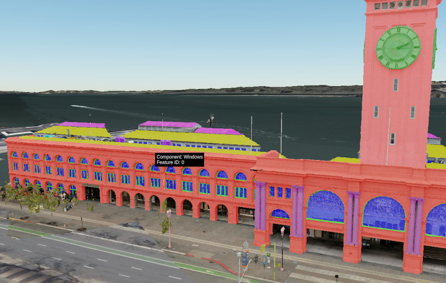

## 3D Tiles Resources

- [**Introducing 3D Tiles**](https://cesium.com/blog/2015/08/10/introducing-3d-tiles/) - the motivation for and principles of 3D Tiles.  Read this first if you are new to 3D Tiles.
- [**3D Tiles Reference Card**](./3d-tiles-reference-card.pdf) - an approachable and concise guide to learning about the main concepts in 3D Tiles and designed to help integrate 3D Tiles into runtime engines.
- [**The Next Generation of 3D Tiles**](https://cesium.com/blog/2017/07/12/the-next-generation-of-3d-tiles/) - future plans for 3D Tiles.
- [**3D Tiles Q&A**](./Q-and-A.md)

### Viewers

- [CesiumJS](https://cesium.com/cesiumjs/) - An open source JavaScript runtime engine for visualizing 3D Tiles
- [Cesium For Unreal](https://cesium.com/platform/cesium-for-unreal/) - An open source plugin for the Unreal Engine for visualizing 3D Tiles
- [Cesium For O3DE](https://cesium.com/platform/cesium-for-o3de/) - An open source plugin for O3DE, the Open 3D Engine, for visualizing 3D Tiles
- [3DTilesRendererJS](https://github.com/NASA-AMMOS/3DTilesRendererJS) - A renderer for 3D Tiles based on Three.js
- [3DTilesViewer](https://github.com/ebeaufay/3DTilesViewer) - A viewer for 3D Tiles based on Three.js
- [mapbox-3dtiles](https://github.com/Geodan/mapbox-3dtiles) - A 3D Tiles viewer, implemented as a Mapbox GL JS custom layer, based on Three.js
- [three-loader-3dtiles](https://github.com/nytimes/three-loader-3dtiles) - A Three.js loader module for loading and visualizing 3D Tiles

### Implementations

- [CesiumJS](https://github.com/CesiumGS/cesium) - The open source JavaScript runtime engine, including an implementation of the 3D Tiles standard
- [cesium-native](https://github.com/CesiumGS/cesium-native) - The Cesium core library with base classes for the implementation of the 3D Tiles standard
- [Unity3DTiles](https://github.com/NASA-AMMOS/Unity3DTiles) - An implementation of the 3D Tiles standard for Unity
- [loaders.gl](https://github.com/visgl/loaders.gl) - A framework for loaders for geospatial data, including 3D Tiles

### Tools

- [3d-tiles-validator](https://github.com/CesiumGS/3d-tiles-validator) - A validator for the tileset JSON file and tile formats of 3D Tiles 1.0

### Sample Data

- [3d-tiles-samples](https://github.com/CesiumGS/3d-tiles-samples) - Sample data sets demonstrating different capabilities of 3D Tiles
- [3DTilesSampleData](https://github.com/NASA-AMMOS/3DTilesSampleData) - 3D Tiles data sets generated from the NASA Curiosity Rover data

### Generators

- [Cesium ion](https://cesium.com/platform/cesium-ion/) -  A platform for creating, hosting and optimizing 3D geospatial data. Own data can be uploaded in many different formats. Cesium ion will convert it into optmized 3D Tiles data that is hosted in the cloud. This data can be combined and fused with curated global 3D content including Cesium World Terrain, Bing Maps imagery, and Cesium OSM Buildings. 
- [cdb-to-3dtiles](https://github.com/CesiumGS/cdb-to-3dtiles) - A tool for converting Open Geospatial Consortium (OGC) CDB datasets int 3D Tiles for efficient streaming and rendering

- [Safe FME](https://hub.safe.com/packages/safe/cesiumion) - A desktop application for transforming data. The `CesiumIonConnector` converts data to 3D Tiles via Cesium ion.
- [Bentley ContextCapture](https://www.bentley.com/en/products/product-line/reality-modeling-software/contextcapture) - A desktop application for converting photographs and/or point clouds to 3D Tiles.
- [Bentley MicroStation](https://www.bentley.com/en/products/brands/microstation) - A CAD application that can export data in the 3D Tiles format
- [osm-cesium-3d-tiles](https://github.com/kiselev-dv/osm-cesium-3d-tiles) - A tool for converting OSM buildings to Cesium 3d tiles
- [OpenDroneMap](https://www.opendronemap.org/) - Solutions for  collecting, processing, analyzing and displaying aerial data, with support for 3D Tiles. 
- [Agisoft Metashape](https://www.agisoft.com/) - Photogrammetry models can directly be uploaded to Cesium ion, converted into the 3D Tiles format, and shared and combined with other 3D- and imagery data.
- [nFrames](https://www.nframes.com/) - The SURE software system is an application for 3D reconstruction from images that can export the results as 3D Tiles data sets.
- [Melown Vadstena](https://www.melowntech.com/products/vadstena/) - A software that can process drone-based close-range imagery and low-overlap nadir imagery, to create 3D models that can be exported in the 3D Tiles format.
- [py3dtilers](https://github.com/VCityTeam/py3dtilers) - A tool and library for building 3D Tiles tilesets from OBJ, GeoJSON, IFC or CityGML input data. 
- [py3dtiles](https://github.com/Oslandia/py3dtiles) _(discontinued)_ - A tool and library for manipulating 3D Tiles, including the creation of 3D Tiles point clouds from LAS and XYZ files.
- [cesium-point-cloud-generator](https://github.com/tum-gis/cesium-point-cloud-generator) - A tool for the generation of point cloud visualization datasets in the 3D Tiles format.

### Data Providers

- [Maxar](https://www.maxar.com/) - Vricon, a Maxar Company, offers massive, highly detailed 3D Models in 3D Tiles format as part of their [Precision3D Data Suite](https://resources.maxar.com/precision3d-data-suite), in close [cooperation with Cesium](https://cesium.com/industries/mission-support/usg-work-from-home/)
- [Aerometrex](https://aerometrex.com/) - Aerometrex offers geographically accurate high-resolution models in the 3D Tiles format. See [this Cesium blog post](https://cesium.com/blog/2017/07/26/aerometrex-melbourne/) for examples of Aerometrex data rendered in Cesium. 
- [Nearmap](https://www.nearmap.com/us/en) - Nearmap manages a library of large-scale 3D content that can be exported in 3D Tiles. Read more about their support in this [blog post about streaming 3D models](https://www.nearmap.com/us/en/aerial-view-blog/cesium-3d-tiles-helping-cities-stream-3d-models).

### Selected Talks

- _Rendering the World with 3D Tiles_, a guest lecture at Drexel University (February 2022) [Slides](https://cesium.com/learn/presentations/#rendering-the-world-with-3d-tiles)
- _Introducing 3D Tiles Next_, at Web3D Conference 2021. [Video and slides](https://cesium.com/learn/presentations/#web3d-conference-2021)
- _3D Tiles in Action_, at FOSS4G 2017. [Slides](https://cesium.com/learn/presentations/#3d-tiles-in-action-2017)
- _Point Clouds with 3D Tiles_, at the OGC Technical Committee Meeting (June 2018). [Slides](https://cesium.com/learn/presentations/#ogc-tc-meeting-2018)
- _The Open Cesium 3D Tiles Specification: Bringing Massive Geospatial 3D Scenes to the Web_, at Web3D 2016. [Slides](https://cesium.com/learn/presentations/#3d-tiles-web3d-2016)
- _3D Tiles: Beyond 2D Tiling_, at FOSS4G NA 2016. [Slides and Video](https://cesium.com/learn/presentations/#3d-tiles-foss4g-2016)
- _3D Tiles motivation and ecosystem update_, at the OGC Technical Committee Meeting (March 2016). [Slides](https://cesium.com/learn/presentations/#ogc-3d-tiles-2016)
- _3D Tiles intro_, at the Cesium BOF at SIGGRAPH 2015. [Slides](https://cesium.com/learn/presentations/#virtual-globes-using-webgl-and-cesium-2015)

### Selected Articles

- [Millimeter Precision Point Clouds with Cesium and 3D Tiles](https://cesium.com/blog/2018/06/27/millimeter-precision-point-clouds/). June 2018
- [OneSky Using Cesium / 3D Tiles For Volumetric Airspace Visualization](https://cesium.com/blog/2018/04/13/onesky-3dtiles/). April 2018.
- [Cesium's Participation in OGC Testbed 13](https://cesium.com/blog/2018/02/06/citygml-testbed-13/). February 2018.
- [Aerometrex and 3D Tiles](https://cesium.com/blog/2017/07/26/aerometrex-melbourne/). July 2017.
- [Skipping Levels of Detail](https://cesium.com/blog/2017/05/05/skipping-levels-of-detail/). May 2017.
- [Infrastructure Visualisation using 3D Tiles](https://cesium.com/blog/2017/04/12/site-see-3d-tiles/). April 2017.
- [Optimizing Spatial Subdivisions in Practice](https://cesium.com/blog/2017/04/04/spatial-subdivision-in-practice/). April 2017.
- [Optimizing Subdivisions in Spatial Data Structures](https://cesium.com/blog/2017/03/30/spatial-subdivision/). March 2017.
- [What's new in 3D Tiles?](https://cesium.com/blog/2017/03/29/whats-new-in-3d-tiles/) March 2017.
- [Streaming 3D Capture Data using 3D Tiles](https://cesium.com/blog/2017/03/06/3d-scans/). March 2017.
- [Visualizing Massive Models using 3D Tiles](https://cesium.com/blog/2017/02/21/massive-models/). February 2017.

### Applications and Services Using 3D Tiles

| 
&nbsp;
 |  |
| :--- | :--- |
| <a href="https://map.geo.admin.ch">Swiss Federal Office of Topography </a> | The Swiss Federal Office of Topography offers a complete topographical map of Switzerland. The 3D view uses 3D Tiles for the terrain- and building models. |
| <a href="https://www.cybercity3d.com/">CyberCity3D </a> | City models for use in smart cities presentations, building analytics and for contextual environmental needs, streamed using 3D Tiles |
| <a href="https://vc.systems/en/">Virtual City Systems </a> | A virtual city hosting- and visualization platform for visualizing 3D cities based on 3D Tiles |
| <a href="https://www.cityzenith.com/">Cityzenith </a> | A City Information Modeling tool that uses 3D Tiles in a pipeline for modeling digital twins |
| <a href="https://georocket.io/">GeoRocket </a> | A high-performance data store for geospatial files, developed by the competence center for Spatial Information Management of the Fraunhofer Institute for Computer Graphics Research |
| <a href="https://www.data61.csiro.au/">CSIRO Data61 </a> | The Commonwealth Scientific and Industrial Research Organisation created a National Digital Twin which includes 3D, time dynamic, and even real-time data, based on 3D Tiles |
| <a href="https://www.gamesim.com/3d-geospatial-conform/">GameSim Conform </a> | A tool for building, visualizing, and editing rich 3D environments that can be exported as 3D Tiles, for urban planning, simulations, and games. |
| <a href="https://www.sitesee.io/">SiteSee </a> | Provides telecom companies with 3D capture models of their infrastructure. The photogrammetry data is converted to 3D Tiles for efficient streaming and visualization. |
| <a href="https://www.virtualgis.io/">VirtualGIS </a> | A set of 2D, 3D and Augmented Reality GIS applications for visualizing data based on 3D Tiles and CesiumJS |
| <a href="https://github.com/iTowns/itowns">iTowns </a> | A Three.js-based framework for visualizing 3D geospatial data, including 3D Tiles |
| <a href="https://geopi.pe/">geopipe </a> | A platform for digital twins for games, simulation, architecture, with options for efficient visualization in the browser, based on 3D Tiles |
| <a href="https://data.grandlyon.com/en/">data.grandlyon.com </a> | A 3D digital clone of Métropole de Lyon, based on 3D Tiles (Cesium blog post: [3D Digital Territory Lab: A Digital Clone of Métropole de Lyon](https://cesium.com/blog/2018/02/05/digital-territory-lab/)) |
| <a href="https://cesium.com/blog/2018/03/26/cesme-3d-city-model/">Çeşme 3D City Model <i>(no longer available)</i> </a> | 3D city model of Çeşme, based on 3D Tiles (Cesium blog post: [Visualize Turkey's Most Visited Tourist Town with 3D Tiles](https://cesium.com/blog/2018/03/26/cesme-3d-city-model/))
| <a href="https://cedricpinson.github.io/osgjs-website/">OSGJS <i>(discontinued)</i> </a> | A WebGL framework based on OpenSceneGraph concepts, with experimental 3D Tiles support |
| <a href="https://github.com/Oslandia/lopocs">LOPoCS <i>(discontinued)</i> </a> | An open source point cloud server written in Python, that can serve point cloud data as 3D Tiles |

### Featured Demos

(Note: These demos had been published based on the <a href="https://github.com/CesiumGS/cesium/blob/main/CHANGES.md#1871---2021-11-09" target="_blank">CesiumJS 1.87.1 Release</a>, which included experimental support for the extensions of 3D Tiles Next. Most of the features that are shown in these demos are now part of the 3D Tiles 1.1 core specification, or extensions of 3D Tiles 1.1)

| 
&nbsp;
 |  |
| :--- | :--- |
| <a href="https://demos.cesium.com/ferry-building">Photogrammetry Classification </a> | Components of the geometry in 3D Tiles can receive identifiers, and be associated with metadata via these identifiers. In this example, building components in a photogrammetry model are classified based on their type. |
| <a href="https://demos.cesium.com/owt-uncertainty">Property Textures </a> | High-frequency data can be associated with the surface of geometry, by storing metadata for each surface point (texel) in a property texture |
| <a href="https://demos.cesium.com/cdb-yemen">Metadata </a> | Metadata can be associated with elements of a tileset on different levels of granularity, and queried at runtime to support analytics and styling based on the property values. |
| <a href="https://demos.cesium.com/owt-globe">S2 Base Globe </a> | An extension allows to divide geographic data into [S2 Cells](https://s2geometry.io/) to represent the whole globe with less distortion than traditional mapping approaches, and without singularities at the poles. |

