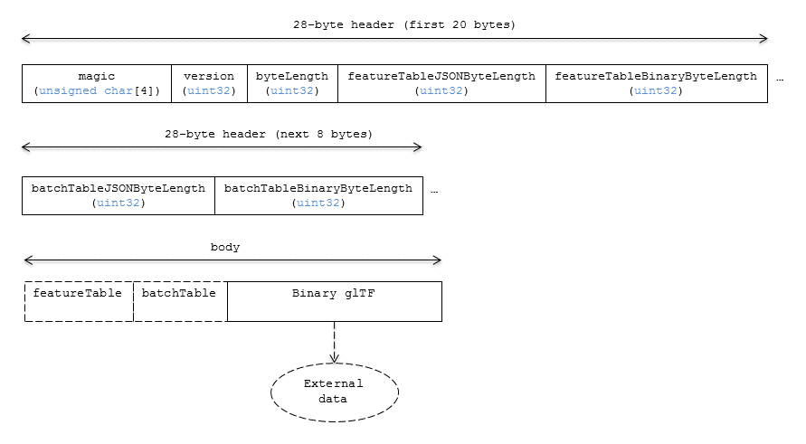

# Batched 3D Model

## Contributors

* Patrick Cozzi, [@pjcozzi](https://twitter.com/pjcozzi)
* Tom Fili, [@CesiumFili](https://twitter.com/CesiumFili)
* Sean Lilley, [@lilleyse](https://github.com/lilleyse)

## Overview

_Batched 3D Model_ allows offline batching of heterogeneous 3D models, such as different buildings in a city, for efficient streaming to a web client for rendering and interaction.  Efficiency comes from transferring multiple models in a single request and rendering them in the least number of WebGL draw calls necessary.  Using the core 3D Tiles spec language, each model is a _feature_.

Per-model properties, such as IDs, enable individual models to be identified and updated at runtime, e.g., show/hide, highlight color, etc. Properties may be used, for example, to query a web service to access metadata, such as passing a building's ID to get its address. Or a property might be referenced on-the-fly for changing a model's appearance, e.g., changing highlight color based on a property value.

Batched 3D Model, or just the _batch_, is a binary blob in little endian accessed in JavaScript as an `ArrayBuffer`.

## Layout

A tile is composed of two sections: a header immediately followed by a body.

**Figure 1**: Batched 3D Model layout (dashes indicate optional fields).



## Header

The 28-byte header contains the following fields:

|Field name|Data type|Description|
|----------|---------|-----------|
| `magic` | 4-byte ANSI string | `"b3dm"`.  This can be used to identify the arraybuffer as a Batched 3D Model tile. |
| `version` | `uint32` | The version of the Batched 3D Model format. It is currently `1`. |
| `byteLength` | `uint32` | The length of the entire tile, including the header, in bytes. |
| `featureTableJSONByteLength` | `uint32` | The length of the feature table JSON section in bytes. Zero indicates there is no feature table. |
| `featureTableBinaryByteLength` | `uint32` | The length of the feature table binary section in bytes. If `featureTableJSONByteLength` is zero, this will also be zero. |
| `batchTableJSONByteLength` | `uint32` | The length of the batch table JSON section in bytes. Zero indicates there is no batch table. |
| `batchTableBinaryByteLength` | `uint32` | The length of the batch table binary section in bytes. If `batchTableJSONByteLength` is zero, this will also be zero. |

If `featureTableJSONByteLength` equals zero, the tile does not need to be rendered.

The body section immediately follows the header section, and is composed of three fields: `Feature Table`, `Batch Table` and `Binary glTF`.

Code for reading the header can be found in
[Batched3DModelTileContent](https://github.com/AnalyticalGraphicsInc/cesium/blob/master/Source/Scene/Batched3DModel3DTileContent.js)
in the Cesium implementation of 3D Tiles.

## Feature Table

Contains values for `b3dm` semantics.
More information is available in the [Feature Table specification](../FeatureTable/README.md).

The `b3dm` Feature Table JSON Schema is defined in [b3dm.featureTable.schema.json](../../schema/b3dm.featureTable.schema.json).

### Semantics

#### Feature Semantics

There are currently no per-feature semantics.

#### Global Semantics

These semantics define global properties for all features.

| Semantic | Data Type | Description | Required |
| --- | --- | --- | --- |
| `BATCH_LENGTH` | `uint32` | The number of distinguishable models, also called features, in the batch. If the Binary glTF does not have a `batchId` attribute, this field _must_ be `0`. | :white_check_mark: Yes. |

## Batch Table

The _Batch Table_ contains per-model application-specific metadata, indexable by `batchId`, that can be used for declarative styling and application-specific use cases such as populating a UI or issuing a REST API request.  In the Binary glTF section, each vertex has an numeric `batchId` attribute in the integer range `[0, number of models in the batch - 1]`.  The `batchId` indicates the model to which the vertex belongs.  This allows models to be batched together and still be identifiable.

See the [Batch Table](../BatchTable/README.md) reference for more information.

## Binary glTF

[glTF](https://www.khronos.org/gltf) is the runtime asset format for WebGL.  [Binary glTF](https://github.com/KhronosGroup/glTF/tree/master/extensions/Khronos/KHR_binary_glTF) is an extension defining a binary container for glTF.  Batched 3D Model uses glTF 1.0 with the [KHR_binary_glTF](https://github.com/KhronosGroup/glTF/tree/master/extensions/Khronos/KHR_binary_glTF) extension.

The binary glTF immediately follows the feature table and batch table.  It may embed all of its geometry, texture, and animations, or it may refer to external sources for some or all of these data.

The glTF asset must be 8-byte aligned so that glTF's byte-alignment guarantees are met. This can be done by padding the Feature Table or Batch Table if they are present.

As described above, each vertex has a `batchId` attribute indicating the model to which it belongs.  For example, vertices for a batch with three models may look like this:
```
batchId:  [0,   0,   0,   ..., 1,   1,   1,   ..., 2,   2,   2,   ...]
position: [xyz, xyz, xyz, ..., xyz, xyz, xyz, ..., xyz, xyz, xyz, ...]
normal:   [xyz, xyz, xyz, ..., xyz, xyz, xyz, ..., xyz, xyz, xyz, ...]
```
Vertices do not need to be ordered by `batchId` so the following is also OK:
```
batchId:  [0,   1,   2,   ..., 2,   1,   0,   ..., 1,   2,   0,   ...]
position: [xyz, xyz, xyz, ..., xyz, xyz, xyz, ..., xyz, xyz, xyz, ...]
normal:   [xyz, xyz, xyz, ..., xyz, xyz, xyz, ..., xyz, xyz, xyz, ...]
```
Note that a vertex can't belong to more than one model; in that case, the vertex needs to be duplicated so the `batchId`s can be assigned.

The `batchId` is identified by the glTF technique parameter semantic `_BATCHID`.  For example:

```JSON
"technique": {
    "attributes": {
        "a_batchId": "batchId"
    },
    "parameters": {
        "batchId": {
            "semantic": "_BATCHID",
            "type": 5126
        }
    }
}
```

For this example the attribute is named `a_batchId`, and is declared in the vertex shader as:

```glsl
attribute float a_batchId;
```

The vertex shader can be modified at runtime to use `a_batchId` to access individual models in the batch, e.g., to change their color.

When a Batch Table is present or the `BATCH_LENGTH` property is greater than `0`, the `batchId` attribute (with the parameter semantic `_BATCHID`) is required; otherwise, it is not.

Although not strictly required, clients may find the glTF [CESIUM_RTC](https://github.com/KhronosGroup/glTF/blob/new-extensions/extensions/CESIUM_RTC/README.md) extension useful for high-precision rendering.

## File Extension

`.b3dm`

The file extension is optional. Valid implementations ignore it and identify a content's format by the `magic` field in its header.

## MIME Type

_TODO, [#60](https://github.com/AnalyticalGraphicsInc/3d-tiles/issues/60)_

`application/octet-stream`
