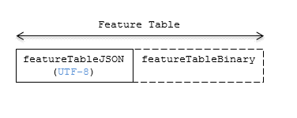
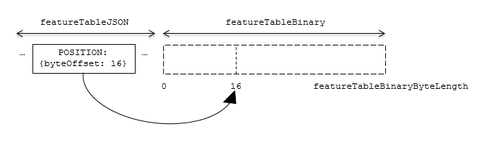

# Feature Table

## Contributors

* Sean Lilley, [@lilleyse](https://twitter.com/lilleyse)
* Rob Taglang, [@lasalvavida](https://github.com/lasalvavida)
* Dan Bagnell, [@bagnell](https://github.com/bagnell)
* Patrick Cozzi, [@pjcozzi](https://twitter.com/pjcozzi)

## Overview

A _Feature Table_ describes position and appearance properties for each feature in a tile.  The _Batch Table_ (TODO: link), on the other hand, contains per-feature application-specific metadata not necessarily used for rendering.

A Feature Table is used by the following tile formats:
* [Instanced 3D Model](../Instanced3DModel) (i3dm) - each model instance is a feature.
* [Point Cloud](../PointCloud) (pnts) - each point is a feature.
* [Vector](../VectorData) (vctr) - each point/polyline/polygon is a feature.

Per-feature properties are defined using tile-format-specific semantics defined in each tile format's specification.  For example, in _Instanced 3D Model_, `SCALE_NON_UNIFORM` defines the non-uniform scale applied to each instance.

## Layout

A Feature Table is composed of two parts: a JSON header and an optional binary body. The JSON keys are tile-format-specific semantics, and the values can either be defined directly in the JSON, or refer to sections in the binary body.
The binary body is a binary buffer containing data referenced by the header. It is more efficient to store long numeric arrays in the binary body.

**Figure 1**: Feature Table layout



When a tile format includes a Feature Table, the Feature Table immediately follows the header.  The header will also contain `featureTableJSONByteLength` and `featureTableBinaryByteLength` `uint32` fields, which can be used to extract each respective part of the Feature Table.
Code for reading the Feature Table can be found in [Cesium3DTileFeatureTableResources.js](https://github.com/AnalyticalGraphicsInc/cesium/blob/3d-tiles/Source/Scene/Cesium3DTileFeatureTableResources.js) in the Cesium implementation of 3D Tiles.

## JSON Header

Feature Table values can be represented in the JSON header in three different ways.

1. A single JSON value. (e.g. `"INSTANCES_LENGTH" : 4`)
  * This is common for global semantics like `"INSTANCES_LENGTH"`, which defines the number of model instances in an Instanced 3D Moel tile.
2. A JSON array of values. (e.g. `"POSITION" : [1.0, 0.0, 0.0, 0.0, 1.0, 0.0, 0.0, 0.0, 1.0]`)
    * Feature values are always stored as a single, flat array, not an array of arrays.  Above, each `POSITION` refers to a `float32[3]` data type so there are three features: `Feature 0's position`=`(1.0, 0.0, 0.0)`, `Feature 1's position`=`(0.0, 1.0, 0.0)`, `Feature 2's position`=`(0.0, 0.0, 1.0)`.
3. A reference to data in the binary body, denoted by an object with a `byteOffset` property. (e.g. `"SCALE" : { "byteOffset" : 24` } )
  * `byteOffset` is a zero-based offset relative to the start of the binary body.

The only valid keys in the JSON header are the defined semantics by the tile format.  Application-specific data should be stored in the Batch Table.

## Binary Body

When the JSON header includes a reference to the binary, the provided `byteOffset` is used to index into the data. 

**Figure 2**: Indexing into the Feature Table binary body



Values can be retrieved using the number of features, `featuresLength`, the desired feature id, `featureId`, and the data type for the feature semantic.

For example, using the `POSITION` semantic, which has a `float32[3]` data type:

```javascript
var byteOffset = featureTableJSON.POSTION.byteOffset;

var positionArray = new Float32Array(featureTableBinary.buffer, byteOffset, featuresLength * 3); // There are three components for each POSITION feature.
var position = positionArray.subarray(featureId * 3, featureId * 3 + 3); // Using subarray creates a view into the array, and not a new array.
```

## Implementation Notes

In JavaScript, a `TypedArray` cannot be created on data unless it is byte-aligned to the data type.
For example, a `Float32Array` must be stored in memory such that its data begins on a byte multiple of four since each `float` contains four bytes.

The string generated from the JSON header should be padded with space characters in order to ensure that the binary body is byte-aligned.
The binary body should also be padded if necessary when there is data following the Feature Table.
