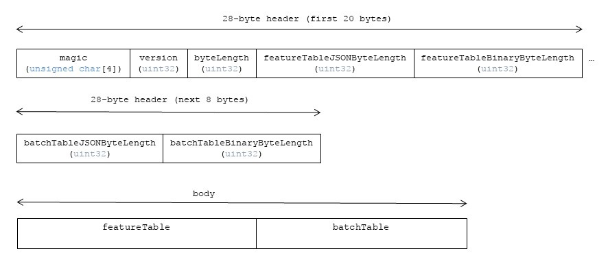

# Geometry

## Contributors

* Dan Bagnell, [@bagnell](https://github.com/bagnell)
* Patrick Cozzi, [@pjcozzi](https://twitter.com/pjcozzi)
* Sean Lilley, [@lilleyse](https://github.com/lilleyse)

## Overview

The _Geometry_ tile format allows streaming of geometry datasets including boxes, cylinders, ellipsoids, and spheres.

Each box, cylinder, ellipsoid, and sphere is a _feature_ in the 3D Tiles specification language.

In addition to rendering the geometry, the geometry can be used for classifying geometry of other 3D Tiles tilesets.

## Layout

A tile is composed of two sections: a header immediately followed by a body.

**Figure1**: Vector tile layout.

## Header

The 28-byte header contains the following fields:

| Field name | Data type | Description |
| --- | --- | --- |
| `magic` | 4-byte ANSI string | `"geom"`. This can be used to identify the arraybuffer as a Geometry tile. |
| `version` | `uint32` | The version of the Geometry Data format. It is currently `1`. |
| `byteLength` | `uint32` | The length of the entire tile, including the header, in bytes. |
| `featureTableJSONByteLength` | `uint32` | The length of the feature table JSON section in bytes. |
| `featureTableBinaryByteLength` | `uint32` | The length of the feature table binary section in bytes. If `featureTableJSONByteLength` is zero, this will also be zero. |
| `batchTableJSONByteLength` | `uint32` | The length of the batch table JSON section in bytes. Zero indicates that there is no batch table. |
| `batchTableBinaryByteLength` | `uint32` | The length of the batch table binary section in bytes. If `batchTableJSONByteLength` is zero, this will also be zero. | 

If `featureTableJSONByteLength` equals zero, the tile does not need to be rendered.

The body section immediately follows the header section, and is composed, in order, of two fields: `Feature Table` and  `Batch Table`.

Code for reading the header can be found in
[Geometry3DTileContent.js](https://github.com/AnalyticalGraphicsInc/cesium/blob/master/Source/Scene/Geometry3DTileContent.js)
in the Cesium implementation of 3D Tiles.

## Feature Table

Contains values for `geom` semantics used to render features.  The general layout of a Feature Table is described in the [Feature Table specification](../FeatureTable).

The `geom` Feature Table JSON schema is defined in [geom.featureTable.schema.json](../../schema/geom.featureTable.schema.json).

### Semantics

Per-feature semantics specific to a feature type are prefixed with the name of the feature type. e.g. `BOXES` for boxes, `CYLINDERS` for cylinders, `ELLIPSOIDS` for ellipsoids, and `SPHERES` for spheres.

At least one global `LENGTH` semantic must be defined. 
* If `BOXES_LENGTH` in not defined, or zero, no boxes will be rendered.
* If `CYLINDERS_LENGTH` in not defined, or zero, no cylinders will be rendered.
* If `ELLIPSOIDS_LENGTH` in not defined, or zero, no ellipsoids will be rendered.
* If `SPHERES_LENGTH` in not defined, or zero, no spheres will be rendered.

Multiple feature types may be defined in a single Geometry tile using multiple `LENGTH` semantics, and in that case, all specified feature types will be rendered.

If a semantic has a dependency on another semantic, that semantic must be defined as well.

#### Geometry Semantics

| Semantic | Data Type | Description | Required |
| --- | --- | --- | --- |
| `BOXES` | `float32[]` | The boxes in the tile. The length of the array will be `16 * BOXES_LENGTH`. The 16 elements are the 4x4 model matrix in column-major order. | :white_check_mark: Yes, when the global `BOXES_LENGTH` is greater than zero. |
| `BOX_BATCH_IDS` | `uint16[]` | The `batchId` of the box that can be used to retrieve metadata from the `Batch Table`. | :red_circle: No. |
| `CYLINDERS` | `float32[]` | The cylinders in the tile. The length of the array will be `16 * CYLINDERS_LENGTH`. The 16 elements are the 4x4 model matrix in column-major order. The scale of the x and y axis will be the radius of the cylinder. Scaling the z axis will change the length of the cylinder. | :white_check_mark: Yes, when the global `CYLINDERS_LENGTH` is greater than zero. |
| `CYLINDER_BATCH_IDS` | `uint16[]` | The `batchId` of the cylinder that can be used to retrieve metadata from the `Batch Table`. | :red_circle: No. |
| `ELLIPSOIDS` | `float32[]` | The ellipsoids in the tile. The length of the array will be `16 * ELLIPSOIDS_LENGTH`. The 16 elements are the 4x4 model matrix in column-major order. | :white_check_mark: Yes, when the global `ELLIPSOIDS_LENGTH` is greater than zero. |
| `ELLIPSOID_BATCH_IDS` | `uint16[]` | The `batchId` of the ellipsoid that can be used to retrieve metadata from the `Batch Table`. | :red_circle: No. |
| `SPHERES` | `float32[]` | The spheres in the tile. The length of the array will be `4 * SPHERES_LENGTH`. The first element is the scale of the sphere. The following 3 elements are the translation of the sphere. | :white_check_mark: Yes, when the global `SPHERES_LENGTH` is greater than zero. |
| `SPHERE_BATCH_IDS` | `uint16[]` | The `batchId` of the sphere that can be used to retrieve metadata from the `Batch Table`. | :red_circle: No. |

#### Global Semantics

The semantics define global properties for all geometry elements.

| Semantic | Data Type | Description | Required |
| --- | --- | --- | --- |
| `BOXES_LENGTH` | `uint32` | The number of boxes in the tile. | :red_circle: No. |
| `CYLINDERS_LENGTH` | `uint32` | The number of cylinders in the tile. | :red_circle: No. |
| `ELLIPSOIDS_LENGTH` | `uint32` | The number of ellipsoids in the tile. | :red_circle: No. |
| `SPHERES_LENGTH` | `uint32` | The number of spheres in the tile. | :red_circle: No. |
| `RTC_CENTER` | `float32[]` | The center used for RTC rendering. | :red_circle: No. If no center is supplied, the center of the global `RECTANGLE` will be used. |

## Batch Table

The _Batch Table_ contains application-specific metadata, indexable by `batchId`, that can be used for declarative styling and application-specific use cases such as populating a UI or issuing a REST API request.

See the [Batch Table](../BatchTable/README.md) reference for more information.

## File Extension

`.geom`

The file extension is optional. Valid implementations ignore it and identify a content's format by the `magic` field in its header.

## MIME Type

_TODO, [#60](https://github.com/AnalyticalGraphicsInc/3d-tiles/issues/60)_

`application/octet-stream`

## Implementation Notes

In JavaScript, a `TypedArray` cannot be created on data unless it is byte-aligned to the data type.
For example, a `Float32Array` must be stored in memory such that its data begins on a byte multiple of four since each `float` contains four bytes.

The string generated from the JSON and each array should be padded is necessary to ensure byte alignment.
