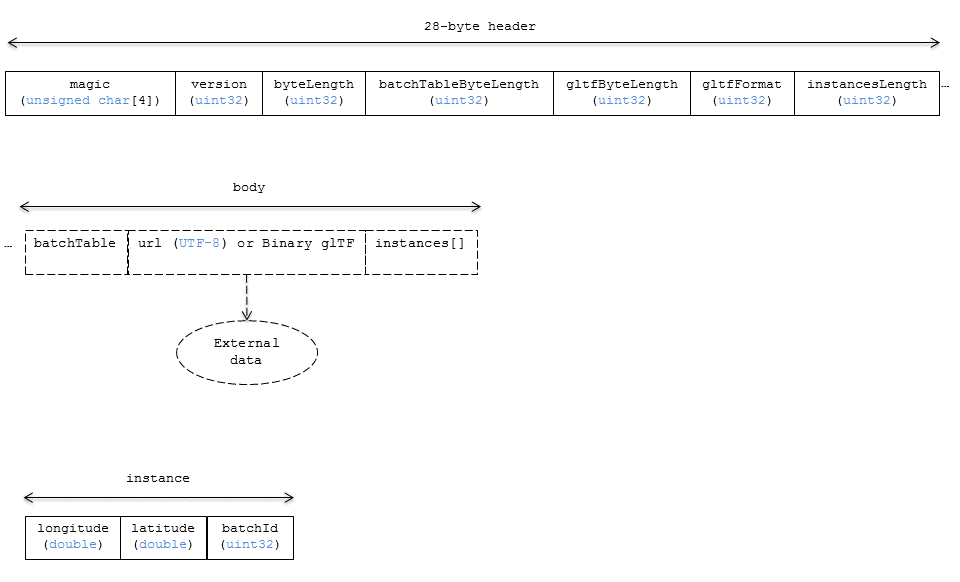

# Instanced 3D Model

## Contributors

* Sean Lilley, [@lilleyse](https://twitter.com/lilleyse)
* Patrick Cozzi, [@pjcozzi](https://twitter.com/pjcozzi)

## Overview

_Instanced 3D Model_ is a tile format for efficient streaming and rendering of a large number of models, called _instances_, with slight variations.  In the simplest case, the same tree model, for example, may be located - or _instanced_ - in several places.  Each instance references the same model, and has per-instance properties, such as position.

In addition to trees, Instanced 3D Model is useful for fire hydrants, sewer caps, lamps, traffic lights, etc.

A Composite tile can be used to create tiles with different types of instanced models, e.g., trees and traffic lights.

Instanced 3D Model maps well to the [ANGLE_instanced_arrays](https://www.khronos.org/registry/webgl/extensions/ANGLE_instanced_arrays/) extension for efficient rendering with WebGL.

## Layout

A tile is composed of a header immediately followed by a body.

**Figure 1**: Instanced 3D Model layout (dashes indicate optional sections).



## Header

The 28-byte header contains:

* `magic` - 4-byte ANSI string `i3dm`.  This can be used to identify the arraybuffer as an Instanced 3D Model tile.
* `version` - `uint32`, which contains the version of the Instanced 3D Model format. It is currently `1`.
* `byteLength` - `uint32`, which contains the length of the entire tile, including the header, in bytes.
* `batchTableLength` - `uint32`, which contains the length of the batch table.  This must be greater than or equal to zero.  Zero indicates there is not a batch table.
* `glTFLength` - `uint32`, which contains the length of glTF field in bytes.  This must be greater than or equal to zero.
* `glTFFormat` - `uint32`, which indicates the format of the glTF field of the body.  `0` indicates it is a uri, `1` indicates it is embedded binary glTF.  See the glTF section below.
* `instancesLength` - `uint32`, which contains the number of instances.  This must be greater than or equal to zero.

_TODO: code example reading header_

If either `glTFLength` or `instancesLength` equal zero, the tile does not need to be rendered.

The body immediately follows the header, and is composed of three fields: `Batch Table`, `glTF`, and `instances`.

## Batch Table

_TODO: create a separate Batch Table spec that b3dm, i3dm, etc. can reference?_

The batch table is a `UTF-8` string containing JSON.  It immediately follows the header.  It can be extracted from the arraybuffer using the `TextDecoder` JavaScript API and transformed to a JavaScript object with `JSON.parse`.

Each property in the object is an array with its length equal to the number of instances in the tile.  Each array is a homogeneous collection of `String`, `Number`, or `Boolean` elements.  Elements may be `null`.

An instance's `batchId` is used to access elements in each array and extract the corresponding properties.  For example, the following batch table has properties for two instances:
```json
{
    "id" : ["unique id", "another unique id"],
    "displayName" : ["Tree species", "Another tree species"],
    "yearPlanted" : [1999, 2003]
}
```

The properties for the instance with `batchId = 0` are
```javascript
id[0] = 'unique id';
displayName[0] = 'Tree species';
yearBuilt[0] = 1999;
```

The properties for `batchId = 1` are
```javascript
id[1] = 'another unique id';
displayName[1] = 'Another tree species';
yearBuilt[1] = 2003;
```

## glTF

The glTF field immediately follows the batch table (or immediately follows the header, if `header.batchTableLength` is zero).

[glTF](https://www.khronos.org/gltf) is the runtime asset format for WebGL.  [Binary glTF](https://github.com/KhronosGroup/glTF/tree/master/extensions/Khronos/KHR_binary_glTF) is an extension defining a binary container for glTF.  Instanced 3D Model uses glTF 1.0 with the [KHR_binary_glTF](https://github.com/KhronosGroup/glTF/tree/master/extensions/Khronos/KHR_binary_glTF) extension.

`header.glTFFormat` determines the format of the glTF field.  When it is `0`, the glTF field is

* a UTF-8 string, which contains a uri to a glTF model.

When the value of `header.glTFFormat` is `1`, the glTF field is

* a binary blob containing binary glTF.

In either case, `header.glTFLength` contains the length of the glTF field in bytes.

## Instances

The `instances` field immediately follows the `glTF` field (which may be omitted when `header.glTFLength` is `0`).

The `instances` field contains `header.instancesLength` tightly packed instances.  Each instance has three fields:

* `longitude` - `double`, the longitude, in radians, in the range `[-PI, PI]`.
* `latitude` - `double`, the latitude, in radians, in the range `[-PI / 2, PI / 2]`.
* `batchId` - `uint16` in the range `[0, header.batchTableLength)`, which indicates the corresponding properties.

_TODO: make this much more memory efficient and more general._

When `header.batchTableLength` is zero, which indicates there is not a batch table, `batchId` is omitted, so each instance contains only `longitude` and `latitude` fields.

Each instance is in the east-north-up reference frame (`x` points east, `y` points north, and `z` points along the geodetic surface normal).

## File Extension

`.i3dm`

## MIME Type

_TODO_

`application/octet-stream`
