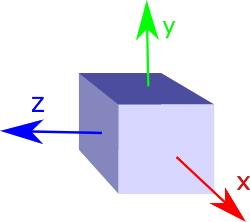

# Instanced 3D Model

## Contributors

* Sean Lilley, [@lilleyse](https://twitter.com/lilleyse)
* Patrick Cozzi, [@pjcozzi](https://twitter.com/pjcozzi)
* Rob Taglang, [@lasalvavida](https://github.com/lasalvavida)

## Overview

_Instanced 3D Model_ is a tile format for efficient streaming and rendering of a large number of models, called _instances_, with slight variations.  In the simplest case, the same tree model, for example, may be located - or _instanced_ - in several places.  Each instance references the same model, and has per-instance properties, such as position.  Using the core 3D Tiles spec language, each instance is a _feature_.

In addition to trees, Instanced 3D Model is useful for exterior features such as fire hydrants, sewer caps, lamps, and traffic lights, and interior CAD features such as bolts, valves, and electric outlets.

A [Composite](../Composite/README.md) tile can be used to create tiles with different types of instanced models, e.g., trees and traffic lights.

Instanced 3D Model maps well to the [ANGLE_instanced_arrays](https://www.khronos.org/registry/webgl/extensions/ANGLE_instanced_arrays/) extension for efficient rendering with WebGL.

## Layout

A tile is composed of a header section immediately followed by a body section.

**Figure 1**: Instanced 3D Model layout (dashes indicate optional fields).


## Header

The 36-byte header contains the following fields:

| Field name | Data type | Description |
| --- | --- | --- |
| `magic` | 4-byte ANSI string | `"i3dm"`.  This can be used to identify the arraybuffer as an Instanced 3D Model tile. |
| `version` | `uint32` | The version of the Instanced 3D Model format. It is currently `1`. |
| `byteLength` | `uint32` | The length of the entire tile, including the header, in bytes. |
| `featureTableJSONByteLength` | `uint32` | The length of the feature table JSON section in bytes. |
| `featureTableBinaryByteLength` | `uint32` | The length of the feature table binary section in bytes. If `featureTableJSONByteLength` is zero, this will also be zero. |
| `batchTableJSONByteLength` | `uint32` | The length of the batch table JSON section in bytes. Zero indicates that there is no batch table. |
| `batchTableBinaryByteLength` | `uint32` | The length of the batch table binary section in bytes. If `batchTableJSONByteLength` is zero, this will also be zero. |
| `gltfByteLength` | `uint32` | The length of the glTF field in bytes. |
| `gltfFormat` | `uint32` | Indicates the format of the glTF field of the body.  `0` indicates it is a url, `1` indicates it is embedded binary glTF.  See the glTF section below. |

If either `featureTableJSONByteLength` or `gltfByteLength` equal zero, the tile does not need to be rendered.

The body section immediately follows the header section, and is composed of three fields: `Feature Table`, `Batch Table`, and `glTF`.

Code for reading the header can be found in
[Instanced3DModelTileContent](https://github.com/AnalyticalGraphicsInc/cesium/blob/3d-tiles/Source/Scene/Instanced3DModel3DTileContent.js)
in the Cesium implementation of 3D Tiles.

## Feature Table

Contains values for `i3dm` semantics used to create instanced models.
[//]: # "TODO: Change this link to the feature table specification URL"

### Semantics

#### Instance Semantics

These semantics map to an array of feature values that are used to create instances. The length of these arrays must be the same for all semantics and is equal to the number of instances.

If a semantic has a dependency on another semantic, that semantic must be defined.
If both `SCALE` and `SCALE_NON_UNIFORM` are defined for an instance, both scaling operations will be applied.

| Semantic | Data Type  | Description | Required |
| --- | --- | --- | --- | --- |
| `POSITION` | `float32[3]` | A 3-component array of numbers containing `x`, `y`, and `z` Cartesian coordinates for the position of the instance. | :white_check_mark: Yes, if `POSITION_QUANTIZED` is not defined|
| `POSITION_QUANTIZED` | `uint16[3]` | A 3-component array of numbers containing `x`, `y`, and `z` in quantized Cartesian coordinates for the position of the instance. | :white_check_mark: Yes, if `POSITION` is not defined <br> :large_blue_diamond: Depends on `QUANTIZED_VOLUME_OFFSET` <br> :large_blue_diamond: Depends on `QUANTIZED_VOLUME_SCALE` |
| `NORMAL_UP` | `float32[3]`| A unit vector defining the `up` direction for the orientation of the instance. | :red_circle: No <br> :large_blue_diamond: Depends on `NORMAL_RIGHT` |
| `NORMAL_RIGHT` | `float32[3]` | A unit vector defining the `right` direction for the orientation of the instance. Must be orthogonal to `up`. | :red_circle: No <br> :large_blue_diamond: Depends on `NORMAL_UP` |
| `NORMAL_UP_OCT32P` | `uint16[2]` | An oct-encoded unit vector with 32-bits of precision defining the `up` direction for the orientation of the instance. | :red_circle: No <br> :large_blue_diamond: Depends on `NORMAL_UP_OCT32P` |
| `NORMAL_RIGHT_OCT32P` | `uint16[2]` | An oct-encoded unit vector with 32-bits of precision defining the `right` direction for the orientation of the instance. Must be orthogonal to `up`. | :red_circle: No <br> :large_blue_diamond: Depends on `NORMAL_RIGHT_OCT32P` |
| `SCALE` | `float32` | A number defining a scale to apply to all axes of the instance. | :red_circle: No |
| `SCALE_NON_UNIFORM` | `float32[3]` | A 3-component array of numbers defining the scale to apply to the `x`, `y`, and `z` axes of the instance. | :red_circle: No |
| `BATCH_ID` | `unit16` | The `batchId` of the instance that can be used to retrieve metadata from the `Batch Table`. | :red_circle: No |

#### Global Semantics

These semantics define global properties for all instances.

| Semantic | Data Type | Description | Required |
| --- | --- | --- | --- |
| `INSTANCES_LENGTH`| `uint32` | The number of instances to generate. The length of each array value for an instance semantic should be equal to this. | :white_check_mark: Yes |
| `QUANTIZED_VOLUME_OFFSET` | `float32[3]` | A 3-component array of numbers defining the offset for the quantized volume. | :red_circle: No, unless `POSITION_QUANTIZED` is defined |
| `QUANTIZED_VOLUME_SCALE` | `float32[3]` | A 3-component array of numbers defining the scale for the quantized volume. |:red_circle: No, unless `POSITION_QUANTIZED` is defined |

### Instance Orientation

An instance's orientation is defined by an orthonormal basis created by an `up` and `right` vector. If `NORMAL_UP` and `NORMAL_RIGHT` or `NORMAL_UP_OCT32P` and `NORMAL_RIGHT_OCT32P` are not present,
the instance will default to the `east/north/up` reference frame's orientation for the instance's Cartographic position (`x`, `y`, `z`) with the tileset transform applied, converted to `longitude` and `latitude` on the `WGS84` ellipsoid).

The `x` vector in the standard basis maps onto the `right` vector in the transformed basis, and the `y` vector maps on to the `up` vector.
The `z` vector would map onto a `forward` vector, but it is omitted because it will always be the cross product of `right` and `up`.

**Figure 2**: A box in the standard basis.



**Figure 3**: A box transformed into a rotated basis.


#### Oct-encoded Normal Vectors

If `NORMAL_UP` and `NORMAL_RIGHT` are not defined for an instance, its orientation may be stored as oct-encoded normals in `NORMAL_UP_OCT32P` and `NORMAL_RIGHT_OCT32P`.
These define `up` and `right` using the oct-encoding described in
[*A Survey of Efficient Representations of Independent Unit Vectors* by Cigolle et al.](http://jcgt.org/published/0003/02/01/).
An implementation for encoding and decoding these unit vectors can be found in Cesium's
[AttributeCompression](https://github.com/AnalyticalGraphicsInc/cesium/blob/master/Source/Core/AttributeCompression.js)
module.

### Instance Position

`POSITION` defines the location for an instance before and tileset transforms are applied.

#### Quantized Positions

If `POSITION` is not defined for an instance, its position may be stored in `POSITION_QUANTIZED` which defines the instance position relative to the quantized volume.
If neither `POSITION` or `POSITION_QUANTIZED` are defined, the instance will not be created.

A quantized volume is defined by `offset` and `scale` to map quantized positions into model space.

**Figure 4**: A quantized volume based on `offset` and `scale`.


`offset` is stored in the global semantic `QUANTIZED_VOLUME_OFFSET`, and `scale` is stored in the global semantic `QUANTIZED_VOLUME_SCALE`.
If those global semantics are not defined, `POSITION_QUANTIZED` cannot be used.

Quantized positions can be mapped to model space using the formula:

`POSITION = POSITION_QUANTIZED * QUANTIZED_VOLUME_SCALE + QUANTIZED_VOLUME_OFFSET`

### Instance Scaling

Scaling can be applied to instances using the `SCALE` and `SCALE_NON_UNIFORM` semantics.
`SCALE` applies a uniform scale along all axes, and `SCALE_NON_UNIFORM` applies scaling to the `x`, `y`, and `z` axes independently.

### Examples

In these examples, the semantic values are shown as JSON arrays. This is done to make the examples more human readable, and is still a valid feature table.
In practice, for performance reasons, these arrays should be stored in the feature table binary with a JSON value pointing to the beginning byteOffset in the binary.

```json
{
    "INSTANCES_LENGTH" : 2,
    "POSITION" : {
        byteOffset : 0
    }
}
```

#### Positions Only

In this minimal example, we place 4 instances on the corners of a unit length square with the default orientation.

```json
{
    "INSTANCES_LENGTH" : 4,
    "POSITION" : [
        0.0, 0.0, 0.0, 
        1.0, 0.0, 0.0, 
        0.0, 0.0, 1.0, 
        1.0, 0.0, 1.0
    ]
}
```

#### Quantized Positions and Oct-Encoded Normals

In this example, the 4 instances will be placed with an orientation `up` of `[0.0, 1.0, 0.0]` and `right` of `[1.0, 0.0, 0.0]` in oct-encoded format 
and they will be placed on the corners of a quantized volume that spans from `-250.0` to `250.0` units in the `x` and `z` directions.

```json
{
    "INSTANCES_LENGTH" : 4,
    "QUANTIZED_VOLUME_OFFSET" : [-250.0, 0, -250],
    "QUANTIZED_VOLUME_SCALE" : [500.0, 0, 500.0],
    "POSITION_QUANTIZED" : [
        0, 0, 0,
        65535, 0, 0,
        0, 0, 65535,
        65535, 0, 65535
    ],
    "NORMAL_UP_OCT32P" : [
        32768, 65535,
        32768, 65535,
        32768, 65535,
        32768, 65535
    ],
    "NORMAL_RIGHT_OCT32P" : [
        65535, 32768,
        65535, 32768,
        65535, 32768,
        65535, 32768
    ]
}
```

## Batch Table

Contains metadata organized by `batchId` that can be used for declarative styling.

See the [Batch Table](..//Batched3DModel#batch-table) reference for more information.
[//]: # "TODO: Change this link to the batch table specification URL"

## glTF

The glTF asset to be instanced is stored after the feature table and batch table.

[glTF](https://www.khronos.org/gltf) is the runtime asset format for WebGL.  [Binary glTF](https://github.com/KhronosGroup/glTF/tree/master/extensions/Khronos/KHR_binary_glTF) is an extension defining a binary container for glTF.  Instanced 3D Model uses glTF 1.0 with the [KHR_binary_glTF](https://github.com/KhronosGroup/glTF/tree/master/extensions/Khronos/KHR_binary_glTF) extension.

`header.gltfFormat` determines the format of the glTF field.  When it is `0`, the glTF field is

* a UTF-8 string, which contains a url to a glTF model.

When the value of `header.gltfFormat` is `1`, the glTF field is

* a binary blob containing binary glTF.

In either case, `header.gltfByteLength` contains the length of the glTF field in bytes.

## File Extension

`.i3dm`

## MIME Type

_TODO, [#60](https://github.com/AnalyticalGraphicsInc/3d-tiles/issues/60)_

`application/octet-stream`

## Resources

1. [*A Survey of Efficient Representations of Independent Unit Vectors* by Cigolle et al.](http://jcgt.org/published/0003/02/01/)
2. [*Mesh Geometry Compression for Mobile Graphics* by Jongseok Lee et al.](http://cg.postech.ac.kr/research/mesh_comp_mobile/mesh_comp_mobile_conference.pdf)
3. Cesium [AttributeCompression](https://github.com/AnalyticalGraphicsInc/cesium/blob/master/Source/Core/AttributeCompression.js) module for oct-encoding

## Implementation Examples

### Cesium

#### Generating up and right from longitude, latitude, and height

```javascript
var position = Cartesian3.fromRadians(longitude, latitude, height);

// Compute the up vector
var up = new Cartesian3();
var transform = Transforms.eastNorthUpToFixedFrame(position);
var rotation = new Matrix3();
Matrix4.getRotation(transform, rotation);

// In east-north-up, the up vector is stored in the z component
Matrix3.multiplyByVector(rotation, Cartesian3.UNIT_Z, up);

// Compute the right and forward vectors
var right = new Cartesian3();
var forward = Cartesian3.clone(Cartesian3.UNIT_Z);

// You can change the orientation of a model by rotating about the y-axis first
var orient = new Matrix3();
var orientAngle = CesiumMath.fromDegrees(90.0);
Matrix3.fromRotationY(orientAngle, orient);
Matrix3.multiplyByVector(orient, forward, forward);

// Cross up and forward to get right
Cartesian3.cross(up, forward, right);
Cartesian3.normalize(right, right);
```

#### Construct a model-matrix for an instance
```javascript
// Cross right and up to get forward
var forward = new Cartesian3();
Cartesian3.cross(right, up, forward);

// Place the basis into a rotation matrix
var rotation = new Matrix3();
Matrix3.setColumn(rotation, 0, right, rotation);
Matrix3.setColumn(rotation, 1, up, rotation);
Matrix3.setColumn(rotation, 2, forward, rotation);

// Get the scale
var scale = Matrix3.IDENTITY.clone();
if (defined(uniformScale)) {
    Matrix3.multiplyByScalar(scale, uniformScale, scale);
}
if (defined(nonUniformScale)) {
    Matrix3.multiplyByVector(scale, nonUniformScale, scale);
}

// Generate the model matrix
var modelMatrix = new Matrix4();
Matrix4.fromTranslationRotationScale(
    new TranslationRotationScale(position, rotation, scale),
    modelMatrix
);
```