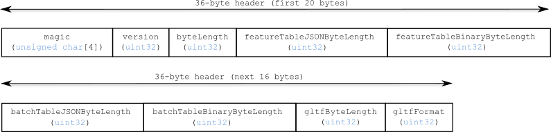
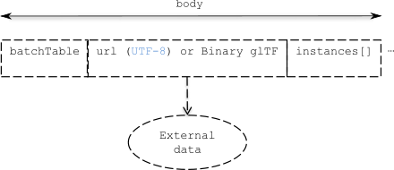
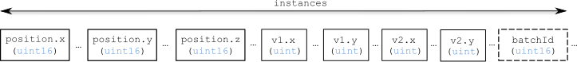
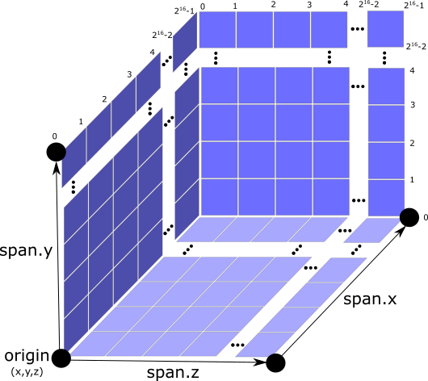
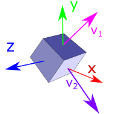

# Instanced 3D Model

## Contributors

* Sean Lilley, [@lilleyse](https://twitter.com/lilleyse)
* Patrick Cozzi, [@pjcozzi](https://twitter.com/pjcozzi)
* Rob Taglang, [@lasalvavida](https://github.com/lasalvavida)

## Overview

_Instanced 3D Model_ is a tile format for efficient streaming and rendering of a large number of models, called _instances_, with slight variations.  In the simplest case, the same tree model, for example, may be located - or _instanced_ - in several places.  Each instance references the same model, and has per-instance properties, such as position.  Using the core 3D Tiles spec language, each instance is a _feature_.

In addition to trees, Instanced 3D Model is useful for exterior features such as fire hydrants, sewer caps, lamps, and traffic lights, and interior CAD features such as bolts, valves, and electric outlets.

A [Composite](../Composite/README.md) tile can be used to create tiles with different types of instanced models, e.g., trees and traffic lights.

Instanced 3D Model maps well to the [ANGLE_instanced_arrays](https://www.khronos.org/registry/webgl/extensions/ANGLE_instanced_arrays/) extension for efficient rendering with WebGL.

## Layout

A tile is composed of a header section immediately followed by a body section.


| **Figure 1**: Instanced 3D Model layout (dashes indicate optional fields). |
| :--- |
|  |
| |
|  |
| |
|  |


## Header

The 76-byte header contains the following fields:

| Field name | Data type | Description |
| --- | --- | --- |
| `magic` | 4-byte ANSI string | `"i3dm"`.  This can be used to identify the arraybuffer as an Instanced 3D Model tile. |
| `version` | `uint32` | The version of the Instanced 3D Model format. It is currently `1`. |
| `byteLength` | `uint32` | The length of the entire tile, including the header, in bytes. |
| `batchTableByteLength` | `uint32` | The length of the batch table in bytes. Zero indicates there is not a batch table. |
| `gltfByteLength` | `uint32` | The length of the glTF field in bytes. |
| `gltfFormat` | `uint32` | Indicates the format of the glTF field of the body.  `0` indicates it is a url, `1` indicates it is embedded binary glTF.  See the glTF section below. |
| `instancesLength` | `uint32` | The number of instances, also called features, in the tile. |
| `origin.x` | `double` | The `x` coordinate of the origin for the instance region. |
| `origin.y` | `double` | The `y` coordinate of the origin for the instance region. |
| `origin.z` | `double` | The `z` coordinate of the origin for the instance region. |
| `span.x` | `double` | The distance from the origin in the `x` direction covered by the instance region. |
| `span.y` | `double` | The distance from the origin in the `y` direction covered by the instance region. |
| `span.z` | `double` | The distance from the origin in the `z` direction covered by the instance region. |

Code for reading the header can be found in
[Instanced3DModelTileContent](https://github.com/AnalyticalGraphicsInc/cesium/blob/3d-tiles/Source/Scene/Instanced3DModel3DTileContent.js#L170)
in the Cesium implementation of 3D Tiles.

If either `gltfByteLength` or `instancesLength` equal zero, the tile does not need to be rendered.

The body section immediately follows the header section, and is composed of three fields: `Batch Table`, `glTF`, and `instances`.

## Batch Table

_TODO: create a separate Batch Table spec that b3dm, i3dm, etc. can reference, [#32](https://github.com/AnalyticalGraphicsInc/3d-tiles/issues/32)?_

The batch table is a `UTF-8` string containing JSON.  It immediately follows the header.  It can be extracted from the arraybuffer using the `TextDecoder` JavaScript API and transformed to a JavaScript object with `JSON.parse`.

Each property in the object is an array with its length equal to `header.batchLength`.  Array elements can be any valid JSON data type, including objects and arrays.  Elements may be `null`.

An instance's `batchId` is used to access elements in each array and extract the corresponding properties.  For example, the following batch table has properties for two instances:
```json
{
    "id" : ["unique id", "another unique id"],
    "displayName" : ["Tree species", "Another tree species"],
    "yearPlanted" : [1999, 2003],
    "location" : [{"x" : 1, "y" : 2}, {"x" : 3, "y" : 4}]
}
```

The properties for the instance with `batchId = 0` are
```javascript
id[0] = 'unique id';
displayName[0] = 'Tree species';
yearBuilt[0] = 1999;
location[0] = {x : 1, y : 2};
```

The properties for `batchId = 1` are
```javascript
id[1] = 'another unique id';
displayName[1] = 'Another tree species';
yearBuilt[1] = 2003;
location[1] = {x : 3, y : 4};
```

## glTF

The glTF field immediately follows the batch table (or immediately follows the header, if `header.batchTableByteLength` is zero).

[glTF](https://www.khronos.org/gltf) is the runtime asset format for WebGL.  [Binary glTF](https://github.com/KhronosGroup/glTF/tree/master/extensions/Khronos/KHR_binary_glTF) is an extension defining a binary container for glTF.  Instanced 3D Model uses glTF 1.0 with the [KHR_binary_glTF](https://github.com/KhronosGroup/glTF/tree/master/extensions/Khronos/KHR_binary_glTF) extension.

`header.gltfFormat` determines the format of the glTF field.  When it is `0`, the glTF field is

* a UTF-8 string, which contains a url to a glTF model.

When the value of `header.gltfFormat` is `1`, the glTF field is

* a binary blob containing binary glTF.

In either case, `header.gltfByteLength` contains the length of the glTF field in bytes.

## Instances

The `instances` field immediately follows the `glTF` field (which may be omitted when `header.gltfByteLength` is `0`).

The `instances` field contains `header.instancesLength` of tightly packed instances.  Each instance has the following fields:

| Field name | Data type | Description | Required |
| --- | --- | --- | --- |
| `position.x` | `uint16` | The x-coordinate in quantized cartesian coordinates. | `yes` |
| `position.y` | `uint16` | The y-coordinate in quantized cartesian coordinates. | `yes` |
| `position.z` | `uint16` | The z-coordinate in quantized cartesian coordinates. | `yes` |
| `v1.x` | `uint` | The first component of the oct-encoded vector `v1`. | `yes` |
| `v1.y` | `uint` | The second component of the oct-encoded vector `v1`. | `yes` |
| `v2.x` | `uint` | The first component of the oct-encoded vector `v2`. | `yes` |
| `v2.y` | `uint` | The second component of the oct-encoded vector `v2`. | `yes` |
| `batchId` | `uint16` | ID in the range `[0, length of arrays in the Batch Table)`, which indicates the corresponding properties. | `if header.batchTableByteLength > 0`

### X, Y, and Z for Translation

`x`, `y`, and `z` are stored as `uint16` positions in the quantized instance region defined by the `origin` and `span` fields in the header.

| **Figure 2:** The instance region defined by `origin` and `span`
| :---: |
|  |

Transforming `position` in instance region space to `position_w` in world space can be done using the formula: `position_w` = `origin` + [`position` * `span` / (`2^16-1`)].

### V1, and V2 for Rotation

`v1` and `v2` are stored as two components in oct-encoded format as described in
[*A Survey of Efficient Representations of Independent Unit Vectors* by Cigolle et al.](http://jcgt.org/published/0003/02/01/)
The [AttributeCompression](https://github.com/AnalyticalGraphicsInc/cesium/blob/master/Source/Core/AttributeCompression.js)
module in Cesium contains an implementation for encoding and decoding vectors in this fashion.

In their decoded form, `v1` and `v2` establish a new orthonormal basis, effectively rotating the coordinate system.

The `y` and `x` vectors in the natural basis are transformed to map onto `v1` and `v2` respectively.

| **Figure 3:** A 3D box in the natural basis | **Figure 4:** A 3D box in the rotated basis |
| :---: | :---: |
|  |  |

The mapping for `z` can be omitted since it will be the cross product of `v1` and `v2`.

A rotation matrix can be created from `v1`, `v2`, and `v3`=`v2`x`v1` by placing `v2` into the first column,
`v1` into the second column, and `v3` into the third column.

## File Extension

`.i3dm`

## MIME Type

_TODO, [#60](https://github.com/AnalyticalGraphicsInc/3d-tiles/issues/60)_

`application/octet-stream`
