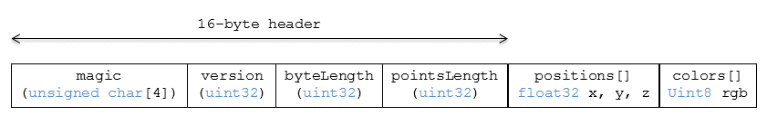

# Points

## Contributors

* Sean Lilley, [@lilleyse](https://github.com/lilleyse)
* Tom Fili, [@CesiumFili](https://twitter.com/CesiumFili)
* Patrick Cozzi, [@pjcozzi](https://twitter.com/pjcozzi)
* Dan Bagnell, [@bagnell](https://github.com/bagnell)

## Overview

The _Point Cloud_ tile format enables efficient streaming of massive point cloud for 3D visualization. Each point is defined by a position and optional properties used to define its appearance, such as color and normal, and optional properties that defined application-specific metadata.

## Layout

A tile is composed of a header section immediately followed by a body section.

**Figure 1**: Points layout (dashes indicate optional fields).



## Header

The 20-byte header contains the following fields:

| Field name | Data type | Description |
| --- | --- | --- |
| `magic` | 4-byte ANSI string | `"pnts"`.  This can be used to identify the arraybuffer as a Points tile. |
| `version` | `uint32` | The version of the Point Cloud format. It is currently `1`. |
| `byteLength` | `uint32` | The length of the entire tile, including the header, in bytes. |
| `featureTableJSONByteLength` | `uint32` | The length of the feature table JSON section in bytes. |
| `featureTableBinaryByteLength` | `uint32` | The length of the feature table binary section in bytes. If `featureTableJSONByteLength` is zero, this will also be zero. |

If `featureTableJSONByteLength` equals zero, the tile does not need to be rendered.

The body section immediately follows the header section, and is composed of a `Feature Table`.

## Feature Table

Contains per-tile and per-point values that define where and how to render points.

### Semantics

#### Point Semantics

These semantics map to an array of feature values that are used to create points. The length of these arrays must be the same for all semantics and is equal to the number of points.

If a semantic has a dependency on another semantic, that semantic must be defined in order to be a valid tile.

| Semantic | Data Type  | Description | Required |
| --- | --- | --- | --- | --- |
| `POSITION` | `float32[3]` | A 3-component array of numbers containing `x`, `y`, and `z` Cartesian coordinates for the position of the point. | :white_check_mark: Yes, if `POSITION_QUANTIZED` is not defined|
| `POSITION_QUANTIZED` | `uint16[3]` | A 3-component array of numbers containing `x`, `y`, and `z` in quantized Cartesian coordinates for the position of the point. | :white_check_mark: Yes, if `POSITION` is not defined <br> :large_blue_diamond: Depends on `QUANTIZED_VOLUME_OFFSET` <br> :large_blue_diamond: Depends on `QUANTIZED_VOLUME_SCALE` |
| `RGBA` | `uint8[4]` | A 4-component array of values containing the `RGBA` color of the point. | :red_circle: No |
| `RGB` | `uint8[3]` | A 3-component array of values containing the `RGB` color of the point. | :red_circle: No |
| `NORMAL` | `float32[3]`| A unit vector defining the normal of the point. | :red_circle: No |
| `NORMAL_OCT16P` | `uint8[2]` | An oct-encoded unit vector with 16-bits of precision defining the normal of the point. | :red_circle: No |

#### Global Semantics

These semantics define global properties for all points.

| Semantic | Data Type | Description | Required |
| --- | --- | --- | --- |
| `POINTS_LENGTH`| `uint32` | The number of points to render. The length of each array value for a point semantic should be equal to this. | :white_check_mark: Yes |
| `RTC_CENTER` | `float32[3]` | A 3-component array of numbers defining the center position when point positions are defined relative-to-center. | :red_circle: No |
| `QUANTIZED_VOLUME_OFFSET` | `float32[3]` | A 3-component array of numbers defining the offset for the quantized volume. | :red_circle: No |
| `QUANTIZED_VOLUME_SCALE` | `float32[3]` | A 3-component array of numbers defining the scale for the quantized volume. | :red_circle: No |
| `CONSTANT_RGBA` | `uint8[4]` | A 4-component array of values defining a constant `RGBA` color for all points in the tile. | :red_circle: No |

#### Point Colors

If more than one color semantic is defined, the precedence order is `RGBA`, `RGB`, then `CONSTANT_RGBA`. For example, if a tile's feature table contains both `RGBA` and `CONSTANT_RGBA` properties, the runtime would render with per-point colors using `RGBA`.

If no color semantics are defined, the runtime is free to color points using an application-specific default color.

In any case, [3D Tiles Styling](../../Styling/README.md) may be used to change the final rendered color and other visual properties at runtime.

### Point Positions

`POSITION` defines the location where a point should be placed in Cartesian space. Positions may be defined relative-to-center for high-precision rendering. `RTC_CENTER` defines the center position in Cartesian space.

#### Quantized Positions

If `POSITION` is not defined for a point, its position may be stored in `POSITION_QUANTIZED` which defines the point position relative to the quantized volume.
If neither `POSITION` or `POSITION_QUANTIZED` are defined, the point will not be created.

A quantized volume is defined by `offset` and `scale` to map quantized positions into model space.

`offset` is stored in the global semantic `QUANTIZED_VOLUME_OFFSET`, and `scale` is stored in the global semantic `QUANTIZED_VOLUME_SCALE`.
If those global semantics are not defined, `POSITION_QUANTIZED` cannot be used.

Quantized positions can be mapped to model space using the formula:

`POSITION = POSITION_QUANTIZED * QUANTIZED_VOLUME_SCALE + QUANTIZED_VOLUME_OFFSET`

#### Point Normals

Per-point normals are an optional property that can help improve the visual quality of points by enabling lighting, hidden surface removal, and other rendering techniques.  Oct-encoding is described in [*A Survey of Efficient Representations of Independent Unit Vectors* by Cigolle et al.](http://jcgt.org/published/0003/02/01/).  An implementation for encoding and decoding these unit vectors can be found in Cesium's
[AttributeCompression](https://github.com/AnalyticalGraphicsInc/cesium/blob/master/Source/Core/AttributeCompression.js)
module.

### Examples

Note: these examples use JSON arrays for illustration purposes but for best performance per-point properties like `POSITIONS` and `RGB` should be stored in the `featureTableBinary`.

#### Positions Only

In this minimal example, we place 4 points on the corners of a unit length square.

```json
{
    "POINTS_LENGTH" : 4,
    "POSITION" : [
        0.0, 0.0, 0.0, 
        1.0, 0.0, 0.0, 
        0.0, 0.0, 1.0, 
        1.0, 0.0, 1.0
    ]
}
```

### Position and Color

In this example, we place 4 points (red, green, blue, and yellow) above the globe. Their positions are defined relative-to-center.

```json
{
    "POINTS_LENGTH" : 4,
    "POSITION" : [
        0.0, 0.0, 0.0, 
        1.0, 0.0, 0.0, 
        0.0, 0.0, 1.0, 
        1.0, 0.0, 1.0
    ],
    "RGB" : [
        255, 0, 0,
        0, 255, 0,
        0, 0, 255,
        255, 255, 0,
    ],
    "RTC_CENTER" : [1215013.8, -4736316.7, 4081608.4]
}
```

## File Extension

`.pnts`

## MIME Type

_TODO, [#60](https://github.com/AnalyticalGraphicsInc/3d-tiles/issues/60)_

`application/octet-stream`

## Resources

1. [*A Survey of Efficient Representations of Independent Unit Vectors* by Cigolle et al.](http://jcgt.org/published/0003/02/01/)
2. [*Mesh Geometry Compression for Mobile Graphics* by Jongseok Lee et al.](http://cg.postech.ac.kr/research/mesh_comp_mobile/mesh_comp_mobile_conference.pdf)
3. Cesium [AttributeCompression](https://github.com/AnalyticalGraphicsInc/cesium/blob/master/Source/Core/AttributeCompression.js) module for oct-encoding
