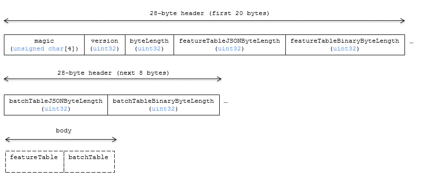
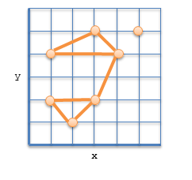

# Vector Data

## Contributors

* Dan Bagnell, [@bagnell](https://github.com/bagnell)
* Rob Taglang, [@lasalvavida](https://github.com/lasalvavida)
* Patrick Cozzi, [@pjcozzi](https://twitter.com/pjcozzi)

## Overview

The _Vector_ tile format allows streaming of vector datasets including points, polylines, and polygons.  Points can be represented with a combination of billboard, label, and point graphics primitives.

Each point, poyline, and polygon is a _feature_ in the 3D Tiles specification language. 

## Layout

A tile is composed of a header section immediately followed by a body section.

**Figure 1**: Vector layout (dashes indicate optional fields). 



## Header

The 28-byte header contains the following fields:

| Field name | Data type | Description |
| --- | --- | --- |
| `magic` | 4-byte ANSI string | `"vctr"`. This can be used to identify the arraybuffer as a Vector tile. |
| `version` | `uint32` | The version of the Vector Data format. It is currently `1`. |
| `byteLength` | `uint32` | The length of the entire tile, including the header, in bytes. |
| `featureTableJSONByteLength` | `uint32` | The length of the feature table JSON section in bytes. |
| `featureTableBinaryByteLength` | `uint32` | The length of the feature table binary section in bytes. If `featureTableJSONByteLength` is zero, this will also be zero. |
| `batchTableJSONByteLength` | `uint32` | The length of the batch table JSON section in bytes. Zero indicates that there is no batch table. |
| `batchTableBinaryByteLength` | `uint32` | The length of the batch table binary section in bytes. If `batchTableJSONByteLength` is zero, this will also be zero. | 

If `featureTableJSONByteLength` equals zero, the tile does not need to be rendered.

The body section immediately follows the header section, and is composed of two fields: `Feature Table` and `Batch Table`.

Code for reading the header can be found in
[Vector3DModelTileContent.js](https://github.com/AnalyticalGraphicsInc/cesium/blob/3d-tiles/Source/Scene/Vector3DModelTileContent.js)
in the Cesium implementation of 3D Tiles.

## Feature Table

Contains values for `vctr` semantics used to render features.  The general layout of a Feature Table is described in the [Feature Table specification](../FeatureTable).

The `vctr` Feature Table JSON schema is defined in [vctr.featureTable.schema.json](../../schema/vctr.featureTable.schema.json).

TODO: Write schema after this gets looked over a bit.

### Semantics

If a semantic has a dependency on another semantic, that semantic must be defined as well.
If both `POSITION` and `POSITION_QUANTIZED` are defined, the higher precision `POSITION` will be used.
Per-feature semantics specific to a feature type are prefixed with the name of the feature type. e.g. `POLYGON` for polygons and `POLYLINE` for polylines.

At least one global `LENGTH` semantic must be defined. 
If `POLYGONS_LENGTH` is not defined, or zero, no polygons will be rendered. 
Likewise, if `POLYLINES_LENGTH` is not defined, or zero, no polylines will be rendered.
Multiple feature types may be defined in a single Vector tile using multiple `LENGTH` semantics, and in that case, all specified feature types will be rendered.

#### Vector Semantics

| Semantic | Data Type | Description | Required |
| --- | --- | --- | --- |
| `POLYGON_COUNT` | `uint32` | The number of points that belong to each polygon. This refers to `POLYGON_INDICES` if it is defined, otherwise it refers to `POSITION` or `POSITION_QUANTIZED`. | :white_check_mark: Yes, unless `POLYGONS_LENGTH` is not defined. |
| `POLYGON_INDICES` | `uint32` | An index into the `POSITION` or `POSITION_QUANTIZED` array. | :red_circle: No. |
| `POLYGON_BATCH_ID` | `uint16` | The `batchId` of the polygon that can be used to retrieve metadata from the `Batch Table`. | :red_circle: No. |
| `POLYLINE_COUNT` | `uint32` | The number of points that belong to each polyline. This refers to `POLYLINE_INDICES` if it is defined, otherwise it refers to `POSITION`  or `POSITION_QUANTIZED`. | :white_check_mark: Yes, unless `POLYLINES_LENGTH` is not defined. |
| `POLYLINE_INDICES` | `uint32` | An index into the `POSITION` or `POSITION_QUANTIZED` array. | :red_circle: No. |
| `POLYLINE_BATCH_ID` | `uint16` | The `batchId` of the polyline that can be used to retrieve metadata from the `Batch Table`. | :red_circle: No. |
| `POSITION` | `float32[3]` | A 3-component array of numbers containing `x`, `y`, and `z` Cartesian coordinates for positions. If an `INDICES` semantic is not defined, these values are used to create the feature in order. | :white_check_mark: Yes, unles  `POSITION_QUANTIZED` is defined. |
| `POSITION_QUANTIZED` | `uint16[3]` | A 3-component array of numbers containing `x`, `y` and `z` in quantized Cartesian coordinates for positions. If an `INDICES` semantic is not defined, these values are used to create the feature in order. | :white_check_mark: Yes, unless `POSITION` is defined. |

#### Global Semantics

The semantics define global properties for all vector elements.

| Semantic | Data Type | Description | Required |
| --- | --- | --- | --- |
| `POLYGONS_LENGTH` | `uint32` | The number of polygons in the tile. | :white_check_mark: Yes, unless `POLYLINES_LENGTH` is defined. |
| `POLYLINES_LENGTH` | `uint32` | The number of polylines in the tile. | :white_check_mark: Yes, unless `POLYGONS_LENGTH` is defined. |
| `RTC_CENTER` | `float32[3]` | A 3-component array of numbers defining the center position when point positions are defined relative-to-center. | :red_circle: No. |
| `QUANTIZED_VOLUME_OFFSET` | `float32[3]` | A 3-component array of numbers defining the offset for the quantized volume. | :red_circle: No, unless `POSITION_QUANTIZED` is defined. |
| `QUANTIZED_VOLUME_SCALE` | `float32[3]` | A 3-component array of numbers defining the scale for the quantized volume. | :red_circle: No, unless `POSITION_QUANTIZED` is defined. |
| `MINIMUM_HEIGHT` | `float32` | The minimum terrain height for this tiles' region in meters above the WGS84 ellipsoid. | :red_circle: No. |
| `MAXIMUM_HEIGHT` | `float32` | The maximum terrain height for this tiles' region in meters above the WGS84 ellipsoid. | :red_circle: No. |

Examples using these semantics can be found in the [examples section](#examples).

### Positions

Features are defined in the Feature Table. 
The `POLYGONS_LENGTH` semantic defines the length of the `POLYGON_COUNT` array.
Likewise, the `POLYLINES_LENGTH` semantic defines the length of the `POLYLINE_COUNT` array.
`COUNT` defines how many points to sequentially read and add to a feature before creating a new one.
Points are read using `INDICES` to retrieve positions by index, if it is defined. 

`POSITION` may be defined relative to a center point using the global semantic `RTC_CENTER` for high-precision rendering  [2].

#### Quantized Positions

`POSITION_QUANTIZED` may be defined instead of `POSITION` which defines points relative to the quantized volume.
Either `POSITION` or `POSITION_QUANTIZED` must be defined.

A quantized volume is defined by `offset` and `scale` to map quantized positions into model space.


`offset` is stored in the global semantic `QUANTIZED_VOLUME_OFFSET`, and `scale` is stored in the global semantic `QUANTIZED_VOLUME_SCALE`.
If those global semantics are not defined, `POSITION_QUANTIZED` cannot be used.

Quantized positions can be mapped to model space using the formula:

`POSITION = POSITION_QUANTIZED * QUANTIZED_VOLUME_SCALE / 65535.0 + QUANTIZED_VOLUME_OFFSET`

### Examples

This example will define positions for polylines, but the same procedure is applied for polygons as well.
The only difference is that polygons automatically connect the last point to the start point to create a closed shape, whereas with polylines, that relationship needs to be defined explicitly to achieve the same result.

In this example, four features are defined, a line, two triangles connected to each line endpoint, and a single point on the XY-Plane as shown in Figure 2.

**Figure 2**: Example polyline plot.



A data layout using indices is shown in Figure 3. This is typically the best approach since duplicate points do not need to have their data repeated.

**Figure 3**: Example polyline data layout.


A feature table can also be easily generated for this example.

```javascript
var featureTableJSON = {
    POLYLINES_LENGTH : 4,
    POLYLINE_COUNT : {
        byteOffset : 0
    },
    POLYLINE_INDICES : {
        byteOffset : 16
    },
    POSITION : {
        byteOffset : 60
    }
};

var polylineCountBinary = new Buffer(new Uint16Array([2, 4, 1, 4]).buffer);

var polylineIndicesBinary = new Buffer(new Uint16Array([
    1, 0,
    1, 2, 3, 1,
    5,
    0, 4, 6, 0
]).buffer);

var positionBinary = new Buffer(new Float32Array([
    4.0, 4.0, 0.0,
    3.0, 2.0, 0.0,
    1.0, 2.0, 0.0,
    2.0, 1.0, 0.0,
    1.0, 4.0, 0.0,
    5.0, 5.0, 0.0,
    3.0, 5.0, 0.0
]).buffer);

var featureTableBinary = Buffer.concat([polylineCountBinary, polylineIndicesBinary, positionBinary]);
```

## Batch Table

Contains metadata organized by `batchId` that can be used for declarative styling.

See the [Batch Table](..//Batched3DModel#batch-table) reference for more information.
[//]: # "TODO: Change this link to the batch table specification URL"

## File Extension

`.vctr`

## MIME Type

_TODO, [#60](https://github.com/AnalyticalGraphicsInc/3d-tiles/issues/60)_

`application/octet-stream`
 
## Resources
1. [*Mesh Geometry Compression for Mobile Graphics* by Jongseok Lee et al.](http://cg.postech.ac.kr/research/mesh_comp_mobile/mesh_comp_mobile_conference.pdf)
2. [Precisions, Precisions](http://blogs.agi.com/insight3d/index.php/2008/09/03/precisions-precisions/)
