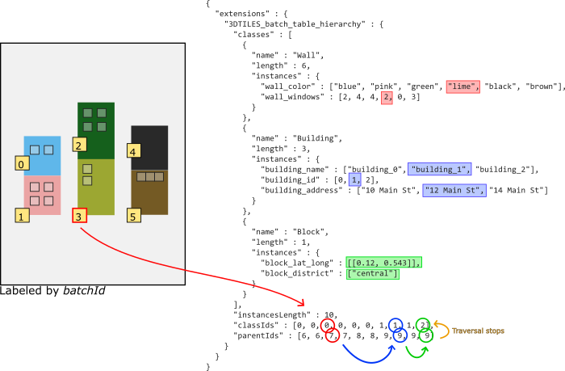

# 3DTILES_batch_table_hierarchy Extension

## Contributors

* Sean Lilley, [@lilleyse](https://github.com/lilleyse)
* Patrick Cozzi, [@pjcozzi](https://twitter.com/pjcozzi)

## Contents

* [Overview](#overview)
* [Motivation](#motivation)
* [Batch table JSON schema updates](#batch-table-json-schema-updates)
   * [3DTILES_batch_table_hierarchy](#3DTILES_batch_table_hierarchy)
* [Examples](#examples)
* [Styling](#styling)
* [Notes](#notes)

## Overview

The standard batch table is suitable for datasets composed of features with the same sets of properties. However, some datasets have more complex metadata structures such as feature types or feature hierarchies that are not easy to represent as parallel arrays of properties. The Batch Table Hierarchy extension provides more flexibility for these cases.

## Motivation

Consider a tile whose features fit into multiple categories that do not share the same properties. A parking lot tile may have three types of features: cars, lamp posts, and trees. With the standard batch table, this might look like the following:

```json
{
    "lampStrength" : [10, 5, 7, 0, 0, 0, 0, 0],
    "lampColor" : ["yellow", "white", "white", "", "", "", "", ""],
    "carType" : ["", "", "", "truck", "bus", "sedan", "", ""],
    "carColor" : ["", "", "", "green", "blue", "red", "", ""],
    "treeHeight" : [0, 0, 0, 0, 0, 0, 10, 15],
    "treeAge" : [0, 0, 0, 0, 0, 0, 5, 8]
}
```

In this example, several `""` and `0` array values are stored so each array has the same number of elements.  A potential workaround is to store properties as JSON objects; however, this becomes bulky as the number of properties grows:

```json
{
  "info" : [
    {
      "lampStrength" : 10,
      "lampColor" : "yellow"
    },
    {
      "lampStrength" : 5,
      "lampColor" : "white"
    },
    {
      "lampStrength" : 7,
      "lampColor" : "white"
    },
    {
      "carType" : "truck",
      "carColor" : "green"
    },
    {
      "carType" : "bus",
      "carColor" : "blue"
    },
    {
      "carType" : "sedan",
      "carColor" : "red"
    },
    {
      "treeHeight" : 10,
      "treeAge" : 5
    },
    {
      "treeHeight" : 15,
      "treeAge" : 8
    }
  ]
}
```

Another limitation of the standard batch table is the difficulty in expressing metadata hierarchies. 
For example, consider a tile that represents a city block. The block itself contains metadata, the individual buildings contain metadata, and the building walls contain metadata. A tree diagram of the hierarchy might look like this:

- block
  - building
    - wall
    - wall
  - building
    - wall
    - wall
  - building
    - wall
    - wall


In order to select a wall and retrieve properties from its building, the wall metadata must also include building metadata. Essentially the three-level hierarchy must be flattened into each feature, resulting in a lot of duplicate entries.

A standard batch table with two walls per building and three buildings per block might look like this:

```json
{
    "wall_color" : ["blue", "pink", "green", "lime", "black", "brown"],
    "wall_windows" : [2, 4, 4, 2, 0, 3],
    "building_name" : ["building_0", "building_0", "building_1", "building_1", "building_2", "building_2"],
    "building_id" : [0, 0, 1, 1, 2, 2],
    "building_address" : ["10 Main St", "10 Main St", "12 Main St", "12 Main St", "14 Main St", "14 Main St"],
    "block_lat_long" : [[0.12, 0.543], [0.12, 0.543], [0.12, 0.543], [0.12, 0.543], [0.12, 0.543], [0.12, 0.543]],
    "block_district" : ["central", "central", "central", "central", "central", "central"],
}
```

Both these cases illustrate the benefit of supporting feature types and a feature hierarchy within the Batch Table.

## Batch table JSON schema updates

The standard batch table may be extended to include a `3DTILES_batch_table_hierarchy` object that defines a set of classes and a tree structure for class instances.

Sample Batch Table:

```json
{
  "extensions" : {
    "3DTILES_batch_table_hierarchy" : {
      "classes" : [
        {
          "name" : "Wall",
          "length" : 6,
          "instances" : {
            "color" : ["white", "red", "yellow", "gray", "brown", "black"],
          }
        },
        {
          "name" : "Building",
          "length" : 3,
          "instances" : {
            "name" : ["unit29", "unit20", "unit93"],
            "address" : ["100 Main St", "102 Main St", "104 Main St"]
          }
        },
        {
          "name" : "Owner",
          "length" : 3,
          "instances" : {
            "type" : ["city", "resident", "commercial"],
            "id" : [1120, 1250, 6445]
          }
        }
      ],
      "instancesLength" : 12,
      "classIds" : [0, 0, 0, 0, 0, 0, 1, 1, 1, 2, 2, 2],
      "parentCounts" : [1, 3, 2, 1, 1, 1, 1, 1, 1, 0, 0, 0],
      "parentIds" : [6, 6, 10, 11, 7, 11, 7, 8, 8, 10, 10, 9]
    }
  }
}
```

### 3DTILES_batch_table_hierarchy

`classes` is an array of objects, where each object contains the following properties:
* `name` - A string representing the name of the class
* `length` - The number of instances of the class
* `instances` - An object containing instance properties. Properties may be stored as an array of values or a reference to data in the binary body.

`instancesLength` is the total number of instances. It is equal to the sum of the `length` properties of the classes.

Note that this is different than a tile's `batchLength`, which is the total number of features. While all features are instances, not all instances are features; the hierarchy may contain instances that don't have a physical basis in the tile's geometry but still contribute to the metadata hierarchy.

`classIds` is an array of integers of length `instancesLength`. Each value specifies the instances's class as an index in the `classes` array.

> **Implementation Note**: The Batch Table Hierarchy does not directly provide an instances's index into its class's `instances` array. Instead the index can be inferred by the number of instances with the same `classId` that have appeared before it. An implementation may want to compute these indices at load time so that property access is as fast as possible.

`parentCounts` is an array of integers of length `instancesLength`. Each value specifies the number of parents that instance has. If omitted, `parentCounts` is implicitly an array of length `instancesLength`, where all values are 1.

`parentIds` is an array of integers whose length equals the sum of the values in `parentCounts`. Parent ids are placed sequentially by instance - instance 0's parent ids are followed by instance 1's parent ids. Each value specifies the instance's parent as an index into the `classIds` array.

Cyclical hierarchies are not allowed. When an instance's `parentId` points to itself, then it has no parent. When `parentIds` is omitted, the instances do not have parents.

A feature's `batchId` is used to access its `classId` and `parentCount`. Therefore, the values in the `classIds` and `parentCounts` arrays are initially ordered by `batchId` and followed by non-feature instances.

The `parentCounts` and `parentIds` arrays form an instance hierarchy. A feature's properties include those defined by its own class and any properties from ancestor instances.

In some cases multiple ancestors may share the same property name. This can occur if two ancestors are the same class or are different classes with the same property names. For example, if every class defined the property "id", then it would be an overloaded property. In such cases it is up to the implementation to decide which value to return.

Finally, `classIds`, `parentCounts`, and `parentIds` may instead be references to data in the binary body. If omitted, `componentType` defaults to `UNSIGNED_SHORT`. `type` is implicitly `SCALAR`.

```json
"classIds" : {
    "byteOffset" : 0,
    "componentType" : "UNSIGNED_SHORT"
};
```

JSON schema definitions can be found in [3DTILES_batch_table_hierarchy.json](./schema/3DTILES_batch_table_hierarchy.json).

## Examples

### Feature classes

Going back to the example of a parking lot with car, lamp post, and tree features, a Batch Table might look like this:

```json
{
  "extensions" : {
    "3DTILES_batch_table_hierarchy" : {
      "classes" : [
        {
          "name" : "Lamp",
          "length" : 3,
          "instances" : {
            "lampStrength" : [10, 5, 7],
            "lampColor" : ["yellow", "white", "white"]
          }
        },
        {
          "name" : "Car",
          "length" : 3,
          "instances" : {
            "carType" : ["truck", "bus", "sedan"],
            "carColor" : ["green", "blue", "red"]
          }
        },
        {
          "name" : "Tree",
          "length" : 2,
          "instances" : {
            "treeHeight" : [10, 15],
            "treeAge" : [5, 8]
          }
        }
      ],
      "instancesLength" : 8,
      "classIds" : [0, 0, 0, 1, 1, 1, 2, 2]
    }
  }
}
```

Since this example does not contain any sort of hierarchy, the `parentCounts` and `parentIds` are not included, and `instancesLength` just equals the tile's `batchLength`.

A `classId` of 0 indicates a "Lamp" instance, 1 indicates a "Car" instance, and 2 indicates a "Tree" instance.

A feature's `batchId` is used to access its class in the `classIds` array. Features with a `batchId` of 0, 1, 2 are "Lamp" instances, features with a `batchId` of 3, 4, 5 are "Car" instances, and features with `batchId` of 6 and 7 are "Tree" instances.

The feature with `batchId = 5` is the third "Car" instance, and its properties are

```
carType : "sedan"
carColor : "red"
```

Batch Table Hierarchy, parking lot:


### Feature hierarchy

The city block example would now look like this:

```json
{
  "extensions" : {
    "3DTILES_batch_table_hierarchy" : {
      "classes" : [
        {
          "name" : "Wall",
          "length" : 6,
          "instances" : {
            "wall_color" : ["blue", "pink", "green", "lime", "black", "brown"],
            "wall_windows" : [2, 4, 4, 2, 0, 3]
          }
        },
        {
          "name" : "Building",
          "length" : 3,
          "instances" : {
            "building_name" : ["building_0", "building_1", "building_2"],
            "building_id" : [0, 1, 2],
            "building_address" : ["10 Main St", "12 Main St", "14 Main St"]
          }
        },
        {
          "name" : "Block",
          "length" : 1,
          "instances" : {
            "block_lat_long" : [[0.12, 0.543]],
            "block_district" : ["central"]
          }
        }
      ],
      "instancesLength" : 10,
      "classIds" : [0, 0, 0, 0, 0, 0, 1, 1, 1, 2],
      "parentIds" : [6, 6, 7, 7, 8, 8, 9, 9, 9, 9]
     }
  }
}
```

The tile's `batchLength` is 6 and `instancesLength` is 10. The building and block instances are not features of the tile but contain properties that are inherited by the six wall features.

`parentCounts` is not included since every instance has at most one parent.

A feature with `batchId = 3` has the following properties:

```
wall_color : "lime"
wall_windows : 2
building_name : "building_1"
building_id : 1,
building_address : "12 Main St"
block_lat_long : [0.12, 0.543]
block_district : "central"
```

Breaking it down into smaller steps:

The feature with `batchId = 3` is the fourth "Wall" instance, and its properties are the following:
```
wall_color : "lime"
wall_windows : 2
```

The feature's `parentId` is 7, which is the second "Building" instance. Therefore it gets the following properties from its parent:
```
building_name : "building_1"
building_id : 1,
building_address : "12 Main St"
```

The building's `parentId` is 9, which is the sole "Block" instance with the following properties:
```
block_lat_long : [[0.12, 0.543]]
block_district : ["central"]
```

Since the block's `parentId` is also 9, it does not have a parent and the traversal is complete.

Batch Table Hierarchy, block:



## Styling

This extension supports additional built-in functions in the styling language for querying feature classes:

* [`getExactClassName`](#getexactclassname)
* [`isExactClass`](#isexactclass)
* [`isClass`](#isclass)

### getExactClassName

```
getExactClassName() : String
```

Returns the feature's class name, or `undefined` if the feature is not a class instance.

For example, the following style will color all doorknobs yellow, all doors green, and all other features gray.

```json
{
    "defines" : {
        "suffix" : "regExp('door(.*)').exec(getExactClassName())"
    },
    "color" : {
        "conditions" : [
            ["${suffix} === 'knob'", "color('yellow')"],
            ["${suffix} === ''", "color('green')"],
            ["${suffix} === null", "color('gray')"],
            ["true", "color('blue'"]
        ]
    }
}
```

### isExactClass

```
isExactClass(name : String) : Boolean
```

Returns `true` if the feature's class is equal to `name`, otherwise `false`.

For example, the following style will color all doors, but not features that are children of doors (like doorknobs):

```json
"color" : {
    "conditions" : [
        ["isExactClass('door')", "color('red')"],
        ["true", "color('white')"]
    ]
}
```

### isClass

```
isClass(name : String) : Boolean
```

Returns `true` if the feature's class, or any of its ancestors' classes, are equal to `name`.

For example, the style below will color all doors and doorknobs.

```json
"color" : {
    "conditions" : [
        ["isClass('door')", "color('blue')"],
        ["true", "color('white')"]
    ]
}
```

## Notes

* Since the Batch Table Hierarchy is an extension to the standard batch table, it is still possible to store per-feature properties alongside the `3DTILES_batch_table_hierarchy` parent `extension` object:

```
{
  "Height" : [...],
  "Longitude" : [...],
  "Latitude" : [...],
  "extensions" : {
    "3DTILES_batch_table_hierarchy" : {...}
  }
}
```

* The Batch Table Hierarchy is self-contained within the tile. It is not possible to form metadata hierarchy across different tiles in the tileset.