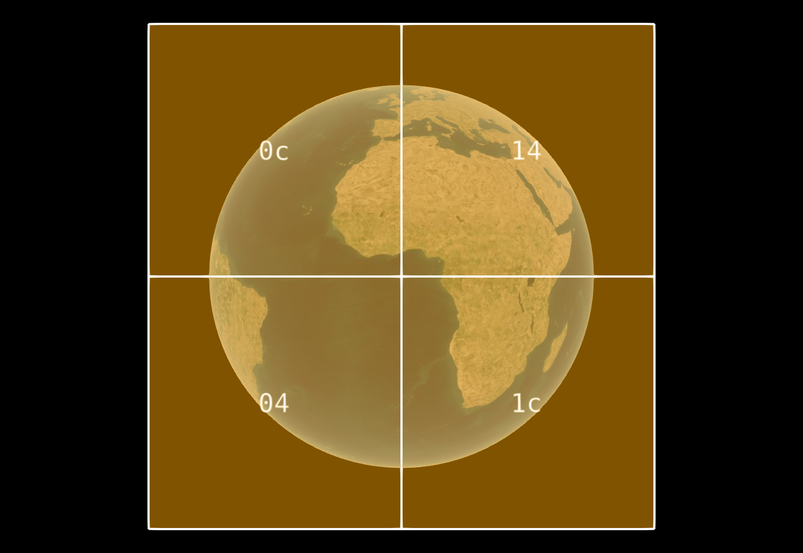
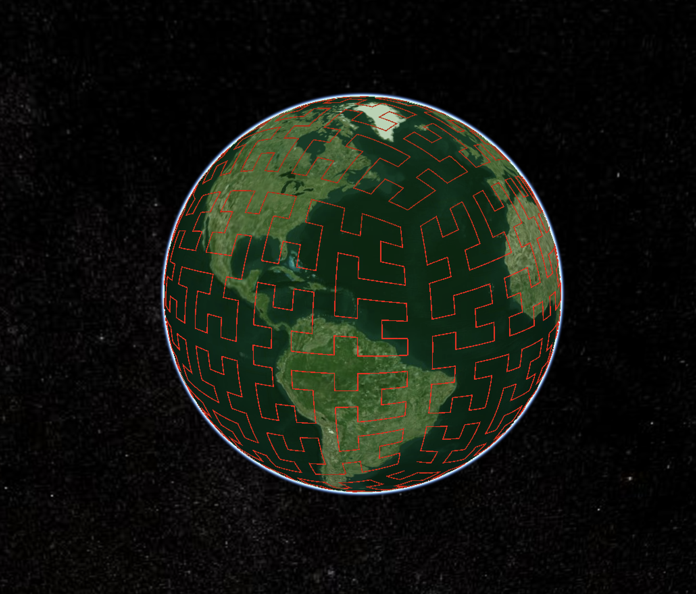
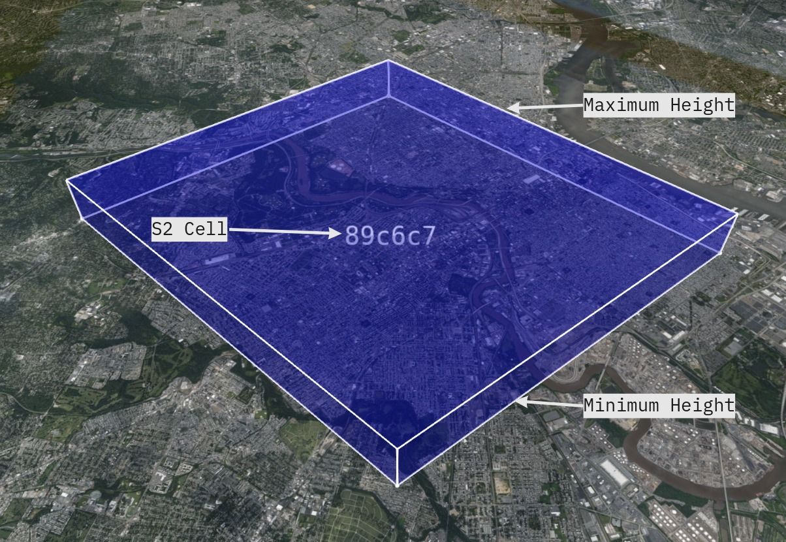
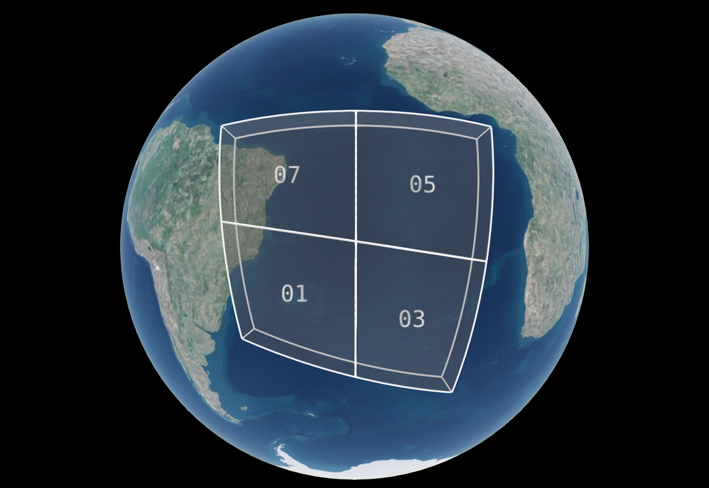

# 3DTILES_bounding_volume_S2

<!-- omit in toc -->
## Contributors

- Sam Suhag, Cesium
- Sean Lilley, Cesium
- Peter Gagliardi, Cesium

<!-- omit in toc -->
## Status

Draft

<!-- omit in toc -->
## Dependencies

Written against 3D Tiles 1.0.

<!-- omit in toc -->
## Optional vs. Required

This extension is required, meaning it must be placed in both the `extensionsUsed` and `extensionsRequired` lists in the tileset JSON.

<!-- omit in toc -->
## Contents

- [3DTILES_bounding_volume_S2](#3dtiles_bounding_volume_s2)
  - [Overview](#overview)
  - [Hierarchy](#hierarchy)
  - [Coordinate System](#coordinate-system)
  - [Bounding Volume](#bounding-volume)
    - [Cell Token](#cell-token)
    - [Bounding Heights](#bounding-heights)
    - [Subdivision](#subdivision)
  - [Property Reference](#property-reference)
  - [JSON Schema](#json-schema)

## Overview

[S2](http://s2geometry.io/) is geometry library that defines a framework for decomposing the unit sphere into a hierarchy of cells. A cell is a quadrilateral bounded by four geodesics. Typically, traditional GIS libraries use planar projections to map data between a 2D plane and a 3D ellipsoid (representing the Earth). Since a sphere is a closer approximation of the shape of the ellipsoid, S2 makes it possible to represent the Earth with no seams or singularities, with low distortion everywhere on globe.

## Hierarchy

The "cell hierarchy" of S2 is rooted in the 6 faces of a cube, which are projected onto the unit sphere. The following diagram illustrates how the S2 Earth cube maps the Earth:


<p align="center">
Source: http://s2geometry.io/devguide/s2cell_hierarchy
</p>

In S2, each face of the unit cube can be subdivided into 30 levels using a quadtree structure, in which each "cell" or tile on the grid subdivides into 4 equal cells or tiles at the subsequent level.

|Level 0|Level 1|
|:-:|:-:|
|  S2 cell (`"1"`) on the Earth cube|  Children of S2 cell (`"1"`) on the Earth cube |
|   S2 cell (`"1"`) on the WGS84 ellipsoid|  Children of S2 cell (`"1"`) on the WGS84 ellipsoid|

The S2 library uses a modified Hilbert curve to provide a one dimensional ordering of cells on the S2 Earth cube. This provides each cell, from level 1 to level 30, with a unique 64-bit identifier. Therefore, we can uniquely identify millimeter scale areas on Earth with their S2 cell IDs.

| S2 Curve on Earth cube |  S2 Curve on WGS84 ellipsoid |
|:-:|:-:|
|   |   |

This extension to 3D Tiles enables using these cells as the basis for bounding volumes for tiles.

## Coordinate System

[S2 works well with both geodetic and geocentric coordinates](https://s2geometry.io/about/overview#geocentric-vs-geodetic-coordinates). Since actual geographic datasets use geodetic coordinates, this extension uses WGS84 geodetic coordinates.

## Bounding Volume

This extension enables using S2 cells and a set of bounding heights to describe a bounding volume in 3D Tiles. The `token` represents an S2 cell. The cell describes 4 vertices on the surface of the WGS84 ellipsoid for the area, and the `minimumHeight` and `maximumHeight` describe the vertical bounds with respect to the WGS84 ellipsoid. The [tile `transform` property](https://github.com/CesiumGS/3d-tiles/tree/master/specification#tile-transforms) will be ignored when this extension is used for describing a tile's bounding volume.



<p align="center">
  S2 cell (<tt>"89c6c7"</tt>) covering the Philadelphia Center City area, with minimum height set to <tt>0</tt> m and maximum height set to <tt>1000</tt> m.
</p>

```json
"boundingVolume": {
  "extensions": {
    "3DTILES_bounding_volume_S2": {
      "token": "89c6c7",
      "minimumHeight": 0,
      "maximumHeight": 1000
    }
  }
}
```

### Cell Token

This extension uses tokens, or hexadecimal string representations of S2 cell identifier for two reasons:
 1. Precision: Using a token will require a client to convert it to the correct data type: `uint64`.
 2. Conciseness: Tokens provide a more concise representation of identifiers. For example, the root (level 0) cell with cell ID `3458764513820540928` has the token `3`.

More details on computing an `S2CellToken` can be found in the [S2 reference implementation](https://github.com/google/s2-geometry-library-java/blob/c28f287b996c0cedc5516a0426fbd49f6c9611ec/src/com/google/common/geometry/S2CellId.java#L468).

### Bounding Heights

The S2 cell itself is used to specify an area on the surface of the ellipsoid. To create a bounding volume, the `minimumHeight` and `maximumHeight` properties must be specified. These heights must be specified in meters above the WGS84 ellipsoid.

### Subdivision

The S2 library defines a [cell hierarchy](http://s2geometry.io/devguide/s2cell_hierarchy), that follows uniform subdivision using a quadtree structure, where each cell subdivides into 4 smaller cells that combine to occupy the same area as the parent.

When used with [`3DTILES_implicit_tiling`](https://github.com/CesiumGS/3d-tiles/tree/3d-tiles-next/extensions/3DTILES_implicit_tiling/0.0.0), a `QUADTREE` subdivision scheme will follow the rules for subdivision as defined by S2. When an `OCTREE` subdivision scheme is used, the split in the vertical dimension occurs at the midpoint of the `minimumHeight` and `maximumHeight` of the parent tile.

The `availability` bitstreams are ordered by the Morton index of the tile, as specified by `3DTILES_implicit_tiling`, not by the Hilbert index used by S2. Additionally, the `maximumLevel` property cannot be greater than `30 - {Level of root S2CellId}` because S2 cell hierarchy only extends to level 30.

| Cell  | Quadtree Subdivision | Octree Subdivision |
|---|---|---|
|   |   |   |

The following example illustrates usage of `3DTILES_bounding_volume_S2` with `3DTILES_implicit_tiling`:

```json
{
  "asset": {
    "version": "1.0"
  },
  "geometricError": 10000,
  "extensionsUsed": [
    "3DTILES_implicit_tiling",
    "3DTILES_bounding_volume_S2"
  ],
  "extensionsRequired": [
    "3DTILES_implicit_tiling",
    "3DTILES_bounding_volume_S2"
  ],
  "root": {
    "boundingVolume": {
      "extensions": {
        "3DTILES_bounding_volume_S2": {
          "token": "04",
          "minimumHeight": 0,
          "maximumHeight": 500000
        }
      }
    },
    "refine": "REPLACE",
    "geometricError": 5000,
    "content": {
      "uri": "content/{level}/{x}/{y}.glb"
    },
    "extensions": {
      "3DTILES_implicit_tiling": {
        "subdivisionScheme": "QUADTREE",
        "subtreeLevels": 4,
        "maximumLevel": 7,
        "subtrees": {
          "uri": "subtrees/{level}/{x}/{y}.subtree"
        }
      }
    }
  }
}
```

The following example usage of `3DTILES_bounding_volume_S2` to represent all 6 faces of S2, to represent a tileset with global coverage:


```json
{
  "asset": {
    "version": "1.0"
  },
  "geometricError": 10000,
  "extensionsUsed": [
    "3DTILES_implicit_tiling",
    "3DTILES_bounding_volume_S2"
  ],
  "extensionsRequired": [
    "3DTILES_implicit_tiling",
    "3DTILES_bounding_volume_S2"
  ],
  "root": {
    "boundingVolume": {
      "region": [
        -3.141592653589793,
        -1.5707963267948966,
        3.141592653589793,
        1.5707963267948966,
        0,
        250000
      ]
    },
    "refine": "REPLACE",
    "geometricError": 10000,
    "children": [
      {
        "boundingVolume": {
          "extensions": {
            "3DTILES_bounding_volume_S2": {
              "token": "1",
              "minimumHeight": 0,
              "maximumHeight": 1000000
            }
          }
        },
        "refine": "REPLACE",
        "geometricError": 5000,
      },
      {
        "boundingVolume": {
          "extensions": {
            "3DTILES_bounding_volume_S2": {
              "token": "3",
              "minimumHeight": 0,
              "maximumHeight": 1000000
            }
          }
        },
        "refine": "REPLACE",
        "geometricError": 5000,
      },
      {
        "boundingVolume": {
          "extensions": {
            "3DTILES_bounding_volume_S2": {
              "token": "5",
              "minimumHeight": 0,
              "maximumHeight": 1000000
            }
          }
        },
        "refine": "REPLACE",
        "geometricError": 5000,
      },
      {
        "boundingVolume": {
          "extensions": {
            "3DTILES_bounding_volume_S2": {
              "token": "7",
              "minimumHeight": 0,
              "maximumHeight": 1000000
            }
          }
        },
        "refine": "REPLACE",
        "geometricError": 5000,
      },
      {
        "boundingVolume": {
          "extensions": {
            "3DTILES_bounding_volume_S2": {
              "token": "9",
              "minimumHeight": 0,
              "maximumHeight": 1000000
            }
          }
        },
        "refine": "REPLACE",
        "geometricError": 5000,
      },
      {
        "boundingVolume": {
          "extensions": {
            "3DTILES_bounding_volume_S2": {
              "token": "b",
              "minimumHeight": 0,
              "maximumHeight": 1000000
            }
          }
        },
        "refine": "REPLACE",
        "geometricError": 5000,
      }
    ]
  }
}
```

## Property Reference

**`3DTILES_bounding_volume_S2` Properties**

|   |Type|Description|Required|
|---|---|---|---|
|**token**|`string`|A hexadecimal representation of the S2 cell identifier. Tokens must be lower-case, must not contain whitespace and must have trailing zeros stripped.| &#10003; Yes|
|**minimumHeight**|`number`|The minimum height of the tile, specified in meters above (or below) the WGS84 ellipsoid.| &#10003; Yes|
|**maximumHeight**|`number`|The maximum height of the tile, specified in meters above (or below) the WGS84 ellipsoid.| &#10003; Yes|
|**extensions**|`object`|Dictionary object with extension-specific objects.| No|
|**extras**|`any`|Application-specific data.| No|

Additional properties are not allowed.

<!-- omit in toc -->
#### token ✅

A hexadecimal representation of the S2CellId. Tokens must be lower-case, must not contain whitespace and must have trailing zeros stripped.

* **Type**: `string`
* **Required**:  &#10003; Yes

<!-- omit in toc -->
#### minimumHeight ✅

The minimum height of the tile, specified in meters above (or below) the WGS84 ellipsoid.

* **Type**: `number`
* **Required**:  &#10003; Yes

<!-- omit in toc -->
#### maximumHeight ✅

The maximum height of the tile, specified in meters above (or below) the WGS84 ellipsoid.

* **Type**: `number`
* **Required**:  &#10003; Yes

<!-- omit in toc -->
#### extensions

Dictionary object with extension-specific objects.

* **Type**: `object`
* **Required**: No

<!-- omit in toc -->
#### extras

Application-specific data.

* **Type**: `any`
* **Required**: No


## JSON Schema

The JSON schema for this extension can be found [here](schema/boundingVolume.3DTILES_bounding_volume_S2.schema.json).
