<!-- omit in toc -->
# 3DTILES_bounding_volume_S2

<!-- omit in toc -->
## Contributors

- Sam Suhag, Cesium
- Sean Lilley, Cesium
- Peter Gagliardi, Cesium
- Marco Hutter, Cesium

<!-- omit in toc -->
## Status

Draft

<!-- omit in toc -->
## Dependencies

Written against 3D Tiles 1.0.

Optionally, this extension may be used in conjunction with [3DTILES_implicit_tiling](../3DTILES_implicit_tiling). When used together, S2 bounding volumes will be implicitly subdivided
in a quadtree or octree.

<!-- omit in toc -->
## Optional vs. Required

This extension is required, meaning it must be placed in both the `extensionsUsed` and `extensionsRequired` lists in the tileset JSON.

<!-- omit in toc -->
## Contents

- [Overview](#overview)
- [Hierarchy](#hierarchy)
- [Cell IDs](#cell-ids)
- [Tokens](#tokens)
- [Bounding Volume](#bounding-volume)
- [Implicit Subdivision](#implicit-subdivision)
  - [Availability](#availability)
- [Schema](#schema)
- [Implementation Examples](#implementation-examples)

## Overview

[S2](https://s2geometry.io/) is a geometry library that defines a framework for decomposing the unit sphere into a hierarchy of cells. A cell is a quadrilateral bounded by four geodesics. The S2 cell hierarchy has 6 root cells, that are obtained by projecting the six faces of a cube onto the unit sphere.

Typically, traditional GIS libraries rely on projecting map data from an ellipsoid onto a plane. For example, the Mercator projection is a cylindrical projection, where the ellipsoid is mapped onto a cylinder that is then unrolled as a plane. This method leads to increasingly large distortion in areas as you move further away from the equator. S2 makes it possible to split the Earth into tiles that have no singularities, have relatively low distortion and are nearly equal in size.

This extension to 3D Tiles enables using S2 cells as bounding volumes. Due to the properties of S2 described above, this extension is well suited for tilesets that span the whole globe.

## Hierarchy

The [cell hierarchy of S2](https://s2geometry.io/devguide/s2cell_hierarchy) is rooted in the 6 faces of a cube, which are projected onto the unit sphere. In S2, each face of the unit cube can be subdivided into 30 levels using a quadtree structure, in which each cell on the grid subdivides into 4 equal cells at the subsequent level.

|Level 0|Level 1|
|:-:|:-:|
| 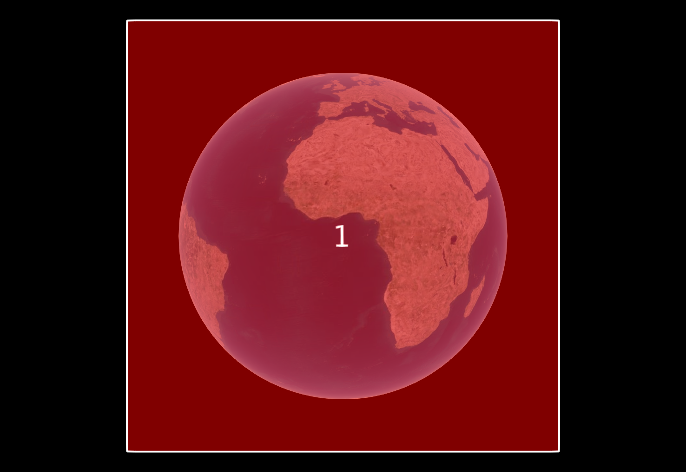 S2 cell (`"1"`) on the Earth cube| 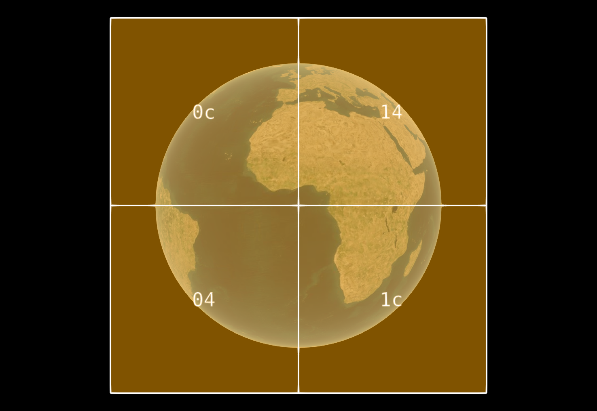 Children of S2 cell (`"1"`) on the Earth cube |
| 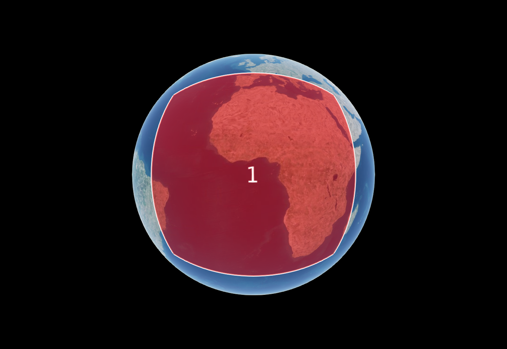  S2 cell (`"1"`) on the WGS84 ellipsoid| 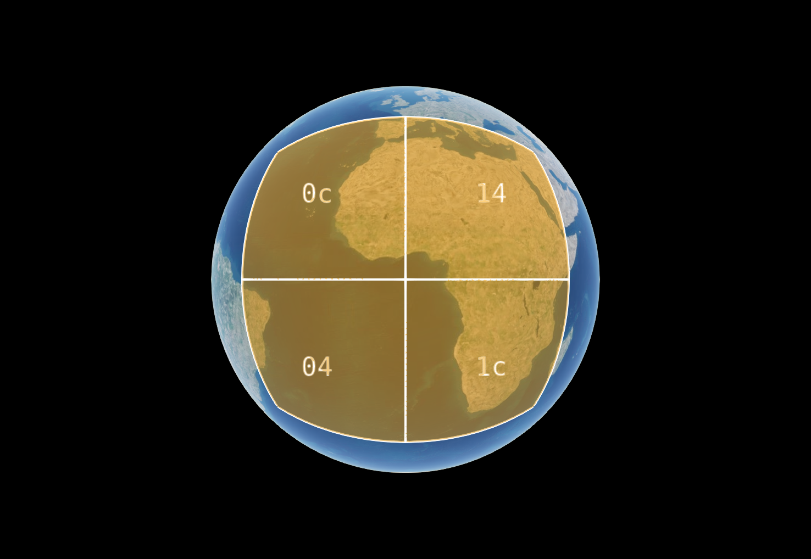 Children of S2 cell (`"1"`) on the WGS84 ellipsoid|

The S2 library uses a modified Hilbert curve to provide a one dimensional ordering of cells on the S2 Earth cube. This provides each cell, from level 1 to level 30, with a unique 64-bit identifier. Using S2 cell IDs, centimeter scale areas be uniquely identified.

| S2 Curve on Earth cube |  S2 Curve on WGS84 ellipsoid |
|:-:|:-:|
| 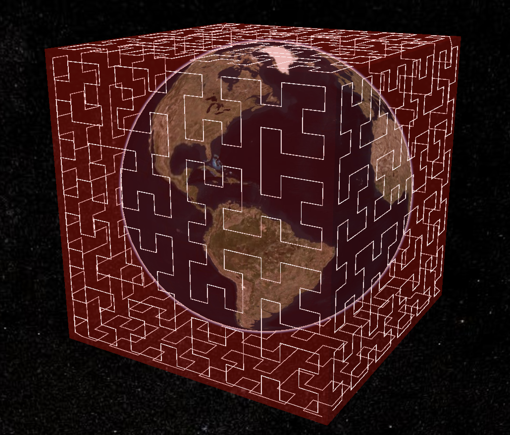  | 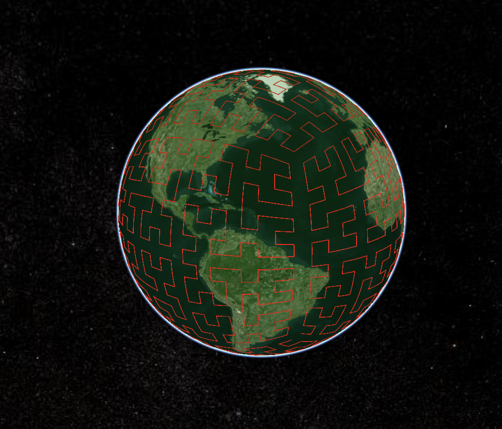  |

## Cell IDs

The 64-bit [S2 cell ID](https://s2geometry.io/devguide/s2cell_hierarchy#s2cellid-numbering) is constructed as follows:

1. Use 3 bits to encode the index of the root cell it belongs to. Valid values are in the range `[0-5]`.
2. For a cell at level `k`, for each of the `k` "child" values, add 2 bits to the right, indicating the selection of one of 4 children during subdivision.
3. Set the bit following the last child to `1`.
4. Set the remaining bits to `0`.

For example:

```
0011000000000...000   Root cell 1
0010110000000...000   2nd child of root cell 1
0010111100000...000   4th child of 2nd child of root cell 1
0010111001000...000   1st child of 4th child of 2nd child of root cell 1
```

In their decimal forms, the cell IDs above are represented as follows:

```
3458764513820540928   Root cell 1
3170534137668829184   2nd child of root cell 1
3386706919782612992   4th child of 2nd child of root cell 1
3332663724254167040   1st child of 4th child of 2nd child of root cell 1
```

## Tokens

To provide a more concise representation of the cell ID, as well as to provide a better indication of the level of the cell, we can use the hexadecimal form of the cell ID and remove any trailing zeros to obtain the cell's token.

For the cell IDs in the example above, the tokens are:

```
3     Root cell 1
2c    2nd child of root cell 1
2f    4th child of 2nd child of root cell 1
2e4   1st child of 4th child of 2nd child of root cell 1
```

## Bounding Volume

An S2 cell describes 4 positions on the surface of the WGS84 ellipsoid forming the corners of a geodesic quadrilateral. To form a bounding volume, the quadrilateral is extruded along normals to the ellipsoid. `minimumHeight` determines the height of the bottom surface of the bounding volume, while `maximumHeight` determines the height of the top surface. Both `minimumHeight` and `maximumHeight` are expressed in meters above (or below) the ellipsoid. A tile's [`transform`](../../specification#tile-transforms) property will be ignored when this extension is used for describing a tile's `boundingVolume`. Tiles using this extension must maintain [spatial coherence](../../specification/README.md#bounding-volume-spatial-coherence). This extension may be applied to the [`tile.boundingVolume`](../../specification/schema/tile.schema.json) or the [`content.boundingVolume`](../../specification/schema/content.schema.json) objects.

> **Implementation Note**: When mapping the sphere to the cube, S2 provides three projection methods: linear, quadratic and tangential. This extension assumes an implementation uses the quadratic projection, since it is reasonably accurate and efficient.

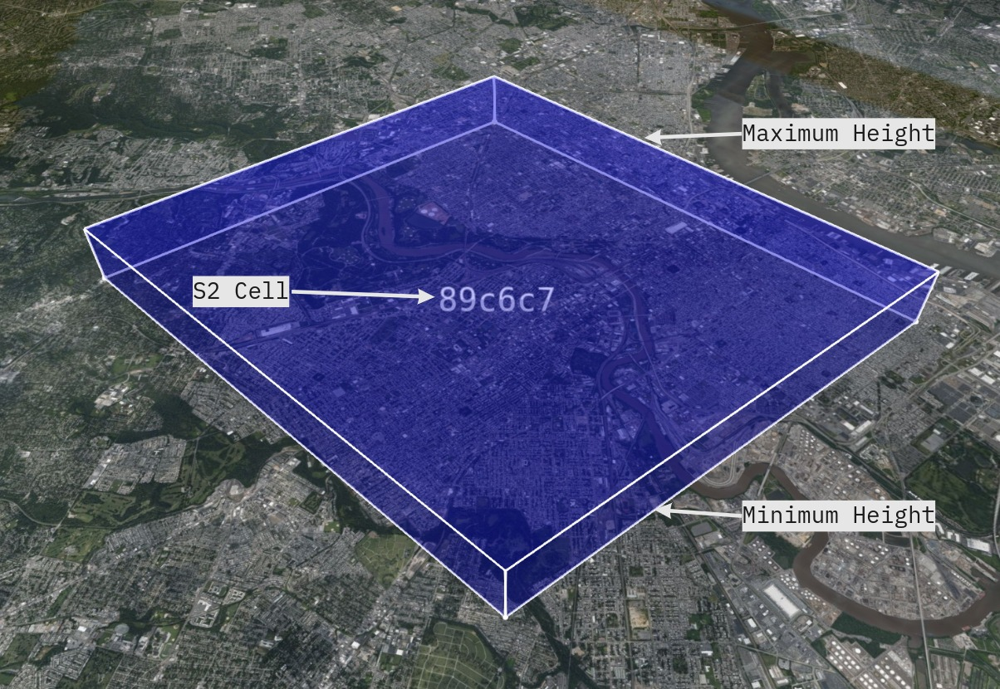

<p align="center">
  S2 cell (<tt>"89c6c7"</tt>) covering the Philadelphia Center City area, with minimum height set to <tt>0</tt> m and maximum height set to <tt>1000</tt> m.
</p>

```json
"boundingVolume": {
  "extensions": {
    "3DTILES_bounding_volume_S2": {
      "token": "89c6c7",
      "minimumHeight": 0,
      "maximumHeight": 1000
    }
  }
}
```

The following example illustrates usage of `3DTILES_bounding_volume_S2`:

```json
{
  "asset": {
    "version": "1.0"
  },
  "geometricError": 1000000,
  "extensionsUsed": [
    "3DTILES_bounding_volume_S2"
  ],
  "extensionsRequired": [
    "3DTILES_bounding_volume_S2"
  ],
  "root": {
    "boundingVolume": {
      "extensions": {
        "3DTILES_bounding_volume_S2": {
          "token": "3",
          "minimumHeight": 0,
          "maximumHeight": 1000000
        }
      }
    },
    "refine": "REPLACE",
    "geometricError": 50000,
    "children": [
      {
        "boundingVolume": {
          "extensions": {
            "3DTILES_bounding_volume_S2": {
              "token": "2c",
              "minimumHeight": 0,
              "maximumHeight": 500000
            }
          }
        },
        "refine": "REPLACE",
        "geometricError": 500000,
        "children": [
          {
            "boundingVolume": {
              "extensions": {
                "3DTILES_bounding_volume_S2": {
                  "token": "2f",
                  "minimumHeight": 0,
                  "maximumHeight": 250000
                }
              }
            },
            "refine": "REPLACE",
            "geometricError": 250000,
            "children": [
              {
                "boundingVolume": {
                  "extensions": {
                    "3DTILES_bounding_volume_S2": {
                      "token": "2ec",
                      "minimumHeight": 0,
                      "maximumHeight": 125000
                    }
                  }
                },
                "refine": "REPLACE",
                "geometricError": 125000
              }
            ]
          }
        ]
      }
    ]
  }
}
```

## Implicit Subdivision

When used with [`3DTILES_implicit_tiling`](../3DTILES_implicit_tiling), a `QUADTREE` subdivision scheme will follow the rules for subdivision as defined by the S2 cell hierarchy. When an `OCTREE` subdivision scheme is used, the split in the vertical dimension occurs at the midpoint of the `minimumHeight` and `maximumHeight` of the parent tile.

| Cell  | Quadtree Subdivision | Octree Subdivision |
|---|---|---|
| 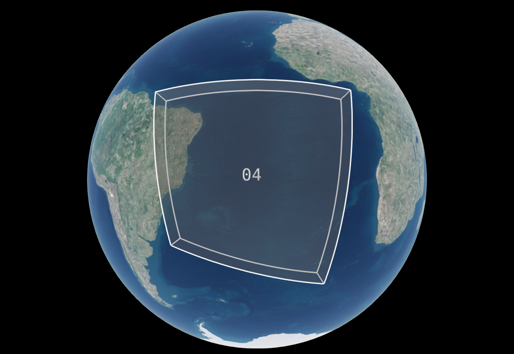  | 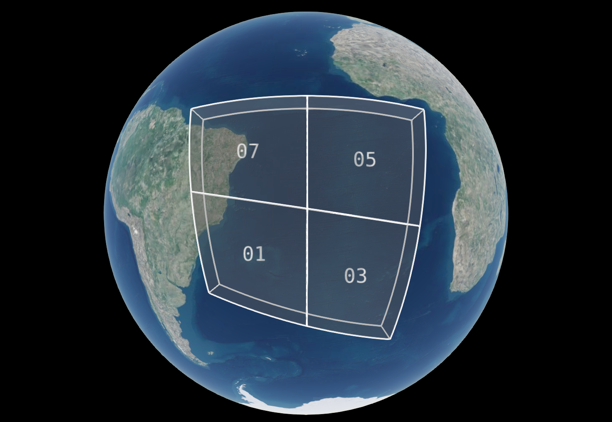  | 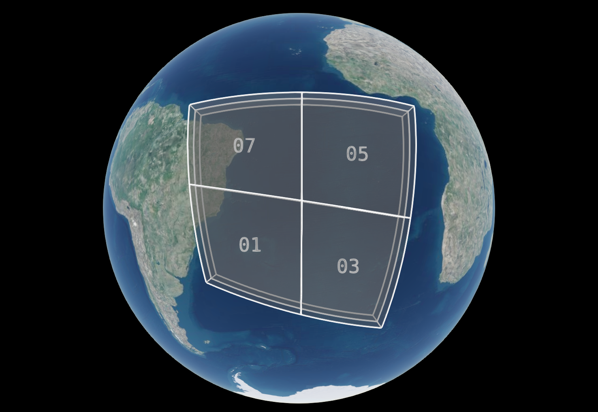  |

To ensure continuity of the Hilbert curve, the faces of the cube are rotated as shown in the diagram below. This must be carefully considered when interpreting the tile coordinates in implicit tiling, since the traversal order in the odd-numbered faces is the mirror of the order in even numbered faces.

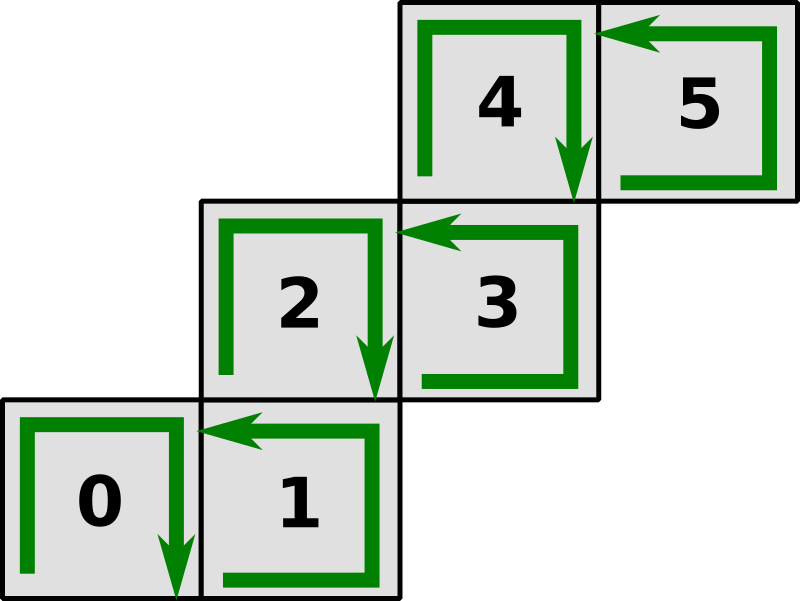


### Availability

When using this extension with `3DTILES_implicit_tiling`, the availability bitstreams must be indexed in Morton order, as illustrated by the following diagram:

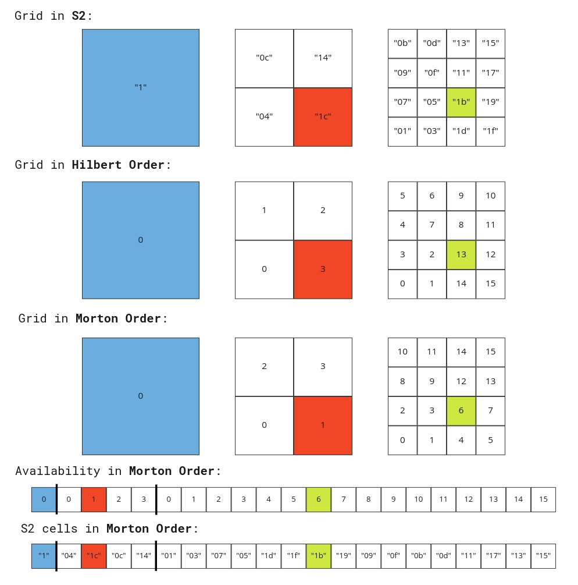

The following example illustrates usage of `3DTILES_bounding_volume_S2` with `3DTILES_implicit_tiling`:

```json
{
  "asset": {
    "version": "1.0"
  },
  "geometricError": 10000,
  "extensionsUsed": [
    "3DTILES_implicit_tiling",
    "3DTILES_bounding_volume_S2"
  ],
  "extensionsRequired": [
    "3DTILES_implicit_tiling",
    "3DTILES_bounding_volume_S2"
  ],
  "root": {
    "boundingVolume": {
      "extensions": {
        "3DTILES_bounding_volume_S2": {
          "token": "04",
          "minimumHeight": 0,
          "maximumHeight": 500000
        }
      }
    },
    "refine": "REPLACE",
    "geometricError": 5000,
    "content": {
      "uri": "content/{level}/{x}/{y}.glb"
    },
    "extensions": {
      "3DTILES_implicit_tiling": {
        "subdivisionScheme": "QUADTREE",
        "subtreeLevels": 4,
        "availableLevels": 8,
        "subtrees": {
          "uri": "subtrees/{level}/{x}/{y}.subtree"
        }
      }
    }
  }
}
```

The following example usage of `3DTILES_bounding_volume_S2` to represent all 6 faces of S2, to represent a tileset with global coverage:

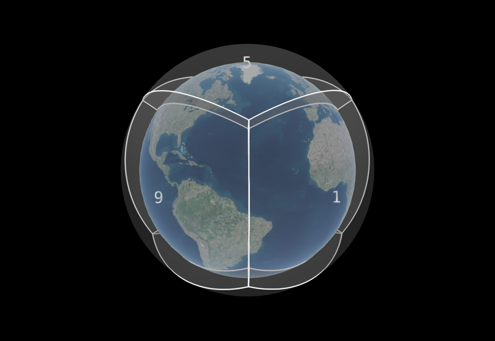

```json
{
  "asset": {
    "version": "1.0"
  },
  "geometricError": 10000,
  "extensionsUsed": [
    "3DTILES_implicit_tiling",
    "3DTILES_bounding_volume_S2"
  ],
  "extensionsRequired": [
    "3DTILES_implicit_tiling",
    "3DTILES_bounding_volume_S2"
  ],
  "root": {
    "boundingVolume": {
      "region": [
        -3.141592653589793,
        -1.5707963267948966,
        3.141592653589793,
        1.5707963267948966,
        0,
        250000
      ]
    },
    "refine": "REPLACE",
    "geometricError": 10000,
    "children": [
      {
        "boundingVolume": {
          "extensions": {
            "3DTILES_bounding_volume_S2": {
              "token": "1",
              "minimumHeight": 0,
              "maximumHeight": 1000000
            }
          }
        },
        "refine": "REPLACE",
        "geometricError": 5000,
      },
      {
        "boundingVolume": {
          "extensions": {
            "3DTILES_bounding_volume_S2": {
              "token": "3",
              "minimumHeight": 0,
              "maximumHeight": 1000000
            }
          }
        },
        "refine": "REPLACE",
        "geometricError": 5000,
      },
      {
        "boundingVolume": {
          "extensions": {
            "3DTILES_bounding_volume_S2": {
              "token": "5",
              "minimumHeight": 0,
              "maximumHeight": 1000000
            }
          }
        },
        "refine": "REPLACE",
        "geometricError": 5000,
      },
      {
        "boundingVolume": {
          "extensions": {
            "3DTILES_bounding_volume_S2": {
              "token": "7",
              "minimumHeight": 0,
              "maximumHeight": 1000000
            }
          }
        },
        "refine": "REPLACE",
        "geometricError": 5000,
      },
      {
        "boundingVolume": {
          "extensions": {
            "3DTILES_bounding_volume_S2": {
              "token": "9",
              "minimumHeight": 0,
              "maximumHeight": 1000000
            }
          }
        },
        "refine": "REPLACE",
        "geometricError": 5000,
      },
      {
        "boundingVolume": {
          "extensions": {
            "3DTILES_bounding_volume_S2": {
              "token": "b",
              "minimumHeight": 0,
              "maximumHeight": 1000000
            }
          }
        },
        "refine": "REPLACE",
        "geometricError": 5000,
      }
    ]
  }
}
```

## Schema

* [boundingVolume.3DTILES_bounding_volume_S2.schema.json](schema/boundingVolume.3DTILES_bounding_volume_S2.schema.json).

## Implementation Examples

_This section is non-normative_

- [S2Geometry Reference C++ Implementation](https://github.com/google/s2geometry/tree/master/src/s2)
- [S2Geometry Reference Java Implementation](https://github.com/google/s2-geometry-library-java/tree/master/src/com/google/common/geometry)
- [S2Cell.js in CesiumJS](https://github.com/CesiumGS/cesium/blob/master/Source/Core/S2Cell.js)
