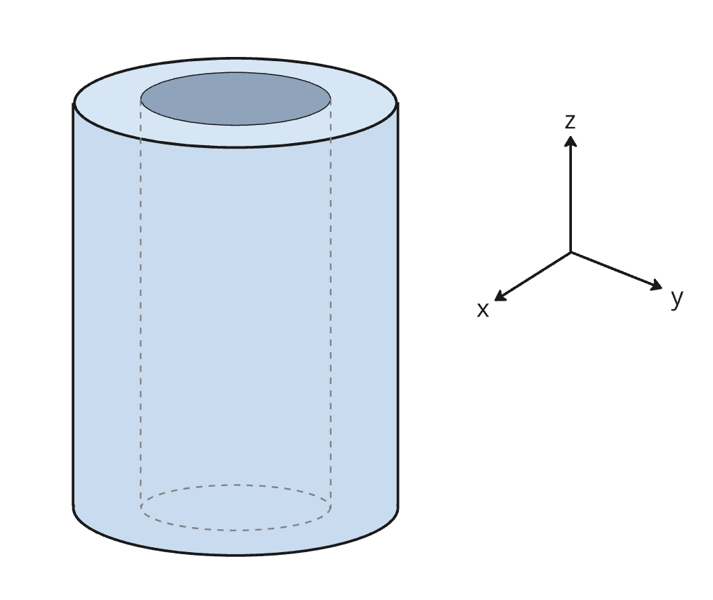
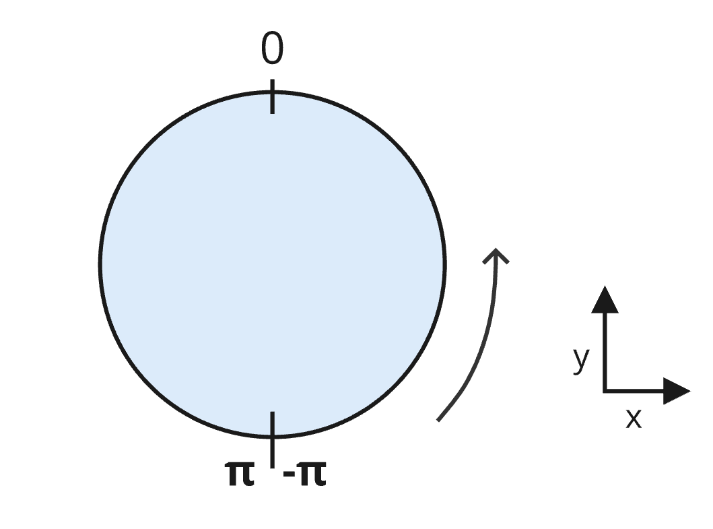
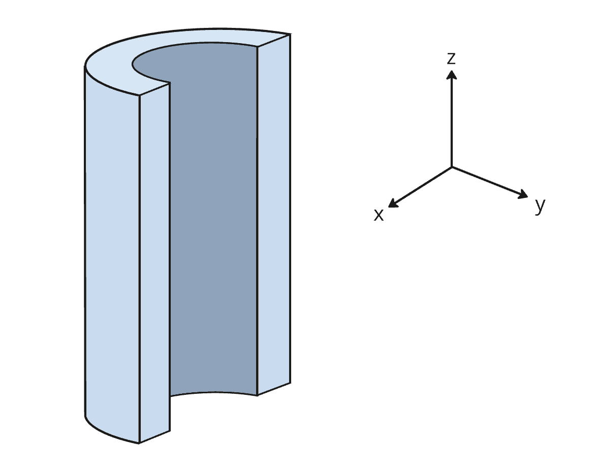
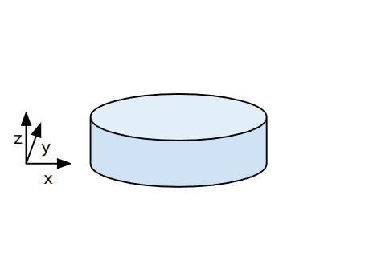
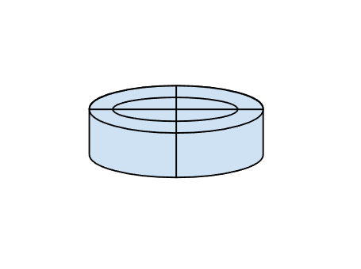
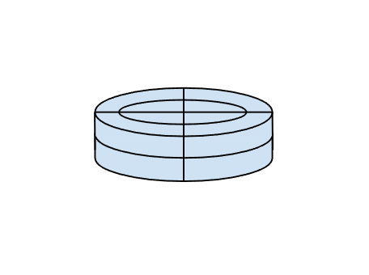

# 3DTILES_bounding_volume_cylinder

## Contributors

- Sean Lilley, Cesium
- Janine Liu, Cesium

## Status

Draft

## Dependencies

Written against the 3D Tiles 1.1 specification.

## Optional vs. Required

This extension is required, meaning it must be placed in both the `extensionsUsed` and `extensionsRequired` lists in the tileset JSON.

## Overview

This extension defines a bounding volume type for a region that follows the surface of a cylinder between two different radius values—aptly referred to as a "cylinder region". These regions are useful for visualizing real-world data that has been captured by cylindrical sensors.

<table>
  <tr>
    <th>
    Example
    </th>
  </tr>
  <tr>
    <td>

```json
"boundingVolume": {
  "extensions": {
    "3DTILES_bounding_volume_cylinder": {
      "minRadius": 0.5,
      "maxRadius": 1.0,
      "height": 2.0
    }
  }
}
```

  </td>
    <td>
    
    </td>
  </tr>
</table>

The cylinder does not need to be completely represented by the volume—for instance, the region may be hollow inside like a tube. However, an inner radius of `0` results in a completely solid cylinder.

## Details

The cylinder is centered at the origin, where the `minRadius` and `maxRadius` are measured along the `x` and `y` axes. The `height` of the cylinder is aligned with the `z` axis.

In addition to these properties—which inherently capture the volume's scale—the cylinder may also be transformed using `translation` and `rotation`. The `rotation` is captured by an array of four numbers `[x, y, z, w]` describing a unit quaternion, where `w` is the scalar.

A cylinder region may also be confined to a certain angular range. Angles are given in radians within the range `[-pi, pi]` and open counter-clockwise around the cylinder. The bounds are aligned such that an angle of `0` falls on the `+x` axis (see figure below).



The `minAngle` and `maxAngle` properties define the angles at which the region starts and stops on the cylinder.

<table>
  <tr>
    <th>
    Example
    </th>
  </tr>
  <tr>
    <td>

```json
"boundingVolume": {
  "extensions": {
    "3DTILES_bounding_volume_cylinder": {
      "minRadius": 0.5,
      "maxRadius": 1.0,
      "height": 2.0,
      "minAngle": -3.1415926,
      "maxAngle": 0
    }
  }
}
```

  </td>
    <td>
    
    </td>
  </tr>
</table>

## Implicit Subdivision

When used with [Implicit Tiling](../../specification/ImplicitTiling), the implicit tile coordinates are interpreted as `(radius, angle, height)` for the cylinder region.

A `QUADTREE` subdivision will subdivide along the radius and angle axes. An `OCTREE` subdivision will subdivide along the radius, angle, and height axes.

| Root Cylinder  | Quadtree | Octree |
|---|---|---|
|   |   |   |

Coordinate|Positive Direction
--|--
x| From the center outwards (increasing radius)
y| From `-pi` to `pi` (counter-clockwise)
z| From bottom to top (increasing height)