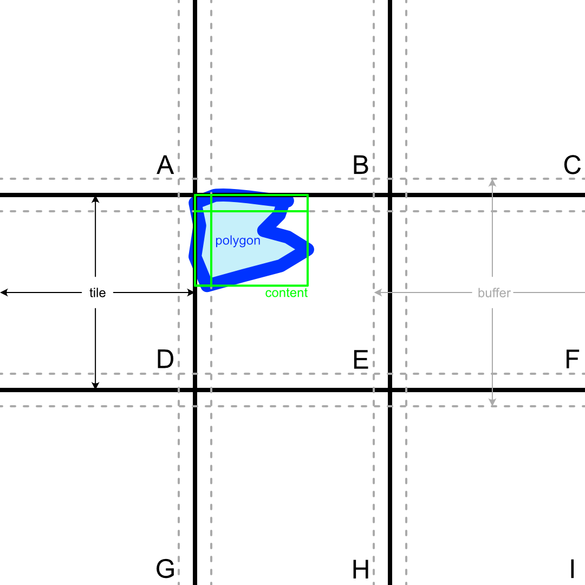

<!-- omit in toc -->

# 3DTILES_content_gltf_vector

<!-- omit in toc -->

## Contributors

- Don McCurdy, Bentley Systems
- TODO

<!-- omit in toc -->

## Status

Draft

<!-- omit in toc -->

## Dependencies

Written against the 3D Tiles 2.0 specification.

<!-- omit in toc -->

## Optional vs. Required

This extension is always optional. It should be placed in the tileset JSON `extensionsUsed` list, but not in the `extensionsRequired` list.

<!-- omit in toc -->

## Contents

- [Overview](#overview)
- [Extending 3D Tiles content](#extending-3d-tiles-content)
- [Points](#points)
- [Polylines](#polylines)
- [Polygons](#polygons)
- [Bounding volumes and clipping](#bounding-volumes-and-clipping)
- [Feature IDs and Properties](#feature-ids-and-properties)
- [Visualization](#visualization)
- [Schema](#schema)
- [Implementation Examples](#implementation-examples)

## Overview

Applied to geospatial domains, the term “vector data” refers to geometric topologies: points in 2D or 3D coordinate systems; polylines connecting a series of points; or polygons having a closed, exterior loop of points, optionally with additional interior loops defining holes in the polygon. The term "vector data" exists in contrast to “raster data”, which stores pixel grids in image-like formats, rather than discrete geometric types.

Extending the concept of vector data into the domain of graphics APIs, and of 3D scenes already composed of graphics primitives — such as points, lines, triangles — this extension proposes and defines an additional distinction: \*\*“vector data” comprises point, polyline, and polygon geometries with intrinsic semantic meaning, but without intrinsic rendering intent.

> [!NOTE]
> Unlike typical glTF geometry, vector data geometry does not directly convey rendering intent. Vector data is a vehicle for topology or for associated properties. Points may be aggregated, clustered, or used as anchors for labels. Lines may be widened, dashed, or used as an invisible track for animation. Polygons may be outlined, extruded, subtracted from existing scene geometry, or used to define an abstract area of analysis.

Working from the definition above, this extension proposes a mechanism for encoding vector point, line, and polygon data in 3D Tiles using glTF content, and for distinguishing such vector data from general glTF content. The extension further refines tile and content bounding volumes as needed to support seamless tiled vector rendering in a variety of visual styles.

## Extending 3D Tiles content

A `content` definition, containing a reference URL or template URL to glTF content, may be extended with the `3DTILES_content_gltf_vector`. The extension's boolean property, `vector: true`, indicates that the glTF content of the tile SHOULD be interpreted as vector data. The value of the `vector` property MUST be `true`; for non-vector content the extension is omitted.

```jsonc
{
  "root": {
    "extensionsUsed": [ "3DTILES_content_gltf_vector" ],
    ...
    "content": {
      "uri": "content/{level}/{x}/{y}.glb",
      "extensions": {
	    "3DTILES_content_gltf_vector": { "vector": true }
      }
    }
    ...
  }
}
```

Interpretation glTF content as particular vector types is explained further in the following sections. See [points](#points), [polylines](#polylines), and [polygons](#polygons).

Requirements for bounding volumes on glTF vector content may differ from other 3D Tiles content types. See [bounding volumes](#bounding-volumes).

## Points

glTF mesh primitives having `primitive.mode = 0` ("POINTS") SHOULD be interpreted as vector point topologies. Authoring tools SHOULD encode multiple point features within the same glTF mesh primitive, to improve file size and rendering efficiency.

## Polylines

glTF mesh primitives having `primitive.mode = 3` ("LINE_STRIP") SHOULD be interpreted as vector polyline topologies. Authoring tools SHOULD encode multiple polyline features within the same glTF mesh primitive, separated by primitive restart values using `KHR_mesh_primitive_restart`, to improve file size and rendering efficiency.

## Polygons

glTF mesh primitives in drawing mode `primitive.mode = 4` ("TRIANGLES"), using extension `EXT_mesh_polygon` (TODO) SHOULD be interpreted as vector polygon topologies. Authoring tools SHOULD encode multiple polygon features within the same glTF mesh primitive, to improve file size and rendering efficiency.

## Bounding volumes and clipping

When the `3DTILES_content_gltf_vector` extension is attached to a glTF `content` definition, a boolean `clip` property may optionally be included, defaulting to `false`:

```jsonc
"content": {
  "uri": "content/{level}/{x}/{y}.glb",
  "extensions": {
	"3DTILES_content_gltf_vector": {
	  "vector": true,
	  "clip": true
	}
  }
}
```

When `true`, a default 3D Tiles requirement is modified: `content.boundingVolume` is no longer required to be fully contained within `tile.boundingVolume`.

Client implementations SHOULD visually "clip" this content at the limits of `tile.boundingVolume`. Overflow of content outside the tile bounding volume is referred to as a "buffer" region.

The buffer region is provided to mitigate seams and discontinuities at tile boundaries. For polylines and polygons crossing tile boundaries and rendered with certain visual styles — particularly "wide" lines or outlines — display in tile A may be affected by the continuation of the same geometry a short distance ("buffer") into tile B. By clipping precisely at the tile boundary, sections of the geometry in tile B may still influence display within tile A, without duplicate rendering and/or z-fighting in tile B.



> TODO: Improve and describe illustration.

> [!NOTE]
> Clipping may be implemented by pre-processing geometry, by discarding fragments in a pixel shader, or by any other means. For typical vector visual styles (involving, for example, wide lines), it is expected that most implementations will implement clipping in the fragment shader (or equivalent), in order to preserve the influence of geometry just outside the tile boundary on lines or outlines crossing the tile boundary.

> [!NOTE]
> To avoid visual artifacts, client implementations would (in the absence of "buffer" region data) need to connect geometries in each tile to their corresponding geometries in adjacent tiles. Such mapping and reconstruction at runtime, while not prohibited, is often impractical for realtime implementations. Overlapping buffers at tile boundaries are included in 3D Tiles as an alternative.

As a result, `content.boundingVolume` may extend arbitrarily outside of `tile.boundingVolume`. Client implementations SHOULD implement LOD selection and tile visibility based on the tile bounding volume, not the (potentially larger) content bounding volume; tile visibility is unchanged as compared to non-vector data. Authoring implementations SHOULD include content extending _outside_ the tile bounding volume only to the extent that such content is likely to influence visualization _inside_ the tile bounding volume.

> [!NOTE]
> A small buffer region, representing a single-digit percentage of a tile's width, is expected to be sufficient for most rendering styles. Client implementations may choose to limit line widths to the widths of tile buffers, in screen space or world space, to avoid visual artifacts.

> [!NOTE]
> Point geometries do not typically require buffer regions or clipping at tile boundaries for proper rendering, but authoring and client implementations are not prohibited from doing either.

## Feature IDs and Properties

_This section is non-normative._

Point, polyline, and polygon geometries are often associated with other geometries comprising a single conceptual feature. Polyline and polygon geometries may also be cut across neighboring tiles during the tiling process. In such cases, `EXT_mesh_features` and `EXT_structural_metadata` may be used to reference and store properties associated with vector features. Global unique IDs, stored as columns in `EXT_structural_metadata`, may be used to allow features split across multiple tiles to participate in interaction (e.g. highlighting) as a single enttiy.

## Visualization

_This section is non-normative._

Visual representation of vector data in 3D Tiles is left undefined by this specification. Current and future versions of the 3D Tiles styling language may be used to define or modify styles.

## Schema

- TODO

## Implementation Examples

_This section is non-normative_

- TODO
