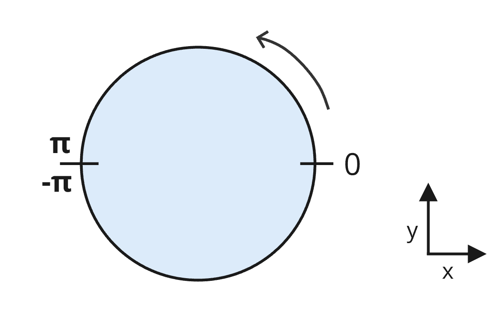
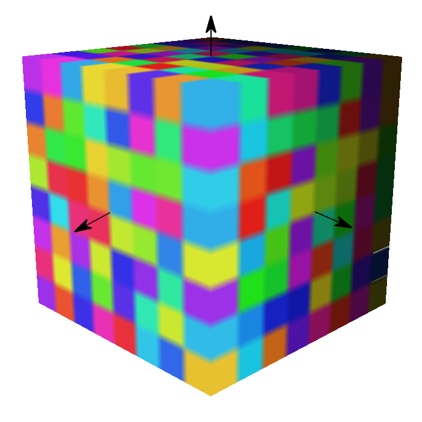
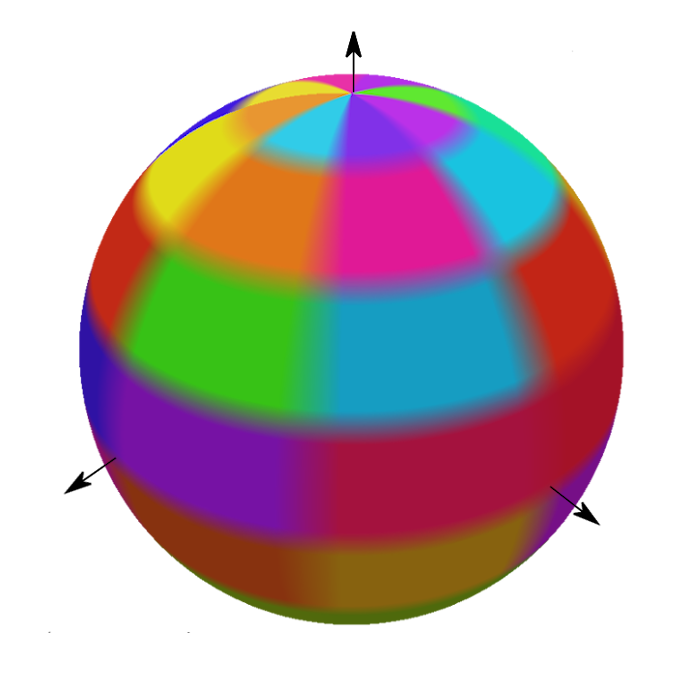
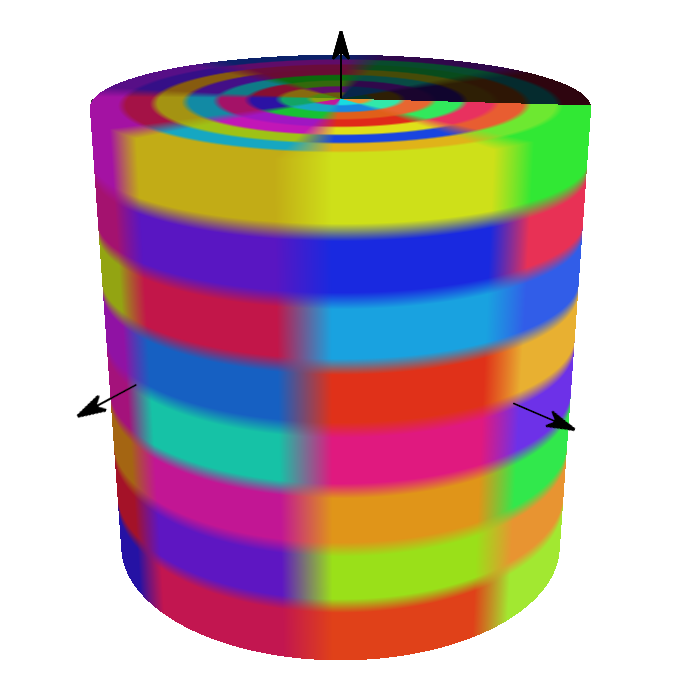

# 3DTILES_content_voxels

## Contributors

* Sean Lilley, Cesium
* Ian Lilley, Cesium
* Janine Liu, Cesium

## Status

Draft

## Dependencies

Written against the 3D Tiles 1.1 specification.

## Optional vs. Required

This extension is required, meaning it must be placed in both the `extensionsUsed` and `extensionsRequired` lists in the tileset JSON.

## Overview

This extension indicates the presence of voxel content and associates it with metadata definitions in the tileset's `schema`. Voxels are stored as glTFs with the [`EXT_primitive_voxels`](https://github.com/CesiumGS/glTF/tree/ext-primitive-voxels/extensions/2.0/Vendor/EXT_primitive_voxels) extension and are typically paired with [`EXT_structural_metadata`](https://github.com/CesiumGS/glTF/tree/3d-tiles-next/extensions/2.0/Vendor/EXT_structural_metadata) to unify the schema between a tileset and its tiles.

This extension is often paired with [Implicit Tiling](../../specification/ImplicitTiling/) for efficient representation of massive sparse voxel datasets. Although rendering implementations may vary, this extension can let runtimes detect voxel content in advance, such that they can allocate the necessary resources before any tiles load. 

### Content Extension

The `content` extension describes the structure of the voxel grid.

```json
"content": {
  "uri": "voxels.glb",
  "boundingVolume": {
    "box": [0, 0, 0, 100, 0, 0, 0, 100, 0, 0, 0, 100],
  },
  "extensions": {
    "3DTILES_content_voxels": {
      "dimensions": [8, 8, 8],
      "padding": {
        "before": [1, 1, 1],
        "after": [1, 1, 1]
      },
      "class": "voxel"
    }
  }
}
```

#### Shape

The shape and coordinate system of the voxel grid is determined by the content bounding volume. When undefined, the tile bounding volume is used instead.

The following bounding volume types are supported:

* [`box`](../../specification/README.adoc#box) - oriented bounding box in Cartesian coordinates
* [`region`](../../specification/README.adoc#region) - geographic region in longitude, latitude, height coordinates
* [`cylinder`](../3DTILES_bounding_volume_cylinder) - oriented bounding cylinder as defined by [3DTILES_bounding_volume_cylinder](../3DTILES_bounding_volume_cylinder)

The bounding volume **MUST** match the type of `shape` used for the glTF voxel grids. This means that:

- For `box` bounding volumes, glTF voxels must use the `box` in [`KHR_implicit_shapes`](https://github.com/eoineoineoin/glTF/tree/refs/heads/collisionShapeMerge/extensions/2.0/Khronos/KHR_implicit_shapes). 
- For `region` bounding volumes, glTF voxels must use the [`EXT_implicit_ellipsoid_region`](https://github.com/CesiumGS/glTF/blob/ext-primitive-voxels/extensions/2.0/Vendor/EXT_implicit_ellipsoid_region/README.md) extension.
- For `cylinder` bounding volumes, glTF voxels must use the [`EXT_implicit_cylinder_region`](https://github.com/CesiumGS/glTF/blob/ext-primitive-voxels/extensions/2.0/Vendor/EXT_implicit_cylinder_region/README.md) etxension.

#### Dimensions

The `dimensions` property of the extension specifies the grid dimensions for each axis. The value **MUST** match the `dimensions` specified in the `EXT_primitive_voxels` extension on the glTF voxel grids. The axis order and coordinate conventions are described below.

For `box` bounding volumes:

Axis|Coordinate|Positive Direction
--|--|--
0|`x`|Along the `+x` axis of the bounding volume
1|`y`|Along the `+y` axis of the bounding volume
2|`z`|Along the `+z` axis of the bounding volume

For `region` bounding volumes:

Axis|Coordinate|Positive Direction
--|--|--
0|`longitude`|From west to east (increasing longitude)
1|`latitude`|From south to north (increasing latitude)
2|`height`|From bottom to top (increasing height)

For `cylinder` bounding volumes:

Axis|Coordinate|Positive Direction
--|--|--
0|`radius`|From center (increasing radius)
1|`angle`|From `-pi` to `pi` clockwise (see figure below)
2|`height`|From bottom to top (increasing height)



The figure below shows `"dimensions": [8, 8, 8]` for each shape type:

|Box|Region|Cylinder|
| ------------- | ------------- | ------------- |
||||

Dimensions must be nonzero. Elements are laid out in memory first-axis-contiguous, e.g. for boxes, x data is contiguous.

#### Padding

The `padding` property specifies how many rows of voxel data in each dimension come from neighboring grids. This is useful in situations where the content represents a single tile in a larger grid, and data from neighboring tiles is needed for non-local effects, e.g., trilinear interpolation, blurring, or anti-aliasing.

`padding.before` and `padding.after` specify the number of rows before and after the grid in each dimension, e.g., a `padding.before` of 1 and a `padding.after` of 2 in the `y` dimension mean that each series of values in a given `y`-slice is preceded by one value and followed by two.

The `padding` property is optional; when omitted, `padding.before` and `padding.after` are both `[0, 0, 0]`. However, it **MUST** match the `padding` property specified in `EXT_primitive_voxels` on the glTF voxel grids.

#### Class

The `class` property refers to a class ID in the root tileset [schema](../../specification/README.adoc#metadata-schema). The class describes which properties exist in the voxel grid. In the example below, each voxel has a `temperature` value and a `salinity` value. When a property value equals the `noData` value it indicates that no data exists for that voxel.

```json
"schema": {
  "classes": {
    "voxel": {
      "properties": {
        "temperature": {
          "type": "SCALAR",
          "componentType": "FLOAT32",
          "noData": 999.9
        },
        "salinity": {
          "type": "SCALAR",
          "componentType": "UINT8",
          "normalized": true,
          "noData": 255
        }
      }
    }
  }
}
```

The `class` **MUST** match the `class` used to classify the glTF voxels in their `EXT_strutural_metadata` extension.

## Example

Tileset JSON with implicit tiling

```json
{
  "asset": {
    "version": "1.1"
  },
  "schema": {
    "classes": {
      "voxel": {
        "properties": {
          "temperature": {
            "type": "SCALAR",
            "componentType": "FLOAT32",
            "noData": 999.9
          },
          "salinity": {
            "type": "SCALAR",
            "componentType": "UINT8",
            "normalized": true,
            "noData": 255
          }
        }
      }
    }
  },
  "root": {
    "boundingVolume": {
      "box": [0, 0, 0, 100, 0, 0, 0, 100, 0, 0, 0, 100],
    },
    "content": {
      "uri": "{level}/{x}/{y}/{z}.glb",
      "extensions": {
        "3DTILES_content_voxels": {
          "dimensions": [8, 8, 8],
          "class": "voxel"
        }
      }
    },
    "implicitTiling": {
      "subdivisionScheme": "OCTREE",
      "subtreeLevels": 6,
      "availableLevels": 14,
      "subtrees": {
        "uri": "{level}/{x}/{y}/{z}.subtree"
      }
    },
    "transform": [0, 1, 0, 0, 0, 0, 1, 0, 1, 0, 0, 0, 6378137, 0, 0, 1],
    "geometricError": 100.0,
    "refine": "REPLACE",
  }
}
```

See [`EXT_primitive_voxels`](https://github.com/CesiumGS/glTF/tree/ext-primitive-voxels/extensions/2.0/Vendor/EXT_primitive_voxels) for examples of glTF voxel tiles.
