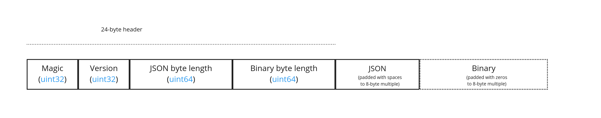

# 3DTILES_content_voxels

## Contributors

* Sean Lilley, Cesium
* Ian Lilley, Cesium

## Status

Draft

## Dependencies

Written against the 3D Tiles 1.1 specification.

## Optional vs. Required

This extension is required, meaning it must be placed in both the `extensionsUsed` and `extensionsRequired` lists in the tileset JSON.

## Overview

This extension introduces a voxel content format for 3D Tiles, which includes:

* A set of supported shape types: box, region, and cylinder
* A `content` extension that describes the structure of the voxel grid and property types
* A file format for storing binary property values

This extension is often paired with [Implicit Tiling](../../specification/ImplicitTiling/) for efficient representation of massive sparse voxel datasets.

### Content Extension

The `content` extension describes the structure of the voxel grid.

```json
"content": {
  "uri": "voxels.json",
  "boundingVolume": {
    "box": [0, 0, 0, 100, 0, 0, 0, 100, 0, 0, 0, 100],
  },
  "extensions": {
    "3DTILES_content_voxels": {
      "dimensions": [8, 8, 8],
      "padding": {
        "before": [1, 1, 1],
        "after": [1, 1, 1]
      },
      "class": "voxel"
    }
  }
}
```

The shape and coordinate system of the voxel grid is determined by the content bounding volume. When undefined, the tile bounding volume is used instead.

The following bounding volume types are supported:

* [`box`](../../specification/README.adoc#box) - oriented bounding box in Cartesian coordinates
* [`region`](../../specification/README.adoc#region) - geographic region in longitude, latitude, height coordinates
* [`cylinder`](../3DTILES_bounding_volume_cylinder) - oriented bounding cylinder as defined by [3DTILES_bounding_volume_cylinder](../3DTILES_bounding_volume_cylinder)

The `dimensions` property of the extension specifies the grid dimensions for each axis. The axis order and coordinate conventions are described below:

For `box` bounding volumes:

Axis|Coordinate|Positive Direction
--|--|--
0|`x`|Along the `+x` axis of the bounding volume
1|`y`|Along the `+y` axis of the bounding volume
2|`z`|Along the `+z` axis of the bounding volume

For `region` bounding volumes:

Axis|Coordinate|Positive Direction
--|--|--
0|`longitude`|From west to east (increasing longitude)
1|`latitude`|From south to north (increasing latitude)
2|`height`|From bottom to top (increasing height)

For `cylinder` bounding volumes:

Axis|Coordinate|Positive Direction
--|--|--
0|`radius`|From center (increasing radius)
1|`height`|From bottom to top (increasing height)
2|`angle`|From `-pi` to `pi` clockwise (see figure below)


The figure below shows `"dimensions": [8, 8, 8]` for each shape type:

|Box|Region|Cylinder|
| ------------- | ------------- | ------------- |
||||

Dimensions must be nonzero. Elements are laid out in memory first-axis-contiguous, e.g. for boxes, x data is contiguous.

The `padding` property specifies how many rows of voxel data in each dimension come from neighboring grids. This is useful in situations where the content represents a single tile in a larger grid, and data from neighboring tiles is needed for non-local effects e.g. trilinear interpolation, blurring, anti-aliasing. `padding.before` and `padding.after` specify the number of rows before and after the grid in each dimension, e.g. a `padding.before` of 1 and a `padding.after` of 2 in the `y` dimension mean that each series of values in a given `y`-slice is preceded by one value and followed by two.

The padding data must be supplied with the rest of the voxel data - this means if `dimensions` is `[d1, d2, d3]`, `padding.before` is `[b1, b2, b3]`, and `padding.after` is `[a1, a2, a3]`, the property must supply `(d1 + a1 + b1)*(d2 + a2 + b2)*(d3 + a3 + b3)` values.

The `padding` property is optional; when omitted, `padding.before` and `padding.after` are both `[0, 0, 0]`.

The `class` property refers to a class ID in the root tileset [schema](../../specification/README.adoc#metadata-schema). The class describes which properties exist in the voxel grid. In the example below, each voxel has a `temperature` value and a `salinity` value. When a property value equals the `noData` value it indicates that no data exists for that voxel. Binary property values are stored in the [Voxel File Format](#voxel-file-format).

```json
"schema": {
  "classes": {
    "voxel": {
      "properties": {
        "temperature": {
          "type": "SCALAR",
          "componentType": "FLOAT32",
          "noData": 999.9
        },
        "salinity": {
          "type": "SCALAR",
          "componentType": "UINT8",
          "normalized": true,
          "noData": 255
        }
      }
    }
  }
}
```

### Voxel File Format

A voxel file is a JSON file that contains binary property values for the voxel grid. A voxel file may reference external files containing binary data. An alternative [Binary Format](#voxel-binary-format) allows the JSON and binary data to be embedded into a single binary file.

```json
{
  "buffers": [
    {
      "uri": "data.bin",
      "byteLength": 3649
    }
  ],
  "bufferViews": [
    {
      "buffer": 0,
      "byteOffset": 0,
      "byteLength": 2916
    },
    {
      "buffer": 0,
      "byteOffset": 2920,
      "byteLength": 729
    }
  ],
  "propertyTables": [
    {
      "class": "voxel",
      "count": 729,
      "properties": {
        "temperature": {
          "values": 0
        },
        "salinity": {
          "values": 1
        }
      }
    }
  ],
  "voxelTable": 0
}
```

A *buffer* is a binary blob. Each buffer has a `uri` that refers to an external file containing buffer data and a `byteLength` describing the buffer size in bytes. Relative paths are relative to the voxel file. Data URIs are not allowed.

In the [Binary Format](#voxel-binary-format) the first buffer may instead refer to the binary chunk of the voxel file, in which case the `uri` property shall be undefined. This buffer is referred to as the _internal buffer_.

A *buffer view* is a contiguous subset of a buffer. A buffer view's `buffer` property is an integer index to identify the buffer. A buffer view has a `byteOffset` and a `byteLength` to describe the range of bytes within the buffer. The `byteLength` does not include any padding. There may be multiple buffer views referencing a single buffer.

For efficient memory access, the `byteOffset` of a buffer view shall be aligned to a multiple of 8 bytes.

A *property table* stores binary property values for a given `class`. See [Property Tables](../../specification/Metadata/ReferenceImplementation/PropertyTable/README.adoc#metadata-referenceimplementation-propertytable-property-table-implementation) for more details about the JSON schema and binary encoding rules.

`voxelTable` is the index of the property table containing voxel data. Typically a voxel file will just have a single property table and this index will be 0.

The property table `class` shall be the same as the extension object `class`. The property table `count` shall equal the total number of voxels plus padding. For example, voxel content with dimensions `[8, 8, 8]` would have a property table of count `512`. If padding were `[1, 1, 1]` in each direction the count would instead be `729`.

#### Voxel Binary Format

The voxel binary format is an alternative to the JSON file format that allows the JSON and binary data to be embedded into a single binary file.

The binary voxel format is little-endian and consists of a 24-byte header and a variable length payload:



Header fields:

| Bytes | Field | Type     | Description |
|-------|-------|----------|-------------|
| 0-3   | Magic | `UINT32` | A magic number identifying this as a voxel file. This is always `0x6C786F76`, the four bytes of the ASCII string `voxl` stored in little-endian order. |
| 4-7   | Version | `UINT32` | The version number. Always `1` for this version of the specification. |
| 8-15  | JSON byte length | `UINT64` | The length of the voxel JSON, including any padding. |
| 16-23 | Binary byte length | `UINT64` | The length of the buffer (or 0 if the buffer does not exist) including any padding. |

Each chunk shall be padded so it ends on an 8-byte boundary:

* The JSON chunk shall be padded with trailing `Space` chars (`0x20`)
* If it exists, the binary chunk shall be padded with trailing zeros (`0x00`)

#### File Extensions and Media Types

* JSON voxel files should use the `.json` extension and the `application/json` Media Type.
* Binary voxel files should use the `.voxel` extension and the `application/octet-stream` Media Type.
* Files representing binary buffers should use the `.bin` extension and `application/octet-stream` Media Type.

## Example

Tileset JSON with implicit tiling


```json
{
  "asset": {
    "version": "1.1"
  },
  "schema": {
    "classes": {
      "voxel": {
        "properties": {
          "temperature": {
            "type": "SCALAR",
            "componentType": "FLOAT32",
            "noData": 999.9
          },
          "salinity": {
            "type": "SCALAR",
            "componentType": "UINT8",
            "normalized": true,
            "noData": 255
          }
        }
      }
    }
  },
  "root": {
    "boundingVolume": {
      "box": [0, 0, 0, 100, 0, 0, 0, 100, 0, 0, 0, 100],
    },
    "content": {
      "uri": "{level}/{x}/{y}/{z}.json",
      "extensions": {
        "3DTILES_content_voxels": {
          "dimensions": [8, 8, 8],
          "class": "voxel"
        }
      }
    },
    "implicitTiling": {
      "subdivisionScheme": "OCTREE",
      "subtreeLevels": 6,
      "availableLevels": 14,
      "subtrees": {
        "uri": "{level}/{x}/{y}/{z}.subtree"
      }
    },
    "transform": [0, 1, 0, 0, 0, 0, 1, 0, 1, 0, 0, 0, 6378137, 0, 0, 1],
    "geometricError": 100.0,
    "refine": "REPLACE",
  }
}
```

Individual voxel file

```json
{
  "buffers": [
    {
      "uri": "data.bin",
      "byteLength": 2560
    }
  ],
  "bufferViews": [
    {
      "buffer": 0,
      "byteOffset": 0,
      "byteLength": 2048
    },
    {
      "buffer": 0,
      "byteOffset": 2048,
      "byteLength": 512
    }
  ],
  "propertyTables": [
    {
      "class": "voxel",
      "count": 512,
      "properties": {
        "temperature": {
          "values": 0
        },
        "salinity": {
          "values": 1
        }
      }
    }
  ],
  "voxelTable": 0
}
```
