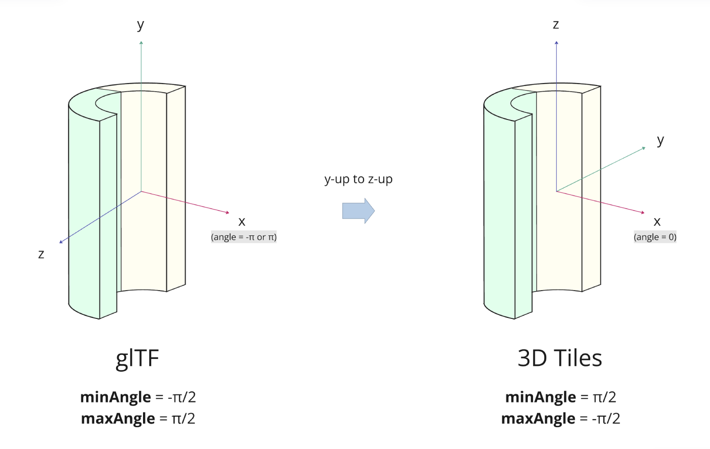

# 3DTILES_content_voxels

## Contributors

* Sean Lilley, Cesium
* Ian Lilley, Cesium
* Janine Liu, Cesium

## Status

Draft

## Dependencies

Written against the 3D Tiles 1.1 specification.

## Optional vs. Required

This extension is required, meaning it must be placed in both the `extensionsUsed` and `extensionsRequired` lists in the tileset JSON.

## Contents

- [Overview](#overview)
- [Example](#example)
- [Notes](#notes)

## Overview

This extension indicates the presence of voxel content and associates it with metadata definitions in the tileset's `schema`. Voxels are stored as glTFs with the [`EXT_primitive_voxels`](https://github.com/CesiumGS/glTF/tree/ext-primitive-voxels/extensions/2.0/Vendor/EXT_primitive_voxels) extension and are typically paired with [`EXT_structural_metadata`](https://github.com/CesiumGS/glTF/tree/3d-tiles-next/extensions/2.0/Vendor/EXT_structural_metadata) to unify the schema between a tileset and its tiles.

This extension is often paired with [Implicit Tiling](../../specification/ImplicitTiling/) for efficient representation of massive sparse voxel datasets. Although rendering implementations may vary, this extension can let runtimes detect voxel content in advance, such that they can allocate the necessary resources before any tiles load. 

### Content Extension

The `content` extension describes the structure of the voxel grid that the `content` object contains.

```json
"content": {
  "uri": "voxels.glb",
  "boundingVolume": {
    "box": [0, 0, 0, 100, 0, 0, 0, 100, 0, 0, 0, 100],
  },
  "extensions": {
    "3DTILES_content_voxels": {
      "dimensions": [8, 8, 8],
      "padding": {
        "before": [1, 1, 1],
        "after": [1, 1, 1]
      },
      "class": "voxel"
    }
  }
}
```

#### Shape

The shape and coordinate system of the voxel grid is determined by the content bounding volume. When undefined, the tile bounding volume is used instead.

The following bounding volume types are supported:

* [`box`](../../specification/README.adoc#box) - oriented bounding box in Cartesian coordinates
* [`region`](../../specification/README.adoc#region) - geographic region in longitude, latitude, height coordinates
* [`cylinder`](../3DTILES_bounding_volume_cylinder) - oriented bounding cylinder as defined by [3DTILES_bounding_volume_cylinder](../3DTILES_bounding_volume_cylinder)

The bounding volume **MUST** match the type of `shape` used for the glTF voxel grids. This means that:

- For `box` bounding volumes, glTF voxels must use the `box` in [`KHR_implicit_shapes`](https://github.com/eoineoineoin/glTF/tree/refs/heads/collisionShapeMerge/extensions/2.0/Khronos/KHR_implicit_shapes). 
- For `region` bounding volumes, glTF voxels must use the [`EXT_implicit_ellipsoid_region`](https://github.com/CesiumGS/glTF/blob/ext-primitive-voxels/extensions/2.0/Vendor/EXT_implicit_ellipsoid_region/README.md) extension.
- For `cylinder` bounding volumes, glTF voxels must use the [`EXT_implicit_cylinder_region`](https://github.com/CesiumGS/glTF/blob/ext-primitive-voxels/extensions/2.0/Vendor/EXT_implicit_cylinder_region/README.md) extension.

#### Dimensions

The `dimensions` property of the extension specifies the voxel grid's dimensions along each axis. Dimensions must be nonzero, and elements must be laid out on a first-axis continguous basis. The meaning of each "axis" depends on the voxel grid's shape, explained below.

For `box` bounding volumes:

Axis|Coordinate|Positive Direction
--|--|--
0|`x`|Along the `+x` axis of the bounding volume
1|`y`|Along the `+y` axis of the bounding volume
2|`z`|Along the `+z` axis of the bounding volume

For `region` bounding volumes:

Axis|Coordinate|Positive Direction
--|--|--
0|`longitude`|From west to east (increasing longitude)
1|`latitude`|From south to north (increasing latitude)
2|`height`|From bottom to top (increasing height)

For `cylinder` bounding volumes:

Axis|Coordinate|Positive Direction
--|--|--
0|`radius`|From center (increasing radius)
1|`angle`|From `-pi` to `pi` counter-clockwise (see figure below)
2|`height`|From bottom to top (increasing height)


These conventions align with how implicit tile coordinates defined in [Implicit Tiling](../../specification/ImplicitTiling/). The figure below shows `"dimensions": [8, 8, 8]` for each shape type:

|Box|Region|Cylinder|
| ------------- | ------------- | ------------- |
||||

> [!NOTE]
>
> glTF and 3D Tiles use different up-axes, which can result in different expectations for voxel **dimensions**.
>
> For **box** voxels, grid height corresponds to `y` in glTF, but must ultimately align with `z` in 3D Tiles. If the dimensions in `3DTILES_content_voxels` are `[width, height, depth]`, then the dimensions in `EXT_primitive_voxels` **MUST** be `[width, depth, height]`.
>
> For **cylinder** voxels, the same rule applies. If the dimensions in `3DTILES_content_voxels` are `[radius, angle, height]`, then the dimensions in `EXT_primitive_voxels` **MUST** be `[radius, height, angle]`.
>
> For **ellipsoid** voxels, the up-axis has no effect on the data layout. The `dimensions` in `EXT_primitive_voxels` **MUST** be equal to those in `3DTILES_content_voxels`.
>
> The up-axis difference will also affect the **data order** for box and cylinder voxels. See [Notes](#notes) for more details.

#### Padding

The `padding` property specifies how many rows of voxel data in each dimension come from neighboring grids. This is useful in situations where the content represents a single tile in a larger grid, and data from neighboring tiles is needed for non-local effects, e.g., trilinear interpolation, blurring, or anti-aliasing.

`padding.before` and `padding.after` specify the number of rows before and after the grid in each dimension, e.g., a `padding.before` of 1 and a `padding.after` of 2 in the `y` dimension mean that each series of values in a given `y`-slice is preceded by one value and followed by two.

The `padding` property is optional; when omitted, `padding.before` and `padding.after` are both `[0, 0, 0]`. However, it **MUST** match the `padding` property specified in `EXT_primitive_voxels` on the glTF voxel grids.

#### Class

The `class` property refers to a class ID in the root tileset [schema](../../specification/README.adoc#metadata-schema). The class describes which properties exist in the voxel grid. In the example below, each voxel has a `temperature` value and a `salinity` value. When a property value equals the `noData` value it indicates that no data exists for that voxel.

```json
"schema": {
  "classes": {
    "voxel": {
      "properties": {
        "temperature": {
          "type": "SCALAR",
          "componentType": "FLOAT32",
          "noData": 999.9
        },
        "salinity": {
          "type": "SCALAR",
          "componentType": "UINT8",
          "normalized": true,
          "noData": 255
        }
      }
    }
  }
}
```

The `class` **MUST** match the `class` used to classify the glTF voxels in their `EXT_strutural_metadata` extension.

## Example

_This section is non-normative_

The following example is a tileset JSON that uses voxel content with implicit tiling.

```json
{
  "asset": {
    "version": "1.1"
  },
  "schema": {
    "classes": {
      "voxel": {
        "properties": {
          "temperature": {
            "type": "SCALAR",
            "componentType": "FLOAT32",
            "noData": 999.9
          },
          "salinity": {
            "type": "SCALAR",
            "componentType": "UINT8",
            "normalized": true,
            "noData": 255
          }
        }
      }
    }
  },
  "root": {
    "boundingVolume": {
      "box": [0, 0, 0, 100, 0, 0, 0, 100, 0, 0, 0, 100],
    },
    "content": {
      "uri": "{level}/{x}/{y}/{z}.glb",
      "extensions": {
        "3DTILES_content_voxels": {
          "dimensions": [8, 8, 8],
          "class": "voxel"
        }
      }
    },
    "implicitTiling": {
      "subdivisionScheme": "OCTREE",
      "subtreeLevels": 6,
      "availableLevels": 14,
      "subtrees": {
        "uri": "{level}/{x}/{y}/{z}.subtree"
      }
    },
    "transform": [0, 1, 0, 0, 0, 0, 1, 0, 1, 0, 0, 0, 6378137, 0, 0, 1],
    "geometricError": 100.0,
    "refine": "REPLACE",
  }
}
```

### Notes

_This section is non-normative_

Recall that [dimensions](#dimensions) are given as `[x, y, z]` for both the `3DTILES_content_voxels` and `EXT_primitive_voxels` extensions, but each is defined against a different up-axis. This notably affects **box** and **cylinder** voxel grids, which align their height with the up-axis in either coordinate system.

In general, this up-axis difference is typically resolved at runtime by transforming the model's vertices with a rotation matrix. However, the attributes used for `EXT_primitive_voxels` are not positional. One solution could be to generate an explicit mesh from the implicit voxel data, then apply the rotation as usual. But other rendering implementations—for example, raymarching—must account for the transform in other ways, such as rewriting data for the 3D Tiles order, or adjusting the coordinates used to sample data at a point within the volume.

The following notes explain the implications for **box** and **cylinder** voxel shapes, including ways that runtimes can incorporate the `y`-up to `z`-up transform as they render voxel data.

#### Box

For any given glTF model, a `y`-up to `z`-up rotation will rotate its `y` axis to the positive `+z` axis, and its `z` axis to the negative `-y` axis. In a box voxel grid, the rotation transforms the indices of the voxel data in a similar way.

Given a box grid with dimensions `[width, height, depth]`, a voxel at index `[x, y, z]` in the glTF will be relocated to `[x, z, (height - 1) - y]` in 3D Tiles (see figure below).


In a UV-sampling approach, the original UV coordinates would be converted from `[u, v, w]` to `[u, w, 1.0 - v]`.

Conversely, if the dimensions are `[width, height, depth]` in 3D Tiles, a box voxel that is located at `[x, y, z]` will relocate to `[x, (depth - 1) - z, y]` in the glTF. Their UV coordinates respectively would be converted from `[u, v, w]` to `[u, 1.0 - w, v]`.

#### Cylinder

`3DTILES_bounding_cylinder` is modeled closely after the `EXT_implicit_cylinder_region` extension in glTF. However, the start of the cylinder's angle is different between the two coordinate systems. In 3D Tiles, an angle of `0` aligns with the positive `+x` axis, whereas in glTF it aligns with the negative `-x` axis. The resulting difference of `pi` should be accounted for when rendering the data.

As long as the region's angular range is less than `2pi`, the ordering of the voxel data remains the same. Instead, the difference can be treated as an offset in the `minAngle` and `maxAngle` properties of the region.

Given an `EXT_implicit_cylinder_region` in glTF, its equivalent in `3DTILES_bounding_cylinder` can be deduced by adding `pi` to its angular bounds. If the resulting angle is greater than `2pi`, then it should be wrapped around to its equivalent in the `[-pi, pi]` range (see below).



No matter how the `minAngle` and `maxAngle` change, a voxel located at `[x, y, z]` in the glTF will still be located at [`x, z, y`] in 3D Tiles, and vice versa. (`y` and `z` are swapped due to the different up-axes.)

However, this rule does not work if the cylinder region fills the entire `2pi` range (such that `minAngle = -pi` and `maxAngle = pi`). In this case, the indices used to access the voxel data will be affected. A **cylinder** voxel at `[x, y, z]` within the glTF will be located at `[x, z, a]` in 3D Tiles, where `a = [y + (angle / 2)] % angle`. The math is the same vice versa.


In a UV-sampling approach, the original coordinates would be converted from `[u, v, w]` in the glTF to `[u, fract(w + 0.5), v]` in 3D Tiles.

### Resources

_This section is non-normative_

- [`EXT_primitive_voxels specification`](https://github.com/CesiumGS/glTF/tree/ext-primitive-voxels/extensions/2.0/Vendor/EXT_primitive_voxels)