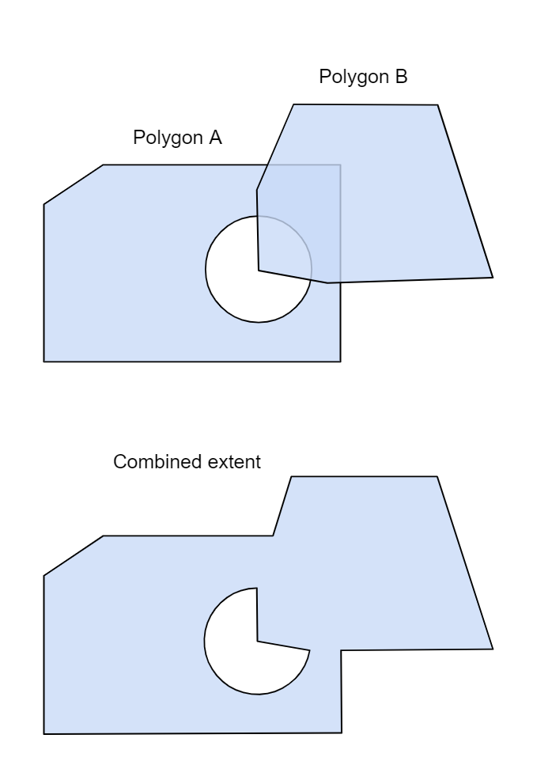

# 3DTILES_extent

## Contributors

* Samuel Vargas [@Samulus](https://github.com/Samulus)
* Sean Lilley, [@lilleyse](https://github.com/lilleyse)

## Contents

- [3DTILES_extent](#3dtilesextent)
  - [Contributors](#contributors)
  - [Contents](#contents)
  - [Overview](#overview)
  - [Defining Extents](#defining-extents)
    - [External extent definition](#external-extent-definition)
    - [`extent.json`](#extentjson)
    - [Embedded extent definition](#embedded-extent-definition)
  - [Holes in Extents](#holes-in-extents)
  - [Arc Types](#arc-types)
  - [Coordinate System](#coordinate-system)
  - [Example](#example)

## Overview

This extension allows the user to annotate the existence of a 2D region(s) (an extent) in a given tileset JSON via a 2D array of decimal coordinate pairs. The first two elements of each coordinate are the longitude followed by the latitude. The elevation may be provided as an optional third component for **each** extent coordinate pair: If one coordinate has an explicit elevation, all coordinates must also have explicit elevations. The extension is useful for a variety of scenarios such as: Overlaying high resolution geometry on top of low level geometry, defining a 2D collision boundary, or clipping excess geometry inside of a provided tileset.

## Defining Extents

An extent is a collection of longitude and latitude coordinate pairs. Extents are two-dimensional in nature, but an optional third component can be specified for **each** extent coordinate to specify its height (in meters) above the WGS84 ellipsoid. The first and last coordinate pairs automatically connect, meaning the first coordinate pair only needs to be provided once. The coordinate pairs should be provided in **counterclockwise** winding order. Multiple extents can be specified. Convex and concave extents are both supported. At least three coordinates must be provided for an extent to be valid. Extents may overlap each other, but self-intersecting extents are forbidden. Overlapping extents are treated as a boolean union.

The extent region definitions can be directly embedded in the tileset JSON or located in a separate file and referred to using a `uri` reference in the corresponding tileset JSON file.

### External extent definition

`tileset JSON`

```json
{
  "asset": {
    "version": "1.0"
  },
  "extensionsUsed": [
    "3DTILES_extent"
  ],
  "extensions": {
    "3DTILES_extent": {
      "uri": "extent.json"
    }
  },
  "geometricError": 100.0,
  "root": {}
}
```

### `extent.json`

```json
{
  "polygons": [
    {
      "coordinates": [
        [-116.61512629247555, 32.511166344475825],
        [-116.61385130521423, 32.514456825587125],
        [-116.61829305963617, 32.515638616140173],
        [-116.61944030086889, 32.513154268152434]
      ]
    }
  ]
}
```

### Embedded extent definition

`tileset JSON`

```json
{
  "asset": {
    "version": "1.0"
  },
  "extensionsUsed": [
    "3DTILES_extent"
  ],
  "extensions": {
    "3DTILES_extent": {
      "extent": {
        "polygons": [
          {
            "coordinates": [
              [-116.61512629247555, 32.511166344475825],
              [-116.61385130521423, 32.514456825587125],
              [-116.61829305963617, 32.515638616140173],
              [-116.61944030086889, 32.513154268152434]
            ]
          }
        ]
      }
    }
  },
  "geometricError": 100.0,
  "root": {}
}
```

## Holes in Extents

Extents support holes; simply provide a `holes` array for a given polygon, e.g:

```json
  "extensions": {
    "3DTILES_extent": {
      "extent": {
        "polygons": [
          {
            "coordinates": [
              [-116.61512629247555, 32.511166344475825],
              [-116.61385130521423, 32.514456825587125],
              [-116.61829305963617, 32.515638616140173],
              [-116.61944030086889, 32.513154268152434]
            ],
            "holes": [
              [
                [-116.615216292478261, 32.512032301338385],
                [-116.613232083209821, 32.513482030238328],
                [-116.614830243800763, 32.517382033280321]
              ]
            ]
          }
        ]
      }
    }
  }
```

Holes should be provided in **counterclockwise** winding order, and at least three coordinates must be provided. Holes may **not** overlap each other and self-intersecting holes are forbidden. Holes may not extend beyond the specified extent.

## Arc Types

Lines formed by consecutive coordinates represent **geodesic** lines. These are straight lines in 3D space, but curved when looking at their 2D projection.

## Coordinate System

Coordinates specified in the extent / holes section should be provided in longitude / latitude order and represent coordinates relative to the WGS84 ellipsoid.

## Example

Two polygons, one with a hole and one without. The combined extent is the boolean union of the two polygons.


