<!-- omit in toc -->
# 3DTILES_implicit_tiling

**Version 0.0.0**, December 1, 2020

<!-- omit in toc -->
## Contributors

* Peter Gagliardi, Cesium
* Erixen Cruz, Cesium
* Sam Suhag, Cesium
* Sean Lilley, Cesium
* Josh Lawrence, Cesium
* Patrick Cozzi, Cesium
* Shehzan Mohammed, Cesium

<!-- omit in toc -->
## Status

Draft

<!-- omit in toc -->
## Dependencies

Written against the 3D Tiles 1.0 specification.

<!-- omit in toc -->
## Contents

- [Overview](#overview)
- [Use Cases](#use-cases)
- [Tiling Schemes](#tiling-schemes)
  - [Implicit Subdivision](#implicit-subdivision)
- [Tile Coordinates](#tile-coordinates)
- [Template URIs](#template-uris)
- [Content](#content)
- [Subtrees](#subtrees)
- [Availability](#availability)
  - [Tile Availability](#tile-availability)
  - [Content Availability](#content-availability)
  - [Child Subtree Availability](#child-subtree-availability)
- [Subtree JSON Files](#subtree-json-files)
  - [Buffers and Buffer Views](#buffers-and-buffer-views)
  - [Morton Order](#morton-order)
  - [Availability Encoding](#availability-encoding)
- [Tileset JSON](#tileset-json)
- [Glossary](#glossary)
- [Examples](#examples)
  - [Quadtree with four levels](#quadtree-with-four-levels)
- [Octree Example](#octree-example)
- [JSON Schema Reference](#json-schema-reference)
- [Appendix A: Tree Indexing Formulas](#appendix-a-tree-indexing-formulas)
  - [Morton Indexing Formulas](#morton-indexing-formulas)
  - [Availability Formulas](#availability-formulas)
    - [Tile and Content Availability Formulas](#tile-and-content-availability-formulas)
    - [Child Subtree Availability Formulas](#child-subtree-availability-formulas)

## Overview

>**Implicit tiling** is an alternative method for describing a Cesium 3D Tileset that provides a more succinct representation for large tilesets. It encodes the hierarchical structure of the tileset in binary, as opposed to explicit tiling, which specifies the tile hierarchy in JSON. The Cesium 3D Tiles 1.0 specification only supports explicit tiling, as every tile is listed in the tileset JSON file.

Implicit tiling keeps the tileset JSON file small, which makes loading large tilesets faster. While explicit tiling can be used to represent large datasets, the tileset JSON file grows linearly with the number of tiles. Implicit tiling keeps the tileset JSON file bounded in size.

Implicit tiling also provides a method for accessing tiles by tile coordinates. This allows for abbreviated tree traversal algorithms.

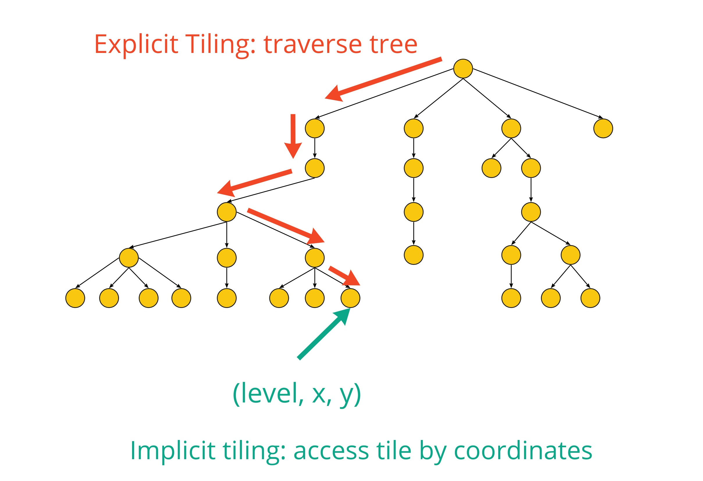

For a complete list of terminology used, see the [Glossary](#glossary).

## Use Cases

_This section is non-normative_

Implicit tiling allows Cesium 3D Tiles to support a variety of new use cases.

A key use for implicit tiling is enabling and/or accelerating tree traversal algorithms. For example, Cesium uses a [skip-LOD](https://cesium.com/blog/2017/05/05/skipping-levels-of-detail/) algorithm for faster loading times. Accessing a tile by coordinates is faster than traversing the entire tree. Likewise, raycasting algorithms and GIS algorithms can benefit from the abbreviated tree traversals.

Implicit tiling also allows for better interoperability with existing GIS data formats with implicitly defined tiling schemes. Some examples are:

* [CDB](https://docs.opengeospatial.org/is/15-113r5/15-113r5.html)
* [S2](http://s2geometry.io/)
* [WMTS](https://www.ogc.org/standards/wmts)
* [TMS](https://wiki.osgeo.org/wiki/Tile_Map_Service_Specification)

One new feature implicit tiling enables is procedurally-generated tilesets. Since implicit tiling encodes tile coordinates in URLs using [Template URIs](#template-uris), consider the server that serves these files. Instead of serving static files, a server could extract the tile coordinates from the URL and generate tiles at runtime. This could be useful for making a large procedural terrain dataset without requiring much disk space.

## Tiling Schemes

>**Tiling schemes** are well-defined patterns for subdividing a bounding volume into a hierarchy of tiles.

Implicit tiling supports two types of bounding volumes, `box` and `region`. Both are defined in the [Bounding Volumes section](https://github.com/CesiumGS/3d-tiles/tree/master/specification#bounding-volumes) of the Cesium 3D Tiles 1.0 Specification. `sphere` is not supported.

A tiling scheme recursively subdivides a volume by splitting it at the midpoint of some or all of the dimensions. If the two horizontal dimensions are split, a quadtree is produced. If all three dimensions are split, an octree is produced. No other tiling schemes are supported. Furthermore, the tiling scheme remains constant throughout the entire tileset; tiling schemes may not be intermixed within a single implicit tileset.

>A **quadtree** divides space only horizontally. It divides each bounding volume into 4 smaller bounding volumes where each horizontal dimension is halved. The vertical dimension remains the same. The resulting tree has a branching factor of 4.

Horizontal dimensions are `(x, y)` when the bounding volume is a `box` and `(longitude, latitude)` when the bounding volume is a `region`.


>An **octree** divides space along all 3 dimensions. It divides each bounding volume into 8 smaller bounding volumes where each dimension is halved. The resulting tree has a branching factor of 8.

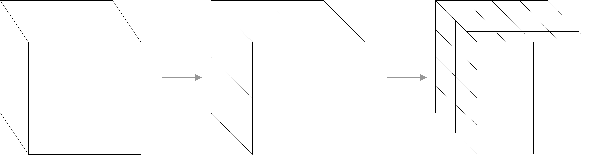

The following diagrams illustrate the subdivision in the bounding volume types supported by 3D Tiles:

| Root Box | Quadtree | Octree |
|:---:|:--:|:--:|
| 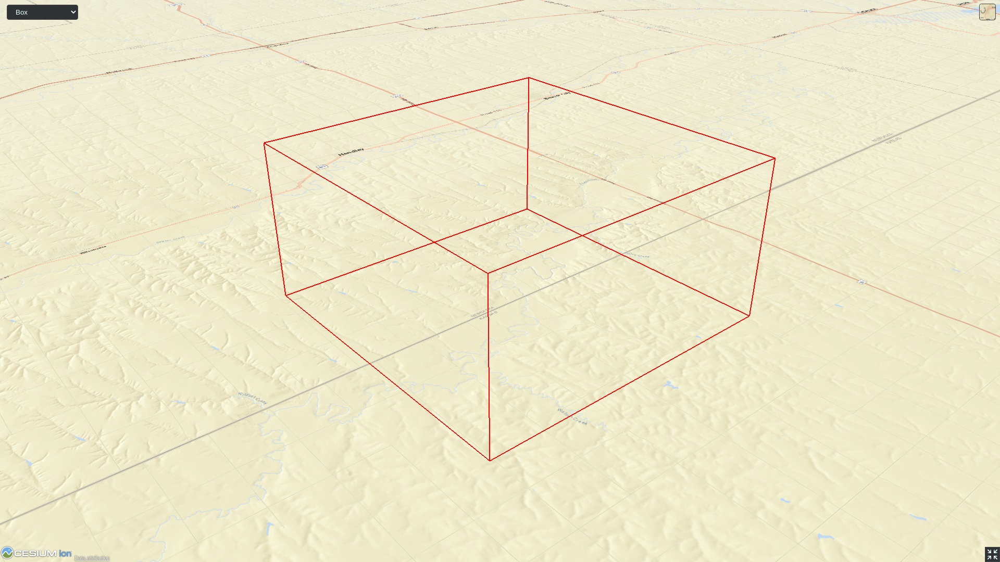 |  |   |

| Root Region | Quadtree | Octree |
|:---:|:--:|:--:|
| 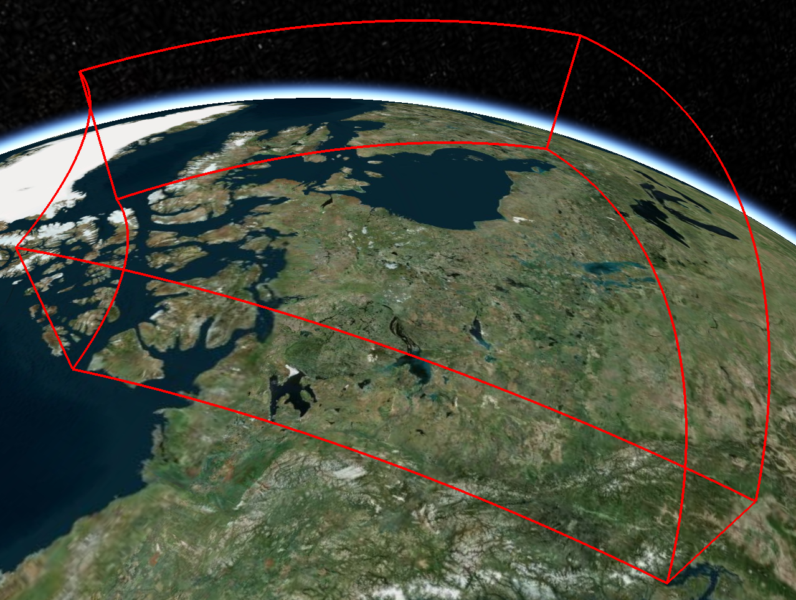 | 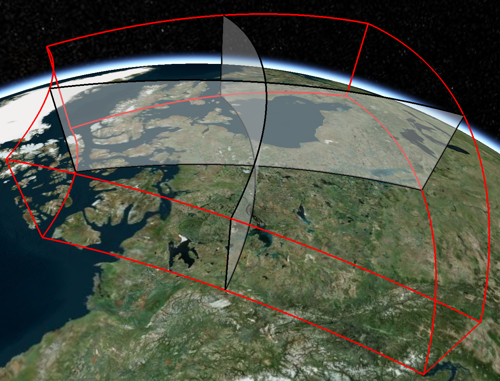 | 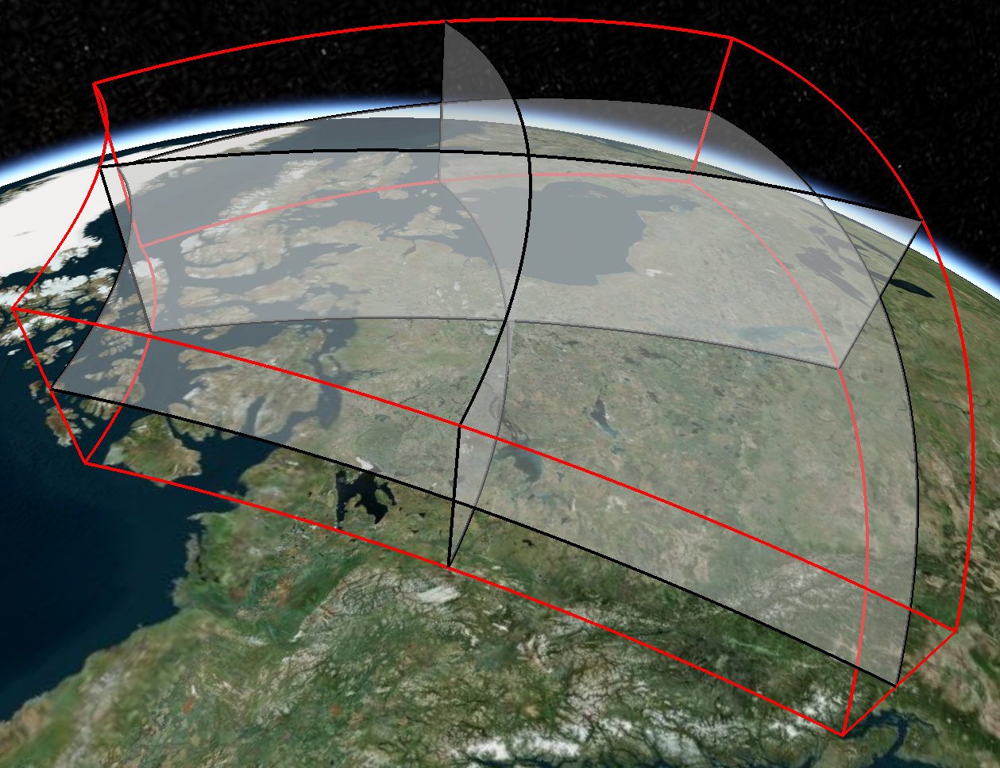  |

### Implicit Subdivision

Implicit tiling only requires defining the tiling scheme, bounding volume, geometric error, and refine strategy at the root tile. These properties can be computed for any other tile based on the following rules:

| Property | Subdivision Rule | 
| --- | --- |
| `tilingScheme` | Constant for all tiles in tileset |
| `refine` | Constant for all tiles in tileset |
| `boundingVolume` | If `tilingScheme` is `QUADTREE`, the parent tile is divided into 4 child tiles. If `tilingScheme` is `OCTREE` the child tile is divided into 8 child tiles. |
| `geometricError` | Each child's `geometricError` is half of the parent's `geometricError` |

## Tile Coordinates

>**Tile coordinates** are a tuple of integers that uniquely identify a tile. Tile coordinates are either `(level, x, y)` for quadtrees or `(level, x, y, z)` for octrees. All tile coordinates are 0-indexed.

`level` is 0 for the root tile. The root tile's children are at level 1, and so on.

`x`, `y`, and `z` coordinates are measured in tiles from a side of the root bounding volume at the current level along one of the coordinate axes. The type of bounding volume (`box` or `region`) determines the direction of increasing tile coordinates.

For `box`, the tile coordinates are listed along the same direction as the Cartesian coordinate system of the tileset. That is:

| Coordinate | Positive Direction |
| --- | --- |
| `x` | Along the `+x` axis of the bounding box |
| `y` | Along the `+y` axis of the bounding box |
| `y` | Along the `+z` axis of the bounding box |


For `region` bounding volumes, the coordinates are interpreted in Cartographic space. That is:

| Coordinate | Positive Direction |
|---|---|
| `x` | From west to east (increasing longitude) |
| `y` | From south to north (increasing latitude) |
| `z` | From bottom to top (increasing height) |

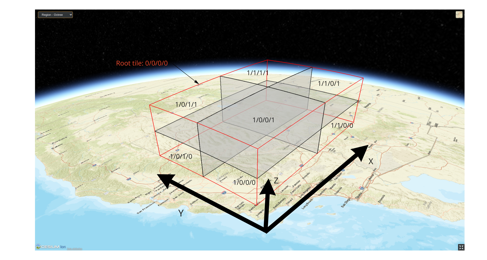

## Template URIs

>**Template URIs** are URI patterns used to refer to specific tiles by their tile coordinates.

Template URIs are configured in the tileset.json. They may be any URI pattern, but must include the variables `${level}`, `${x}`, `${y}`. Template URIs for octrees must also include `${z}`. When referring to a specific tile, the tile's coordinates are substituted in for these variables.

Here are some examples of template URIs and files that they match:

```
== Quadtree Example ==
Pattern: "content/${level}/${x}/${y}/tile.b3dm"
Valid filenames: 
- content/0/0/0/tile.b3dm
- content/1/1/0/tile.b3dm
- content/3/2/2/tile.b3dm

== Octree Example ==
Pattern: "content/${level}/${z}/${y}/${x}.pnts"
Valid filenames:
- content/0/0/0/0.pnts
- content/1/1/1/1.pnts
- content/3/2/1/0.pnts
```

Unless otherwise specified, template URIs are resolved relative to the tileset.json file.

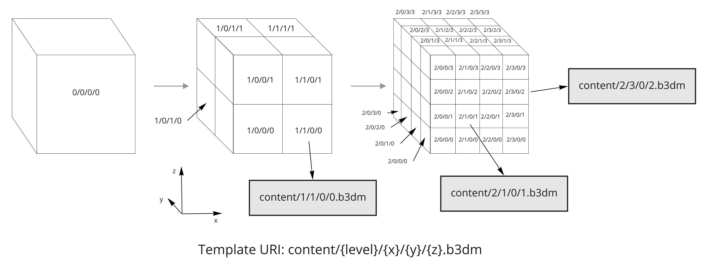

## Content

>**Content** is an optional 3D model associated with a single tile, as described in the [Introduction section](https://github.com/CesiumGS/3d-tiles/tree/master/specification#introduction) of the Cesium 3D Tiles 1.0 specification, with the addition of an explicit `mimeType`. 

This extension adds the `mimeType` property to identify the type of content. This is more reliable than a file extension for determining the file type.

## Subtrees

>**Subtrees** are fixed-depth and fixed-branching factor sections of the tileset tree used for breaking tilesets into manageable pieces.

Since tilesets grow exponentially with depth, storing information about every tile in a single file is not always feasible or desirable. Even if RAM is not a direct limitation, streaming large files over the network can make loading times slower. To account for this, subtrees partition the tileset structure into pieces of bounded size.

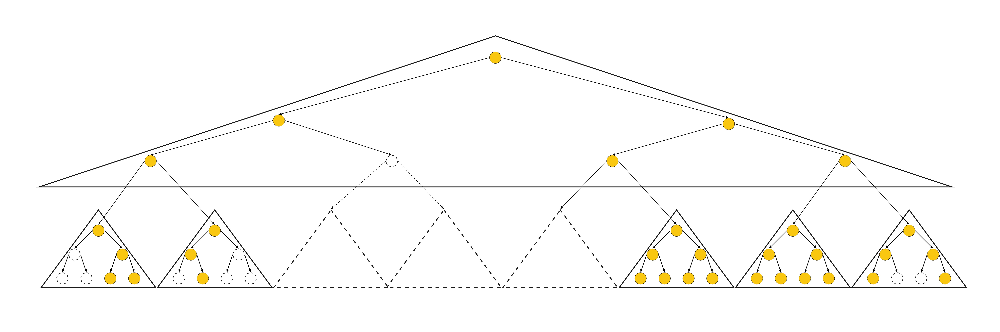

Each subtree is a tree-shaped container for tiles. A subtree has a fixed number of levels defined by the `subtreeLevels` property. This describes the number of distinct levels in the tree. The branching factor is also fixed due to the tiling scheme. For quadtrees, the branching factor is `4`, while octrees have a branching factor of `8`. Taken together, a subtree has exactly enough nodes to store a full quadtree or full octree with a limited depth. However, each node may or may not contain a tile, as a tileset only stores the tiles that are necessary.

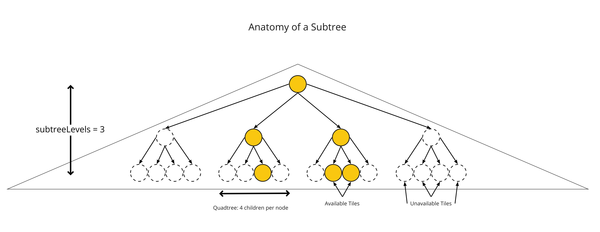

## Availability

**Availability** is boolean data about which tiles, contents, or subtrees exist in a tileset. Availability serves two purposes:

1. It provides an efficient method for checking what files are present
2. Including ths information prevents extraneous HTTP requests that would result in 404 errors.

Availability takes the form of a bitstream with one bit per node in consideration. A 1 indicates that a tile/content/subtree is available at this node. Meanwhile, a 0 indicates that no tile/content/subtree is available at this node.

For cases where all nodes are available or all nodes are unavailable, the `constant` property should be used instead of storing a full bitstream. For example, `constant: 0` indicates that all bits are 0 and no bitstream must be stored.

Availability data is scoped to a subtree. This ensures that the size of each bitstream is bounded to a reasonable size.

### Tile Availability

**Tile availability** is a bitstream that determines which tiles exist within a subtree. There is one bit for each subtree node. A 1 indicates that a tile is available, while a 0 indicates that a tile is unavailable.

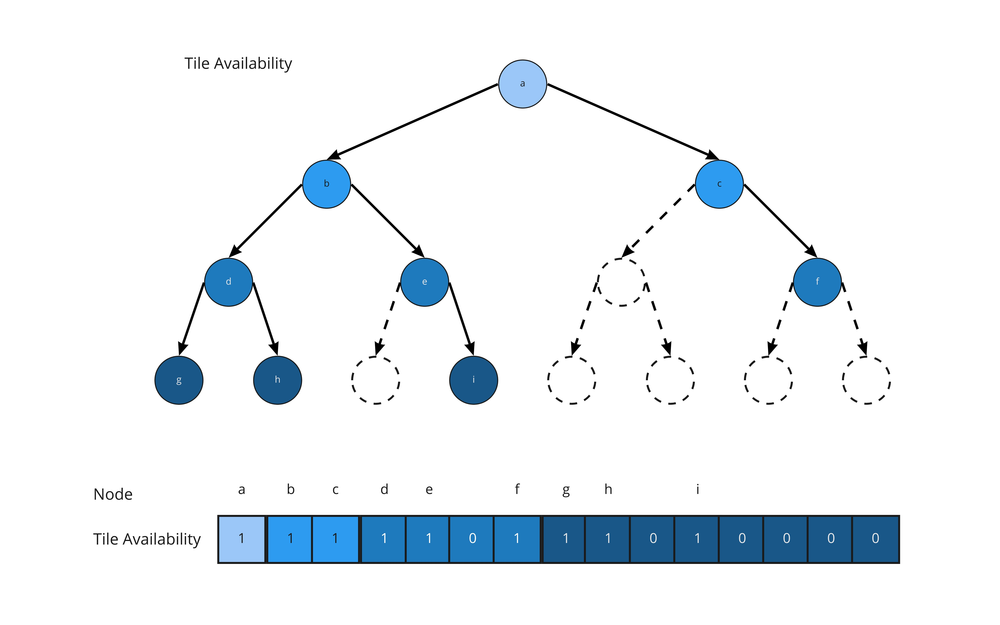

In the diagram above, colored nodes indicated available tile, while nodes with dashed outlines are unavailable tiles.

If a tile is marked as available, more information about the tile, such as its content or children can be queried. If a tile is marked as unavailable, the tile must be skipped.

### Content Availability

**Content availability** is a bitstream that determines which tiles have an associated content file. Like tile availability, there is one bit for each subtree node. A 1 indicates a content file exists for this tile, while a 0 indicates that no content file exists.

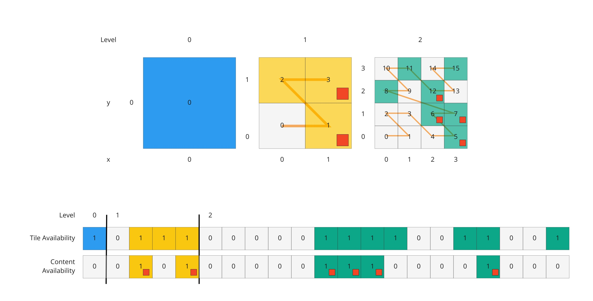

The purpose of content availability is to check if a file exists before making a network request. If content is marked as unavailable, the network request for that file must be skipped.

A content availability bit must only be set if the corresponding tile availability bit is set. Otherwise, it would be possible to specify content files that are not reachable by the tiles of the tileset. The content availability bitstream can be validated by checking that the following equation holds true:

```
contentAvailability & ~tileAvailability === 0
```

where `&` is the bitwise AND operation and `~` is the bitwise NOT operation.

### Child Subtree Availability

**Child subtree availability** is a bitstream that determines what subtrees can be reached from this subtree. There are `N` bits for every node in the bottom-most level of the subtree, where `N` is the branching factor of the tree. A 1 means there is a child subtree available at that position in the tree. Meanwhile, a 0 means there is no subtree available.

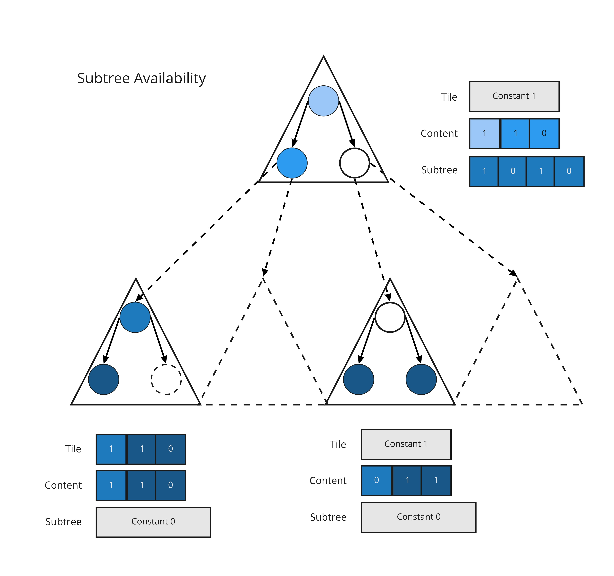

Child subtree availability is used to determine whether files for child subtrees exist before making network requests. If a child subtree availability bit is 0, any network request for that subtree must be skipped.

## Subtree JSON Files

A **subtree JSON file** describes where the availability information for a single subtree is stored.

Each subtree JSON file contains the following information:

* The location of a bitstream for tile availability (if not `constant`)
* The location of a bitstream for content availability (if not `constant`)
* The location of a bitstream for child subtree availability (if not `constant`)

### Buffers and Buffer Views

OUTLINE:
- Which spec to reference? 3DTILES_binary_buffers or core metadata?

### Morton Order

>**[Morton order](https://en.wikipedia.org/wiki/Z-order_curve)** assigns indices to nodes in the same level. The indices are used for lookup in availability buffers.

Using the Morton order serves these purposes:

- Efficient tile location decomposition: The Morton order allows efficient encoding and decoding of locations of a tile in the level to its location in the availability buffers.
- Efficient traversal: The binary representation of tile locations in the tree level allow for easy traversal of the tileset (finding parent and child nodes).
- Locality of reference: Adjacent indices are stored close to each other in memory and are close to each other spatially.

*The following section is non-normative*

The figure below shows the tile location decomposition of the tile `(level, x, y) = (3, 5, 1)`. We first convert the tile location to its Morton index, which is `19`. At Level 3 of a Quadtree, we'll use 6 bits to represent the binary value of the Morton index: `010011`.


### Availability Encoding

Availability bitstreams are packed in binary using the format described in the [Boolean Data section](https://github.com/CesiumGS/3d-tiles/blob/3d-tiles-next/specification/Metadata/0.0.0/README.md#boolean-data) of the Cesium 3D Metadata Specification.

Each availability bitstream must be stored as a separate `bufferView`, but multiple `bufferViews` may be stored in a single `buffer`.

## Tileset JSON

>Using implicit tiling, the tileset JSON file describes the root tile, tiling scheme, and template URIs for locating resources.

In the extension object, the following information about the root tile is included:

| Property | Description |
| ------ | ----------- |
| `tilingScheme` | Either `QUADTREE` or `OCTREE`|
| `boundingVolume` | a bounding volume (either a `box` or `region`) describing the root tile |
| `refine` | Either `ADD` or `REPLACE` as in the Cesium 3D Tiles 1.0 Specification. |
| `geometricError` | Geometric error of the root tile as described in the Cesium 3D Tiles 1.0 Specification. |
| `maximumLevel` | Maximum level of the entire tree |
| `subtreeLevels` | How many distance levels in each subtree. |

Furthermore, template URIs are used for locating subtree JSON files as well as tile contents. The key properties are as follows:

| Option | Description |
| ------ | ----------- |
| `subtrees.uri` | template URI for a subtree JSON file. see [Subtrees](#subtrees) for more info |
| `content.uri` | template URI for the content 3D Models |

Below is a full example of how the tileset JSON file looks in practice:

```json
{
  "asset": {
    "version": "1.0"
  },
  "geometricError": 10000,
  "extensionsUsed": [
    "3DTILES_implicit_tiling",
  ],
  "extensionsRequired": [
    "3DTILES_implicit_tiling",
  ],
  "extensions": {
    "3DTILES_implicit_tiling": {
      "extras": {
        "draftVersion": "0.0.0"
      },
      "boundingVolume": {
        "region": [-1.318, 0.697, -1.319, 0.698, 0, 20]
      },
      "refine": "REPLACE",
      "tilingScheme": "QUADTREE",
      "geometricError": 5000,
      "subtreeLevels": 7,
      "maximumLevel": 21,
      "subtrees": {
        "uri": "subtrees/${level}/${x}/${y}/subtree.json"
      },
      "content": {
        "mimeType": "application/octet-stream",
        "uri": "terrain/${level}/${x}/${y}.b3dm"
      }
    }
  }
}
```
## Glossary

* **availability** - Data specifying which tiles/subtrees/contents are available within a single subtree. This helps prevent unnecessary network requests.
* **available tile** - A tile that exists in the dataset.
* **boolean array** - An array of boolean values.
* **bitstream** - A boolean array stored as a sequence of bits rather than bytes.
* **child subtree** - A subtree reachable from an available tile in the bottommost row of a subtree.
* **child subtree availability** - Information about what child subtrees are available.
* **content availability** - Information about which tiles have an associated content file within a single subtree.
* **explicit tiling** - Describing a tileset by providing information about every tile.
* **implicit tiling** - Describing a tileset by describing the hierarchical structure in binary rather than in JSON.
* **octree** - A 3D tiling scheme that divides each cuboid into 8 smaller cuboids.
* **quadtree** - A 2D tiling scheme that divides each rectangle into 4 smaller rectangles.
* **root tile** - The topmost tile in a tileset tree.
* **subtree** - A fixed-depth section of the tileset tree used to break large tilesets into manageable pieces.
* **subtree file** - A JSON file storing information about a specific subtree.
* **subtree node** - A node in a subtree, regardless of whether there is an available tile there.
* **template URI** - A URI pattern containing tile coordinates for directly addressing tiles.
* **tile** - A tile as described in the Cesium 3D Tiles 1.0 specification.
* **tile availability** - Information about which tiles exist within a single subtree.
* **tileset** - A tileset as described in the Cesium 3D Tiles 1.0 specification.
* **tileset JSON** - A JSON file describing a tileset, as described in the Cesium 3D Tiles 1.0 specification.
* **tiling scheme** - A well-defined method for subdividing a bounding volume into a hierarchy of tiles.
* **unavailable tile** - A region of space that does not contain a tile.

## Examples

### Quadtree with four levels
Consider a tileset with a quadtree tiling scheme and four levels of detail. Suppose that we want to use implicit tiling with subtrees with 2 levels.

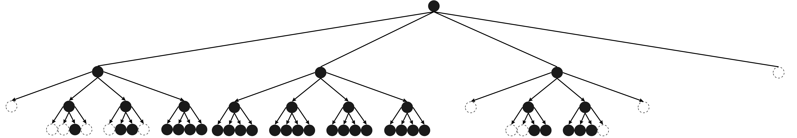

The root tileset JSON might look something this:
```json
{
  "asset": {
    "version": "1.0"
  },
  "geometricError": 10000,
  "extensionsUsed": [
    "3DTILES_implicit_tiling",
  ],
  "extensionsRequired": [
    "3DTILES_implicit_tiling",
  ],
  "extensions": {
    "3DTILES_implicit_tiling": {
      "extras": {
        "draftVersion": "0.0.0"
      },
      "boundingVolume": {
        "region": [-1.318, 0.697, -1.319, 0.698, 0, 20]
      },
      "refine": "ADD",
      "tilingScheme": "QUADTREE",
      "geometricError": 5000,
      "subtreeLevels": 2,
      "maximumLevel": 4,
      "subtrees": {
        "uri": "subtrees/${level}/${x}/${y}/subtree.json"
      },
      "content": {
        "mimeType": "application/octet-stream",
        "uri": "models/${level}/${x}/${y}.b3dm"
      }
    }
  }
}
```

The directory structure for subtrees is:

```
|__ tileset.json
|__ subtrees/
  |__ 0/
    |__ subtree.json
    |__ availability.bin
  |__ 2/
    |__ 0/
      |__ 1/
        |__ subtree.json
        |__ availability.bin
      |__ 2/
        |__ subtree.json
        |__ availability.bin
      |__ 3/
        |__ subtree.json
    |__ 1/
      |__ 0/
        |__ subtree.json
      |__ 1/
        |__ subtree.json
      |__ 2/
        |__ subtree.json
      |__ 3/
        |__ subtree.json
    |__ 2/
      |__ 1/
        |__ subtree.json
        |__ availability.bin
      |__ 2/
        |__ subtree.json
        |__ availability.bin
```
Notice that subtrees that do not exist do not have subtree JSON files or binary buffers. Also, subtrees that are completely full do not get availability buffers since they can specify availability with a constant.

`subtrees/0/0/0/subtree.json`
```json
{
  "buffers": [
    {
      "uri": "availability.bin",
      "byteLength": 4
    }
  ],
  "bufferViews": [
    {
      "buffer": 0,
      "byteOffset": 0,
      "byteLength": 1
    },
    {
      "buffer": 0,
      "byteOffset": 1,
      "byteLength": 1
    },
    {
      "buffer": 0,
      "byteOffset": 2,
      "byteLength": 2
    }
  ],
  "tileAvailability": {
    "bufferView": 0
  },
  "contentAvailability": {
    "bufferView": 1
  },
  "childSubtreeAvailability": {
    "bufferView": 2
  },
}
```
In this example, tile, content, and child subtree availability are in one availability buffer. Buffer views split the buffer into the three parts. Since there are five nodes in the subtree, tile and content availability only need five bits each, so they each get one byte. There are 16 children, however, so two bytes are needed for child subtree availability.

`subtrees/2/1/0/subtree.json`
```json
{
  "tileAvailability": {
    "constant": 1
  },
  "contentAvailability": {
    "constant": 1
  },
  "childSubtreeAvailability": {
    "constant": 0
  },
}
```
This subtree at the bottom of the tree is completely full. It uses constants for its availabilities instead of buffers. Because it is at the bottom of the tree, there are no child subtrees, so child subtree availability is a constant zero.

## Octree Example

`tileset.json`:

```json
{
  "asset": {
    "version": "1.0"
  },
  "geometricError": 100,
  "extensionsUsed": [
    "3DTILES_implicit_tiling",
  ],
  "extensionsRequired": [
    "3DTILES_implicit_tiling",
  ],
  "extensions": {
    "3DTILES_implicit_tiling": {
      "extras": {
        "draftVersion": "0.0.0"
      },
      "boundingVolume": {
        "box": [
          0, 0, 0,
          100, 0, 0,
          0, 100, 0
          0, 0, 100
        ]
      },
      "refine": "ADD",
      "tilingScheme": "OCTREE",
      "geometricError": 5000,
      "subtreeLevels": 3,
      "maximumLevel": 8,
      "subtrees": {
        "uri": "subtrees/${level}/${z}/${y}/${x}/subtree.json"
      },
      "content": {
        "mimeType": "application/octet-stream",
        "uri": "models/${level}/${z}/${y}/${x}/model.pnts"
      }
    }
  }
}
```

`subtrees/0/0/0/0/subtree.json`

```json
{
	"buffers": [
    {
      "uri": "availability.bin",
      "byteLength": 74
    }
  ],
  "bufferViews": [
    {
      "buffer": 0,
      "byteOffset": 0,
      "byteLength": 10
    },
    {
      "buffer": 0,
      "byteOffset": 10,
      "byteLength": 64
    }
  ],
  "tileAvailability": {
    "bufferView": 0
  },
  "contentAvailability": {
    "constant": 0
  },
  "childSubtreeAvailability": {
    "bufferView": 1
  }
}
```

`subtrees/6/0/0/0/subtree.json`

```json
{
	"buffers": [
    {
      "uri": "availability.bin",
      "byteLength": 84
    }
  ],
  "bufferViews": [
    {
      "buffer": 0,
      "byteOffset": 0,
      "byteLength": 10
    },
    {
      "buffer": 0,
      "byteOffset": 10,
      "byteLength": 10
    }
    {
      "buffer": 0,
      "byteOffset": 10,
      "byteLength": 64
    }
  ],
  "tileAvailability": {
    "bufferView": 0
  },
  "contentAvailability": {
    "bufferView": 1
  },
  "childSubtreeAvailability": {
    "bufferView": 2
  }
}
```

File structure:

```
|__ tileset.json
|__ subtrees/
  |__ 0/
    |__ 0/
      |__ 0/
        |__ 0/
            |__ subtree.json
            |__ availability.bin
  |__ 3/
    |__ 0/
      |__ 0/
        |__ 0/
          |__ subtree.json
          |__ availability.bin
  |__ 6/
    |__ 0/
      |__ 0/
        |__ 0/
        |__ subtree.json
        |__ availability.bin
|__ models/
  |__ 8/
    |__ 0/
      |__ 0/
        |__ 0/
          |__ model.pnts
        |__ 1/
          |__ model.pnts
      |__ 1/
        |__ 0/
          |__ model.pnts
        |__ 1/
          |__ model.pnts
    |__ 1/
      |__ 0/
        |__ 0/
          |__ model.pnts
        |__ 1/
          |__ model.pnts
      |__ 1/
        |__ 0/
          |__ model.pnts
        |__ 1/
          |__ model.pnts
```

OUTLINE:
- double-headed quadtree as explicit root tileset + external implicit tilesets
- sparse, shallow octree
- deep, sparse quadtree
- Full quadtree (medium depth)

## JSON Schema Reference

OUTLINE:
- Generate via Wetzel
  
## Appendix A: Tree Indexing Formulas

### Morton Indexing Formulas

| Quantity | Formula | Description |
| -------- | ------- | ----------- |
| `N` | 4 or 8 | N is 4 for quadtrees, 8 for octrees |
| `bits` | `log2(N)` | Quadtree address are a multiple of 2 bits, Octrees use a multiple of 3 bits | 
| `mortonIndex` | `interleave(z, y, x)` or `interleave(y, x)` | The morton index is computed by interleaving bits. see below. |
| `length(mortonIndex)` | `level * bits` | length of morton index in bits
| `parent.mortonIndex` | `child.mortonIndex >> bits` | The parent morton index is a prefix of the child |
| `child[k].mortonIndex` | `(parent.mortonIndex << bits) + k` | Morton index of a node's `k-th` child in Morton order |
| `parent.indexOf(child)` | `child.mortonIndex % N` or `child.mortonIndex & (N - 1)` | Index of the child within the parent's `N` children |

The `interleave(a, b, c, ...)` function mentioned above interleaves the bits of the input streams into a single bit stream. It does this by taking a bit from each bit stream from left to light and concatenating them into a single bitstream. This is repeated until all bits have been used.

Below are some examples:

```
interleave(0b11, 0b00) = 0b1010
interleave(0b1010, 0b0011) = 0b10001101
interleave(0b0110, 0b0101) = 0b00111001

interleave(0b001, 0b010, 0b100) = 0b001010100
interleave(0b111, 0b000, 0b111) = 0b101101101
```

### Availability Formulas

#### Tile and Content Availability Formulas

Both tile and content availability are stored in a bitstream with the same structure, so these formulas apply equally well to both

| Quantity | Formula | Description |
| -------- | ------- | ----------- |
| `lengthBits` | `(N^subtreeLevels - 1)/(N - 1)` | Length of buffer is determined by subtree levels |
| `lengthBytes` | `ceil(lengthBits / 8)` | Bytes needed to store the buffer | 
| `parent.index` | `floor((child.index - 1) / N)` | Index of the parent in the bitstream | 
| `parent.indexOf(child)` | `(child.index - 1) % N` | Index of the child within the parent's `N` children |
| `parent.children[k].index` | `N * index + k + 1` | Find the bit of the `k-th` child of a node |
| `index` | `(N^level - 1)/(N - 1) + mortonIndex` | Find the index of a node from `(level, mortonIndex)`
| `level` | `ceil(log(index + 1)/log(N))` | Find the level of a node relative to the subtree |
| `globalLevel` | `level + subtreeRoot.globalLevel` | Find the level of a node relative to the entire tileset | 
| `startOfLevel` | `(N^level - 1)/(N - 1)` | first index at a particular level (relative to the subtree root) |
| `mortonIndex` | `index - startOfLevel` | Convert from bit index to Morton index, relative to the root of the subtree |
| `globalMortonIndex` | `concat(subtreeRoot.globalMortonIndex, mortonIndex)` | Get the Morton index relative to the root of the tileset |

#### Child Subtree Availability Formulas

| Quantity | Formula | Description |
| -------- | ------- | ----------- |
| `lengthBits` | `N^subtreeLevels` | Length of the buffer by subtree levels |
| `lengthBytes` | `ceil(lengthBits / 8)` | Bytes needed to store the buffer |
| `childSubtree.globalLevel` | `subtreeRoot.globalLevel + subtreeLevels` | Level of the child subtrees relative to the tileset root |
| `leaf.children[k].index` | `N * leaf.mortonIndex + k` | index of the `k-th` child subtree |
| `leaf.indexOf(childSubtree)` | `subtreeRoot.mortonIndex % N` | Index of the child subtree within the parent leaf's `N` children |
| `leaf.mortonIndex` | `floor(subtreeRoot.mortonIndex / N)` | Morton index of the parent leaf |
