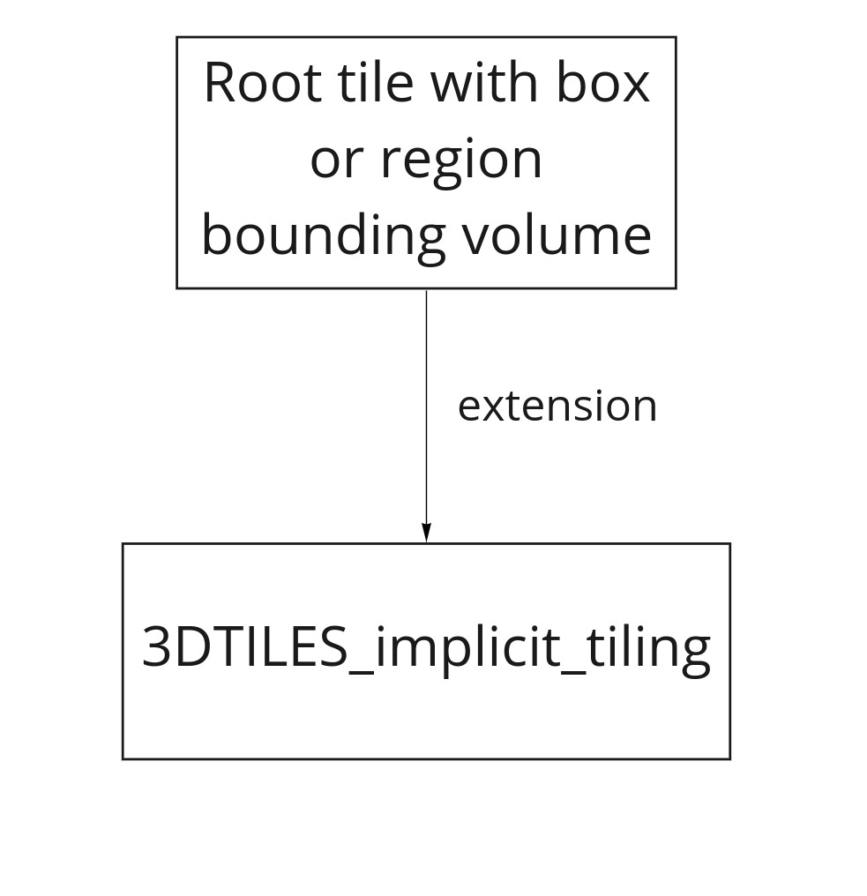
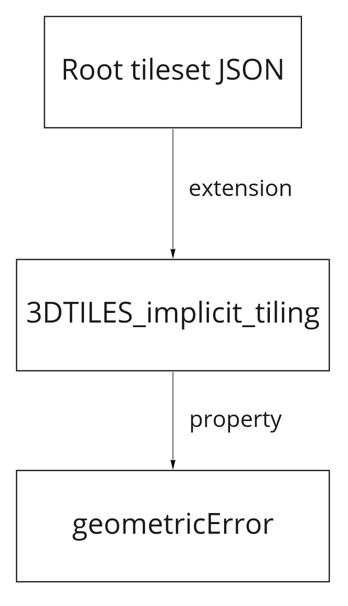
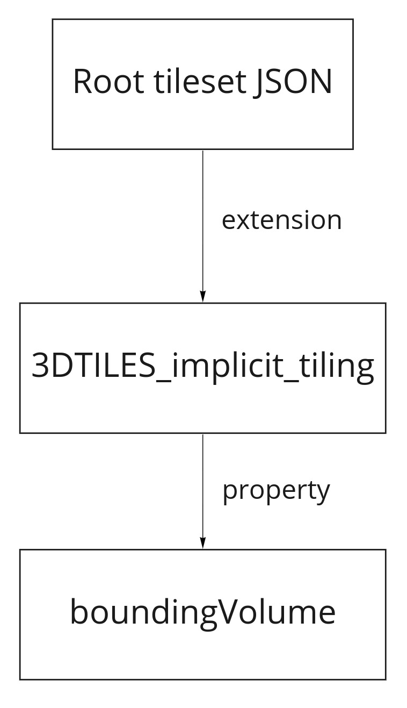
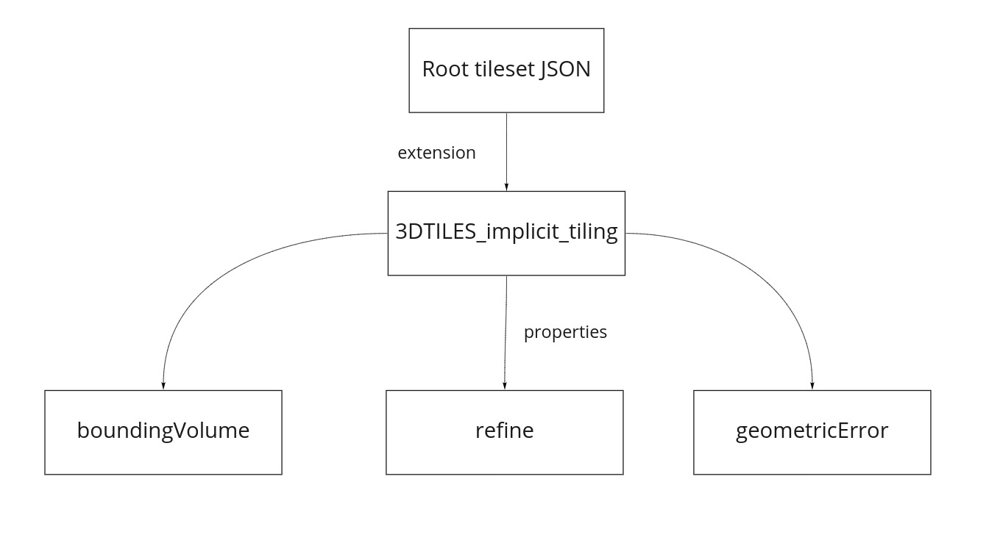
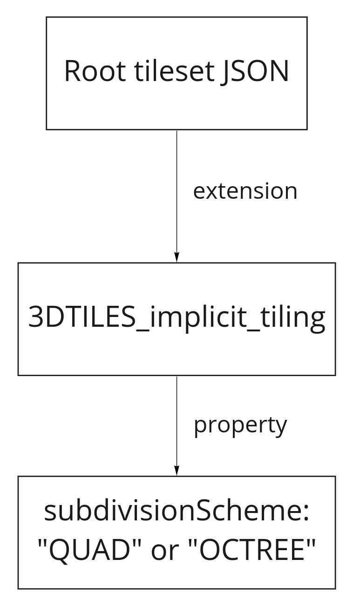

<!-- omit in toc -->
# 3DTILES_implicit_tiling

**Version 0.0.0**, December 1, 2020

<!-- omit in toc -->
## Contributors

* Peter Gagliardi, Cesium
* Erixen Cruz, Cesium
* Sam Suhag, Cesium
* Sean Lilley, Cesium
* Josh Lawrence, Cesium
* Patrick Cozzi, Cesium
* Shehzan Mohammed, Cesium

<!-- omit in toc -->
## Status

Draft

<!-- omit in toc -->
## Dependencies

Written against the 3D Tiles 1.0 specification.

<!-- omit in toc -->
## Contents

- [Overview](#overview)
- [Use Cases](#use-cases)
- [Tileset JSON](#tileset-json)
- [Geometric Error](#geometric-error)
- [Bounding volume](#bounding-volume)
  - [Refinement](#refinement)
- [Subdivision scheme](#subdivision-scheme)
  - [Implicit Subdivision](#implicit-subdivision)
- [Tile Coordinates](#tile-coordinates)
- [Template URIs](#template-uris)
- [Content](#content)
- [Subtrees](#subtrees)
- [Availability](#availability)
  - [Tile Availability](#tile-availability)
  - [Content Availability](#content-availability)
  - [Child Subtree Availability](#child-subtree-availability)
- [Subtree JSON Files](#subtree-json-files)
  - [Buffers and Buffer Views](#buffers-and-buffer-views)
  - [Morton Order](#morton-order)
  - [Morton Order Example](#morton-order-example)
  - [Availability Encoding](#availability-encoding)
- [Tileset JSON](#tileset-json-1)
- [Glossary](#glossary)
- [Examples](#examples)
  - [Quadtree with four levels](#quadtree-with-four-levels)
- [Octree Example](#octree-example)
- [JSON Schema Reference](#json-schema-reference)
- [Appendix A: Tree Indexing Formulas](#appendix-a-tree-indexing-formulas)
  - [Morton Indexing Formulas](#morton-indexing-formulas)
  - [Availability Formulas](#availability-formulas)
    - [Tile and Content Availability Formulas](#tile-and-content-availability-formulas)
    - [Child Subtree Availability Formulas](#child-subtree-availability-formulas)

## Overview

**Implicit tiling** describes a Cesium 3D Tileset while enabling new data structures and algorithms for near constant time random access and dynamic tileset generation. It makes fast, efficient high resolution (meter or centimeter scale) global dataset streaming possible. The tileset is uniformly subdivided and organized for ease of read and write without the need to read the entire tileset at once. The subdivision, using full and sparse quad and octrees, enables random access, smaller tileset JSON files, and faster loading.


Implicit tiling provides a method for accessing tiles by tile coordinates. This allows for abbreviated tree traversal algorithms.


For a complete list of terminology used, see the [Glossary](#glossary).

## Use Cases

_This section is non-normative_

Implicit tiling allows Cesium 3D Tiles to support a variety of new use cases.

A key use for implicit tiling is enabling and/or accelerating tree traversal algorithms. Accessing a tile by coordinates is faster than traversing the entire tree. Likewise, raycasting algorithms and GIS algorithms can benefit from the abbreviated tree traversals. Tiles can be loaded immediately instead of going from top to bottom of a tree.

Implicit tiling also allows for better interoperability with existing GIS data formats with implicitly defined tiling schemes. Some examples are:

* [CDB](https://docs.opengeospatial.org/is/15-113r5/15-113r5.html)
* [S2](http://s2geometry.io/)
* [WMTS](https://www.ogc.org/standards/wmts)
* [TMS](https://wiki.osgeo.org/wiki/Tile_Map_Service_Specification)

Implicit tiling enables procedurally-generated tilesets. Instead of serving static files, a server could extract the tile coordinates from [Template URIs](#template-uris) and generate tiles at runtime while using little disk space.

## Tileset JSON
Like in [3D Tiles 1.0](https://github.com/CesiumGS/3d-tiles/tree/master/specification#tileset-json), one main tileset JSON file is the entry point for defining an implicit tileset. To use implicit tiling, the `3DTILES_implicit_tiling` extension must be defined in the root `tileset.json`.
```json
{
  "asset": {
    "version": "1.0"
  },
  "extensionsUsed": [
    "3DTILES_implicit_tiling",
  ],
  "extensionsRequired": [
    "3DTILES_implicit_tiling",
  ],
  "extensions": {
    "3DTILES_implicit_tiling": {
      ...
    }
  }
}
```


## Geometric Error
**Geometric error** is the error, in meters, of the tile's simplified representation of its source geometry, as defined in the [3D Tiles 1.0 Specification](https://github.com/CesiumGS/3d-tiles/tree/master/specification#geometric-error). An implementation uses it to determine the level of detail to render.
```json
{
  "asset": {
    "version": "1.0"
  },
  "extensionsUsed": [
    "3DTILES_implicit_tiling",
  ],
  "extensionsRequired": [
    "3DTILES_implicit_tiling",
  ],
  "extensions": {
    "3DTILES_implicit_tiling": {
      "geometricError": 10000,
      ...
    }
  }
}
```


## Bounding volume
Implicit tiling supports two types of bounding volumes, `box` and `region`. Both are defined in the [Bounding Volumes section](https://github.com/CesiumGS/3d-tiles/tree/master/specification#bounding-volumes) of the Cesium 3D Tiles 1.0 Specification. `box` is defined by an array of 12 numbers that define an oriented bounding box in a right-handed 3-axis (x, y, z) Cartesian coordinate system where the z-axis is up, while `region` is defined by an array of six numbers that define the bounding geographic region with latitude, longitude, and height coordinates with the order [west, south, east, north, minimum height, maximum height].
```json
{
  "asset": {
    "version": "1.0"
  },
  "extensionsUsed": [
    "3DTILES_implicit_tiling",
  ],
  "extensionsRequired": [
    "3DTILES_implicit_tiling",
  ],
  "extensions": {
    "3DTILES_implicit_tiling": {
      "geometricError": 10000,
      "boundingVolume": {
        "region": [
          -0.0005682966577418737,
          0.8987233516605286,
          0.00011646582098558159,
          0.8990603398325034,
          0,
          241.6
        ]
      },
      ...
    }
  }
}
```


### Refinement
**Refinement** determines the process by which a lower resolution parent tile renders when its higher resolution children are selected to be rendered, [as defined in 1.0](https://github.com/CesiumGS/3d-tiles/tree/master/specification#refinement).
```json
{
  "asset": {
    "version": "1.0"
  },
  "extensionsUsed": [
    "3DTILES_implicit_tiling",
  ],
  "extensionsRequired": [
    "3DTILES_implicit_tiling",
  ],
  "extensions": {
    "3DTILES_implicit_tiling": {
      "geometricError": 10000,
      "boundingVolume": {
        "region": [
          -0.0005682966577418737,
          0.8987233516605286,
          0.00011646582098558159,
          0.8990603398325034,
          0,
          241.6
        ]
      },
      "refine": "ADD",
      ...
    }
  }
}
```



## Subdivision scheme

A **subdivision scheme** is a recursive pattern for dividing a bounding volume of a tile into smaller children tiles that take up the same space.

A subdivision scheme recursively subdivides a volume by splitting it at the midpoint of some or all of the dimensions. If the `x` and `y` dimensions are split, a quadtree is produced. If all three dimensions are split, an octree is produced. The subdivision scheme remains constant throughout the entire tileset. They may not be intermixed within a single implicit tileset.

For a `region` bounding volume, `x`, `y`, and `z` refer to `longitude`, `latitude`, and `height` respectively.

A **quadtree** divides space only on the `x` and `y` dimensions. It divides each tile into 4 smaller tiles where the `x` and `y` dimensions are halved. The quadtree `z` minimum and maximum remain unchanged. The resulting tree has 4 children per tile.


An **octree** divides space along all 3 dimensions. It divides each tile into 8 smaller tiles where each dimension is halved. The resulting tree has 8 children per tile.


The following diagrams illustrate the subdivision in the bounding volume types supported by 3D Tiles:

| Root Box | Quadtree | Octree |
|:---:|:--:|:--:|
|  |  |   |

| Root Region | Quadtree | Octree |
|:---:|:--:|:--:|
|  |  |   |
The `region` boxes above are curved to follow the globe's surface.

### Implicit Subdivision

Implicit tiling only requires defining the subdivision scheme, bounding volume, geometric error, and refine strategy at the root tile. These properties can be computed for any other tile based on the following rules:

| Property | Subdivision Rule | 
| --- | --- |
| `subdivisionScheme` | Constant for all tiles in tileset |
| `refine` | Constant for all tiles in tileset |
| `boundingVolume` | If `subdivisionScheme` is `QUADTREE`, the parent tile is divided into 4 child tiles. If `subdivisionScheme` is `OCTREE` the child tile is divided into 8 child tiles. |
| `geometricError` | Each child's `geometricError` is half of the parent's `geometricError` |
```json
{
  "asset": {
    "version": "1.0"
  },
  "extensionsUsed": [
    "3DTILES_implicit_tiling",
  ],
  "extensionsRequired": [
    "3DTILES_implicit_tiling",
  ],
  "extensions": {
    "3DTILES_implicit_tiling": {
      "geometricError": 10000,
      "boundingVolume": {
        "region": [
          -0.0005682966577418737,
          0.8987233516605286,
          0.00011646582098558159,
          0.8990603398325034,
          0,
          241.6
        ]
      },
      "refine": "ADD",
      "subdivisionScheme": "QUADTREE"
    }
  }
}
```


## Tile Coordinates

**Tile coordinates** are a tuple of integers that uniquely identify a tile. Tile coordinates are either `(level, x, y)` for quadtrees or `(level, x, y, z)` for octrees. All tile coordinates are 0-indexed.

`level` is 0 for the root tile. The root tile's children are at level 1, and so on.

`x`, `y`, and `z` coordinates are measured in tiles from a side of the root bounding volume at the current level along one of the coordinate axes. The type of bounding volume (`box` or `region`) determines the direction of increasing tile coordinates.

For `box`, the tile coordinates are listed along the same direction as the Cartesian coordinate system of the tileset. That is:

| Coordinate | Positive Direction |
| --- | --- |
| `x` | Along the `+x` axis of the bounding box |
| `y` | Along the `+y` axis of the bounding box |
| `y` | Along the `+z` axis of the bounding box |


For `region` bounding volumes, the coordinates are interpreted in Cartographic space, as desribed in [the 1.0 specification](https://github.com/CesiumGS/3d-tiles/tree/master/specification#region). That is:

| Coordinate | Positive Direction |
|---|---|
| `x` | From west to east (increasing longitude) |
| `y` | From south to north (increasing latitude) |
| `z` | From bottom to top (increasing height) |


## Template URIs

A **Template URI** is a URI pattern used to refer to tiles by their tile coordinates.

Template URIs are configured in the tileset.json. They may be any URI pattern, but must include the variables `${level}`, `${x}`, `${y}`. Template URIs for octrees must also include `${z}`. When referring to a specific tile, the tile's coordinates are substituted in for these variables.

Here are some examples of template URIs and files that they match:

```
== Quadtree Example ==
Pattern: "content/${level}/${x}/${y}/tile.b3dm"
Valid filenames: 
- content/0/0/0/tile.b3dm
- content/1/1/0/tile.b3dm
- content/3/2/2/tile.b3dm

== Octree Example ==
Pattern: "content/${level}/${z}/${y}/${x}.pnts"
Valid filenames:
- content/0/0/0/0.pnts
- content/1/1/1/1.pnts
- content/3/2/1/0.pnts
```

Unless otherwise specified, template URIs are resolved relative to the tileset.json file.


## Content

**Content** is an optional 3D model associated with a single tile, as described in the [Introduction section](https://github.com/CesiumGS/3d-tiles/tree/master/specification#introduction) of the Cesium 3D Tiles 1.0 specification, with the addition of an explicit `mimeType` to reliably identify the type of content.
```json
{
  "asset": {
    "version": "1.0"
  },
  "extensionsUsed": [
    "3DTILES_implicit_tiling",
  ],
  "extensionsRequired": [
    "3DTILES_implicit_tiling",
  ],
  "extensions": {
    "3DTILES_implicit_tiling": {
      "geometricError": 10000,
      "boundingVolume": {
        "region": [
          -0.0005682966577418737,
          0.8987233516605286,
          0.00011646582098558159,
          0.8990603398325034,
          0,
          241.6
        ]
      },
      "refine": "ADD",
      "subdivisionScheme": "QUADTREE",
      "content": {
        "mimeType": "application/octet-stream",
        "uri": "terrain/${level}/${x}/${y}.b3dm"
      }
    }
  }
}
```
## Subtrees

**Subtrees** are fixed-sized sections of the tileset tree used for breaking tilesets into manageable pieces.

Since tilesets grow exponentially with depth, storing information about every tile in a single file is not always feasible or desirable. Even if RAM is not a direct limitation, streaming large files over the network can make loading times slower. To account for this, subtrees partition the tileset structure into pieces of bounded size.


A subtree has a fixed number of levels defined by the `subtreeLevels` property. This describes the number of distinct levels in the tree. The number of children per tile is also fixed due to the subdivision scheme. For quadtrees, there are `4` children per tile, while octrees have `8` children per tile. Taken together, a subtree has exactly enough tiles to store a full quadtree or full octree with a limited number of levels. However, each tile may or may not exist or contain content, as a tileset only stores the tiles that are necessary.


## Availability

**Availability** is a boolean that defines whether a tile, content, or subtree exist in a tileset. Availability serves two purposes:

1. It provides an efficient method for checking which resources (tile, content, subtrees) are present
2. Including ths information prevents extraneous HTTP requests that would result in 404 errors.

Availability takes the form of a bitstream with one bit per node in consideration. A 1 indicates that a tile/content/subtree is available at this node. Meanwhile, a 0 indicates that no tile/content/subtree is available at this node.

For cases where all nodes are available or all nodes are unavailable, the `constant` property should be used instead of storing a full bitstream. For example, `constant: 0` indicates that all bits are 0 and no bitstream must be stored.

Availability data is scoped to a subtree. This ensures that the size of each bitstream is bounded to a reasonable size.

### Tile Availability

**Tile availability** is a bitstream that determines which tiles exist within a subtree. There is one bit for each subtree node. A 1 indicates that a tile is available, while a 0 indicates that a tile is unavailable. The bits follow [Morton Order](#morton-order).


In the diagram above, colored nodes indicate available tiles, while nodes with dashed outlines are unavailable tiles Note that this is for illustration purposes only. Binary trees are not supported.

If a tile is marked as available, it may have extensions attached to it as defined by the tileset author, and it may have content or children.

### Content Availability

**Content availability** is a bitstream, separate from tile availability, that determines which tiles have an associated content 3D model. Like tile availability, there is one bit for each tile. A 1 indicates a content file exists for this tile, while a 0 indicates that no content file exists. An available tile does not need to have content if, for example, the tileset author defines extensions that store extra information in tiles outside of content.


The purpose of content availability is to check if a content 3D model exists before making a network request. If content is marked as unavailable, the network request for that file must be skipped.

A content availability bit can only be set if the corresponding tile availability bit is set. Otherwise, it would be possible to specify content files that are not reachable by the tiles of the tileset. The content availability bitstream can be validated by checking that the following equation holds true:

```
contentAvailability & ~tileAvailability === 0
```

where `&` is the bitwise AND operation and `~` is the bitwise NOT operation.

### Child Subtree Availability

**Child subtree availability** is a bitstream that determines what subtrees can be reached from this subtree. There are `N` bits for every node in the bottom-most level of the subtree, where `N` is the branching factor of the tree. A 1 means there is a child subtree available at that position in the tree. Meanwhile, a 0 means there is no subtree available.


Child subtree availability is used to determine whether files for child subtrees exist before making network requests. If a child subtree availability bit is 0, any network request for that subtree must be skipped.

## Subtree JSON Files

A **subtree JSON file** describes where the availability information for a single subtree is stored.

Each subtree JSON file contains the following information:

* The URI of a bitstream for tile availability (if not `constant`)
* The URI of a bitstream for content availability (if not `constant`)
* The URI of a bitstream for child subtree availability (if not `constant`)

### Buffers and Buffer Views

OUTLINE:
- Which spec to reference? 3DTILES_binary_buffers or core metadata?

### Morton Order

**[Morton order](https://en.wikipedia.org/wiki/Z-order_curve)** assigns indices to nodes in the same level. The indices are used for lookup in availability buffers.

Using the Morton order serves these purposes:

- Efficient tile location decomposition: The Morton order allows efficient encoding and decoding of locations of a tile in the level to its location in the availability buffers.
- Efficient traversal: The binary representation of tile locations in the tree level allow for easy traversal of the tileset (finding parent and child nodes).
- Locality of reference: Adjacent indices are stored close to each other in memory and are close to each other spatially.

Given tile coordinates `(level, x, y)`, the Morton index is found by interleaving the bits of `x` and `y` in binary, each represented by `level` bits.

_The following section is non-normative_
### Morton Order Example

The figure below shows the tile coordinate decomposition of the tile `(level, x, y) = (3, 5, 1)`. We first convert the tile coordinate to its Morton index. `5` represented as 3 bits is `101`. `1` represented as 3 bits is `001`. Interleaving the two, we get `010011`, which is `19`. 

At Level 3 of a Quadtree, we'll use 6 bits to represent the binary value of the Morton index: `010011`.


### Availability Encoding

Availability bitstreams are packed in binary using the format described in the [Boolean Data section](https://github.com/CesiumGS/3d-tiles/blob/3d-tiles-next/specification/Metadata/0.0.0/README.md#boolean-data) of the Cesium 3D Metadata Specification. These bitstreams are subject to alignment requirements described in the [Binary Alignment Rules section](https://github.com/CesiumGS/3d-tiles/tree/3DTILES_binary_buffers/extensions/3DTILES_binary_buffers) of the same specification.

Each availability bitstream must be stored as a separate `bufferView`, but multiple `bufferViews` may be stored in a single `buffer`.

## Tileset JSON

Using implicit tiling, the tileset JSON file describes the root tile, tiling scheme, and template URIs for locating files.

In the extension object of the tileset JSON, the following properties about the root tile are included:

| Property | Description |
| ------ | ----------- |
| `subdivisionScheme` | Either `QUADTREE` or `OCTREE`|
| `boundingVolume` | a bounding volume (either a `box` or `region`) describing the root tile |
| `refine` | Either `ADD` or `REPLACE` as in the [Cesium 3D Tiles 1.0 Specification](https://github.com/CesiumGS/3d-tiles/tree/master/specification#refinement). |
| `geometricError` | Geometric error of the root tile as described in the [Cesium 3D Tiles 1.0 Specification.](https://github.com/CesiumGS/3d-tiles/tree/master/specification#geometric-error) |
| `maximumLevel` | Maximum level of the entire tree |
| `subtreeLevels` | How many levels there are in each subtree |

Furthermore, template URIs are used for resolving subtree JSON files as well as tile contents. The key properties are as follows:

| Property | Description |
| ------ | ----------- |
| `subtrees` | template URI for a subtree JSON file. See [Subtrees](#subtrees) for more info |
| `content` | template URI for the content 3D Models |

Below is a full example of how the tileset JSON file looks in practice:

```json
{
  "asset": {
    "version": "1.0"
  },
  "geometricError": 10000,
  "extensionsUsed": [
    "3DTILES_implicit_tiling",
  ],
  "extensionsRequired": [
    "3DTILES_implicit_tiling",
  ],
  "extensions": {
    "3DTILES_implicit_tiling": {
      "extras": {
        "draftVersion": "0.0.0"
      },
      "boundingVolume": {
        "region": [-1.318, 0.697, -1.319, 0.698, 0, 20]
      },
      "refine": "REPLACE",
      "subdivisionScheme": "QUADTREE",
      "geometricError": 5000,
      "subtreeLevels": 7,
      "maximumLevel": 21,
      "subtrees": "subtrees/${level}/${x}/${y}/subtree.json",
      "content": {
        "mimeType": "application/octet-stream",
        "uri": "terrain/${level}/${x}/${y}.b3dm"
      }
    }
  }
}
```
## Glossary

* **availability** - Data specifying which tiles/subtrees/contents exist within a single subtree.
* **bounding volume** - The spatial extent enclosing a tile or a tile's content, as defined in the [3D Tiles specification](https://github.com/CesiumGS/3d-tiles/tree/master/specification#bounding-volumes).
* **boolean bitstream** - A boolean array stored as a sequence of bits rather than bytes.
* **child subtree** - A subtree reachable from an available tile in the bottommost row of a subtree.
* **implicit tiling** - Describing a tileset using recursive subdivision.
* **octree** - A 3D subdivision scheme that divides each bounding volume into 8 smaller bounding volumes along the midpoint of the `x`, `y`, and `z` axes.
* **quadtree** - A 2D subdivision scheme that divides each bounding volume into 4 smaller bounding volume along the midpoint of the `x` and `y` axes.
* **subtree** - A fixed-size section of the tileset tree used to break large tilesets into manageable pieces.
* **subtree JSON** - A JSON file storing information about a specific subtree.
* **template URI** - A URI pattern containing tile coordinates for directly addressing tiles.
* **tile** - A division of space that may contain content.
* **tileset** - A hierarchical collection of tiles.
* **tileset JSON** - A JSON file describing a tileset, as described in the [Cesium 3D Tiles 1.0 specification](https://github.com/CesiumGS/3d-tiles/tree/master/specification#tileset-json).
* **subdivision scheme** - A recursive pattern of dividing a parent tile into smaller children tiles occupying the same area. This is done by uniformly dividing the bounding volume of the parent tile.

## Examples
Here are some complete examples for how to create commonly used data structures with implicit tiling.
### Quadtree with four levels
Consider a tileset with a quadtree tiling scheme and four levels of detail. Suppose that we want to use implicit tiling with subtrees with 2 levels.


The root tileset JSON might look something this:
```json
{
  "asset": {
    "version": "1.0"
  },
  "geometricError": 10000,
  "extensionsUsed": [
    "3DTILES_implicit_tiling",
  ],
  "extensionsRequired": [
    "3DTILES_implicit_tiling",
  ],
  "extensions": {
    "3DTILES_implicit_tiling": {
      "extras": {
        "draftVersion": "0.0.0"
      },
      "boundingVolume": {
        "region": [-1.318, 0.697, -1.319, 0.698, 0, 20]
      },
      "refine": "ADD",
      "subdivisionScheme": "QUADTREE",
      "geometricError": 5000,
      "subtreeLevels": 2,
      "maximumLevel": 4,
      "subtrees": "subtrees/${level}/${x}/${y}/subtree.json",
      "content": {
        "mimeType": "application/octet-stream",
        "uri": "models/${level}/${x}/${y}.b3dm"
      }
    }
  }
}
```

The directory structure for subtrees is:

```
|__ tileset.json
|__ subtrees/
  |__ 0/
    |__ subtree.json
    |__ availability.bin
  |__ 2/
    |__ 0/
      |__ 1/
        |__ subtree.json
        |__ availability.bin
      |__ 2/
        |__ subtree.json
        |__ availability.bin
      |__ 3/
        |__ subtree.json
    |__ 1/
      |__ 0/
        |__ subtree.json
      |__ 1/
        |__ subtree.json
      |__ 2/
        |__ subtree.json
      |__ 3/
        |__ subtree.json
    |__ 2/
      |__ 1/
        |__ subtree.json
        |__ availability.bin
      |__ 2/
        |__ subtree.json
        |__ availability.bin
```
Notice that subtrees that do not exist do not have subtree JSON files or binary buffers. Also, subtrees that are completely full do not get availability buffers since they can specify availability with a constant.

`subtrees/0/0/0/subtree.json`
```json
{
  "buffers": [
    {
      "uri": "availability.bin",
      "byteLength": 4
    }
  ],
  "bufferViews": [
    {
      "buffer": 0,
      "byteOffset": 0,
      "byteLength": 1
    },
    {
      "buffer": 0,
      "byteOffset": 1,
      "byteLength": 1
    },
    {
      "buffer": 0,
      "byteOffset": 2,
      "byteLength": 2
    }
  ],
  "tileAvailability": {
    "bufferView": 0
  },
  "contentAvailability": {
    "bufferView": 1
  },
  "childSubtreeAvailability": {
    "bufferView": 2
  },
}
```
In this example, tile, content, and child subtree availability are in one availability buffer. Buffer views split the buffer into the three parts. Since there are five nodes in the subtree, tile and content availability only need five bits each, so they each get one byte. There are 16 children, however, so two bytes are needed for child subtree availability.

`subtrees/2/1/0/subtree.json`
```json
{
  "tileAvailability": {
    "constant": 1
  },
  "contentAvailability": {
    "constant": 1
  },
  "childSubtreeAvailability": {
    "constant": 0
  },
}
```
This subtree at the bottom of the tree is completely full. It uses constants for its availabilities instead of buffers. Because it is at the bottom of the tree, there are no child subtrees, so child subtree availability is a constant zero.

## Octree Example

`tileset.json`:

```json
{
  "asset": {
    "version": "1.0"
  },
  "geometricError": 100,
  "extensionsUsed": [
    "3DTILES_implicit_tiling",
  ],
  "extensionsRequired": [
    "3DTILES_implicit_tiling",
  ],
  "extensions": {
    "3DTILES_implicit_tiling": {
      "extras": {
        "draftVersion": "0.0.0"
      },
      "boundingVolume": {
        "box": [
          0, 0, 0,
          100, 0, 0,
          0, 100, 0
          0, 0, 100
        ]
      },
      "refine": "ADD",
      "subdivisionScheme": "OCTREE",
      "geometricError": 5000,
      "subtreeLevels": 3,
      "maximumLevel": 8,
      "subtrees": {
        "uri": "subtrees/${level}/${z}/${y}/${x}/subtree.json"
      },
      "content": {
        "mimeType": "application/octet-stream",
        "uri": "models/${level}/${z}/${y}/${x}/model.pnts"
      }
    }
  }
}
```

`subtrees/0/0/0/0/subtree.json`

```json
{
  "buffers": [
    {
      "uri": "availability.bin",
      "byteLength": 74
    }
  ],
  "bufferViews": [
    {
      "buffer": 0,
      "byteOffset": 0,
      "byteLength": 10
    },
    {
      "buffer": 0,
      "byteOffset": 10,
      "byteLength": 64
    }
  ],
  "tileAvailability": {
    "bufferView": 0
  },
  "contentAvailability": {
    "constant": 0
  },
  "childSubtreeAvailability": {
    "bufferView": 1
  }
}
```

`subtrees/6/0/0/0/subtree.json`

```json
{
  "buffers": [
    {
      "uri": "availability.bin",
      "byteLength": 84
    }
  ],
  "bufferViews": [
    {
      "buffer": 0,
      "byteOffset": 0,
      "byteLength": 10
    },
    {
      "buffer": 0,
      "byteOffset": 10,
      "byteLength": 10
    },
    {
      "buffer": 0,
      "byteOffset": 10,
      "byteLength": 64
    }
  ],
  "tileAvailability": {
    "bufferView": 0
  },
  "contentAvailability": {
    "bufferView": 1
  },
  "childSubtreeAvailability": {
    "bufferView": 2
  }
}
```

File structure:

```
|__ tileset.json
|__ subtrees/
  |__ 0/
    |__ 0/
      |__ 0/
        |__ 0/
            |__ subtree.json
            |__ availability.bin
  |__ 3/
    |__ 0/
      |__ 0/
        |__ 0/
          |__ subtree.json
          |__ availability.bin
  |__ 6/
    |__ 0/
      |__ 0/
        |__ 0/
        |__ subtree.json
        |__ availability.bin
|__ models/
  |__ 8/
    |__ 0/
      |__ 0/
        |__ 0/
          |__ model.pnts
        |__ 1/
          |__ model.pnts
      |__ 1/
        |__ 0/
          |__ model.pnts
        |__ 1/
          |__ model.pnts
    |__ 1/
      |__ 0/
        |__ 0/
          |__ model.pnts
        |__ 1/
          |__ model.pnts
      |__ 1/
        |__ 0/
          |__ model.pnts
        |__ 1/
          |__ model.pnts
```

## JSON Schema Reference

OUTLINE:
- Generate via Wetzel
  
## Appendix A: Tree Indexing Formulas

### Morton Indexing Formulas

| Quantity | Formula | Description |
| -------- | ------- | ----------- |
| `N` | 4 or 8 | N is 4 for quadtrees, 8 for octrees |
| `bits` | `log2(N)` | Quadtree address are a multiple of 2 bits, Octrees use a multiple of 3 bits | 
| `mortonIndex` | `interleave(z, y, x)` or `interleave(y, x)` | The morton index is computed by interleaving bits. see below. |
| `length(mortonIndex)` | `level * bits` | length of morton index in bits
| `parent.mortonIndex` | `child.mortonIndex >> bits` | The parent morton index is a prefix of the child |
| `child[k].mortonIndex` | `(parent.mortonIndex << bits) + k` | Morton index of a node's `k-th` child in Morton order |
| `parent.indexOf(child)` | `child.mortonIndex % N` or `child.mortonIndex & (N - 1)` | Index of the child within the parent's `N` children |

The `interleave(a, b, c, ...)` function mentioned above interleaves the bits of the input streams into a single bit stream. It does this by taking a bit from each bit stream from left to light and concatenating them into a single bitstream. This is repeated until all bits have been used.

Below are some examples:

```
interleave(0b11, 0b00) = 0b1010
interleave(0b1010, 0b0011) = 0b10001101
interleave(0b0110, 0b0101) = 0b00111001

interleave(0b001, 0b010, 0b100) = 0b001010100
interleave(0b111, 0b000, 0b111) = 0b101101101
```

### Availability Formulas

#### Tile and Content Availability Formulas

Both tile and content availability are stored in a bitstream with the same structure, so these formulas apply equally well to both

| Quantity | Formula | Description |
| -------- | ------- | ----------- |
| `lengthBits` | `(N^subtreeLevels - 1)/(N - 1)` | Length of buffer is determined by subtree levels |
| `lengthBytes` | `ceil(lengthBits / 8)` | Bytes needed to store the buffer | 
| `parent.index` | `floor((child.index - 1) / N)` | Index of the parent in the bitstream | 
| `parent.indexOf(child)` | `(child.index - 1) % N` | Index of the child within the parent's `N` children |
| `parent.children[k].index` | `N * index + k + 1` | Find the bit of the `k-th` child of a node |
| `index` | `(N^level - 1)/(N - 1) + mortonIndex` | Find the index of a node from `(level, mortonIndex)`
| `level` | `ceil(log(index + 1)/log(N))` | Find the level of a node relative to the subtree |
| `globalLevel` | `level + subtreeRoot.globalLevel` | Find the level of a node relative to the entire tileset | 
| `startOfLevel` | `(N^level - 1)/(N - 1)` | first index at a particular level (relative to the subtree root) |
| `mortonIndex` | `index - startOfLevel` | Convert from bit index to Morton index, relative to the root of the subtree |
| `globalMortonIndex` | `concat(subtreeRoot.globalMortonIndex, mortonIndex)` | Get the Morton index relative to the root of the tileset |

#### Child Subtree Availability Formulas

| Quantity | Formula | Description |
| -------- | ------- | ----------- |
| `lengthBits` | `N^subtreeLevels` | Length of the buffer by subtree levels |
| `lengthBytes` | `ceil(lengthBits / 8)` | Bytes needed to store the buffer |
| `childSubtree.globalLevel` | `subtreeRoot.globalLevel + subtreeLevels` | Level of the child subtrees relative to the tileset root |
| `leaf.children[k].index` | `N * leaf.mortonIndex + k` | index of the `k-th` child subtree |
| `leaf.indexOf(childSubtree)` | `subtreeRoot.mortonIndex % N` | Index of the child subtree within the parent leaf's `N` children |
| `leaf.mortonIndex` | `floor(subtreeRoot.mortonIndex / N)` | Morton index of the parent leaf |
