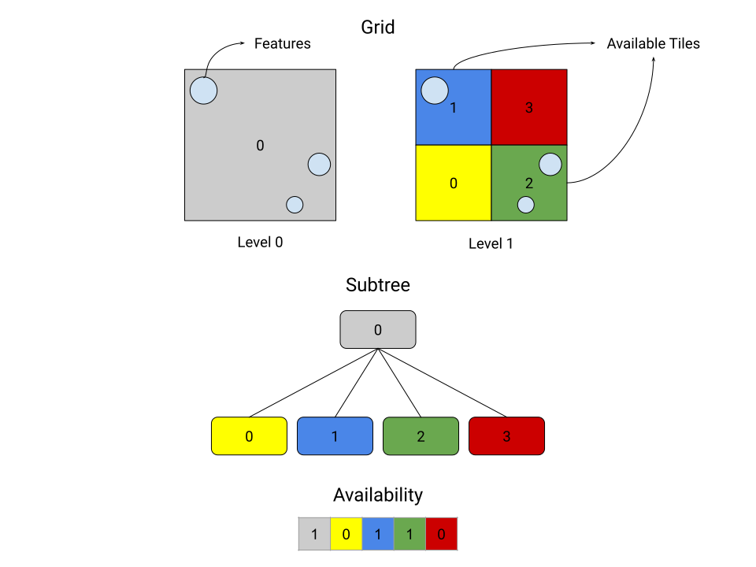

# 3DTILES_implicit_tiling Extension

## Contributors

## Contents

## Overview

This extension enables 3D Tiles to support streaming tilesets with implied subdivision. When subdivision is implied, it enables simplification at every stage of the tileset's lifetime: querying tree structure from the server, data storage on the client, as well as simplification and optimization of algorithms involved with the structure of the tree such as traversal, visibility, arbitrary selection of tiles in a region, ray casting, analysis, etc. 

## Indexing Scheme

Grid's are indexed from the bottom left, with

## Tree Location

A tile's location in the tree can be defined in terms of the level at which it resides as well as the location within that level. Every level of the three can be through of as a fixed grid of equally sized tiles, where the level occupies the same space as the previous level but with double the amount of tiles along each axis that gets split.

## Root Grid

Each tileset specifies a root grid with dimensions and the locations of all available subtrees.

## Subtree

### Level

Every level of a subtree represents a fixed grid of equally sized tiles, where the level occupies the same physical space as the previous level, but with double the amount of tiles along each split axis.

### Grid Indexing Scheme

The x-coordinates are indexed from left to right, from 0 to n - 1, where n is the number of tiles along the x-direction for that level. The y-coordinates are indexed from back to front, from 0 to n - 1, where n is the number of tiles along the y-direction for that level. The z-coordinates are indexed from bottom to up, from 0 to n - 1, where n is the number of tiles along the z-direction for that level.

> Should we use the right-handed coordinate system with Y-up (as defined by glTF)?

### Tile Location

A tile's location in the subtree can be defined by the level at which in resides and its position in the grid at that level, as defined by the grid indexing scheme.

### Tree Indexing Scheme

The tiles in the subtree are indexed through breadth-first traversal of the subtree.

### Availability

Each subtree defines an index of availability for each level - stored as binary files. If a tile is available, it is set to `1`. If a tile is not available, it is set to `0`.

