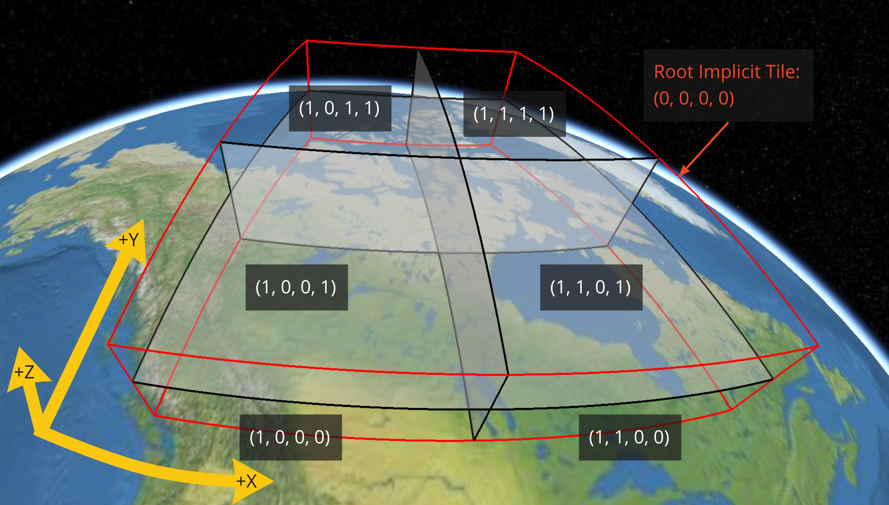
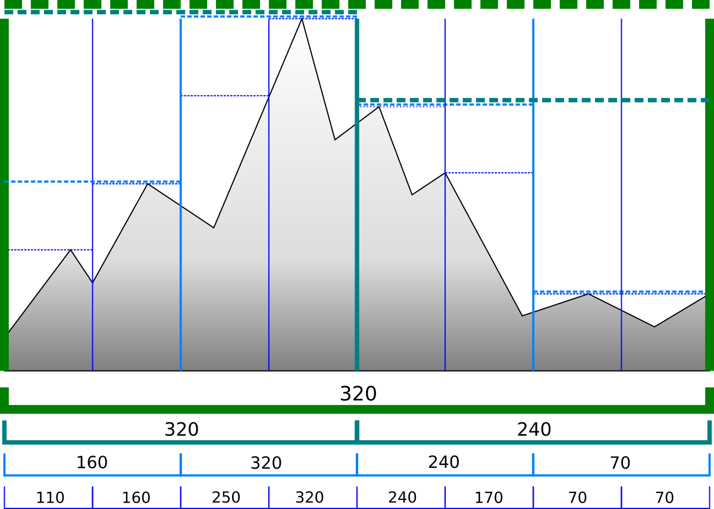

<!-- omit in toc -->
# 3DTILES_implicit_tiling

<!-- omit in toc -->
## Contributors

* Peter Gagliardi, Cesium
* Sam Suhag, Cesium
* Sean Lilley, Cesium
* Ian Lilley, Cesium
* Marco Hutter, Cesium
* Don McCurdy, Independent
* Erixen Cruz, Cesium
* Josh Lawrence, Cesium
* Shehzan Mohammed, Cesium
* Patrick Cozzi, Cesium

<!-- omit in toc -->
## Status

Draft

<!-- omit in toc -->
## Dependencies

Written against the 3D Tiles 1.0 specification.

<!-- omit in toc -->
## Optional vs. Required

This extension is required, meaning it must be placed in both the `extensionsUsed` and `extensionsRequired` lists in the tileset JSON.

<!-- omit in toc -->
## Contents

- [Overview](#overview)
- [Tile Extension](#tile-extension)
- [Subdivision Scheme](#subdivision-scheme)
- [Tile Coordinates](#tile-coordinates)
- [Template URIs](#template-uris)
- [Subtrees](#subtrees)
  - [Availability](#availability)
    - [Tile Availability](#tile-availability)
    - [Content Availability](#content-availability)
    - [Child Subtree Availability](#child-subtree-availability)
  - [Metadata](#metadata)
    - [Tile Metadata](#tile-metadata)
    - [Content Metadata](#content-metadata)
    - [Subtree Metadata](#subtree-metadata)
- [Subtree JSON Format](#subtree-json-format)
- [Subtree Binary Format](#subtree-binary-format)
- [Appendix A: Availability Indexing](#appendix-a-availability-indexing)

## Overview

This extension defines a concise representation of quadtrees and octrees in 3D Tiles. This regular pattern allows for random access of tiles based on their tile coordinates which enables accelerated spatial queries, new traversal algorithms, and efficient updates of tile content, among other use cases.

Implicit tiling also allows for better interoperability with existing GIS data formats with implicitly defined tiling schemes. Some examples are [TMS](https://wiki.osgeo.org/wiki/Tile_Map_Service_Specification), [WMTS](https://www.ogc.org/standards/wmts), [S2](http://s2geometry.io/), and [CDB](https://docs.opengeospatial.org/is/15-113r5/15-113r5.html).

In order to support sparse datasets, **availability** data determines which tiles exist. To support massive datasets, availability is partitioned into fixed-size **subtrees**. Subtrees may store **metadata** for available tiles and contents.

The `3DTILES_implicit_tiling` extension may be added to any tile in the tileset. The extension object defines how the tile is subdivided and where to locate content resources. The extension may be added to multiple tiles to create more complex subdivision schemes.


_A point cloud organized into a sparse octree. Data source: Trimble_

## Tile Extension

The `3DTILES_implicit_tiling` extension may be defined on any tile in the tileset JSON. Such a tile is called an **implicit root tile**, to distinguish it from the root tile of the tileset JSON.

```json
{
  "root": {
    "boundingVolume": {
      "region": [-1.318, 0.697, -1.319, 0.698, 0, 20]
    },
    "refine": "REPLACE",
    "geometricError": 5000,
    "content": {
      "uri": "content/{level}/{x}/{y}.b3dm"
    },
    "extensions": {
      "3DTILES_implicit_tiling": {
        "subdivisionScheme": "QUADTREE",
        "availableLevels": 21,
        "subtreeLevels": 7,
        "subtrees": {
          "uri": "subtrees/{level}/{x}/{y}.json"
        },
      }
    }
  }
}
```

The following properties about the implicit root tile are included in the extension object:

| Property | Description |
| ------ | ----------- |
| `subdivisionScheme` | Either `QUADTREE` or `OCTREE`. See [Subdivision scheme](#subdivision-scheme). |
| `availableLevels` | How many levels there are in the tree. |
| `subtreeLevels` | How many levels there are in each subtree. |
| `subtrees` | Template URI for subtree files. See [Subtrees](#subtrees). |

[Template URIs](#template-uris) are used for locating subtree files as well as tile contents. For content, the template URI is specified in the tile's `content.uri` property.

The following constraints apply to implicit root tiles:
  
  * The tile must omit the `children` property
  * The tile must not have the `3DTILES_metadata` extension
  * The `content.uri` must not point to an [external tileset](../../specification#external-tilesets)
  * The `content` must not have an associated `boundingVolume` property

## Subdivision Scheme

A **subdivision scheme** is a recursive pattern for dividing a bounding volume of a tile into smaller children tiles that take up the same space.

A **quadtree** divides space only on the `x` and `y` dimensions. It divides each tile into 4 smaller tiles where the `x` and `y` dimensions are halved. The quadtree `z` minimum and maximum remain unchanged. The resulting tree has 4 children per tile.


An **octree** divides space along all 3 dimensions. It divides each tile into 8 smaller tiles where each dimension is halved. The resulting tree has 8 children per tile.


For a `region` bounding volume, `x`, `y`, and `z` refer to `longitude`, `latitude`, and `height` respectively.

Sphere bounding volumes are disallowed, as these cannot be divided into a quadtree or octree.

The following diagrams illustrate the subdivision in the bounding volume types supported by 3D Tiles:

| Root Box | Quadtree | Octree |
|:---:|:--:|:--:|
|  |  |   |

| Root Region | Quadtree | Octree |
|:---:|:--:|:--:|
|  |  |   |

<!-- omit in toc -->
### Subdivision Rules

Implicit tiling only requires defining the subdivision scheme, refinement strategy, bounding volume, and geometric error at the implicit root tile. For descendant tiles, these properties are computed automatically, based on the following rules:

| Property | Subdivision Rule | 
| --- | --- |
| `subdivisionScheme` | Constant for all descendant tiles |
| `refine` | Constant for all descendant tiles |
| `boundingVolume` | Divided into four or eight parts depending on the `subdivisionScheme` |
| `geometricError` | Each child's `geometricError` is half of its parent's `geometricError` |

> **Implementation note:**
> 
> In order to maintain numerical stability during this subdivision process, the actual bounding volumes should not be computed progressively by subdividing a non-root tile volume. Instead, the exact bounding volumes should be computed directly for a given level.
> 
> Let the extent of the root bounding volume along one dimension *d* be *(min<sub>d</sub>, max<sub>d</sub>)*. The number of bounding volumes along that dimension for a given level  is *2<sup>level</sup>*. The size of each bounding volume at this level, along dimension *d*, is *size<sub>d</sub> = (max<sub>d</sub> - min<sub>d</sub>) / 2<sup>level</sup>*. The extent of the bounding volume of a child can then be computed directly as *(min<sub>d</sub> + size<sub>d</sub> * i, min<sub>d</sub> + size<sub>d</sub> * (i + 1))*, where *i* is the index of the child in dimension *d*. 

The computed tile `boundingVolume` and `geometricError` can be overridden with [tile metadata](#tile-metadata), if desired. Content bounding volumes are not computed automatically but they may be provided by [content metadata](#content-metadata). Tile and content bounding volumes must maintain [spatial coherence](../../specification/#bounding-volume-spatial-coherence).

## Tile Coordinates

**Tile coordinates** are a tuple of integers that uniquely identify a tile. Tile coordinates are either `(level, x, y)` for quadtrees or `(level, x, y, z)` for octrees. All tile coordinates are 0-indexed.

`level` is 0 for the implicit root tile. This tile's children are at level 1, and so on.

`x`, `y`, and `z` coordinates define the location of the tile within the level.

For `box` bounding volumes:

| Coordinate | Positive Direction |
| --- | --- |
| `x` | Along the `+x` axis of the bounding box |
| `y` | Along the `+y` axis of the bounding box |
| `z` | Along the `+z` axis of the bounding box |


For `region` bounding volumes:

| Coordinate | Positive Direction |
|---|---|
| `x` | From west to east (increasing longitude) |
| `y` | From south to north (increasing latitude) |
| `z` | From bottom to top (increasing height) |



## Template URIs

A **Template URI** is a URI pattern used to refer to tiles by their tile coordinates.

Template URIs must include the variables `{level}`, `{x}`, `{y}`. Template URIs for octrees must also include `{z}`. When referring to a specific tile, the tile's coordinates are substituted for these variables.

Template URIs, when given as relative paths, are resolved relative to the tileset JSON file.


## Subtrees

In order to support sparse datasets, additional information is needed to indicate which tiles or contents exist. This is called **availability**.

**Subtrees** are fixed size sections of the tileset tree used for storing availability. The tileset is partitioned into subtrees to bound the size of each availability buffer for optimal network transfer and caching. The `subtreeLevels` property defines the number of levels in each subtree. The subdivision scheme determines the number of children per tile.


After partitioning a tileset into subtrees, the result is a tree of subtrees.


### Availability

Each subtree contains tile availability, content availability, and child subtree availability.

* **Tile availability** indicates which tiles exist within the subtree
* **Content availability** indicates which tiles have associated content resources
* **Child subtree availability** indicates what subtrees are reachable from this subtree

Each type of availability is represented as a separate bitstream. Each bitstream is a 1D array where each element represents a node in the quadtree or octree. A 1 bit indicates that the element is available, while a 0 bit indicates that the element is unavailable. Alternatively, if all the bits in a bitstream are the same, a single constant value can be used instead.

To form the 1D bitstream, the tiles are ordered with the following rules:

* Within each level of the subtree, the tiles are ordered using the [Morton Z-order curve](https://en.wikipedia.org/wiki/Z-order_curve)
* The bits for each level are concatenated into a single bitstream


In the diagram above, colored cells represent 1 bits, grey cells represent 0 bits.

Storing tiles in Morton order provides these benefits:

- Efficient indexing - The Morton index for a tile is computed in constant time by interleaving bits.
- Efficient traversal - The Morton index for a parent or child tile are computed in constant time by removing or adding bits, respectively.
- Locality of reference - Consecutive tiles are near to each other in 3D space.
- Better Compression - Locality of reference leads to better compression of availability bitstreams.

For more detailed information about working with Morton indices and availability bitstreams, see [Appendix A: Availability Indexing](#appendix-a-availability-indexing).

#### Tile Availability

Tile availability determines which tiles exist in a subtree.

Tile availability has the following restrictions:

* If a non-root tile's availability is 1, its parent tile's availability must also be 1. 
* A subtree must have at least one available tile. 


#### Content Availability

Content availability determines which tiles have a content resource. The content resource is located using the `content.uri` template URI. If there are no tiles with a content resource, `tile.content` must be omitted.

Content availability has the following restrictions:

* If content availability is 1 its corresponding tile availability must also be 1. Otherwise, it would be possible to specify content files that are not reachable by the tiles of the tileset. 
* If content availability is 0 and its corresponding tile availability is 1 then the tile is considered to be an empty tile.


#### Child Subtree Availability

Child subtree availability determines which subtrees are reachable from the deepest level of this subtree. This links subtrees together to form a tree.

Unlike tile and content availability, which store bits for every level in the subtree, child subtree availability stores bits for nodes one level deeper than the deepest level of the subtree, and represent the root nodes of child subtrees. This is used to determine which other subtrees are reachable before requesting tiles. If availability is 0 for all child subtrees, then the tileset does not subdivide further.


### Metadata

Subtrees may store metadata at multiple granularities.

* **Tile metadata** - metadata for available tiles in the subtree
* **Content metadata** - metadata for available content in the subtree
* **Subtree metadata** - metadata about the subtree as a whole

#### Tile Metadata

When tiles are listed explicitly within a tileset, each tile's metadata is also embedded explicitly within the tile definition. When the tile hierarchy is _implicit_, as enabled by `3DTILES_implicit_tiling`, tiles are not listed exhaustively and metadata cannot be directly embedded in tile definitions. To support metadata for tiles within implicit tiling schemes, property values for all available tiles in a subtree are encoded in a compact [*Binary Table Format*](../../specification/Metadata/README.md#binary-table-format) defined by the 3D Metadata Specification. The binary representation is particularly efficient for larger datasets with many tiles.

Tile metadata exists only for available tiles and is tightly packed by an increasing tile index according to the [Availability Ordering](#availability). Each available tile must have a value — representation of missing values within a tile is possible only with the `noData` indicator defined by the *Binary Table Format*.

> **Implementation note:** To determine the index into a property value array for a particular tile, count the number of available tiles occurring before that index, according to the tile Availability Ordering. If `i` available tiles occur before a particular tile, that tile's property values are stored at index `i` of each property value array. These indices may be precomputed for all available tiles, as a single pass over the subtree availability buffer.

Tile properties can have [Semantics](../../specification/Metadata/Semantics) which define how property values should be interpreted. In particular, `TILE_BOUNDING_BOX`, `TILE_BOUNDING_REGION`, `TILE_BOUNDING_SPHERE`, `TILE_MINIMUM_HEIGHT`, and `TILE_MAXIMUM_HEIGHT` semantics each define a more specific bounding volume for a tile than is implicitly calculated from `3DTILES_implicit_tiling`. If more than one of these semantics are available for a tile, clients may select the most appropriate option based on use case and performance requirements.

> **Example:** The following diagram shows how tile height semantics may be used to define tighter bounding regions for an implicit tileset: The overall height of the bounding region of the whole tileset is 320. The bounding regions for the child tiles will be computed by splitting the bounding regions of the respective parent tile at its center. By default, the height will remain constant. By storing the _actual_ height of the contents in the respective region, and providing it as the `TILE_MAXIMUM_HEIGHT` for each available tile, it is possible to define the tightest-fitting bounding region for each level.
>
>


The `TILE_GEOMETRIC_ERROR` semantic allows tiles to provide a geometric error that overrides the implicitly computed geometric error.

#### Content Metadata

Subtrees may also store metadata for tile content. Content metadata exists only for available content and is tightly packed by increasing tile index. Binary property values are encoded in a compact [*Binary Table Format*](../../specification/Metadata/README.md#binary-table-format) defined by the 3D Metadata Specification and are stored in a property table. If the implicit root tile has multiple contents — as supported by `3DTILES_multiple_contents` — content metadata is stored in multiple property tables.

Content bounding volumes are not computed automatically by `3DTILES_implicit_tiling` but may be provided by properties with semantics `CONTENT_BOUNDING_BOX`, `CONTENT_BOUNDING_REGION`, `CONTENT_BOUNDING_SPHERE`, `CONTENT_MINIMUM_HEIGHT`, and `CONTENT_MAXIMUM_HEIGHT`.

If the tile content is assigned a [`group`](../3DTILES_metadata#content-group-properties) — such as with the `3DTILES_metadata` extension — all contents in the implicit tree are assigned to that group.

#### Subtree Metadata

Properties assigned to subtrees provide metadata about the subtree as a whole. Subtree metadata is encoded in JSON according to the [JSON Format](../../specification/Metadata/README.md#json-format) specification.

## Subtree JSON Format

_Defined in [subtree.schema.json](schema/subtree/subtree.schema.json)._

A **subtree file** is a JSON file that contains availability and metadata information for a single subtree. A subtree may reference external files containing binary data. An alternative [Binary Format](#subtree-binary-format) allows the JSON and binary data to be embedded into a single binary file.

<!-- omit in toc -->
#### Buffers and Buffer Views

A **buffer** is a binary blob. Each buffer has a `uri` that refers to an external file containing buffer data and a `byteLength` describing the buffer size in bytes. Relative paths are relative to the subtree file. Data URIs are not allowed.

In the [Binary Format](#subtree-binary-format) the first buffer may instead refer to the binary chunk of the subtree file, in which case the `uri` property must be undefined. This buffer is referred to as the _internal buffer_.

A **buffer view** is a contiguous subset of a buffer. A buffer view's `buffer` property is an integer index to identify the buffer. A buffer view has a `byteOffset` and a `byteLength` to describe the range of bytes within the buffer. The `byteLength` does not include any padding. There may be multiple buffer views referencing a single buffer.

For efficient memory access, the `byteOffset` of a buffer view must be aligned to a multiple of 8 bytes.

<!-- omit in toc -->
### Availability

Tile availability (`tileAvailability`) and child subtree availability (`childSubtreeAvailability`) must always be provided for a subtree. 

Content availability (`contentAvailability`) is an array of content availability objects. If the implicit root tile has a single content this array will have one element; if the tile has multiple contents - as supported by `3DTILES_multiple_contents` - this array will have multiple elements. If the implicit root tile does not have content then `contentAvailability` must be omitted.

Availability may be represented either as a bitstream or a constant value. `bitstream` is an integer index that identifies the buffer view containing the availability bistream. `constant` is an integer indicating whether all of the elements are available (`1`) or all are unavailable (`0`). `availableCount` is an integer indicating how many `1` bits exist in the availability bitstream.

Availability bitstreams are packed in binary using the format described in the [Booleans](../../specification/Metadata#booleans) section of the 3D Metadata Specification.

> **Example:** The JSON description of a subtree where each tile is available, but not all tiles have content, and not all child subtrees are available:
> 
> ```json
> {
>   "buffers": [
>     {
>       "name": "Internal Buffer",
>       "byteLength": 16
>     },
>     {
>       "name": "External Buffer",
>       "uri": "external.bin",
>       "byteLength": 32
>     }
>   ],
>   "bufferViews": [
>     {
>       "buffer": 0,
>       "byteOffset": 0,
>       "byteLength": 11
>     },
>     {
>       "buffer": 1,
>       "byteOffset": 0,
>       "byteLength": 32
>     }
>   ],
>   "tileAvailability": {
>     "constant": 1,
>   },
>   "contentAvailability": [{
>     "bitstream": 0,
>     "availableCount": 60
>   }],
>   "childSubtreeAvailability": {
>     "bitstream": 1
>   }
> }
> ```
>
> The tile availability can be encoded by setting `tileAvailability.constant` to `1`, without needing an explicit bitstream, because all tiles in the subtree are available.
> 
> Only some tiles have content, and `contentAvailability.bufferView` indicates where the bitstream for the content availability is stored: The `bufferView` with index 0 refers to the `buffer` with index 0. This buffer does not have a `uri` property, and therefore refers to the _internal_ buffer that is stored directly in the binary chunk of the subtree binary file. The `byteOffset` and `byteLength` indicate that the content availability bitstream is stored in the bytes `[0...11)` of the internal buffer.
>
> Some child subtrees exist, so `childSubtreeAvailability.bufferView` refers to another bitstream. The `bufferView` with index 1 refers to the buffer with index `1`. This buffer has a `uri` property, indicating that this second bitstream is stored in an external binary file.

<!-- omit in toc -->
### Metadata

Subtrees may store metadata at multiple granularities. `tileMetadata` is a property table containing metadata for available tiles. `contentMetadata` is an array of property tables containing metadata for available content. If the implicit root tile has a single content this array will have one element; if the tile has multiple contents - as supported by `3DTILES_multiple_contents` - this array will have multiple elements. If the implicit root tile does not have content then `contentMetadata` must be omitted.

Subtree metadata (`subtreeMetadata`) is encoded in JSON according to the [JSON Format](../../specification/Metadata/README.md#json-format) specification.

<!-- omit in toc -->
#### Property Tables

Binary property values are stored in a **property table**. A property table must specify its class (`class`), which refers to a class ID in the `3DTILES_metadata` extension of root tileset JSON, and a dictionary of properties (`properties`), where each key is a property ID correspond to a class property and each value is the index of the buffer view containing property values. The property table may provide value arrays for only a subset of the properties of its class, but class properties marked `required: true` must not be omitted.

A property may override the [`minimum` and `maximum` values](../../specification/Metadata#minimum-and-maximum-values) and the [`offset` and `scale`](../../specification/Metadata#offset-and-scale) from the property definition in the class, to account for the actual range of values that is stored in the property table.

Array offsets (`arrayOffsets`) is required for variable-length arrays and string offsets (`stringOffsets`) is required for strings. For variable-length arrays of strings, both are required. `arrayOffsetType` describes the storage type for array offsets and `stringOffsetType` describes the storage type for string offsets. Allowed types are `UINT8`, `UINT16`, `UINT32`, and `UINT64`. The default is `UINT32`.

Details of binary value encoding, including how to determine property value offsets for mixed-length string and array values, are defined by the [*Binary Table Format*](../../specification/Metadata/README.md#binary-table-format).

> **Example:** The same JSON description of a subtree extended with tile, content, and subtree metadata. The subtree JSON refers to class IDs in the `3DTILES_metadata` schema definition. Tile and content metadata is stored in property tables; subtree metadata is encoded directly in JSON.
>
> _`3DTILES_metadata` extension in the root tileset JSON_
> ```json
> {
>   "schema": {
>     "classes": {
>       "tile": {
>         "properties": {
>           "horizonOcclusionPoint": {
>             "semantic": "TILE_HORIZON_OCCLUSION_POINT",
>             "type": "VEC3",
>             "componentType": "FLOAT64",
>           },
>           "countries": {
>             "description": "Countries a tile intersects",
>             "type": "STRING",
>             "array": true
>           }
>         }
>       },
>       "content": {
>         "properties": {
>           "attributionIds": {
>             "semantic": "ATTRIBUTION_IDS",
>             "type": "SCALAR",
>             "componentType": "UINT16",
>             "array": true
>           },
>           "minimumHeight": {
>             "semantic": "CONTENT_MINIMUM_HEIGHT",
>             "type": "SCALAR",
>             "componentType": "FLOAT64"
>           },
>           "maximumHeight": {
>             "semantic": "CONTENT_MAXIMUM_HEIGHT",
>             "type": "SCALAR",
>             "componentType": "FLOAT64"
>           },
>           "triangleCount": {
>             "type": "SCALAR",
>             "componentType": "UINT32"
>           }
>         }
>       },
>       "subtree": {
>         "properties": {
>           "attributionStrings": {
>             "semantic": "ATTRIBUTION_STRINGS",
>             "type": "STRING",
>             "array": true
>           }
>         }
>       }
>     }
>   }
> }
> ```
>
> _Subtree JSON_
> ```json
> {
>   "buffers": [
>     {
>       "name": "Availability Buffer",
>       "uri": "availability.bin",
>       "byteLength": 48
>     },
>     {
>       "name": "Metadata Buffer",
>       "uri": "metadata.bin",
>       "byteLength": 6512
>     }
>   ],
>   "bufferViews": [
>     { "buffer": 0, "byteOffset": 0, "byteLength": 11 },
>     { "buffer": 0, "byteOffset": 16, "byteLength": 32 },
>     { "buffer": 1, "byteOffset": 0, "byteLength": 2040 },
>     { "buffer": 1, "byteOffset": 2040, "byteLength": 1530 },
>     { "buffer": 1, "byteOffset": 3576, "byteLength": 344 },
>     { "buffer": 1, "byteOffset": 3920, "byteLength": 1024 },
>     { "buffer": 1, "byteOffset": 4944, "byteLength": 240 },
>     { "buffer": 1, "byteOffset": 5184, "byteLength": 122 },
>     { "buffer": 1, "byteOffset": 5312, "byteLength": 480 },
>     { "buffer": 1, "byteOffset": 5792, "byteLength": 480 },
>     { "buffer": 1, "byteOffset": 6272, "byteLength": 240 }
> 
>   ],
>   "tileAvailability": {
>     "constant": 1
>   },
>   "contentAvailability": [{
>     "bitstream": 0,
>     "availableCount": 60
>   }],
>   "childSubtreeAvailability": {
>     "bitstream": 1
>   },
>   "tileMetadata": {
>     "class": "tile",
>     "properties": {
>       "horizonOcclusionPoint": {
>         "values": 2
>       },
>       "countries": {
>         "values": 3,
>         "arrayOffsets": 4,
>         "stringOffsets": 5,
>         "arrayOffsetType": "UINT32",
>         "stringOffsetType": "UINT32"
>       }
>     }
>   },
>   "contentMetadata": [
>     {
>       "class": "content",
>       "properties": {
>         "attributionIds": {
>           "values": 6,
>           "arrayOffsets": 7,
>           "arrayOffsetType": "UINT16"
>         },
>         "minimumHeight": {
>           "values": 8
>         },
>         "maximumHeight": {
>           "values": 9
>         },
>         "triangleCount": {
>           "values": 10,
>           "min": 520,
>           "max": 31902
>         }
>       }
>     }
>   ],
>   "subtreeMetadata": {
>     "class": "subtree",
>     "properties": {
>       "attributionStrings": [
>         "Source A",
>         "Source B",
>         "Source C",
>         "Source D"
>       ]
>     }
>   }
> }
> ```

<!-- omit in toc -->
### Multiple Contents

When using the `3DTILES_multiple_contents` extension `contentAvailability` and `contentMetadata` are provided for each content layer.

> **Example:** JSON description of a subtree extended with multiple contents. In this example all tiles are available, all building contents are available, and only some tree contents are available. 
> 
> _Implicit root tile_
> 
> ```json
> {
>   "root": {
>     "boundingVolume": {
>       "region": [-1.318, 0.697, -1.319, 0.698, 0, 20]
>     },
>     "refine": "ADD",
>     "geometricError": 5000,
>     "extensions": {
>       "3DTILES_multiple_contents": {
>         "content": [
>           {
>             "uri": "buildings/{level}/{x}/{y}.b3dm",
>           },
>           {
>             "uri": "trees/{level}/{x}/{y}.i3dm",
>           }
>         ]    
>       },
>       "3DTILES_implicit_tiling": {
>         "subdivisionScheme": "QUADTREE",
>         "availableLevels": 21,
>         "subtreeLevels": 7,
>         "subtrees": {
>           "uri": "subtrees/{level}/{x}/{y}.json"
>         },
>       }
>     }
>   }
> }
> ```
> 
> _Subtree JSON_
> ```json
> {
>   "tileAvailability": {
>     "constant": 1
>   },
>   "contentAvailability": [
>     {
>       "constant": 1
>     },
>     {
>       "bitstream": 0,
>       "availableCount": 52
>     }
>   ],
>   "childSubtreeAvailability": {
>     "constant": 1
>   },
>   "contentMetadata": [
>     {
>       "class": "building",
>       "properties": {
>         "height": {
>           "values": 1,
>         },
>         "owners": {
>           "values": 2,
>           "arrayOffsets": 3,
>           "stringOffsets": 4
>         }
>       }
>     },
>     {
>       "class": "tree",
>       "properties": {
>         "height": {
>           "values": 5,
>         },
>         "species": {
>           "values": 6
>         }
>       }
>     }
>   ]
> }
> ```

## Subtree Binary Format

The subtree binary format is an alternative to the JSON file format that allows the JSON and binary data to be embedded into a single binary file.

The binary subtree format is little-endian and consists of a 24-byte header and a variable length payload:


Header fields:

| Bytes | Field | Type     | Description |
|-------|-------|----------|-------------|
| 0-3   | Magic | `UINT32` | A magic number identifying this as a subtree file. This is always `0x74627573`, the four bytes of the ASCII string `subt` stored in little-endian order. |
| 4-7   | Version | `UINT32` | The version number. Always `1` for this version of the specification. |
| 8-15  | JSON byte length | `UINT64` | The length of the subtree JSON, including any padding. |
| 16-23 | Binary byte length | `UINT64` | The length of the buffer (or 0 if the buffer does not exist) including any padding. |

Each chunk must be padded so it ends on an 8-byte boundary:

* The JSON chunk must be padded with trailing `Space` chars (`0x20`)
* If it exists, the binary chunk must be padded with trailing zeros (`0x00`)

## Appendix A: Availability Indexing

<!-- omit in toc -->
### Converting from Tile Coordinates to Morton Index

A [Morton index](https://en.wikipedia.org/wiki/Z-order_curve) is computed by interleaving the bits of the `(x, y)` or `(x, y, z)` coordinates of a tile. Specifically:

```
quadtreeMortonIndex = interleaveBits(x, y)
octreeMortonIndex = interleaveBits(x, y, z)
```

For example:

```
// Quadtree
interleaveBits(0b11, 0b00) = 0b0101
interleaveBits(0b1010, 0b0011) = 0b01001110
interleaveBits(0b0110, 0b0101) = 0b00110110

// Octree
interleaveBits(0b001, 0b010, 0b100) = 0b100010001
interleaveBits(0b111, 0b000, 0b111) = 0b101101101
```


<!-- omit in toc -->
### Availability Bitstream Lengths

| Availability Type | Length (bits) | Description |
|-------------------|---------------|-------------|
| Tile availability | `(N^subtreeLevels - 1)/(N - 1)` | Total number of nodes in the subtree |
| Content availability | `(N^subtreeLevels - 1)/(N - 1)` | Since there is at most one content per tile, this is the same length as tile availability |
| Child subtree availability | `N^subtreeLevels` | Number of nodes one level deeper than the deepest level of the subtree |

Where `N` is 4 for quadtrees and 8 for octrees.

These lengths are in number of bits in a bitstream. To compute the length of the bitstream in bytes, the following formula is used:

```
lengthBytes = ceil(lengthBits / 8)
```

<!-- omit in toc -->
### Accessing Availability Bits

For tile availability and content availability, the Morton index only determines the ordering within a single level of the subtree. Since the availability bitstream stores bits for every level of the subtree, a level offset must be computed.

Given the `(level, mortonIndex)` of a tile relative to the subtree root, the index of the corresponding bit can be computed with the following formulas:

| Quantity | Formula | Description |
| -------- | ------- | ----------- |
| `levelOffset` | `(N^level - 1) / (N - 1)` | This is the number of nodes at levels `1, 2, ... (level - 1)` |
| `tileAvailabilityIndex` | `levelOffset + mortonIndex` | The index into the buffer view is the offset for the tile's level plus the morton index for the tile |

Where `N` is 4 for quadtrees and 8 for octrees.

Since child subtree availability stores bits for a single level, no levelOffset is needed, i.e. `childSubtreeAvailabilityIndex = mortonIndex`, where the `mortonIndex` is the Morton
index of the desired child subtree relative to the root of the current subtree.

<!-- omit in toc -->
### Global and Local Tile Coordinates

When working with tile coordinates, it is important to consider which tile the coordinates are relative to. There are two main types used in implicit tiling:

* **global coordinates** - coordinates relative to the implicit root tile.
* **local coordinates** - coordinates relative to the root of a specific subtree.

Global coordinates are used for locating any tile in the entire implicit tileset. For example, template URIs use global coordinates to locate content files and subtrees. Meanwhile, local coordinates are used for locating data within a single subtree file.

In binary, a tile's global Morton index is the complete path from the implicit root tile to the tile. This is the concatenation of the path from the implicit root tile to the subtree root tile, followed by the path from the subtree root tile to the tile. This can be expressed with the following equation:

```
tile.globalMortonIndex = concatBits(subtreeRoot.globalMortonIndex, tile.localMortonIndex)
```


Similarly, the global level of a tile is the length of the path from the implicit root tile to the tile. This is the sum of the subtree root tile's global level and the tile's local level relative to the subtree root tile:

```
tile.globalLevel = subtreeRoot.globalLevel + tile.localLevel
```


`(x, y, z)` coordinates follow the same pattern as Morton indices. The only difference is that the concatenation of bits happens component-wise. That is:

```
tile.globalX = concatBits(subtreeRoot.globalX, tile.localX)
tile.globalY = concatBits(subtreeRoot.globalY, tile.localY)

// Octrees only
tile.globalZ = concatBits(subtreeRoot.globalZ, tile.localZ)
```


<!-- omit in toc -->
### Finding Parent and Child Tiles

The coordinates of a parent or child tile can also be computed with bitwise operations on the Morton index. The following formulas apply for both local and global coordinates.

```
childTile.level = parentTile.level + 1
childTile.mortonIndex = concatBits(parentTile.mortonIndex, childIndex)
childTile.x = concatBits(parentTile.x, childX)
childTile.y = concatBits(parentTile.y, childY)

// Octrees only
childTile.z = concatBits(parentTile.z, childZ)
```

Where:
* `childIndex` is an integer in the range `[0, N)` that is the index of the child tile relative to the parent.
* `childX`, `childY`, and `childZ` are single bits that represent which half of the parent's bounding volume the child is in in each direction.


