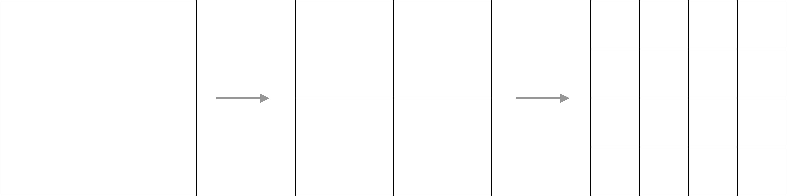
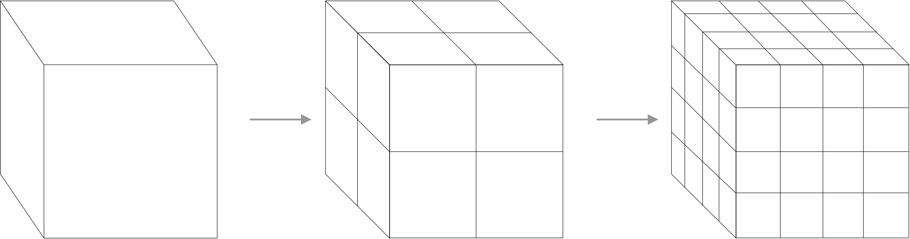

# 3DTILES_implicit_tiling Extension

## Contributors

- Sam Suhag, Cesium
- Sean Lilley, Cesium
- Josh Lawrence, Cesium
- Patrick Cozzi, Cesium

## Contents

* [Overview](#overview)
* [Concepts](#concepts)
    * [Tiling Scheme](#tiling-scheme)
    * [Root Tiles](#root-tiles)
    * [Levels](#levels)
    * [Tile Location](#tile-location)
    * [Tile States](#tile-states)
        * [Subdivision](#subdivision)
        * [Content](#content)
        * [Metadata](#metadata)
    * [Bitstream Layout](#bitstream-layout)
* [Properties Reference](#properties-reference)
* [Appendix](#appendix)
    * [Algorithms](#algorithms)
        * [Jump Buffer Construction](#jump-buffer-construction)
        * [Tile Index Lookup](#tile-index)
    * [Samples](#samples)

## Overview

This extension enables 3D Tiles to support tilesets with implied subdivision schemes. This improves interoperability with existing geospatial data formats that use implicit tiling schemes, such as [CDB](https://www.ogc.org/standards/cdb) and [WMTS](https://www.ogc.org/standards/wmts). When subdivision is implied, it enables simplification at every stage of the tileset's lifetime: querying tree structure from the server, data storage on the client, as well as simplification and optimization of algorithms involved with the structure of the tree such as traversal, visibility, arbitrary selection of tiles in a region, ray casting, analysis, etc.

## Concepts

### Tiling Scheme

Tiling schemes specify how each tile in a level will subdivide in the next level. The tiling scheme remains consistent in a tileset, however, tiling schemes can be combined by using external tilesets.

#### Quadtree



When a tile subdivides into a [quadtree](https://en.wikipedia.org/wiki/Quadtree), it produces 4 children tile that occupy the same area as the parent tile. The tile is split on the XY plane at the midpoint of the bounds along the X and Y axes.

#### Octree



When a tile subdivides into an [octree](https://en.wikipedia.org/wiki/Octree), it produces 8 equally size children tiles that occupy the same volume as the parent tile. The tile is split at the midpoint of the bounds along X, Y and Z axes.

### Root Tiles

Multiple tilesets using this extension can be combined by using parent tileset referring to one or more external tilesets using `3DTILES_implicit_tiling` as the children of the root tile. Such a configuration can be used to represent structures like double-headed quadtrees in formats such as [TMS](https://wiki.osgeo.org/wiki/Tile_Map_Service_Specification) and [quantized-mesh](https://github.com/CesiumGS/quantized-mesh) and six-headed quadtrees in tiling schemes such as [S2geometry](https://s2geometry.io/).

### Levels


Every level of the tree can be thought of as a fixed grid of tiles of equal size, where the level occupies the same space as the previous level but with double the amount of tiles along each axis that gets split (2 in case of [quadtree](https://en.wikipedia.org/wiki/Quadtree) and 3 in case of [octree](https://en.wikipedia.org/wiki/Octree)).

### Tile Location

#### Location in space


Level grids are indexed from the bottom left, using a right handed coordinate system, with +Z pointing in the up direction.

Tiles in a level are indexed by applying the [Morton/Z-order](https://en.wikipedia.org/wiki/Z-order_curve) curve to the grid at that level. Using the Morton order serves three primary purposes:

- Increasing spatial locality of reference: Tiles that are close to each in other in space will be located close to each other on the file system.
- Efficient tile location decomposition: The Morton order allows efficient encoding and decoding of locations of a tile in the level grid to its location in the availability bitstream
- Efficient traversal: The binary representation of tile locations in the grid allow for easy traversal of the tileset.

#### Location on disk

Tiles are located in the file system according to their position in the tileset hierarchy in the following order: `Level/X/Y/Z`. In the case of a quadtree, the `Z` index can be ommitted.

### Tile States

Information about the state of each tile in the tileset is present in 2 categories. The first category is related to **structure** of the spatial hierarchy of the tileset, and if/how a tile subdivides into external tilesets. The second category is related to **availability**, of content and metadata, for each tile.

State information for the tileset is stored in the following bitstreams:


| Bitstream | Description       | Size (bits) |
|------|-------------------|---|
|  subdivision  | Encodes subdivision of each tile | 2 |
|  content  | Encodes availability of content for tile | 1 |
|  metadata  | Encodes availability of metadata for tile | 1 |

#### Subdivision

The subdivision state for each tile determines if and how it subdivides into children tiles, as per the `tilingScheme`. The subdivision state is encoded in 2 bits, and padded with 0s at the end to meet byte boundaries. The jump buffer generation will ignore the padding. Subdivision in a tile can have one of the following states:

| Code | Description                                            |
|------|--------------------------------------------------------|
| `00` | Does not subdivide.                                    |
| `01` | Subdivides into external tileset at implicit location. | 
| `10` | Subdivides into external tileset at explicit location. |
| `11` | Subdivides internally.                                 |

When a tile subdivides externally, the content and metadata for the root tile are obtained from the external tileset.
##### External Tileset at Implicit Location

An external tileset may exist within the file structure of its parent tileset, with the root of the external tileset being present at the implicit location of the tile with subdivision state `01`.

##### External Tileset at Implicit Location

An external tileset may exist outside the file structure of its parent tileset, with the root of the external tileset being present in the `tile.json` at the implicit location of the tile with subdivision state `10`.

##### Complete Levels

For tilesets that have uniform subdivision for each tile up to a certain level, it is redundant to store the tile subdivision state information. The `completeLevels` property is used to indicate how many levels within the tileset are complete. Complete levels are levels in which all tiles subdivide implicitly and internally (using the bitcode `11`).

#### Content

This is a one bit representation of whether or not a tile has content associated with it.

| Code | Description       |
|------|-------------------|
| `0`  | No content        |
| `1`  | Has content       |

When the tile has content, the content payload can be found implicitly by combining the tile location with the tile extension.

#### Metadata

This is a one bit representation of whether or not a tile has content associated with it.

| Code | Description       |
|------|-------------------|
| `0`  | No metadata       |
| `1`  | Has metadata      |


When the tile has metadata, the index of the tile in the subdivision buffer will be the index of corresponding metadata property in the associated buffer in the `3DTILES_tile_metadata` extension.

#### Level Offsets

In the content and metadata objects, a level offset and a default value can be specified to implicitly apply the default value to each tile in all levels before the specified level offset. Similar to 

#### Level Offset Fill

The level offset fill describes the state of all tiles in levels before the level offset.

### Bitstream Layout

Each bitstream encodes tile state information using an adaptive linear quadtree or octree (depending on the `tilingScheme`) representation of the hierarchy. Tile states are packed in increasing order of level and Morton index of tiles within that level. Only tiles that subdivide internally will have information about their children present at the next level. This allows for a space efficient representation of sparse hierarchies.

*The following section is non-normative.*

The following example illustrates the usage of these buffers in a sparse quadtree that extends to 2 levels. 

```json
{
    "tilingScheme": "quadtree",
    "subdivision": {
        "bufferView": 0
    },
    "content": {
        "levelOffset": 2,
        "levelOffsetFill": 1,
        "bufferView": 1
    },
    "metadata": {
        "levelOffset": 2,
        "levelOffsetFill": 0,
        "bufferView": 0
    }
}
```

Only the information with grey background is present in the bitstream.


## Properties Reference

---------------------------------------
### 3DTILES_implicit_tiling Tileset JSON extension

Specifies the Tileset JSON properties for the 3DTILES_implicit_tiling.

**Properties**

|   |Type|Description|Required|
|---|----|-----------|--------|
|**boundingVolume**|`object`|A bounding volume that encloses the tileset.|☑️ Yes|
|**tilingScheme**|`string`|A string describing the tiling scheme used within the tileset|☑️ Yes|
|**subdivision**|`object`|An object containing high level information about the subdivision buffer|☑️ Yes|
|**content**|`object`|An object containing high level information about the content buffer. This may be omitted if no tiles in the tileset contain content.|No|
|**metadata**|`object`|An object containing high level information about the metadata buffer. This may be omitted if no tiles in the tileset contain metadata.|No|
|**bufferViews**|`array`|An array containing typed views into buffers|No|
|**buffers**|`array`|An array of buffers.|No|
|**contentExtension**|`string`|The extension applied to each tile in the tileset.|No|
|**tilesetExtension**|`string`|The extension applied to each implicit external tileset in the tileset.|No|

Additional properties are not allowed.

---


### boundingVolume 

A bounding volume that encloses the tileset.  Exactly one `box`, `region` or `geodesicQuad` property is required.

**Properties**

|   |Type|Description|Required|
|---|----|-----------|--------|
|**box**|`number` `[12]`|An array of 12 numbers that define an oriented bounding box. The first three elements define the x, y, and z values for the center of the box.  The next three elements (with indices 3, 4, and 5) define the x axis direction and half-length.  The next three elements (indices 6, 7, and 8) define the y axis direction and half-length.  The last three elements (indices 9, 10, and 11) define the z axis direction and half-length.|No|
|**region**|`number` `[6]`|An array of six numbers that define a bounding geographic region in EPSG:4979 coordinates with the order [west, south, east, north, minimum height, maximum height]. Longitudes and latitudes are in radians, and heights are in meters above (or below) the WGS84 ellipsoid.|No|
|**geodesicQuad**|`number` `[3]`|An array of 10 numbers that defines a geodesic quadrilateral. The first 8 elements are 4 pairs of EPSG:4979 coordinates in radians, and the last 2 elements are heights in meters above the WGS84 ellipsoid.|No|

Additional properties are not allowed.

#### boundingVolume.box

An array of 12 numbers that define an oriented bounding box. The first three elements define the x, y, and z values for the center of the box. The next three elements (with indices 3, 4, and 5) define the x axis direction and half-length.
The next three elements (indices 6, 7, and 8) define the y axis direction and half-length. The last three elements (indices 9, 10, and 11) define the z axis direction and half-length.

When using the quadtree tiling scheme, the split axes are defined on the X-Z plane at `Y * 0.5` and the Y-Z plane at `X * 0.5`. When using the octree tiling scheme, an additional split axis is defined on the X-Y plane at `Z * 0.5`.

* **Type**: `number` `[12]`
* **Required**: No

| Box | Quadtree | Octree |
|:---:|:--:|:--:|
|  |  |   |

#### boundingVolume.region

An array of six numbers that define a bounding geographic region in EPSG:4979 coordinates with the order [west, south, east, north, minimum height, maximum height]. Longitudes and latitudes are in radians, and heights are in meters above (or below) the WGS84 ellipsoid.

When using the quadtree tiling scheme, the split axes are defined on the X-Z plane at `(west - east) * 0.5` and the Y-Z plane at `(south - north) * 0.5`. When using the octree tiling scheme, an additional split axis is defined on the X-Y plane at `(maxHeight - minHeight) * 0.5`.

* **Type**: `number` `[6]`
* **Required**: No

| Region | Quadtree | Octree |
|:---:|:--:|:--:|
|  |  |   |

#### boundingVolume.geodesicQuad

An array of 10 numbers that defines a geodesic quadrilateral. The first 8 elements are 4 pairs of EPSG:4979 coordinates in degrees in counterclockwise order, and the last 2 elements are heights in meters above the WGS84 ellipsoid.

When using the quadtree tiling scheme, the first split axis is defined through the midpoint of the geodesic between the first and second point and the midpoint of the geodesic between the third and the fourth point. The second split axis is defined through the midpoint of the geodesic between the second and third point and the midpoint of the geodesic between the fourth and the first point. When using the octree tiling scheme, an additional split axis is defined at `(maxHeight - minHeight) * 0.5`.

* **Type**: `number` `[10]`
* **Required**: No

| Goedesic Quad | Quadtree | Octree |
|:---:|:--:|:--:|
|  |  |   |

---

### tilingScheme

Describes the tiling scheme used in the tileset.

**Allowed Values**

|tilingScheme|Description|
|:------------:|:-----------|
|`"quadtree"`|Splits the bounding volume on 2 axes (X/Y)|
|`"octree"`|Splits the bounding volume on 2 axes (X/Y/Z)|


---

### subdivision

Provides information about the subdivision of the tileset.

**Properties**

|   |Type|Description|Required|
|---|----|-----------|--------|
|**completeLevels**|`number`|An integer describing how many levels subdivide internally. The default value for the subdivision state for all tiles on complete levels is `11`.|No|
|**bufferView**|`number`|An index to the buffer view containing the subdivision buffer.|No|

---

### content

Provides information about the content of the tileset.

**Properties**

|   |Type|Description|Required|
|---|----|-----------|--------|
|**levelOffset**|`number`|An integer describing which level the content bitsream, if provided, starts at|No|
|**levelOffsetFill**|`number`|An integer describing the state value for the content bit for all levels up to the `levelOffset`. The default value is `0`. |No|
|**bufferView**|`number`|An index to the buffer view containing the content buffer.|No|

---

### metadata

Provides information about the metadata of the tileset.

**Properties**

|   |Type|Description|Required|
|---|----|-----------|--------|
|**levelOffset**|`number`|An integer describing which level the metadata bitsream, if provided, starts at|No|
|**levelOffsetFill**|`number`|An integer describing the state value for the metadata bit for all levels up to the `levelOffset`. The default value is `0`. |No|
|**bufferView**|`number`|An index to the buffer view containing the metadata buffer.|No|

## Appendix

### Algorithms

#### Jump Buffer Construction

The jump buffer is a buffer created at runtime to allow efficient traversal and tile lookup functions. The jump buffer is a bijection between a tile's Morton index and its index in the level.

```javascript
function createJumpBuffer(sBuffer) {   
    let jBuffer = [];
    let sBufferIndex = 1;
    let currentLevel = 0;
    while (sBufferIndex != sBuffer.length) {
        currentLevel++;
        jBuffer.push([]);
        // Get maximum number of elements in this level, based on number of tiles in the level above that will subdivide.
        let currentLevelMax = jBuffer[currentLevel - 1].length * tilingScheme;
        jumpBufferSize += currentLevelMax;
        for (let i = 0; i < currentLevelMax; i++) {
            if (sBuffer[sBufferIndex++] === 1) {
                jBuffer[currentLevel].push(jBuffer[currentLevel - 1][Math.floor(i / tilingScheme)] * tilingScheme + (i % tilingScheme));
            }
        }
    }
    return jBuffer;
}
```

#### Tile Index Lookup

```javascript
function getIndex(level, x, y, z) {
    const mortonIndex = morton(x, y, z);
    if (level === 1) {
        return 1 + mortonIndex;
    }
    // Level 1 Search
    const levelOneCellMorton = mortonIndex >> 2;
    if (sBuffer[1 + levelOneCellMorton] === 1) {
        // Level 2... Search
        return traverse(level, mortonIndex, 2, 5);
    }
    return -1;
}

function traverse(targetLevel, morton, currentLevel, levelOffset) {
    const parentTileMorton = morton >> (2 ^ (targetLevel - currentLevel + 1));
    const currentTileOffset = morton % 4;
    const currentTileBufferOffset = levelOffset + jBuffer[currentLevel - 1].indexOf(parentTileMorton) + currentTileOffset;

    if (targetLevel === currentLevel) {
        return currentTileBufferOffset;
    }

    if (sBuffer[currentTileBufferOffset] === 1) {
        return traverse(targetLevel, morton, currentLevel + 1, levelOffset + (jBuffer[currentLevel].length * tilingScheme));
    } else {
        return -1;
    }
}
```


### Samples

#### Complete Octree

##### Root Tileset - tileset.json

```json
{
    "asset": {
        "version": "2.0.0-alpha.0"
    },
    "geometricValue": 10000,
    "extensions": {
        "3DTILES_implicit_tiling": {
            "boundingVolume": {
                "box": [
                    0, 0, 0,
                    5, 0, 0,
                    0, 5, 0,
                    0, 0, 5
                ]
            },
            "tilingScheme": "octree",
            "contentExtension": "glb",
            "tilesetExtension": "json",
            "content": {
                "levelOffset": 4,
                "levelOffsetFill": 1
            },
            "subdivision": {
                "completeLevels": 3
            }
        }
    }
}
```

##### Directory Structure

```
.
└── tileset.json/
    ├── L0/
    │   └── 0/0/0/
    │       └── 0/0/0.glb
    ├── L1/
    │   ├── 0/0/0/
    │   │   └── 0/0/0.glb
    │   ├── 0/1/0/
    │   │   └── 0/1/0.glb
    │   ├── 1/0/0/
    │   │   └── 1/0/0.glb
    │   ├── 1/1/0/
    │   │   └── 1/1/0.glb
    │   ├── 0/0/1/
    │   │   └── 0/0/1.glb
    │   ├── 0/1/1/
    │   │   └── 0/1/1.glb
    │   ├── 1/0/1/
    │   │   └── 1/0/1.glb
    │   └── 1/1/1/
    │       └── 1/1/1.glb
    ├── L2/
    │   └── ...
    └── ...    
```

#### Double Headed Quadtree (as 2 separate tilesets)

##### Root 0 Tileset - tileset.json

```json
{
    "asset": {
        "version": "2.0.0-alpha.0"
    },
    "geometricError": 500,
    "extensions": {
        "3DTILES_implicit_tiling": {
            "boundingVolume": {
                "box": [
                    0, 0, 0,
                    5, 0, 0,
                    0, 5, 0,
                    0, 0, 5
                ]
            },
            "tilingScheme": "quadtree",
            "contentExtension": "glb",
            "tilesetExtension": "json",
            "subdivision": {
                "bufferView": 0
            },
            "content": {
                "bufferView": 1
            }
        }
    }
}
```

##### Root 1 Tileset - tileset.json

```json
{
    "asset": {
        "version": "2.0.0-alpha.0"
    },
    "geometricError": 500,
    "extensions": {
        "3DTILES_implicit_tiling": {
            "boundingVolume": {
                "box": [
                    10, 0, 0,
                    5, 0, 0,
                    0, 5, 0,
                    0, 0, 5
                ]
            },
            "tilingScheme": "quadtree",
            "contentExtension": "glb",
            "tilesetExtension": "json",
            "subdivision": {
                "bufferView": 0
            },
            "content": {
                "bufferView": 1
            }
        }
    }
}
```

##### Directory Structure

```
.
├── Tileset 0/
│   └── tileset.json/
│       ├── L0/
│       │   └── 0/0/
│       │       └── 0/0.glb
│       ├── L1/
│       │   ├── 0/0/
│       │   │   └── 0/0.glb
│       │   ├── 0/1/
│       │   │   └── 0/1.glb
│       │   ├── 1/0/
│       │   │   └── 1/0.glb
│       │   └── 1/1/
│       │       └── 1/1.glb
│       ├── L2/
│       │   └── ...
│       └── ...
└── Tileset 1/
    └── tileset.json/
        ├── L0/
        │   └── 0/0/
        │       └── 0/0.glb
        ├── L1/
        │   ├── 0/0/
        │   │   └── 0/0.glb
        │   ├── 0/1/
        │   │   └── 0/1.glb
        │   ├── 1/0/
        │   │   └── 1/0.glb
        │   └── 1/1/
        │       └── 1/1.glb
        ├── L2/
        │   └── ...
        └── ...
        
```

#### Double Headed Quadtree (combined using a base tileset)

##### Base Tileset

```json
{
    "asset": {
        "version": "1.0"
    },
    "geometricError": 1000,
    "root": {
        "boundingVolume": {
            "box": [
                5, 0, 0,
                10, 0, 0,
                0, 5, 0,
                0, 0, 5
            ]
        },
        "geometricError": 1000,
        "children": [
            {
                "boundingVolume": {
                    "box": [
                        0, 0, 0,
                        5, 0, 0,
                        0, 5, 0,
                        0, 0, 5
                    ]
                },
                "geometricError": 500,
                "content": {
                    "uri": "./R0/tileset.json"
                }
            },
            {
                "boundingVolume": {
                    "box": [
                        10, 0, 0,
                        5, 0, 0,
                        0, 5, 0,
                        0, 0, 5
                    ]
                },
                "geometricError": 500,
                "content": {
                    "uri": "./R1/tileset.json"
                }
            }
        ]
    }
}
```

##### Root 0 Tileset - tileset.json

```json
{
    "asset": {
        "version": "2.0.0-alpha.0"
    },
    "geometricError": 500,
    "extensions": {
        "3DTILES_implicit_tiling": {
            "boundingVolume": {
                "box": [
                    0, 0, 0,
                    5, 0, 0,
                    0, 5, 0,
                    0, 0, 5
                ]
            },
            "tilingScheme": "quadtree",
            "contentExtension": "glb",
            "tilesetExtension": "json",
            "subdivision": {
                "bufferView": 0
            },
            "content": {
                "bufferView": 1
            }
        }
    }
}
```

##### Root 1 Tileset - tileset.json

```json
{
    "asset": {
        "version": "2.0.0-alpha.0"
    },
    "geometricError": 500,
    "extensions": {
        "3DTILES_implicit_tiling": {
            "boundingVolume": {
                "box": [
                    10, 0, 0,
                    5, 0, 0,
                    0, 5, 0,
                    0, 0, 5
                ]
            },
            "tilingScheme": "quadtree",
            "contentExtension": "glb",
            "tilesetExtension": "json",
            "subdivision": {
                "bufferView": 0
            },
            "content": {
                "bufferView": 1
            }
        }
    }
}
```

##### Directory Structure

```
.
├── tileset.json
├── R0/
│   └── tileset.json/
│       ├── L0/
│       │   └── 0/0/
│       │       └── 0/0.glb
│       ├── L1/
│       │   ├── 0/0/
│       │   │   └── 0/0.glb
│       │   ├── 0/1/
│       │   │   └── 0/1.glb
│       │   ├── 1/0/
│       │   │   └── 1/0.glb
│       │   └── 1/1/
│       │       └── 1/1.glb
│       ├── L2/
│       │   └── ...
│       └── ...
└── R1/
    └── tileset.json/
        ├── L0/
        │   └── 0/0/
        │       └── 0/0.glb
        ├── L1/
        │   ├── 0/0/
        │   │   └── 0/0.glb
        │   ├── 0/1/
        │   │   └── 0/1.glb
        │   ├── 1/0/
        │   │   └── 1/0.glb
        │   └── 1/1/
        │       └── 1/1.glb
        ├── L2/
        │   └── ...
        └── ...
```

#### Six-headed Global Geodesic Quads (combined using a base tileset)


##### Base Tileset - tileset.json

```json
{
    "asset": {
        "version": "1.0"
    },
    "geometricError": 1000,
    "root": {
        "boundingVolume": {
            "sphere": [
                0,
                0,
                0,
                6378000
            ]
        },
        "geometricError": 10000,
        "children": [
            {
                "boundingVolume": {
                    "region": [
                        -90, 30,
                        0, 30,
                        90, 30,
                        180, 30
                        0,
                        100000
                    ]
                },
                "geometricError": 1000,
                "content": {
                    "uri": "./RO/tileset.json"
                }
            },
            {
                "boundingVolume": {
                    "region": [
                        -90, -30,
                        0, -30,
                        90, -30,
                        180, -30
                        0,
                        100000
                    ]
                },
                "geometricError": 1000,
                "content": {
                    "uri": "./R1/tileset.json"
                }
            },
            {
                "boundingVolume": {
                    "region": [
                        -90, 30,
                        0, 30,
                        0, -30,
                        -90, -30
                        0,
                        100000
                    ]
                },
                "geometricError": 1000,
                "content": {
                    "uri": "./R2/tileset.json"
                }
            },
            {
                "boundingVolume": {
                    "region": [
                        0, 30,
                        90, 30,
                        90, -30,
                        0, -30
                        0,
                        10000
                    ]
                },
                "geometricError": 1000,
                "content": {
                    "uri": "./R3/tileset.json"
                }
            },
            {
                "boundingVolume": {
                    "region": [
                        90, 30,
                        180, 30,
                        180, -30,
                        90, -30
                        0,
                        10000
                    ]
                },
                "geometricError": 1000,
                "content": {
                    "uri": "./R4/tileset.json"
                }
            },
            {
                "boundingVolume": {
                    "region": [
                        180, 30,
                        -90, 30,
                        -90, -30,
                        180, -30
                        0,
                        10000
                    ]
                },
                "geometricError": 1000,
                "content": {
                    "uri": "./R5/tileset.json"
                }
            }
        ]
    }
}
```

##### Root 0 Tileset - tileset.json

```json
{
    "asset": {
        "version": "2.0.0-alpha.0"
    },
    "geometricError": 1000,
    "extensions": {
        "3DTILES_implicit_tiling": {
            "boundingVolume": {
                "geodesicQuad": [
                    -90,30,
                    0, 30,
                    90,30,
                    180,30,
                    0,
                    100000
                ]
            },
            "tilingScheme": "quadtree",
            "contentExtension": "glb",
            "tilesetExtension": "json",
            "subdivision": {
                "completeLevels": 3
            },
            "content": {
                "levelOffset": 4,
                "levelOffsetFill": 1
            }
        }
    }
        
}
```

#### Directory Structure

```json
.
├── tileset.json
├── R0/
│   └── tileset.json/
│       ├── L0/
│       │   └── 0/0/
│       │       └── 0/0.glb
│       ├── L1/
│       │   ├── 0/0/
│       │   │   └── 0/0.glb
│       │   ├── 0/1/
│       │   │   └── 0/1.glb
│       │   ├── 1/0/
│       │   │   └── 1/0.glb
│       │   └── 1/1/
│       │       └── 1/1.glb
│       ├── L2/
│       │   └── ...
│       └── ...
├── R1/
│   └── tileset.json/
│       ├── L0/
│       │   └── 0/0/
│       │       └── 0/0.glb
│       ├── L1/
│       │   ├── 0/0/
│       │   │   └── 0/0.glb
│       │   ├── 0/1/
│       │   │   └── 0/1.glb
│       │   ├── 1/0/
│       │   │   └── 1/0.glb
│       │   └── 1/1/
│       │       └── 1/1.glb
│       ├── L2/
│       │   └── ...
│       └── ...
├── R2/
│   └── ...
├── R3/
│   └── ...
├── R4/
│   └── ...
└── R5/
    └── ...
```

*Note: This example is not complete for brevity. The diagram above contains 6 tilesets.*
