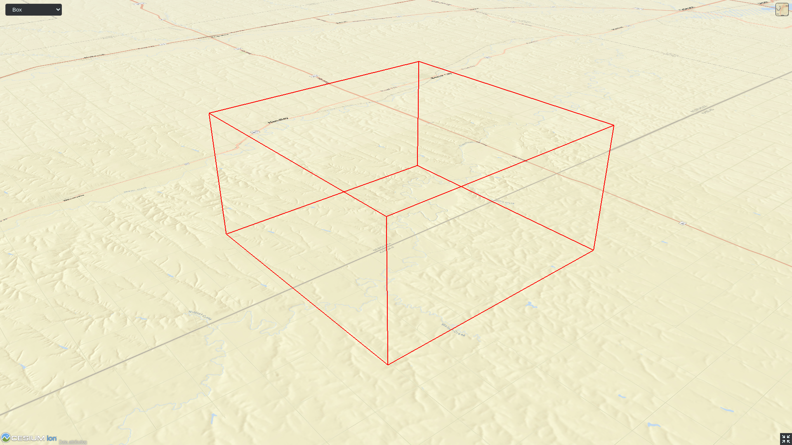

<!-- omit in toc -->
# 3DTILES_implicit_tiling

<!-- omit in toc -->
## Contributors

* Peter Gagliardi, Cesium
* Erixen Cruz, Cesium
* Sam Suhag, Cesium
* Sean Lilley, Cesium
* Ian Lilley, Cesium
* Josh Lawrence, Cesium
* Marco Hutter, Cesium
* Don McCurdy, Independent
* Shehzan Mohammed, Cesium
* Patrick Cozzi, Cesium

<!-- omit in toc -->
## Status

Draft

<!-- omit in toc -->
## Dependencies

Written against the 3D Tiles 1.0 specification.

<!-- omit in toc -->
## Optional vs. Required

This extension is required, meaning it must be placed in both the `extensionsUsed` and `extensionsRequired` lists in the tileset JSON.

<!-- omit in toc -->
## Contents

- [Overview](#overview)
- [Tile Extension](#tile-extension)
- [Subdivision scheme](#subdivision-scheme)
  - [Subdivision Rules](#subdivision-rules)
- [Tile Coordinates](#tile-coordinates)
- [Template URIs](#template-uris)
- [Subtrees](#subtrees)
  - [Availability](#availability)
  - [Tile Availability](#tile-availability)
  - [Content Availability](#content-availability)
  - [Child Subtree Availability](#child-subtree-availability)
- [Subtree File Format](#subtree-file-format)
  - [Buffers and Buffer Views](#buffers-and-buffer-views)
- [Multiple contents](#multiple-contents)
- [Appendix A: Availability Indexing](#appendix-a-availability-indexing)

## Overview

This extension defines a concise representation of quadtrees and octrees in 3D Tiles. This regular pattern allows for random access of tiles based on their tile coordinates which enables accelerated spatial queries, new traversal algorithms, and efficient updates of tile content, among other use cases.

Implicit tiling also allows for better interoperability with existing GIS data formats with implicitly defined tiling schemes. Some examples are [TMS](https://wiki.osgeo.org/wiki/Tile_Map_Service_Specification), [WMTS](https://www.ogc.org/standards/wmts), [S2](http://s2geometry.io/), and [CDB](https://docs.opengeospatial.org/is/15-113r5/15-113r5.html).

In order to support sparse datasets, **availability** data determines which tiles exist. To support massive datasets, availability is partitioned into fixed-size **subtrees**. Subtrees are stored in a compact binary file format.

The `3DTILES_implicit_tiling` extension may be added to any tile in the tileset. This extension defines how the tile is subdivided and where to locate content resources. The extension may be added to multiple tiles to create more complex subdivision schemes like double-headed quadtrees.

The figure below shows how tiles are accessed directly by their tile coordinates, in contrast to explicit tiling which must traverse the tree:


## Tile Extension

The `3DTILES_implicit_tiling` extension may be defined on any tile in the tileset JSON. Such a tile is called an **implicit root tile**, to distinguish it from the root tile of the tileset JSON. The implicit root tile must omit the `children` property.

```json
{
  "asset": {
    "version": "1.0"
  },
  "geometricError": 10000,
  "extensionsUsed": [
    "3DTILES_implicit_tiling"
  ],
  "extensionsRequired": [
    "3DTILES_implicit_tiling"
  ],
  "root": {
    "boundingVolume": {
      "region": [-1.318, 0.697, -1.319, 0.698, 0, 20]
    },
    "refine": "REPLACE",
    "geometricError": 5000,
    "content": {
      "uri": "content/{level}/{x}/{y}.b3dm"
    },
    "extensions": {
      "3DTILES_implicit_tiling": {
        "subdivisionScheme": "QUADTREE",
        "maximumLevel": 20,
        "subtrees": {
          "uri": "subtrees/{level}/{x}/{y}.subtree"
        },
        "subtreeLevels": 7
      }
    }
  }
}
```

The following properties about the implicit root tile are included in the extension object:

| Property | Description |
| ------ | ----------- |
| `subdivisionScheme` | Either `QUADTREE` or `OCTREE`. See [Subdivision scheme](#subdivision-scheme). |
| `maximumLevel` | Level of the deepest available tile in the tree. |
| `subtrees` | Template URI for subtree files. See [Subtrees](#subtrees). |
| `subtreeLevels` | How many levels there are in each subtree. |

[Template URIs](#template-uris) are used for locating subtree files as well as tile contents. For content, the template URI is specified in the tile's `content.uri` property.

The `content` of an implicit root tile must not have an associated `boundingVolume` property.

## Subdivision scheme

A **subdivision scheme** is a recursive pattern for dividing a bounding volume of a tile into smaller children tiles that take up the same space.

A **quadtree** divides space only on the `x` and `y` dimensions. It divides each tile into 4 smaller tiles where the `x` and `y` dimensions are halved. The quadtree `z` minimum and maximum remain unchanged. The resulting tree has 4 children per tile.


An **octree** divides space along all 3 dimensions. It divides each tile into 8 smaller tiles where each dimension is halved. The resulting tree has 8 children per tile.


For a `region` bounding volume, `x`, `y`, and `z` refer to `longitude`, `latitude`, and `height` respectively.

Sphere bounding volumes are disallowed, as these cannot be divided into a quadtree or octree.

The following diagrams illustrate the subdivision in the bounding volume types supported by 3D Tiles:

| Root Box | Quadtree | Octree |
|:---:|:--:|:--:|
|  |  |   |

| Root Region | Quadtree | Octree |
|:---:|:--:|:--:|
|  |  |   |


### Subdivision Rules

Implicit tiling only requires defining the subdivision scheme, refinement strategy, bounding volume, and geometric error at the implicit root tile. For descendant tiles, these properties are computed automatically, based on the following rules:

| Property | Subdivision Rule | 
| --- | --- |
| `subdivisionScheme` | Constant for all descendant tiles |
| `refine` | Constant for all descendant tiles |
| `boundingVolume` | Divided into four or eight parts depending on the `subdivisionScheme` |
| `geometricError` | Each child's `geometricError` is half of its parent's `geometricError` |

> **Implementation note:**
> 
> In order to maintain numerical stability during this subdivision process, the actual bounding volumes should not be computed progressively by subdividing a non-root tile volume. Instead, the exact bounding volumes should be computed directly for a given level.
> 
> Let the extent of the root bounding volume along one dimension *d* be *(min<sub>d</sub>, max<sub>d</sub>)*. The number of bounding volumes along that dimension for a given level  is *2<sup>level</sup>*. The size of each bounding volume at this level, along dimension *d*, is *size<sub>d</sub> = (max<sub>d</sub> - min<sub>d</sub>) / 2<sup>level</sup>*. The extent of the bounding volume of a child can then be computed directly as *(min<sub>d</sub> + size<sub>d</sub> * i, min<sub>d</sub> + size<sub>d</sub> * (i + 1))*, where *i* is the index of the child in dimension *d*. 
> 

The computed `boundingVolume` and `geometricError` properties can be overridden with the [`3DTILES_metadata`](https://github.com/CesiumGS/3d-tiles/tree/3d-tiles-next/extensions/3DTILES_metadata#implicit-tile-metadata) extension. This extension offers a mechanism for associating metadata with implicit tiles. This metadata can have different [Semantics](https://github.com/CesiumGS/3d-tiles/tree/3d-tiles-next/specification/Metadata/Semantics), including [`TILE_BOUNDING_BOX`](https://github.com/CesiumGS/3d-tiles/tree/3d-tiles-next/specification/Metadata/Semantics#tile_bounding_box) and [`TILE_GEOMETRIC_ERROR`](https://github.com/CesiumGS/3d-tiles/tree/3d-tiles-next/specification/Metadata/Semantics#tile_geometric_error). When metadata with these semantics is given for the implicit tiles, the metadata values override the computed `boundingVolume` and `geometricError` properties of implicit tiles, respectively. This is useful for creating tighter bounding volumes than the implicitly computed bounding volumes. Additionally semantics like [`CONTENT_BOUNDING_BOX`](../../specification/Metadata/Semantics#content_bounding_box) can be used to define content bounding volumes for implicit tiles.

## Tile Coordinates

**Tile coordinates** are a tuple of integers that uniquely identify a tile. Tile coordinates are either `(level, x, y)` for quadtrees or `(level, x, y, z)` for octrees. All tile coordinates are 0-indexed.

`level` is 0 for the implicit root tile. This tile's children are at level 1, and so on.

`x`, `y`, and `z` coordinates define the location of the tile within the level.

For `box` bounding volumes:

| Coordinate | Positive Direction |
| --- | --- |
| `x` | Along the `+x` axis of the bounding box |
| `y` | Along the `+y` axis of the bounding box |
| `z` | Along the `+z` axis of the bounding box |


For `region` bounding volumes:

| Coordinate | Positive Direction |
|---|---|
| `x` | From west to east (increasing longitude) |
| `y` | From south to north (increasing latitude) |
| `z` | From bottom to top (increasing height) |


## Template URIs

A **Template URI** is a URI pattern used to refer to tiles by their tile coordinates.

Template URIs must include the variables `{level}`, `{x}`, `{y}`. Template URIs for octrees must also include `{z}`. When referring to a specific tile, the tile's coordinates are substituted for these variables.

Template URIs, when given as relative paths, are resolved relative to the tileset JSON file.


## Subtrees

In order to support sparse datasets, additional information is needed to indicate which tiles or contents exist. This is called **availability**.

**Subtrees** are fixed size sections of the tileset tree used for storing availability. The tileset is partitioned into subtrees to bound the size of each availability buffer for optimal network transfer and caching. The `subtreeLevels` property defines the number of levels in each subtree. The subdivision scheme determines the number of children per tile.


After partitioning a tileset into subtrees, the result is a tree of subtrees.


### Availability

Each subtree contains tile availability, content availability, and child subtree availability.

* **Tile availability** indicates which tiles exist within the subtree
* **Content availability** indicates which tiles have associated content resources
* **Child subtree availability** indicates what subtrees are reachable from this subtree

Each type of availability is represented as a separate bitstream. Each bitstream is a 1D array where each element represents a node in the quadtree or octree. A 1 bit indicates that the element is available, while a 0 bit indicates that the element is unavailable. Alternatively, if all the bits in a bitstream are the same, a single constant value can be used instead.

To form the 1D bitstream, the tiles are ordered with the following rules:

* Within each level of the subtree, the tiles are ordered using the [Morton Z-order curve](https://en.wikipedia.org/wiki/Z-order_curve).
* The bits for each level are concatenated into a single bitstream


In the diagram above, colored cells represent 1 bits, grey cells represent 0 bits.

Storing tiles in Morton order provides these benefits:

- Efficient indexing - The Morton index for a tile is computed in constant time by interleaving bits.
- Efficient traversal - The Morton index for a parent or child tile are computed in constant time by removing or adding bits, respectively.
- Locality of reference - Consecutive tiles are near to each other in 3D space.
- Better Compression - Locality of reference leads to better compression of availability bitstreams.

For more detailed information about working with Morton indices and availability bitstreams, see [Appendix A: Availability Indexing](#appendix-a-availability-indexing).

### Tile Availability

Tile availability determines which tiles exist in a subtree.

Tile availability has the following restrictions:

* If a non-root tile's availability is 1, its parent tile's availability must also be 1. 
* A subtree must have at least one available tile. 


### Content Availability

Content availability determines which tiles have a content resource. The content resource is located using the `content.uri` template URI.

Content availability has the following restrictions:

* If content availability is 1 its corresponding tile availability must also be 1. Otherwise, it would be possible to specify content files that are not reachable by the tiles of the tileset. 
* If content availability is 0 and its corresponding tile availability is 1 then the tile is considered to be an empty tile.


### Child Subtree Availability

Child subtree availability determines which subtrees are reachable from the deepest level of this subtree. This links subtrees together to form a tree.

Unlike tile and content availability, which store bits for every level in the subtree, child subtree availability stores bits for nodes one level deeper than the deepest level of the subtree, and represent the root nodes of child subtrees. This is used to determine which other subtrees are reachable before requesting tiles. If availability is 0 for all child subtrees, then the tileset does not subdivide further.


## Subtree File Format

A **subtree file** is a binary file that contains availability information for a single subtree. It includes two main portions:

* The **subtree JSON** chunk which describes how the availability data is stored.
* A binary chunk for storing availability bitstreams as needed.

Subtrees are stored in little-endian. A subtree file consists of a 24-byte header and a variable length payload: 


Header fields:

| Bytes | Field | Type     | Description |
|-------|-------|----------|-------------|
| 0-3   | Magic | `UINT32` | A magic number identifying this as a subtree file. This is always `0x74627573`, the four bytes of the ASCII string `subt` stored in little-endian order. |
| 4-7   | Version | `UINT32` | The version number. Always `1` for this version of the specification. |
| 8-15  | JSON byte length | `UINT64` | The length of the subtree JSON, including any padding. |
| 16-23 | Binary byte length | `UINT64` | The length of the buffer (or 0 if the buffer does not exist) including any padding. |

Each chunk must be padded so it ends on an 8-byte boundary:

* The JSON chunk must be padded at the end with spaces (ASCII `' '` = `0x20`)
* If it exists, the binary chunk must be padded at the end with zeros (`0x00`)

The subtree JSON describes where the availability information for a single subtree is stored. Availability bitstreams are stored in buffers and accessed through buffer views.

### Buffers and Buffer Views

A **buffer** is a binary blob. A single buffer can be stored within the binary chunk of a subtree file. Further buffers can be stored as external binary files that are referred to by the `buffer.uri` property. The buffers can store availability bitstreams, or other data that is associated with a subtree, like metadata for implicit tiles defined using the [`3DTILES_metadata`](https://github.com/CesiumGS/3d-tiles/tree/3d-tiles-next/extensions/3DTILES_metadata#implicit-tile-metadata) extension.

Each buffer has a `byteLength` describing the size of the data, including any padding. 

A **buffer view** is a contiguous subset of a buffer. A buffer view's `buffer` property is an integer index to identify the buffer. A buffer view has a `byteOffset` and a `byteLength` to describe the range of bytes within the buffer. The `byteLength` does not include any padding. Multiple buffer views may reference a single buffer.

For efficient memory access, the `byteOffset` of a buffer view must be aligned to a multiple of 8 bytes.

Tile availability, content availability, and child subtree availability may refer to either a buffer view containing an availability bitstream or a constant value (`1` meaning all elements are available, `0` meaning no elements are available).

Availability bitstreams are packed in binary using the format described in the [Booleans](../../specification/Metadata#booleans) section of the 3D Metadata Specification.

> **Example:** The JSON description of a subtree where each tile is available, but not all tiles have content, and not all child subtrees are available:
> 
> ```json
> {
>   "buffers": [
>     {
>       "name": "Internal Buffer",
>       "byteLength": 16
>     },
>     {
>       "name": "External Buffer",
>       "uri": "external.bin",
>       "byteLength": 32
>     }
>   ],
>   "bufferViews": [
>     {
>       "buffer": 0,
>       "byteOffset": 0,
>       "byteLength": 11
>     },
>     {
>       "buffer": 1,
>       "byteOffset": 0,
>       "byteLength": 32
>     }
>   ],
>   "tileAvailability": {
>     "constant": 1,
>   },
>   "contentAvailability": {
>     "bufferView": 0
>   },
>   "childSubtreeAvailability": {
>     "bufferView": 1
>   }
> }
> ```

## Multiple contents

Tiles may contain more than one content entity (see: [`3DTILES_multiple_contents`](https://github.com/CesiumGS/3d-tiles/blob/main/extensions/3DTILES_multiple_contents)). In this case `contentAvailability` is provided for each element in the content array. The subtree's top-level `contentAvailability` must be omitted.

> **Example:** The example below has two contents for each implicit tile. Each content provides its own template URI in the tileset JSON and its own content availability in subtrees.
> 
> _Tileset JSON_
> 
> ```jsonc
> {
>   "root": {
>     "refine": "ADD",
>     "geometricError": 16384.0,
>     "boundingVolume": {
>       "region": [-1.707, 0.543, -1.706, 0.544, 203.895, 253.113]
>     },
>     "extensions": {
>       "3DTILES_multiple_contents": {
>         "content": [
>           {
>             "uri": "buildings/{level}/{x}/{y}.b3dm",
>           },
>           {
>             "uri": "trees/{level}/{x}/{y}.i3dm",
>           }
>         ]    
>       },
>       "3DTILES_implicit_tiling": {
>         "subdivisionScheme": "QUADTREE",
>         "subtreeLevels": 10,
>         "maximumLevel": 16,
>         "subtrees": {
>           "uri": "subtrees/{level}/{x}/{y}.subtree"
>         }
>       }
>     }
>   }
> }
> ```
>
> _Subtree JSON_
> 
> ```jsonc
> {
>   "buffers": [
>     {
>       "byteLength": 262160
>     }
>   ],
>   "bufferViews": [
>     {
>       "buffer": 0,
>       "byteLength": 43691,
>       "byteOffset": 0
>     },
>     {
>       "buffer": 0,
>       "byteLength": 131072,
>       "byteOffset": 43696
>     },
>     {
>       "buffer": 0,
>       "byteLength": 43691,
>       "byteOffset": 174768
>     },
>     {
>       "buffer": 0,
>       "byteLength": 43691,
>       "byteOffset": 218464
>     }
>   ],
>   "tileAvailability": {
>     "bufferView": 0
>   },
>   "childSubtreeAvailability": {
>     "bufferView": 1
>   },
>   "extensions": {
>     "3DTILES_multiple_contents": {
>       "contentAvailability": [
>         {
>           "bufferView": 2
>         },
>         {
>           "bufferView": 3
>         }
>       ]
>     }
>   }
> }
> ```

## Appendix A: Availability Indexing

<!-- omit in toc -->
### Converting from Tile Coordinates to Morton Index

A [Morton index](https://en.wikipedia.org/wiki/Z-order_curve) is computed by interleaving the bits of the `(x, y)` or `(x, y, z)` coordinates of a tile. Specifically:

```
quadtreeMortonIndex = interleaveBits(x, y)
octreeMortonIndex = interleaveBits(x, y, z)
```

For example:

```
// Quadtree
interleaveBits(0b11, 0b00) = 0b0101
interleaveBits(0b1010, 0b0011) = 0b01001110
interleaveBits(0b0110, 0b0101) = 0b00110110

// Octree
interleaveBits(0b001, 0b010, 0b100) = 0b100010001
interleaveBits(0b111, 0b000, 0b111) = 0b101101101
```


<!-- omit in toc -->
### Availability Bitstream Lengths

| Availability Type | Length (bits) | Description |
|-------------------|---------------|-------------|
| Tile availability | `(N^subtreeLevels - 1)/(N - 1)` | Total number of nodes in the subtree |
| Content availability | `(N^subtreeLevels - 1)/(N - 1)` | Since there is at most one content per tile, this is the same length as tile availability |
| Child subtree availability | `N^subtreeLevels` | Number of nodes one level deeper than the deepest level of the subtree |

Where `N` is 4 for quadtrees and 8 for octrees.

These lengths are in number of bits in a bitstream. To compute the length of the bitstream in bytes, the following formula is used:

```
lengthBytes = ceil(lengthBits / 8)
```

<!-- omit in toc -->
### Accessing Availability Bits

For tile availability and content availability, the Morton index only determines the ordering within a single level of the subtree. Since the availability bitstream stores bits for every level of the subtree, a level offset must be computed.

Given the `(level, mortonIndex)` of a tile relative to the subtree root, the index of the corresponding bit can be computed with the following formulas:

| Quantity | Formula | Description |
| -------- | ------- | ----------- |
| `levelOffset` | `(N^level - 1) / (N - 1)` | This is the number of nodes at levels `1, 2, ... (level - 1)` |
| `tileAvailabilityIndex` | `levelOffset + mortonIndex` | The index into the buffer view is the offset for the tile's level plus the morton index for the tile |

Where `N` is 4 for quadtrees and 8 for octrees.

Since child subtree availability stores bits for a single level, no levelOffset is needed, i.e. `childSubtreeAvailabilityIndex = mortonIndex`, where the `mortonIndex` is the Morton
index of the desired child subtree relative to the root of the current subtree.

<!-- omit in toc -->
### Global and Local Tile Coordinates

When working with tile coordinates, it is important to consider which tile the coordinates are relative to. There are two main types used in implicit tiling:

* **global coordinates** - coordinates relative to the implicit root tile.
* **local coordinates** - coordinates relative to the root of a specific subtree.

Global coordinates are used for locating any tile in the entire implicit tileset. For example, template URIs use global coordinates to locate content files and subtrees. Meanwhile, local coordinates are used for locating data within a single subtree file.

In binary, a tile's global Morton index is the complete path from the implicit root tile to the tile. This is the concatenation of the path from the implicit root tile to the subtree root tile, followed by the path from the subtree root tile to the tile. This can be expressed with the following equation:

```
tile.globalMortonIndex = concatBits(subtreeRoot.globalMortonIndex, tile.localMortonIndex)
```


Similarly, the global level of a tile is the length of the path from the implicit root tile to the tile. This is the sum of the subtree root tile's global level and the tile's local level relative to the subtree root tile:

```
tile.globalLevel = subtreeRoot.globalLevel + tile.localLevel
```


`(x, y, z)` coordinates follow the same pattern as Morton indices. The only difference is that the concatenation of bits happens component-wise. That is:

```
tile.globalX = concatBits(subtreeRoot.globalX, tile.localX)
tile.globalY = concatBits(subtreeRoot.globalY, tile.localY)

// Octrees only
tile.globalZ = concatBits(subtreeRoot.globalZ, tile.localZ)
```


<!-- omit in toc -->
### Finding Parent and Child Tiles

The coordinates of a parent or child tile can also be computed with bitwise operations on the Morton index. The following formulas apply for both local and global coordinates.

```
childTile.level = parentTile.level + 1
childTile.mortonIndex = concatBits(parentTile.mortonIndex, childIndex)
childTile.x = concatBits(parentTile.x, childX)
childTile.y = concatBits(parentTile.y, childY)

// Octrees only
childTile.z = concatBits(parentTile.z, childZ)
```

Where:
* `childIndex` is an integer in the range `[0, N)` that is the index of the child tile relative to the parent.
* `childX`, `childY`, and `childZ` are single bits that represent which half of the parent's bounding volume the child is in in each direction.


