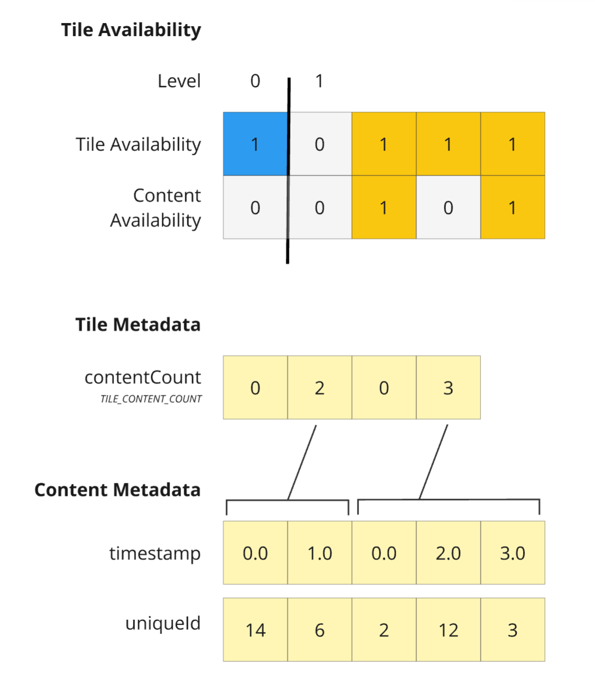

# 3DTILES_implicit_tiling_multiple_contents

## Contributors

* Sean Lilley, Cesium

## Status

Draft

## Dependencies

Written against the 3D Tiles 1.1 specification.

## Optional vs. Required

This extension is required, meaning it must be placed in both the `extensionsUsed` and `extensionsRequired` lists in the tileset JSON.

## Overview

This extension introduces a new [tile metadata semantic](https://github.com/CesiumGS/3d-tiles/blob/main/specification/Metadata/Semantics/README.adoc#tile) `TILE_CONTENT_COUNT` for indicating the number of contents referenced by each tile in an implicit tileset. This is more efficient than the existing [multiple contents approach](https://github.com/CesiumGS/3d-tiles/tree/main/specification/ImplicitTiling#multiple-contents) when tiles have a widely varying number of contents.

Semantic | Type | Description
--|--|--
`TILE_CONTENT_COUNT`| <ul><li>Type: `SCALAR`</li><li>Component type: `UINT8`, `UINT16`, `UINT32`, `UINT64`</li></ul>|The number of tile contents.
 
When `TILE_COUNT_COUNT` is zero, the tile is empty and its content availability bit is 0. Otherwise, if the tile has one or more contents, its content availability bit is 1.

Unlike the existing approach where content metadata is stored in separate property tables, content metadata is stored sequentially in the same property table, as shown in the diagram below.



> *Illustration of multiple contents with content metadata, showing a subtree of depth two with four available tiles. The first tile contains zero contents, the second tile contains two contents, the third tile contains zero contents, and the fourth tile contains three contents. There are five contents total, each having a `timestamp` and `uniqueId` associated with it.*

This extension is often paired with `3DTILES_implicit_tiling_custom_template_variables` so that content metadata can be used to locate content resources.

## Example

_Tileset JSON_

```jsonc
{
  "asset": {
    "version": "1.1"
  },
  "schema": "schema.json",
  "geometricError": 1000,
  "root": {
    "boundingVolume": {
      "region": [-1.318, 0.697, -1.319, 0.698, 0, 20]
    },
    "refine": "ADD",
    "geometricError": 5000,
    "content": {
      "uri": "content/{level}/{x}/{y}/{uniqueId}/{timestamp}.glb",
    },
    "implicitTiling": {
      "subdivisionScheme": "QUADTREE",
      "availableLevels": 2,
      "subtreeLevels": 2,
      "subtrees": {
        "uri": "subtrees/{level}/{x}/{y}.json"
      }
    }
  },
  "extensionsUsed": ["3DTILES_implicit_tiling_multiple_contents", "3DTILES_implicit_tiling_custom_template_variables"],
  "extensionsRequired": ["3DTILES_implicit_tiling_multiple_contents", "3DTILES_implicit_tiling_custom_template_variables"]
}
```

_Schema JSON_

```jsonc
{
  "id": "exampleSchema",
  "classes": {
    "tile": {
      "properties": {
        "contentCount": {
          "type": "SCALAR",
          "componentType": "UINT16",
          "semantic": "TILE_CONTENT_COUNT"
        }
      }
    },
    "content": {
      "properties": {
        "timestamp": {
          "type": "SCALAR",
          "componentType": "FLOAT",
          "required": true
        },
        "uniqueId": {
          "type": "SCALAR",
          "componentType": "UINT64",
          "required": true
        }
      }
    }
  }
}
```

_Subtree JSON_

```json
{
  "buffers": [
    {
      "name": "Tile Availability Buffer",
      "uri": "tile_availability.bin",
      "byteLength": 1
    },
    {
      "name": "Content Availability Buffer",
      "uri": "content_availability.bin",
      "byteLength": 1
    },
    {
      "name": "Tile Metadata Buffer",
      "uri": "tile_metadata.bin",
      "byteLength": 8
    },
    {
      "name": "Content Metadata Buffer",
      "uri": "content_metadata.bin",
      "byteLength": 64
    }
  ],
  "bufferViews": [
    { "buffer": 0, "byteOffset": 0, "byteLength": 1 },
    { "buffer": 1, "byteOffset": 0, "byteLength": 1 },
    { "buffer": 2, "byteOffset": 0, "byteLength": 8 },
    { "buffer": 3, "byteOffset": 0, "byteLength": 20 },
    { "buffer": 3, "byteOffset": 24, "byteLength": 40 },
  ],
  "propertyTables": [
    {
      "class": "tile",
      "count": 4,
      "properties": {
        "contentCount": {
          "values": 2
        }
      }
    },
    {
      "class": "content",
      "count": 5,
      "properties": {
        "timestamp": {
          "values": 3,
        },
        "uniqueId": {
          "values": 4
        }
      }
    }
  ],
  "tileAvailability": {
    "bitstream": 0,
    "availableCount": 4
  },
  "contentAvailability": [{
    "bitstream": 1,
    "availableCount": 2
  }],
  "childSubtreeAvailability": {
    "constant": 0
  },
  "tileMetadata": 0,
  "contentMetadata": [1]
}
```
