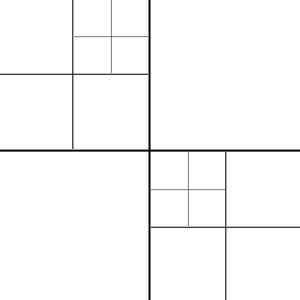
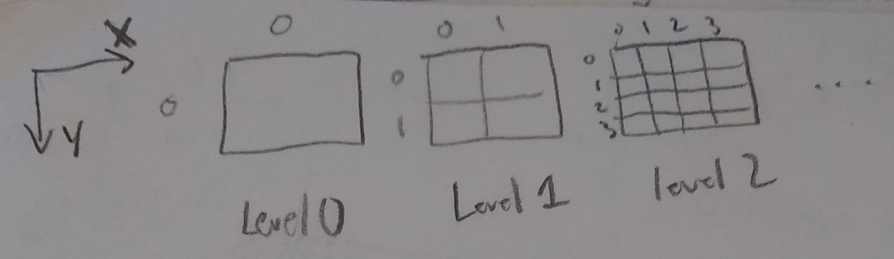
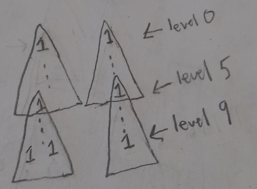
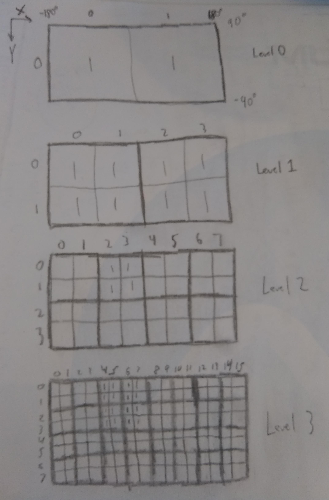
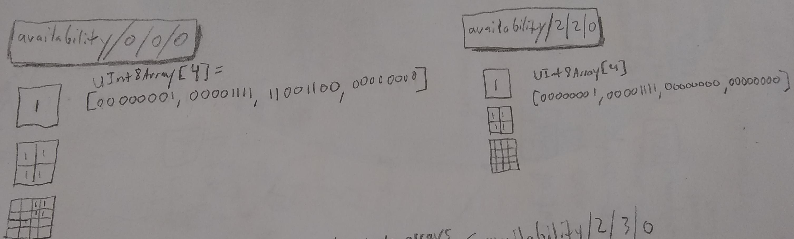
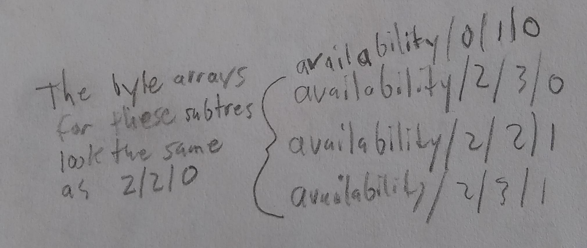

# 3DTILES_implicit_tiling Extension

## Contributors

* Josh Lawrence, [@loshjawrence](https://github.com/loshjawrence)
* Shehzan Mohammed, [@shehzan10](https://github.com/shehzan10)
* Patrick Cozzi, [@pjcozzi](https://github.com/pjcozzi)

## Contents

* [Overview](#overview)
* [Concepts](#concepts)
* [Tileset JSON Format Updates](#tileset-json-format-updates)
   * [Tiling Scheme](#tiling-scheme)
   * [Notes](#notes)
* [Resources](#resources)
* [Property Reference](#property-reference)
* [Example](#example)

## Overview

This extension enables the [3D Tiles JSON](../../specification/schema/tileset.schema.json) to support streaming tilesets with implied subdivision.
When subdivision is implied, it enables simplification at every stage of the tileset's lifetime:
querying tree structure from the server, data storage on the client, as well as simplification and optimization of algorithms involved with the structure of the tree such as traversal,
visibility, arbitrary  selection of tiles in a region, ray casting, analysis, etc.
The tileset.json only needs to supply the information needed so that any tile can derive attributes like `geometricError`, `boundingVolume`, `refine`, etc.
This cuts down the size and verbosity of the tileset.json. Because the access to information describing any part of tree structure is predictable,
random access queries on the tree are possible.

Because subdivision is predicable, the only information regarding the tree structure that needs to be queried from the server is whether a tile exists or not.
Only 1 bit per tile is needed for this. For explicit tilesets, per-tile information is a little over 300 bytes. This simplified approach reduces IO and allows easier interoperability with other standards.

TODO: include a representative image here

## Concepts
### Implicit Tilling
Implicit tiling is a term used to convey that the rule for how a tile subdivides into its children is the same for every tile in a tileset.
The two supported methods for how a tile subdivides are quadree subdivision and octree subdivision.

### Quadtree
When a tile subdivides in a quadtree, it produces 4 equally sized tiles that fit in the footprint of the original tile, the parent tile.
The tile is split along two axes picking the midpoint of the bounds along those axes. These axes are the x and y axes.



### Octree
When a tile subdivides in an octree, it produces 8 equally sized tiles that fit in the footprint of the original tile, the parent tile.
The tile is split along all three axes picking the midpoint of the bounds along each axis.


### Split Axes
The property used to specify this subdivision is `splitAxes`.
It is a number indicating the number of axes split, 2 being a quadtree and 3 being an octree.

### Availability Subtree
The only information that is needed on a per-tile basis is whether the tile is available or not at some location in the tree.
The full tree of information that expresses all tiles' availability is broken up into subtrees(small portions of the full tree). Since a single bit is needed to hold a tile's availability,
the subtree of availability is expressed as an array of bytes where each bit holds a tile's availability, i.e. a 1 or 0 indicating that the tile is available or not available, respectively.

### Complete Subtree Levels
In the `tileset.json`, the `completeSubtreeLevels` property is the number of levels in every subtree in the tileset.
Every subtree starts from a single tile, its root, and spans the number levels indicated by `completeSubtreeLevels`.
Subtrees are complete meaning no part of the subtree stops early.
Therefore, every subtree has the same number of bytes.
Subtrees are binary files containing only their array of bytes.
These binary files live in a folder called `availability` in the root directory (where the tileset.json lives).
The location of a subtree within this `availability` folder is dictated by its root tile's location in the tree, discussed next.

### Tree Location
A tile's location in the tree can be defined in terms of the level at which it resides as well as the location within that level.
Every level of the tree can be thought of as a fixed grid of equally sized tiles, where the level occupies the same space as the previous level but with double the amount of tiles along each axis that gets split.
For quadtrees, the location within a level in the tree can be described by an x, y coordinate.
For octrees, location within a level in the tree can be described by an x, y, z coordinate.
For the x direction, tiles' x coordinates are indexed from left to right, ranging from 0 to n - 1 where n is the number of tiles along the x direction for that level.
For the y direction, tiles' y coordinates are indexed from top to bottom, ranging from 0 to n - 1 where n is the number of tiles along the y direction for that level.
For the z direction, tiles' z coordinates are indexed from back to front, ranging from 0 to n - 1 where n is the number of tiles along the z direction for that level.
Quadtrees do not index the z direction.



If a tile is available in the subtree, its uri is its tree location, delimited by forward slashes.
For example, if a tile's location in an octree is at level 5, with an x,y,z of 6,7,8, its uri is `5/6/7/8`, relative to the base uri.
If a tile's location in a quadtree is at level 9 with an x and y of 10 and 11, its uri is `9/10/11`, relative to the base uri.

It was mentioned that the location of a subtree within the `availability` folder is dictated by its root tile's location in the tree. Therefore, the uri of a subtree
whose root tile has a tree location of `9/10/11` would have a uri of `availability/9/10/11`.

On the last level of a subtree, tiles that have a 1 will have a subtree starting from that location. For example, if a tile on the last level of a subtree has a 1 and its tree location was
`5/6/7/8` there would be a tile available at uri `5/6/7/8` and a subtree of availability at uri `availability/5/6/7/8`.
The example here shows a binary tree with two tiles in the subtree's last level,
There would be subtrees at each of these locations as well, unless this level was the last level of tileset.


### Root Grid Dimensions
Some tilesets are defined on the surface of an ellipsoid (like planet earth) where the subdivision happens at regular intervals of longitude and latitude rather than regular intervals of 3D cartesian space.
The surface of the ellipsoid is represented as a 2D cartographic map ranging from -180 to 180 degrees in longitude and -90 to 90 degrees in latitude.
Tiles near the poles do not occupy the same 3D space as they do for tiles near the equator, on the same level.
Different 2D mapping formats have different techniques for dealing with this pole distortion, usually by specifying a fixed grid that is responsible for some latitude range.
To allow tiling with these different 2D mapping techniques, `rootGridDimensions` property allows specifying a fixed grid at the root level. Any location in this fixed grid can hold the root of a tree.

Most tilesets can do without a fixed grid at the root level. Specifying a dimension of 1 far each axis for `rootGridDimensions` will make it so that the root grid has only 1 possible root location.

### First Subtrees with Content
To specify where the tree begins `firstSubtreesWithContent` is used to say where the first set of subtrees live.
A root grid may have a few empty locations or a tileset may be in the context of globe but start further down the tree.
The example here shows a 2x3 root grid with 2 roots available as shown.


## Tileset JSON Format Updates

### Tiling Scheme

The Tileset JSON describing a [3D Tiles](../../specification/README.md) tileset may be extended to include a `3DTILES_implicit_tiling` object. This object defines
the root level context from which the entire tileset structure (`boundingVolume`, `geometricError`, `refine`, etc.) can be implied.

Below is an example of a Tileset JSON with the implicit tiling scheme extension set:

```json
{
    "asset": {
        "version": "1.0"
    },
    "geometricError": 563.8721715009725,
    "extensions": {
        "3DTILES_implicit_tiling": {
            "splitAxes": 2,
            "refine": "REPLACE",
            "rootGridDimensions": [2,1,1],
            "firstSubtreesWithContent": [[0,0,0,0], [0,1,0,0]],
            "completeSubtreeLevels": 10,
            "lastLevel": 19,
            "boundingVolume": {
                "region": [
                     -1.5707963267948966,
                     -3.1415926535897932,
                      1.5707963267948966,
                      3.1415926535897932,
                    -11.89207010413975,
                    547.7591827297583
                ]
            },
            "transform": [
                0.964993398200894,
                -0.2622741722486046,
                0,
                0,
                0.1674100354510973,
                0.6159568729846445,
                0.7697863409110614,
                0,
                -0.2018950753707308,
                -0.7428387370043971,
                0.6383016444806947,
                0,
                -1289474.3598308756,
                -4744402.522436097,
                4049448.137488265,
                1
            ],
        }
    }
}
```

This provide the information needed to derive the `boundingVolume`, `transform`, `splitAxes`, and `refine` for any tile in the tileset.

#### properties

#### splitAxes

|Type|Description|
|----|-----------|
|`0`|TODO: Indicates no `splitAxes`? (CDB negative levels, i.e. the mipped imagery) |
|`2`|Quadtree scheme.|
|`3`|Octree scheme.|

The `splitAxes` property specifies the subdivision scheme for the entire tileset. A value of 2 means the subdivision scheme is a quadtree while a value of 3 means the subdivision scheme is an octree.
In a quadtree, a tile is split evenly along the x and y axes, forming four equally sized children. In an octree, a tile is split evenly along the x, y, and z axes, forming eight equally sized children.

#### refine

The `refine` property specifies the refinement style and is either `REPLACE` or `ADD`. The refinement specified applies to all tiles in the tileset.
This is the same `refine` property which is defined per-tile in the core 3D Tiles specification [3D Tiles `refine` Property](https://github.com/AnalyticalGraphicsInc/3d-tiles/tree/master/specification#refinement).

#### rootGridDimensions

The `rootGridDimensions` property is a three element array of numbers specifying the x, y, and z dimensions of a fixed grid at tree level 0.
At each location of the fixed grid, there may reside a tileset root.
The space is uniformly divided so all of the root tiles will have exactly the same geometric size.
For quadtrees, the third element of this array is ignored. A single root is indicated by "`rootGridDimensions`": [1, 1, 1].
Two roots side-by-side along the x dimension is indicated by "`rootGridDimensions`": [2, 1, 1].
The example here shows a 2x3 root grid with 2 roots available as shown.


#### firstSubtreesWithContent

The `firstSubtreesWithContent` property describes the first set of subtrees that are available in the tree.
It is an array where each element holds a four element array specifying the subtrees d,x,y,z index in the tileset. The last element is ignored if the tileset is a quadtree.

```json
    "firstSubtreesWithContent": [[0,0,0,0], [0,1,0,0]],
```
In this example, the first subtrees that are available have d,x,y,z indexes of 0,0,0,0 and 0,1,0,0.
A subtree uri is this d,x,y,z tree location appended to the subtree default folder location or `availability/d/x/y/z`.
These two subtree relative uri's would be `availability/0/0/0/0` and `availability/0/1/0/0`, respectively.
From here, all other tree structure information can be found by jumping the bottom level of a subtree, and requesting more availability subtrees as needed.

#### completeSubtreeLevels

The `completeSubtreeLevels` property is a number that specifies the fixed amount of levels in of all subtrees for the tileset.

```json
    "completeSubtreeLevels": 10,
```
In this example, `completeSubtreeLevels` is 10 meaning that all subtrees will supply availability for 10 levels starting from their root.
If a subtree starts at level 0 it would cover levels 0 through 9 for its portion of the tree.
If a subtree starts at level 9 it would cover levels 9 through 18 for its portion of the tree.
All subtrees of availability have the same number of bytes since they are full trees of a fixed amount of levels for a fixed tiling scheme.

#### lastLevel

The `lastLevel` property is a number that specifies the last tree level in the tileset.

```json
    "lastLevel": 9,
```
In the example above, this number is `9` meaning that last level in the tree is level 9.
This number is indexed from 0 so if the number was 0 it would mean the tileset only has 1 level, the root at level 0.

So if you also had:
```json
    "completeSubtreeLevels": 6,
    "lastLevel": 9,
    "firstSubtreesWithContent": [[0,0,0,0], [0,1,0,0]],
    "rootGridDimensions": [2, 1, 1]
```

The tree might look something like this:



#### boundingVolume

The `boundingVolume` property specifies bounding volume for the entire tileset.
The `boundingVolume` types are restricted to `region` and `box`.
This is the same `boundingVolume` property which is defined per-tile in the core 3D Tiles specification [3D Tiles `boundingVolume` Property](https://github.com/AnalyticalGraphicsInc/3d-tiles/tree/master/specification#bounding-volumes)
Every tile in the tileset can derive its bounding volume from the tileset bounding volume.

#### transform

The `transform` property specifies 4x4 affine transformation that transforms any tile in the tileset from the tileset's local coordinate system to a global coordinate system.
This is the same `transform` property which is defined per-tile in the core 3D Tiles specification [3D Tiles `transform` Property](https://github.com/AnalyticalGraphicsInc/3d-tiles/tree/implicit-tiling/specification#transforms)

### Subtree availability
```
Please rewrite this section for preciseness and to build the concept bottom up with simple example. Include more figures with the examples, e.g., for the initial quad and octree examples.
Also motivate why this availability data is useful for different types of algorithms.
Also, it looks like this will be part of the implicit tiling extension, but optional to implement. Is that correct?
At one point we discussed making this a separate extension, but maybe that is too fine-grained? Was that your conclusion?
```

Availability of tiles are broken up into subtree chunks.
A subtree of availability is binary file where each tiles gets a bit: 1 if it exists, 0 if it does not.
Every tile in the subtree must have a 0 or 1.
Tiles on the last level of a subtree that have a 1 will have an additional subtree for requesting (unless that tile is also on the last level of the tree).
Each level of the subtree has a minimimum size of 1 byte.
For example, a quadtrees root and first levels have some bit padding. An example quadtree subtree that is fully packed:
quad subtree: [0b00000001, 0b00001111, 0b11111111, 0b11111111, ...]

An example oct tree subtree that is fully packed:
oct subtree: [0b00000001, 0b11111111, 0b11111111, ...]

Bits are left to right, top to bottom, back to front raster order, same as the tree indexing. LSB bits are earlier in the raster order.

Below is a binary subtree (not supported, only for illustrative purposes) of 4 levels.
There are two leaf tiles at level 3 (root is level 0) that are available. These
would have uri's of "3/1" and "3/4".  They would also have subtree binaries available for requesting as well, at uri's "availability/3/1" and "availability/3/4".


See #example for a replacement refinement quad tree example.

### Schema updates

See [Property reference](#reference-3DTILES_implicit_tiling-tileset-extension) for the `3DTILES_implicit_tiling.tileset` schema reference. The full JSON schema can be found in [3DTILES_implicit_tiling.tileset.schema.json](schema/3DTILES_implicit_tiling.tileset.schema.json).

## Notes
_This section is non-normative._

## Resources
_This section is non-normative._

## Property reference

* [`3DTILES_implicit_tiling Tileset JSON extension`](#reference-3DTILES_implicit_tiling-tileset-extension)

---------------------------------------
<a name="reference-3DTILES_implicit_tiling-tileset-extension"></a>
## 3DTILES_implicit_tiling Tileset JSON extension

Specifies the Tileset JSON properties for the 3DTILES_implicit_tiling.

**Properties**

|   |Type|Description|Required|
|---|----|-----------|--------|
|**boundingVolume**|`object`|A bounding volume that encloses the tileset.  Exactly one `box` or `region` property is required.|:white_check_mark: Yes|
|**rootGridDimensions**|`number` `[3]`|Defines the fixed grid dimensions at the root level of the tree.| :white_check_mark: Yes|
|**lastLevel**|`number`|Defines the last level in the tileset. 0 indexed.| :white_check_mark: Yes|
|**refine**|`string`|Specifies if additive or replacement refinement is used when traversing the tileset for rendering. This refinement applies to the entire tileset.|:white_check_mark: Yes|
|**firstSubtreesWithContent**|`array`|Defines the first set of subtrees that are available in the tileset as indicated by the subtree' root tile tree location.| :white_check_mark: Yes|
|**splitAxes**|`number`|Defines the implied subdivision scheme for all tiles in the tileset.| :white_check_mark: Yes|
|**completeSubtreeLevels**|`number`|Defines how many levels each availability subtree contains.| :white_check_mark: Yes|

Additional properties are not allowed.

### boundingVolume :white_check_mark:

A bounding volume that encloses the tileset.  Exactly one `box` or `region` property is required.

**Properties**

|   |Type|Description|Required|
|---|----|-----------|--------|
|**box**|`number` `[12]`|An array of 12 numbers that define an oriented bounding box. The first three elements define the x, y, and z values for the center of the box.  The next three elements (with indices 3, 4, and 5) define the x axis direction and half-length.  The next three elements (indices 6, 7, and 8) define the y axis direction and half-length.  The last three elements (indices 9, 10, and 11) define the z axis direction and half-length.|No|
|**region**|`number` `[6]`|An array of six numbers that define a bounding geographic region in EPSG:4979 coordinates with the order [west, south, east, north, minimum height, maximum height]. Longitudes and latitudes are in radians, and heights are in meters above (or below) the WGS84 ellipsoid.|No|

Additional properties are not allowed.

#### BoundingVolume.box

An array of 12 numbers that define an oriented bounding box. The first three elements define the x, y, and z values for the center of the box. The next three elements (with indices 3, 4, and 5) define the x axis direction and half-length.
The next three elements (indices 6, 7, and 8) define the y axis direction and half-length. The last three elements (indices 9, 10, and 11) define the z axis direction and half-length.

* **Type**: `number` `[12]`
* **Required**: No

#### BoundingVolume.region

An array of six numbers that define a bounding geographic region in EPSG:4979 coordinates with the order [west, south, east, north, minimum height, maximum height]. Longitudes and latitudes are in radians, and heights are in meters above (or below) the WGS84 ellipsoid.

* **Type**: `number` `[6]`
* **Required**: No

### rootGridDimensions :white_check_mark:

Defines a three element array contains the x, y, and z dimensions for a fixed grid at level 0 of the tileset. The last element is ignored for quadtrees.

* **Type**: `number` `[3]`
* **Required**: Yes
* **Minimum**: [1,1,1]

### lastLevel :white_check_mark:

Defines the last level in the tileset. 0 indexed.

* **Type**: `number`
* **Required**: Yes
* **Minimum**: 0

### refine :white_check_mark:

Specifies if additive or replacement refinement is used when traversing the tileset for rendering. This refinement applies to the entire tileset.

* **Type**: `string`
* **Required**: Yes
* **Allowed values**:
   * `"ADD"`
   * `"REPLACE"`

### firstSubtreesWithContent :white_check_mark:

Defines the first set of subtrees that are available in the tileset as indicated by their root tile's tree location.
Each element of the array is a four element array holding the d,x,y,z index in the tileset for the root of the subtree. The last element of this four element array is ignored for quadtrees.
The corresponding uri for this subtree of availability is `availability/d/x/y/z` for octrees and `availability/d/x/y` for quadtrees.

* **Type**: `array`
* **Required**: Yes
* **Type of each property**: `number` `[4]`
* **Minimum**: [0,0,0,0]

### subdivision :white_check_mark:

Defines the implied subdivision for all tiles in the tileset.

* **Type**: `number`
* **Required**: Yes
* **Allowed Values**:
  * `2` Quadtree
  * `3` Octree

### completeSubtreeLevels :white_check_mark:

Defines how many levels each subtree of availability contains.

* **Type**: `number`
* **Required**: Yes
* **Minimum**: 1

#### Example

In this example, the tileset is a quadtree with replacement refinement. Since it's `boundingVolume` is a `region`, it is a availability will correlate
to a 2D cartographic map where the surface of the globe is represented as a rectangle where left and right edge range from -180 to 180 degrees and the bottom and top edge range from -90 to 90 degrees, respectively.
There's a 2x1 grid at the root level and there's a subtree at each location in the grid. `Cesium` uses this kind of configuration for terrain payloads like `quantized-mesh`.
Availability subtrees span 3 levels and the tree itself goes down to level 4.
```json
{
    "asset": {
        "version": "1.0"
    },
    "geometricError": 563.8721715009725,
    "extensions": {
        "3DTILES_implicit_tiling": {
            "splitAxes": 2,
            "refine": "REPLACE",
            "rootGridDimensions": [2,1],
            "firstSubtreesWithContent": [[0,0,0], [0,1,0]],
            "completeSubtreeLevels": 3,
            "lastLevel": 3,
            "boundingVolume": {
                "region": [
                     -1.5707963267948966,
                     -3.1415926535897932,
                      1.5707963267948966,
                      3.1415926535897932,
                    -11.89207010413975,
                    547.7591827297583
                ]
            }
        }
    }
}
```

The full tree of availability might look something like this:



The subtrees and their byte arrays would look like this:




Without a predicable subdivision, additional tile information like geometricError, boundingVolume would need to be specified in the tileset.json. Each tile would need to have something like this:
```json
{
"content": {
    "url": "13/4971/3401.b3dm",
},
"boundingVolume": {
    "region": [
    0.54388426404325441,
    0.52361260650112784,
    0.54394155069686589,
    0.52366375841790003,
    30.035595852874767,
    86.742527859291442
    ]
},
"geometricError": 4.0,
"refine": "replace",
"children": [
    {
    ...
    }
]
}
```

A global quadtree like WMTS might look something like this.
There's a 1x1 grid (no grid) at the root level and there's a subtree at the root of the tree.
Availability subtrees span 3 levels and the tree itself goes down to level 4.
```json
{
    "asset": {
        "version": "1.0"
    },
    "geometricError": 563.8721715009725,
    "extensions": {
        "3DTILES_implicit_tiling": {
            "splitAxes": 2,
            "refine": "REPLACE",
            "rootGridDimensions": [1,1],
            "firstSubtreesWithContent": [[0,0,0]],
            "completeSubtreeLevels": 9,
            "lastLevel": 22,
            "boundingVolume": {
                "region": [
                     -1.5707963267948966,
                     -3.1415926535897932,
                      1.5707963267948966,
                      3.1415926535897932,
                    -11.89207010413975,
                    547.7591827297583
                ]
            }
        }
    }
}
```

An octree tileset like a pointcloud might look something like this.
There's a 1x1x1 grid (no grid) at the root level and there's a subtree at the root of the tree.
Availability subtrees span 7 levels and the tree itself goes down to level 12.
It's an octree since it splits 3 axes indicated by `"splitAxes: 3"`.
```json
{
    "asset": {
        "version": "1.0"
    },
    "geometricError": 563.8721715009725,
    "extensions": {
        "3DTILES_implicit_tiling": {
            "splitAxes": 3,
            "refine": "ADD",
            "rootGridDimensions": [1,1],
            "firstSubtreesWithContent": [[0,0,0]],
            "completeSubtreeLevels": 7,
            "lastLevel": 12,
            "boundingVolume": {
                "box": [
                    -0.015391968241431186,
                    -0.3532479633577168,
                    92.70943470788187,
                    352.10639004734344,
                    0,
                    0,
                    0,
                    442.07886020861565,
                    0,
                    0,
                    0,
                    92.72882069413549
                ]
            },
            "transform": [
                0.964993398200894,
                -0.2622741722486046,
                0,
                0,
                0.1674100354510973,
                0.6159568729846445,
                0.7697863409110614,
                0,
                -0.2018950753707308,
                -0.7428387370043971,
                0.6383016444806947,
                0,
                -1289474.3598308756,
                -4744402.522436097,
                4049448.137488265,
                1
            ]
        }
    }
}
```
