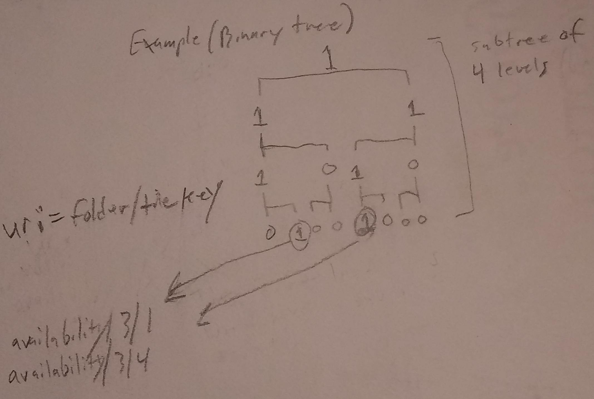

# 3DTILES_implicit_tiling Extension

## Contributors

* Josh Lawrence, [@loshjawrence](https://github.com/loshjawrence)
* Shehzan Mohammed, [@shehzan10](https://github.com/shehzan10)
* Patrick Cozzi, [@pjcozzi](https://github.com/pjcozzi)

## Contents

* [Overview](#overview)
* [Tileset JSON Format Updates](#tileset-json-format-updates)
   * [Tiling Scheme](#tiling-scheme)
   * [Available](#available)
   * [Notes](#notes)
* [Resources](#resources)
* [Property Reference](#property-reference)

## Overview

This extension enables the [3D Tiles JSON](../../specification/schema/tileset.schema.json) to support streaming tilesets with implied subdivision schemes.

## Tileset JSON Format Updates

### Tiling Scheme

The Tileset JSON describing a [3D Tiles](../../specification/README.md) tileset may be extended to include a `3DTILES_implicit_tiling` object. This object defines
the root level context from which the entire tileset structure (`boundingVolumes`, `geometricError`, `subdivision`, `refine`) can be implied.

Below is an example of a Tileset JSON with the implicit tiling scheme extension set:

```json
{
    "asset": {
        "version": "1.0"
    },
    "geometricError": 563.8721715009725,
    "extensions": {
        "3DTILES_implicit_tiling": {
            "subdivision": 2,
            "refine": "REPLACE",
            "headCount": [2,1,1],
            "roots": [[0,0,0,0], [0,1,0,0]],
            "subtreeLevels": 10,
            "lastLevel": 19,
            "boundingVolume": {
                "region": [
                     -1.5707963267948966,
                     -3.1415926535897932,
                      1.5707963267948966,
                      3.1415926535897932,
                    -11.89207010413975,
                    547.7591827297583
                ]
            },
        }
    }
}
```

### TODO:
* Context
* Examples
* Precise language. Get rid of soft language like would/could.
    * subdivision name: subdivisions? partions? splits? numberOf*? *Count?

#### properties

`subdivision` defines the subdivision scheme for the entire tileset. In the example above, a type of 2 would indicate a quadtree subdivision, or the number of axes being split.
Other possible types are defined in the table below.

|Type|Description|
|----|-----------|
|`0`|Reserved. TODO: Indicates no subdivision? (CDB negative levels, i.e. the mipped imagery) |
|`1`|Reserved. Binary tree? |
|`2`|Quadtree subdivision scheme |
|`3`|Octree subdivision scheme |

#### refine

The `refine` property specifies the refinement style and is either `REPLACE` or `ADD`. The refinement specified applies to all tiles in the tileset.
This is the same `refine` metadata as described in [3D Tiles](../../specification/README.md).

#### headCount

The `headCount` property specifies the number of heads in each dimension (x, y, and z, in that order) at tree level 0 as indicated by a three element array containing integers. A single root would be indicated by "headCount": [1, 1, 1].
A "dual-headed quad tree" or TMS style quadtree, where there are two roots side-by-side along the x dimension, would be indicated by "headCount": [2, 1, 1].

#### roots

The `roots` property describes the first set of subtrees in the tree.
It is an array where each element holds a [d,x,y,z] key of the subtree that can be requested.
The this is needed to know where the tree starts for cases where the content starts somewhere down the tree (not at level 0, as can be the case with some tilesets defined in a globe context with a region bounding box) or if some heads are missing.

In the example above, the first subtrees that are available on level 0 at each of the available head locations. A subtree uri is this d,x,y,z key prepended with the subtree default folder location or `availability/d/x/y/z`.

#### subtreeLevels

The `subtreeLevels` property is a number that specifies the fixed amount of levels in of all subtree availabilities for the tileset. In the example above this number is `10` meaning that any subtree that is requested out of the `availabililty` folder
(followed by the `d/x/y/z` index of the subtrees root within the tree) will specify availability for all nodes from the subtree root and down 10 levels. Available tiles on the last level of the subtree will have another subtree available for requesting.

#### lastLevel

The `lastLevel` property is a number that specifies the last tree level in the tileset. In the example above this number is `19` meaning that last level in the tree is level 19.
This number is indexed from 0 so if the number was 0 it would mean the tileset only has 1 level, the root at level 0.

#### boundingVolume

The `boundingVolume` property specifies boundingVolume for level 0 of the tileset (and all of its heads, not per-head).  The `boundingVolume` types are restricted to `region` and `box`.
This is the same `boundingVolume` metadata as described in [3D Tiles](../../specification/README.md).
Every tile in the tileset can derive its bounding volume from the root bounding volume.

#### transform

The `transform` property specifies 4x4 affine transformation to apply to the tileset. Per-tile transforms are not supported.
This is the same `transform` metadata as described in [3D Tiles](../../specification/README.md).

### Subtree availability

Availability of nodes are broken up into subtree chunks. A subtree of availability is binary file where each node gets a bit: 1 if it exists, 0 if it does not. Every node in the subtree must have a 0 or 1.
Nodes on the last level that have a 1 will have an additional subtree for requesting (unless that node is also on the last level of the tree). Each level of the subtree has a minimimum size of 1 byte.
For example, a quadtrees root and first levels have some bit padding. An example quad tree subtree that is fully packed:
quad subtree: [0b00000001, 0b00001111, 0b11111111, 0b11111111, ...]

An example oct tree subtree that is fully packed:
oct subtree: [0b00000001, 0b11111111, 0b11111111, ...]

Bits are left to right, top to bottom raster order. LSB bits are earlier in the raster order.

Note: Padding bits in the root of the subtree can allow the subtree itself communicate how deep it goes. Will let implementation dictate that this is more desirable than fix sizes (don't think it will, hasn't yet).

Below is a binary subtree of 4 levels. There are two leaf tiles at level 3 (root is level 0) that are available.
These would have tiles available for requesting (like all the other 1's) but they would also have subtree binaries available for requesting as well, at uri "baseUri/availability/d/x" (d/x in this case since its binary. quad would be d/x/y, oct would be d/x/y/z)



Clearly, duds can exist (a subtree with 1 in the root (coinciding with the tile in the parent subtree's leaf level), and the rest 0's). Tiling can easily enough adjust its `subtreeLevel` to limit these.
Another approach could be to have the last level of the subtree have 2 bits to indicate no-tile/tile/tile+subtree. I don't this is a common enough issue to introduce extra complexity that would be felt in subtree size and implementation. As mentioned already,
If it is an issue it can be easily remedied through other means that the spec provides.

We use the 7 bits in the subtree root to store the subtrees depth (and remove the need for it in the tileset.json). During tiling, this could allow adding an extra level to a subtree, if there would be many duds without the extra level.

### Schema updates

See [Property reference](#reference-3DTILES_implicit_tiling-tileset-extension) for the `3DTILES_implicit_tiling.tileset` schema reference. The full JSON schema can be found in [3DTILES_implicit_tiling.tileset.schema.json](schema/3DTILES_implicit_tiling.tileset.schema.json).


## Notes
_This section is non-normative._

## Resources
_This section is non-normative._

## Property reference

* [`3DTILES_implicit_tiling Tileset JSON extension`](#reference-3DTILES_implicit_tiling-tileset-extension)

---------------------------------------
<a name="reference-3DTILES_implicit_tiling-tileset-extension"></a>
## 3DTILES_implicit_tiling Tileset JSON extension

Specifies the Tileset JSON properties for the 3DTILES_implicit_tiling.

**Properties**

|   |Type|Description|Required|
|---|----|-----------|--------|
|**boundingVolume**|`object`|The `boundingVolumes` around level 0, not just the heads that are available.| :white_check_mark: Yes|
|**headCount**|`array`|Defines the number of heads at level 0 in the tree.| :white_check_mark: Yes|
|**lastLevel**|`number`|Defines the last level in the tileset. 0 indexed.| :white_check_mark: Yes|
|**refine**|`string`|Defines the refinement scheme for all tiles described by the `available` array in available.json.| :white_check_mark: Yes|
|**roots**|`array`|Defines the first set of subtree keys that are available in the tileset.| :white_check_mark: Yes|
|**subdivision**|`number`|Defines the implied subdivision for all tiles described by the `available` array in available.json.| :white_check_mark: Yes|
|**subtreeLevels**|`number`|Defines how many levels each availability subtree contains.| :white_check_mark: Yes|

Additional properties are not allowed.

### boundingVolume :white_check_mark:

Defines the bounds around all the heads (both available and unavailable) at level 0 in the tree.

* **Type**: `object`
* **Required**: Yes
* **Type of each property**: `array`

### headCount :white_check_mark:

Defines the number of heads at level 0 in the tree.

* **Type**: `array`
* **Required**: Yes
* **Type of each property**: `number`

### lastLevel :white_check_mark:

Defines the last level in the tileset. 0 indexed.

* **Type**: `number`
* **Required**: Yes

### refine :white_check_mark:

Defines the refinement scheme for all tiles described by the `available` array in available.json.

* **Type**: `string`
* **Required**: Yes

### roots :white_check_mark:

Defines the first set of subtree keys that are available in the tileset.

* **Type**: `array`
* **Required**: Yes
* **Type of each property**: `array`

### subdivision :white_check_mark:

Defines the implied subdivision for all tiles described by the `available` array in available.json.

* **Type**: `number`
* **Required**: Yes
* **Minimum**: ` >= 0`

### subtreeLevels :white_check_mark:

Defines how many levels each availability subtree contains.

* **Type**: `number`
* **Required**: Yes
