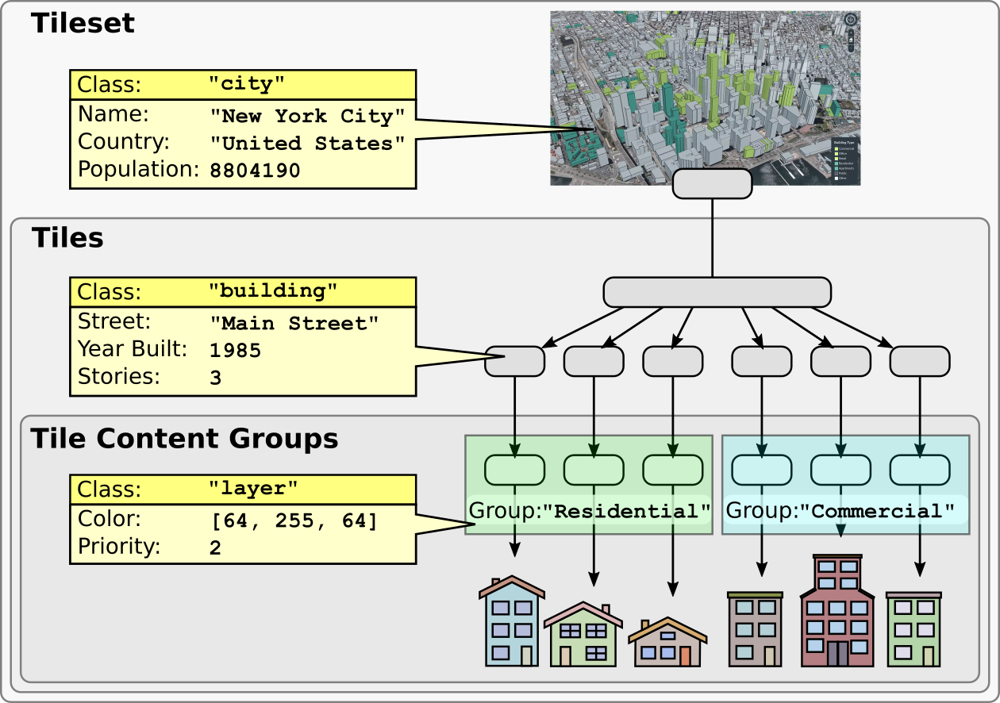

<!-- omit in toc -->
# 3DTILES_metadata Extension

<!-- omit in toc -->
## Contributors

* Sean Lilley, Cesium
* Peter Gagliardi, Cesium
* Sam Suhag, Cesium
* Patrick Cozzi, Cesium
* Bao Tran, Cesium

<!-- omit in toc -->
## Status

Draft

<!-- omit in toc -->
## Dependencies

Written against the 3D Tiles 1.0 specification.

Adds new functionality to the [`3DTILES_implicit_tiling` extension](../3DTILES_implicit_tiling). See [Implicit Tile Metadata](#implicit-tile-metadata).

<!-- omit in toc -->
## Optional vs. Required

This extension is optional, meaning it should be placed in the tileset JSON `extensionsUsed` list, but not in the `extensionsRequired` list.

<!-- omit in toc -->
## Contents

- [Overview](#overview)
- [Use Cases](#use-cases)
- [Compatibility Notes](#compatibility-notes)
- [Concepts](#concepts)
  - [Schemas](#schemas)
  - [Tileset Metadata](#tileset-metadata)
  - [Tile Metadata](#tile-metadata)
    - [Implicit Tile Metadata](#implicit-tile-metadata)
  - [Group Metadata](#group-metadata)
  - [Feature Metadata](#feature-metadata)
  - [Statistics](#statistics)
  - [Semantics](#semantics)
  - [Styling](#styling)
- [JSON Schema Reference](#json-schema-reference)
- [Revision History](#revision-history)

## Overview

This extension defines a standard mechanism for adding metadata to 3D Tiles. This includes:

* Tileset metadata - metadata about the tileset as a whole.
* Tile metadata - metadata about individual tiles.
* Group metadata - metadata about groups of content.
* Feature metadata - metadata about features. See the companion glTF extension [EXT_feature_metadata](https://github.com/CesiumGS/glTF/tree/3d-tiles-next/extensions/2.0/Vendor/EXT_feature_metadata).



A tileset defines a **schema**. A schema has a set of **classes** and **enums**. A class contains a set of **properties**, which may be numeric, boolean, string, enum, or array types.

**Entities** (such as tiles, features, etc.) conform to classes and contain **property values**. Depending on the context, property values may be stored in JSON or binary.

**Statistics** provide aggregate information about the metadata. For example, statistics may include the min/max values of a numeric property for mapping property values to color ramps with the [declarative styling language](../../specification/Styling) or the number of enum occurrences for creating histograms.

By default, properties do not have any inherent meaning. A property may be assigned a **semantic**, an identifier that describes how the property should be interpreted. The full list of built-in semantics can be found in the [Cesium Metadata Semantic Reference](../../specification/Metadata/Semantics). Tileset authors may define their own application- or domain-specific semantics separately.

This extension implements the [Cesium 3D Metadata Specification](../../specification/Metadata), which describes the metadata format in full detail.

## Use Cases

_This section is non-normative_

This extension is designed with several new use cases in mind.

* An application can style tilesets using metadata stored at per-tileset, per-tile, per-group, and per-feature granularity
* An application can see what metadata is available before requesting content, e.g. for populating a UI
* Tileset authors can extend metadata with their own semantic data model
* Metadata schemas can be shared within a tileset and across different tilesets
* A runtime engine can optimize traversal algorithms by using per-tile metadata
* An application can create a layering system by adding show/hide or color styles for groups, as well as selectively loading groups on demand

## Compatibility Notes

This extension is independent of the [Batch Table](../../specification/TileFormats/BatchTable) used in the Batched 3D Model, Instanced 3D Model, and Point Cloud formats. Similarly, this extension is independent of the [`properties`](../../specification/schema/properties.schema.json) object in tileset JSON.

glTF models in Batched 3D Model or Instanced 3D Model content must not use the [EXT_feature_metadata](https://github.com/CesiumGS/glTF/tree/3d-tiles-next/extensions/2.0/Vendor/EXT_feature_metadata) extension. Instead use glTF content directly with [`3DTILES_content_gltf`](../3DTILES_content_gltf).

## Concepts

### Schemas

A schema defines a set of classes and enums used in a tileset. Classes serve as templates for entities - they provide a list of properties and the type information for those properties. Enums define the allowable values for enum properties. Schemas are defined in full detail in the [Cesium 3D Metadata Specification](../../specification/Metadata#schemas).

A schema may be embedded in the extension directly or referenced externally with the `schemaUri` property. Multiple tilesets and glTF contents may refer to the same external schema to avoid duplication.

This example shows a schema with a `building` class and `buildingType` enum. Later examples show how entities declare their class and supply property values.

```jsonc
{
  "extensions": {
    "3DTILES_metadata": {
      "schema": {
        "classes": {
          "building": {
            "properties": {
              "height": {
                "type": "FLOAT32"
              },
              "owners": {
                "description": "Names of the owners",
                "type": "ARRAY",
                "componentType": "STRING"
              },
              "buildingType": {
                "type": "ENUM",
                "enumType": "buildingType"
              }
            }
          }
        },
        "enums": {
          "buildingType": {
            "values": [
              {
                "name": "Residential",
                "value": 0
              },
              {
                "name": "Commercial",
                "value": 1
              },
              {
                "name": "Other",
                "value": 2
              }
            ]
          }
        }
      }
    }
  }
}
```

### Tileset Metadata

Metadata may be assigned to the tileset as a whole using the `tileset` object.

The `tileset` object may specify a `class` and contain property values. The `tileset` object may also specify a `name` and `description`.

Note that the optional property `country` is omitted in the example below.


```jsonc
{
  "extensions": {
    "3DTILES_metadata": {
      "schema": {
        "classes": {
          "city": {
            "properties": {
              "dateFounded": {
                "type": "STRING"
              },
              "population": {
                "type": "UINT32"
              },
              "country": {
                "type": "STRING",
                "optional": true,
                "default": "United States"
              }
            }
          }
        }
      },
      "tileset": {
        "name": "Philadelphia",
        "description": "Point cloud of Philadelphia",
        "class": "city",
        "properties": {
          "dateFounded": "October 27, 1682",
          "population": 1579000
        }
      }
    }
  }
}
```

### Tile Metadata

Metadata may be assigned to individual tiles. Tile metadata often contains spatial information to optimize traversal algorithms. The example below uses the built-in semantic `TILE_HORIZON_OCCLUSION_POINT` from the [Cesium Metadata Semantic Reference](../../specification/Metadata/Semantics).

```jsonc
{
  "extensions": {
    "3DTILES_metadata": {
      "schema": {
        "classes": {
          "tile": {
            "properties": {
              "horizonOcclusionPoint": {
                "type": "ARRAY",
                "componentType": "FLOAT64",
                "componentCount": 4,
                "semantic": "TILE_HORIZON_OCCLUSION_POINT",
              },
              "countries": {
                "description": "The countries that this tile overlaps",
                "type": "ARRAY",
                "componentType": "STRING"
              }
            }
          }
        }
      }
    }
  },
  "root": {
    "refine": "ADD",
    "geometricError": 19266.834945,
    "boundingVolume": {
      "region": [-2.356194490192345, 0.0, -1.5707963267948966, 0.7853981633974483, -2119.1943359375, 5615.173828125]
    },
    "content": {
      "uri": "terrain.b3dm"
    },
    "extensions": {
      "3DTILES_metadata": {
        "class": "tile",
        "properties": {
          "horizonOcclusionPoint": [-0.4142135640377178, -1.0000000040187549, 0.44683832670325535],
          "countries": ["United States", "Canada", "Mexico"]
        }
      }
    }
  }
}
```

#### Implicit Tile Metadata

When using the [`3DTILES_implicit_tiling` extension](../3DTILES_implicit_tiling) tile metadata is stored in subtree buffers. Tile metadata only exists for available tiles and is tightly packed by increasing tile index. See [Implicit Tiling Availability](../3DTILES_implicit_tiling#availability) for details about tile ordering. To access individual tile metadata, implementations may create a mapping from tile indices to tile metadata indices.

Below is an example subtree JSON:

```jsonc
{
  "buffers": [
    {
      "byteLength": 99692
    }
  ],
  "bufferViews": [
    {
      "buffer": 0,
      "byteLength": 688,
      "byteOffset": 0
    },
    {
      "buffer": 0,
      "byteLength": 688,
      "byteOffset": 688
    },
    {
      "buffer": 0,
      "byteLength": 2048,
      "byteOffset": 1376
    },
    {
      "buffer": 0,
      "byteLength": 49152,
      "byteOffset": 3424
    },
    {
      "buffer": 0,
      "byteLength": 24576,
      "byteOffset": 50528
    },
    {
      "buffer": 0,
      "byteLength": 8196,
      "byteOffset": 75104
    },
    {
      "buffer": 0,
      "byteLength": 16388,
      "byteOffset": 83304
    }
  ],
  "tileAvailability": {
    "bufferView": 0
  },
  "contentAvailability": {
    "bufferView": 1
  },
  "childSubtreeAvailability": {
    "bufferView": 2
  },
  "extensions": {
    "3DTILES_metadata": {
      "class": "tile",
      "properties": {
        "horizonOcclusionPoint": {
          "bufferView": 3
        },
        "countries": {
          "bufferView": 4,
          "arrayOffsetBufferView": 5,
          "stringOffsetBufferView": 6
        }
      }
    }
  }
}
```

### Group Metadata

Metadata may be assigned to groups. Groups represent collections of contents. Contents are assigned to groups with the `3DTILES_metadata` content extension.

Group metadata can be paired with [`3DTILES_multiple_contents`](../3DTILES_multiple_contents) to assign multiple contents in a tile to different groups.

```jsonc
{
  "extensions": {
    "3DTILES_metadata": {
      "schema": {
        "classes": {
          "layer": {
            "properties": {
              "color": {
                "type": "ARRAY",
                "componentType": "UINT8",
                "componentCount": 3
              },
              "priority": {
                "type": "UINT32"
              }
            }
          }
        }
      },
      "groups": {
        "buildings": {
          "class": "layer",
          "properties": {
            "color": [128, 128, 128],
            "priority": 0
          }
        },
        "trees": {
          "class": "layer",
          "properties": {
            "color": [10, 240, 30],
            "priority": 1
          }
        }
      }
    }
  },
  "root": {
    "refine": "ADD",
    "geometricError": 32768.0,
    "boundingVolume": {
      "region": [-1.707, 0.543, -1.706, 0.544, -10.3, 253.113]
    },
    "children": [
      {
        "geometricError": 0.0,
        "boundingVolume": {
          "region": [-1.707, 0.543, -1.706, 0.544, -10.3, 253.113]
        },
        "content": {
          "uri": "buildings.b3dm",
          "extensions": {
            "3DTILES_metadata": {
              "group": "buildings"
            }
          }
        }
      },
      {
        "geometricError": 0.0,
        "boundingVolume": {
          "region": [-1.707, 0.543, -1.706, 0.544, -10.3, 253.113]
        },
        "content": {
          "uri": "trees.i3dm",
          "extensions": {
            "3DTILES_metadata": {
              "group": "trees"
            }
          }
        }
      }
    ]
  }
}
```

### Feature Metadata

A feature is an entity that has both geometry and metadata, such as a 3D building in a city. Features are the finest level of granularity within the tileset.

Metadata may be assigned to features using the glTF extension [`EXT_feature_metadata`](https://github.com/CesiumGS/glTF/tree/3d-tiles-next/extensions/2.0/Vendor/EXT_feature_metadata).

Feature metadata classes may be included in the `3DTILES_metadata` schema. This lets an application know what classes exist before requesting content.

### Statistics

Statistics provide aggregate information about entities in a tileset. Statistics are provided on a per-class basis.

* `count` is the number of entities that conform to the class
* `properties` contains statistics about property values

Properties have the following built-in statistics:

Name|Description|Type
--|--|--
`min`|The minimum property value|Numeric types or fixed-length arrays of numeric types
`max`|The maximum property value|...
`mean`|The arithmetic mean of the property values|...
`median`|The median of the property values|...
`standardDeviation`|The standard deviation of the property values|...
`variance`|The variance of the property values|...
`sum`|The sum of the property values|...
`occurrences`|Number of enum occurrences|Enums or fixed-length arrays of enums

Tileset authors may define their own additional semantics, like `mode` in the example below.

```jsonc
{
  "extensions": {
    "3DTILES_metadata": {
      "schema": {
        "classes": {
          "building": {
            "properties": {
              "height": {
                "type": "FLOAT32"
              },
              "owners": {
                "type": "ARRAY",
                "componentType": "STRING"
              },
              "buildingType": {
                "type": "ENUM",
                "enumType": "buildingType"
              }
            }
          }
        },
        "enums": {
          "buildingType": {
            "valueType": "UINT16",
            "values": [
              {
                "name": "Residential",
                "value": 0
              },
              {
                "name": "Commercial",
                "value": 1
              },
              {
                "name": "Hospital",
                "value": 2
              },
              {
                "name": "Other",
                "value": 3
              }
            ]
          }
        }
      },
      "statistics": {
        "classes": {
          "building": {
            "count": 100000,
            "properties": {
              "height": {
                "min": 3.9,
                "max": 341.7,
                "mode": 5.0
              },
              "buildingType": {
                "occurrences": {
                  "Residential": 50000,
                  "Commercial": 40950,
                  "Hospital": 50
                }
              }
            }
          }
        }
      }
    }
  }
}
```

### Semantics

By default properties do not have any inherent meaning. A property may be assigned a **semantic**, an identifier that describes how the property should be interpreted. The full list of built-in semantics can be found in the [Cesium Metadata Semantic Reference](../../specification/Metadata/Semantics).

Tileset authors may define their own application- or domain-specific semantics separately.

The example below uses two built-in semantics, `NAME` and `ID`, and one custom semantic, `_HEIGHT`.

```jsonc
{
  "extensions": {
    "3DTILES_metadata": {
      "schema": {
        "classes": {
          "building": {
            "properties": {
              "name": {
                "type": "STRING",
                "semantic": "NAME"
              },
              "id": {
                "type": "STRING",
                "semantic": "ID"
              },
              "height": {
                "type": "FLOAT32",
                "semantic": "_HEIGHT"
              }
            }
          }
        }
      }
    }
  }
}
```

### Styling

TODO - requires more experimentation in CesiumJS

TODO - use semantics in styling language

## JSON Schema Reference

* [Tileset extension](#tileset-extension)
* [Tile extension](#tile-extension)
* [Content extension](#content-extension)
* [`3DTILES_implicit_tiling` subtree extension](#3dtiles_implicit_tiling-subtree-extension)

<!-- omit in toc -->
## Tileset Extension
* [`Tileset extension`](#reference-3dtiles_metadata-3d-tiles-extension) (root object)
* [`Schema `](#reference-schema)
   * [`Class`](#reference-class)
      * [`Class Property`](#reference-class-property)
   * [`Enum`](#reference-enum)
      * [`Enum Value`](#reference-enum-value)
* [`Tileset Metadata`](#reference-tileset)
* [`Group Metadata`](#reference-group)
* [`Statistics`](#reference-statistics)
   * [`Class Statistics`](#reference-statistics-class)
      * [`Property Statistics`](#reference-statistics-class-property)

---------------------------------------
<a name="reference-3dtiles_metadata-3d-tiles-extension"></a>
<!-- omit in toc -->
## Tileset extension

3D Tiles extension that defines metadata for a tileset.

**`Tileset extension` Properties**

|   |Type|Description|Required|
|---|---|---|---|
|**schema**|`schema`|An object defining classes and enums.|No|
|**schemaUri**|`string`|A uri to an external schema file.|No|
|**statistics**|`statistics`|An object containing statistics about entities.|No|
|**groups**|`object`|A dictionary, where each key is a group ID and each value is an object defining the group.|No|
|**tileset**|`tileset`|An object containing metadata about the tileset.|No|
|**extensions**|`any`||No|
|**extras**|`any`||No|

Additional properties are allowed.

<!-- omit in toc -->
#### Tileset extension.schema

An object defining classes and enums.

* **Type**: `schema`
* **Required**: No

<!-- omit in toc -->
#### Tileset extension.schemaUri

A uri to an external schema file.

* **Type**: `string`
* **Required**: No
* **Format**: uriref

<!-- omit in toc -->
#### Tileset extension.statistics

An object containing statistics about entities.

* **Type**: `statistics`
* **Required**: No

<!-- omit in toc -->
#### Tileset extension.groups

A dictionary, where each key is a group ID and each value is an object defining the group.

* **Type**: `object`
* **Required**: No
* **Type of each property**: `group`

<!-- omit in toc -->
#### Tileset extension.tileset

An object containing metadata about the tileset.

* **Type**: `tileset`
* **Required**: No

<!-- omit in toc -->
#### Tileset extension.extensions

* **Type**: `any`
* **Required**: No

<!-- omit in toc -->
#### Tileset extension.extras

* **Type**: `any`
* **Required**: No

---------------------------------------
<a name="reference-schema"></a>
<!-- omit in toc -->
### Schema 

An object defining classes and enums.

**`Schema ` Properties**

|   |Type|Description|Required|
|---|---|---|---|
|**name**|`string`|The name of the schema.|No|
|**description**|`string`|The description of the schema.|No|
|**version**|`string`|Application-specific version of the schema.|No|
|**classes**|`object`|A dictionary, where each key is a class ID and each value is an object defining the class.|No|
|**enums**|`object`|A dictionary, where each key is an enum ID and each value is an object defining the values for the enum.|No|
|**extensions**|`any`||No|
|**extras**|`any`||No|

Additional properties are allowed.

<!-- omit in toc -->
#### schema.name

The name of the schema.

* **Type**: `string`
* **Required**: No
* **Minimum Length**`: >= 1`

<!-- omit in toc -->
#### schema.description

The description of the schema.

* **Type**: `string`
* **Required**: No
* **Minimum Length**`: >= 1`

<!-- omit in toc -->
#### schema.version

Application-specific version of the schema.

* **Type**: `string`
* **Required**: No
* **Minimum Length**`: >= 1`

<!-- omit in toc -->
#### schema.classes

A dictionary, where each key is a class ID and each value is an object defining the class.

* **Type**: `object`
* **Required**: No
* **Type of each property**: `class`

<!-- omit in toc -->
#### schema.enums

A dictionary, where each key is an enum ID and each value is an object defining the values for the enum.

* **Type**: `object`
* **Required**: No
* **Type of each property**: `enum`

<!-- omit in toc -->
#### schema.extensions

* **Type**: `any`
* **Required**: No

<!-- omit in toc -->
#### schema.extras

* **Type**: `any`
* **Required**: No

---------------------------------------
<a name="reference-class"></a>
<!-- omit in toc -->
### Class

A class containing a set of properties.

**`Class` Properties**

|   |Type|Description|Required|
|---|---|---|---|
|**name**|`string`|The name of the class, e.g. for display purposes.|No|
|**description**|`string`|The description of the class.|No|
|**properties**|`object`|A dictionary, where each key is a property ID and each value is an object defining the property.|No|
|**extensions**|`any`||No|
|**extras**|`any`||No|

Additional properties are allowed.

<!-- omit in toc -->
#### class.name

The name of the class, e.g. for display purposes.

* **Type**: `string`
* **Required**: No
* **Minimum Length**`: >= 1`

<!-- omit in toc -->
#### class.description

The description of the class.

* **Type**: `string`
* **Required**: No
* **Minimum Length**`: >= 1`

<!-- omit in toc -->
#### class.properties

A dictionary, where each key is a property ID and each value is an object defining the property.

* **Type**: `object`
* **Required**: No
* **Type of each property**: `class.property`

<!-- omit in toc -->
#### class.extensions

* **Type**: `any`
* **Required**: No

<!-- omit in toc -->
#### class.extras

* **Type**: `any`
* **Required**: No

---------------------------------------
<a name="reference-class-property"></a>
<!-- omit in toc -->
### Class property

A class property.

**`Class property` Properties**

|   |Type|Description|Required|
|---|---|---|---|
|**name**|`string`|The name of the property, e.g. for display purposes.|No|
|**description**|`string`|The description of the property.|No|
|**type**|`string`|The property type. If `ENUM` is used, then `enumType` must also be specified. If `ARRAY` is used, then `componentType` must also be specified. `ARRAY` is a fixed-length array when `componentCount` is defined, and variable-length otherwise.| &#10003; Yes|
|**enumType**|`string`|An enum ID as declared in the `enums` dictionary. This value must be specified when `type` or `componentType` is `ENUM`.|No|
|**componentType**|`any`|When `type` is `ARRAY` this indicates the type of each component of the array. If `ENUM` is used, then `enumType` must also be specified.|No|
|**componentCount**|`integer`|The number of components per element for `ARRAY` elements.|No|
|**normalized**|`boolean`|Specifies whether integer values are normalized. This applies both when `type` is an integer type, or when `type` is `ARRAY` with a `componentType` that is an integer type. For unsigned integer types, values are normalized between `[0.0, 1.0]`. For signed integer types, values are normalized between [-1.0, 1.0]. For all other types, this property is ignored.|No, default: `false`|
|**max**|`number,array`|Maximum allowed values for property values. Only applicable for numeric types and fixed-length arrays of numeric types. For numeric types this is a single number. For fixed-length arrays this is an array with `componentCount` number of elements. `normalized` property has no effect on these values: they always correspond to the integer values.|No|
|**min**|`number,array`|Minimum allowed values for property values. Only applicable for numeric types and fixed-length arrays of numeric types. For numeric types this is a single number. For fixed-length arrays this is an array with `componentCount` number of elements. `normalized` property has no effect on these values: they always correspond to the integer values.|No|
|**default**|`boolean,number,string,array`|A default value to use when the property value is not defined. If used, `optional` must be set to true. The type of the default value must match the property definition: For `BOOLEAN` use `true` or `false`. For `STRING` use a JSON string. For numeric types use a JSON number. For `ENUM` use the enum `name`, not the integer value. For `ARRAY` use a JSON array containing values matching the `componentType`.|No|
|**optional**|`boolean`|If true, this property is optional.|No, default: `false`|
|**semantic**|`string`|An identifier that describes how this property should be interpreted. The semantic cannot be used by other properties in the class.|No|
|**extensions**|`any`||No|
|**extras**|`any`||No|

Additional properties are allowed.

<!-- omit in toc -->
#### class.property.name

The name of the property, e.g. for display purposes.

* **Type**: `string`
* **Required**: No
* **Minimum Length**`: >= 1`

<!-- omit in toc -->
#### class.property.description

The description of the property.

* **Type**: `string`
* **Required**: No
* **Minimum Length**`: >= 1`

<!-- omit in toc -->
#### class.property.type

The property type. If `ENUM` is used, then `enumType` must also be specified. If `ARRAY` is used, then `componentType` must also be specified. `ARRAY` is a fixed-length array when `componentCount` is defined, and variable-length otherwise.

* **Type**: `string`
* **Required**:  &#10003; Yes
* **Allowed values**:
   * `"INT8"`
   * `"UINT8"`
   * `"INT16"`
   * `"UINT16"`
   * `"INT32"`
   * `"UINT32"`
   * `"INT64"`
   * `"UINT64"`
   * `"FLOAT32"`
   * `"FLOAT64"`
   * `"BOOLEAN"`
   * `"STRING"`
   * `"ENUM"`
   * `"ARRAY"`

<!-- omit in toc -->
#### class.property.enumType

An enum ID as declared in the `enums` dictionary. This value must be specified when `type` or `componentType` is `ENUM`.

* **Type**: `string`
* **Required**: No

<!-- omit in toc -->
#### class.property.componentType

When `type` is `ARRAY` this indicates the type of each component of the array. If `ENUM` is used, then `enumType` must also be specified.

* **Type**: `any`
* **Required**: No
* **Allowed values**:
   * `INT8`
   * `UINT8`
   * `INT16`
   * `UINT16`
   * `INT32`
   * `UINT32`
   * `INT64`
   * `UINT64`
   * `FLOAT32`
   * `FLOAT64`
   * `BOOLEAN`
   * `STRING`
   * `ENUM`

<!-- omit in toc -->
#### class.property.componentCount

The number of components per element for `ARRAY` elements.

* **Type**: `integer`
* **Required**: No
* **Minimum**: ` >= 2`

<!-- omit in toc -->
#### class.property.normalized

Specifies whether integer values are normalized. This applies both when `type` is an integer type, or when `type` is `ARRAY` with a `componentType` that is an integer type. For unsigned integer types, values are normalized between `[0.0, 1.0]`. For signed integer types, values are normalized between [-1.0, 1.0]. For all other types, this property is ignored.

* **Type**: `boolean`
* **Required**: No, default: `false`

<!-- omit in toc -->
#### class.property.max

Maximum allowed values for property values. Only applicable for numeric types and fixed-length arrays of numeric types. For numeric types this is a single number. For fixed-length arrays this is an array with `componentCount` number of elements. `normalized` property has no effect on these values: they always correspond to the integer values.

* **Type**: `number,array`
* **Required**: No

<!-- omit in toc -->
#### class.property.min

Minimum allowed values for property values. Only applicable for numeric types and fixed-length arrays of numeric types. For numeric types this is a single number. For fixed-length arrays this is an array with `componentCount` number of elements. `normalized` property has no effect on these values: they always correspond to the integer values.

* **Type**: `number,array`
* **Required**: No

<!-- omit in toc -->
#### class.property.default

A default value to use when the property value is not defined. If used, `optional` must be set to true. The type of the default value must match the property definition: For `BOOLEAN` use `true` or `false`. For `STRING` use a JSON string. For numeric types use a JSON number. For `ENUM` use the enum `name`, not the integer value. For `ARRAY` use a JSON array containing values matching the `componentType`.

* **Type**: `boolean,number,string,array`
* **Required**: No

<!-- omit in toc -->
#### class.property.optional

If true, this property is optional.

* **Type**: `boolean`
* **Required**: No, default: `false`

<!-- omit in toc -->
#### class.property.semantic

An identifier that describes how this property should be interpreted. The semantic cannot be used by other properties in the class.

* **Type**: `string`
* **Required**: No
* **Minimum Length**`: >= 1`

<!-- omit in toc -->
#### class.property.extensions

* **Type**: `any`
* **Required**: No

<!-- omit in toc -->
#### class.property.extras

* **Type**: `any`
* **Required**: No

---------------------------------------
<a name="reference-enum"></a>
<!-- omit in toc -->
### Enum

An object defining the values of an enum.

**`Enum` Properties**

|   |Type|Description|Required|
|---|---|---|---|
|**name**|`string`|The name of the enum, e.g. for display purposes.|No|
|**description**|`string`|The description of the enum.|No|
|**valueType**|`string`|The type of the integer enum value.|No, default: `"UINT16"`|
|**values**|`enum.value` `[1-*]`|An array of enum values. Duplicate names or integer values are not allowed.| &#10003; Yes|
|**extensions**|`any`||No|
|**extras**|`any`||No|

Additional properties are allowed.

<!-- omit in toc -->
#### enum.name

The name of the enum, e.g. for display purposes.

* **Type**: `string`
* **Required**: No
* **Minimum Length**`: >= 1`

<!-- omit in toc -->
#### enum.description

The description of the enum.

* **Type**: `string`
* **Required**: No
* **Minimum Length**`: >= 1`

<!-- omit in toc -->
#### enum.valueType

The type of the integer enum value.

* **Type**: `string`
* **Required**: No, default: `"UINT16"`
* **Allowed values**:
   * `"INT8"`
   * `"UINT8"`
   * `"INT16"`
   * `"UINT16"`
   * `"INT32"`
   * `"UINT32"`
   * `"INT64"`
   * `"UINT64"`

<!-- omit in toc -->
#### enum.values

An array of enum values. Duplicate names or integer values are not allowed.

* **Type**: `enum.value` `[1-*]`
* **Required**: &#10003; Yes

<!-- omit in toc -->
#### enum.extensions

* **Type**: `any`
* **Required**: No

<!-- omit in toc -->
#### enum.extras

* **Type**: `any`
* **Required**: No

---------------------------------------
<a name="reference-enum-value"></a>
<!-- omit in toc -->
### Enum value

An enum value.

**`Enum value` Properties**

|   |Type|Description|Required|
|---|---|---|---|
|**name**|`string`|The name of the enum value.| &#10003; Yes|
|**description**|`string`|The description of the enum value.|No|
|**value**|`integer`|The integer enum value.| &#10003; Yes|
|**extensions**|`any`||No|
|**extras**|`any`||No|

Additional properties are allowed.

<!-- omit in toc -->
#### enum.value.name

The name of the enum value.

* **Type**: `string`
* **Required**: &#10003; Yes
* **Minimum Length**`: >= 1`

<!-- omit in toc -->
#### enum.value.description

The description of the enum value.

* **Type**: `string`
* **Required**: No
* **Minimum Length**`: >= 1`

<!-- omit in toc -->
#### enum.value.value

The integer enum value.

* **Type**: `integer`
* **Required**: &#10003; Yes

<!-- omit in toc -->
#### enum.value.extensions

* **Type**: `any`
* **Required**: No

<!-- omit in toc -->
#### enum.value.extras

* **Type**: `any`
* **Required**: No

---------------------------------------
<a name="reference-tileset"></a>
<!-- omit in toc -->
### Tileset Metadata

An object containing metadata about the tileset.

**`Tileset Metadata` Properties**

|   |Type|Description|Required|
|---|---|---|---|
|**name**|`string`|The name of the tileset, e.g. for display purposes.|No|
|**description**|`string`|The description of the tileset.|No|
|**class**|`string`|The class this metadata object conforms to. The value must be a class ID declared in the `classes` dictionary.|No|
|**properties**|`object`|A dictionary, where each key corresponds to a property ID in the class' `properties` dictionary and each value contains the property values. The type of the value must match the property definition: For `BOOLEAN` use `true` or `false`. For `STRING` use a JSON string. For numeric types use a JSON number. For `ENUM` use the enum `name`, not the integer value. For `ARRAY` use a JSON array containing values matching the `componentType`. Optional properties may be excluded from this dictionary.|No|
|**extensions**|`any`||No|
|**extras**|`any`||No|

Additional properties are allowed.

<!-- omit in toc -->
#### tileset.name

The name of the tileset, e.g. for display purposes.

* **Type**: `string`
* **Required**: No
* **Minimum Length**`: >= 1`

<!-- omit in toc -->
#### tileset.description

The description of the tileset.

* **Type**: `string`
* **Required**: No
* **Minimum Length**`: >= 1`

<!-- omit in toc -->
#### tileset.class

The class this metadata object conforms to. The value must be a class ID declared in the `classes` dictionary.

* **Type**: `string`
* **Required**: No

<!-- omit in toc -->
#### tileset.properties

A dictionary, where each key corresponds to a property ID in the class' `properties` dictionary and each value contains the property values. The type of the value must match the property definition: For `BOOLEAN` use `true` or `false`. For `STRING` use a JSON string. For numeric types use a JSON number. For `ENUM` use the enum `name`, not the integer value. For `ARRAY` use a JSON array containing values matching the `componentType`. Optional properties may be excluded from this dictionary.

* **Type**: `object`
* **Required**: No
* **Type of each property**: `boolean,number,string,array`

<!-- omit in toc -->
#### tileset.extensions

* **Type**: `any`
* **Required**: No

<!-- omit in toc -->
#### tileset.extras

* **Type**: `any`
* **Required**: No

---------------------------------------
<a name="reference-group"></a>
<!-- omit in toc -->
### Group Metadata

An object containing metadata about a group.

**`Group Metadata` Properties**

|   |Type|Description|Required|
|---|---|---|---|
|**name**|`string`|The name of the group, e.g. for display purposes.|No|
|**description**|`string`|The description of the group.|No|
|**class**|`string`|The class this metadata object conforms to. The value must be a class ID declared in the `classes` dictionary.|No|
|**properties**|`object`|A dictionary, where each key corresponds to a property ID in the class' `properties` dictionary and each value contains the property values. The type of the value must match the property definition: For `BOOLEAN` use `true` or `false`. For `STRING` use a JSON string. For numeric types use a JSON number. For `ENUM` use the enum `name`, not the integer value. For `ARRAY` use a JSON array containing values matching the `componentType`. Optional properties may be excluded from this dictionary.|No|
|**extensions**|`any`||No|
|**extras**|`any`||No|

Additional properties are allowed.

<!-- omit in toc -->
#### group.name

The name of the group, e.g. for display purposes.

* **Type**: `string`
* **Required**: No
* **Minimum Length**`: >= 1`

<!-- omit in toc -->
#### group.description

The description of the group.

* **Type**: `string`
* **Required**: No
* **Minimum Length**`: >= 1`

<!-- omit in toc -->
#### group.class

The class this metadata object conforms to. The value must be a class ID declared in the `classes` dictionary.

* **Type**: `string`
* **Required**: No

<!-- omit in toc -->
#### group.properties

A dictionary, where each key corresponds to a property ID in the class' `properties` dictionary and each value contains the property values. The type of the value must match the property definition: For `BOOLEAN` use `true` or `false`. For `STRING` use a JSON string. For numeric types use a JSON number. For `ENUM` use the enum `name`, not the integer value. For `ARRAY` use a JSON array containing values matching the `componentType`. Optional properties may be excluded from this dictionary.

* **Type**: `object`
* **Required**: No
* **Type of each property**: `boolean,number,string,array`

<!-- omit in toc -->
#### group.extensions

* **Type**: `any`
* **Required**: No

<!-- omit in toc -->
#### group.extras

* **Type**: `any`
* **Required**: No

---------------------------------------
<a name="reference-statistics"></a>
<!-- omit in toc -->
### Statistics

Statistics about entities.

**`Statistics` Properties**

|   |Type|Description|Required|
|---|---|---|---|
|**classes**|`object`|A dictionary, where each key is a class ID declared in the `classes` dictionary and each value is an object containing statistics about entities that conform to the class.|No|
|**extensions**|`any`||No|
|**extras**|`any`||No|

Additional properties are allowed.

<!-- omit in toc -->
#### statistics.classes

A dictionary, where each key is a class ID declared in the `classes` dictionary and each value is an object containing statistics about entities that conform to the class.

* **Type**: `object`
* **Required**: No
* **Type of each property**: `statistics.class`

<!-- omit in toc -->
#### statistics.extensions

* **Type**: `any`
* **Required**: No

<!-- omit in toc -->
#### statistics.extras

* **Type**: `any`
* **Required**: No

---------------------------------------
<a name="reference-statistics-class"></a>
<!-- omit in toc -->
### Class Statistics

Statistics about entities that conform to the class.

**`Class Statistics` Properties**

|   |Type|Description|Required|
|---|---|---|---|
|**count**|`integer`|The number of entities that conform to the class.|No|
|**properties**|`object`|A dictionary, where each key corresponds to a property ID in the class' `properties` dictionary and each value is an object containing statistics about property values.|No|
|**extensions**|`any`||No|
|**extras**|`any`||No|

Additional properties are allowed.

<!-- omit in toc -->
#### statistics.class.count

The number of entities that conform to the class.

* **Type**: `integer`
* **Required**: No
* **Minimum**: ` >= 0`

<!-- omit in toc -->
#### statistics.class.properties

A dictionary, where each key corresponds to a property ID in the class' `properties` dictionary and each value is an object containing statistics about property values.

* **Type**: `object`
* **Required**: No
* **Type of each property**: `statistics.class.property`

<!-- omit in toc -->
#### statistics.class.extensions

* **Type**: `any`
* **Required**: No

<!-- omit in toc -->
#### statistics.class.extras

* **Type**: `any`
* **Required**: No

---------------------------------------
<a name="reference-statistics-class-property"></a>
<!-- omit in toc -->
### Property Statistics

Statistics about property values.

**`Property Statistics` Properties**

|   |Type|Description|Required|
|---|---|---|---|
|**min**|`number,array`|The minimum property value. Only applicable for numeric types and fixed-length arrays of numeric types. For numeric types this is a single number. For fixed-length arrays this is an array with `componentCount` number of elements. The `normalized` property has no effect on these values.|No|
|**max**|`number,array`|The maximum property value. Only applicable for numeric types and fixed-length arrays of numeric types. For numeric types this is a single number. For fixed-length arrays this is an array with `componentCount` number of elements. The `normalized` property has no effect on these values.|No|
|**mean**|`number,array`|The arithmetic mean of the property values. Only applicable for numeric types and fixed-length arrays of numeric types. For numeric types this is a single number. For fixed-length arrays this is an array with `componentCount` number of elements. The `normalized` property has no effect on these values.|No|
|**median**|`number,array`|The median of the property values. Only applicable for numeric types and fixed-length arrays of numeric types. For numeric types this is a single number. For fixed-length arrays this is an array with `componentCount` number of elements. The `normalized` property has no effect on these values.|No|
|**standardDeviation**|`number,array`|The standard deviation of the property values. Only applicable for numeric types and fixed-length arrays of numeric types. For numeric types this is a single number. For fixed-length arrays this is an array with `componentCount` number of elements. The `normalized` property has no effect on these values.|No|
|**variance**|`number,array`|The variance of the property values. Only applicable for numeric types and fixed-length arrays of numeric types. For numeric types this is a single number. For fixed-length arrays this is an array with `componentCount` number of elements. The `normalized` property has no effect on these values.|No|
|**sum**|`number,array`|The sum of the property values. Only applicable for numeric types and fixed-length arrays of numeric types. For numeric types this is a single number. For fixed-length arrays this is an array with `componentCount` number of elements. The `normalized` property has no effect on these values.|No|
|**occurrences**|`object`|A dictionary, where each key corresponds to an enum `name` and each value is the number of occurrences of that enum. Only applicable when `type` or `componentType` is `ENUM`. For fixed-length arrays, this is an array with `componentCount` number of elements.|No|
|**extensions**|`any`||No|
|**extras**|`any`||No|

Additional properties are allowed.

<!-- omit in toc -->
#### statistics.class.property.min

The minimum property value. Only applicable for numeric types and fixed-length arrays of numeric types. For numeric types this is a single number. For fixed-length arrays this is an array with `componentCount` number of elements. The `normalized` property has no effect on these values.

* **Type**: `number,array`
* **Required**: No

<!-- omit in toc -->
#### statistics.class.property.max

The maximum property value. Only applicable for numeric types and fixed-length arrays of numeric types. For numeric types this is a single number. For fixed-length arrays this is an array with `componentCount` number of elements. The `normalized` property has no effect on these values.

* **Type**: `number,array`
* **Required**: No

<!-- omit in toc -->
#### statistics.class.property.mean

The arithmetic mean of the property values. Only applicable for numeric types and fixed-length arrays of numeric types. For numeric types this is a single number. For fixed-length arrays this is an array with `componentCount` number of elements. The `normalized` property has no effect on these values.

* **Type**: `number,array`
* **Required**: No

<!-- omit in toc -->
#### statistics.class.property.median

The median of the property values. Only applicable for numeric types and fixed-length arrays of numeric types. For numeric types this is a single number. For fixed-length arrays this is an array with `componentCount` number of elements. The `normalized` property has no effect on these values.

* **Type**: `number,array`
* **Required**: No

<!-- omit in toc -->
#### statistics.class.property.standardDeviation

The standard deviation of the property values. Only applicable for numeric types and fixed-length arrays of numeric types. For numeric types this is a single number. For fixed-length arrays this is an array with `componentCount` number of elements. The `normalized` property has no effect on these values.

* **Type**: `number,array`
* **Required**: No

<!-- omit in toc -->
#### statistics.class.property.variance

The variance of the property values. Only applicable for numeric types and fixed-length arrays of numeric types. For numeric types this is a single number. For fixed-length arrays this is an array with `componentCount` number of elements. The `normalized` property has no effect on these values.

* **Type**: `number,array`
* **Required**: No

<!-- omit in toc -->
#### statistics.class.property.sum

The sum of the property values. Only applicable for numeric types and fixed-length arrays of numeric types. For numeric types this is a single number. For fixed-length arrays this is an array with `componentCount` number of elements. The `normalized` property has no effect on these values.

* **Type**: `number,array`
* **Required**: No

<!-- omit in toc -->
#### statistics.class.property.occurrences

A dictionary, where each key corresponds to an enum `name` and each value is the number of occurrences of that enum. Only applicable when `type` or `componentType` is `ENUM`. For fixed-length arrays, this is an array with `componentCount` number of elements.

* **Type**: `object`
* **Required**: No
* **Type of each property**: `number,array`

<!-- omit in toc -->
#### statistics.class.property.extensions

* **Type**: `any`
* **Required**: No

<!-- omit in toc -->
#### statistics.class.property.extras

* **Type**: `any`
* **Required**: No

<!-- omit in toc -->
## Tile extension
* [`Tile extension`](#reference-3dtiles_metadata-tile-extension) (root object)

---------------------------------------
<a name="reference-3dtiles_metadata-tile-extension"></a>
<!-- omit in toc -->
### Tile extension

An object containing metadata about a tile. This extension must not be added to tiles using the `3DTILES_implicit_tiling` extension since tile metadata is provided separately in the subtrees.

**`Tile extension` Properties**

|   |Type|Description|Required|
|---|---|---|---|
|**class**|`string`|The class this metadata object conforms to. The value must be a class ID declared in the `classes` dictionary.|No|
|**properties**|`object`|A dictionary, where each key corresponds to a property ID in the class' `properties` dictionary and each value contains the property values. The type of the value must match the property definition: For `BOOLEAN` use `true` or `false`. For `STRING` use a JSON string. For numeric types use a JSON number. For `ENUM` use the enum `name`, not the integer value. For `ARRAY` use a JSON array containing values matching the `componentType`. Optional properties may be excluded from this dictionary.|No|
|**extensions**|`any`||No|
|**extras**|`any`||No|

Additional properties are allowed.

<!-- omit in toc -->
#### Tile extension.class

The class this metadata object conforms to. The value must be a class ID declared in the `classes` dictionary.

* **Type**: `string`
* **Required**: No

<!-- omit in toc -->
#### Tile extension.properties

A dictionary, where each key corresponds to a property ID in the class' `properties` dictionary and each value contains the property values. The type of the value must match the property definition: For `BOOLEAN` use `true` or `false`. For `STRING` use a JSON string. For numeric types use a JSON number. For `ENUM` use the enum `name`, not the integer value. For `ARRAY` use a JSON array containing values matching the `componentType`. Optional properties may be excluded from this dictionary.

* **Type**: `object`
* **Required**: No
* **Type of each property**: `boolean,number,string,array`

<!-- omit in toc -->
#### Tile extension.extensions

* **Type**: `any`
* **Required**: No

<!-- omit in toc -->
#### Tile extension.extras

* **Type**: `any`
* **Required**: No

<!-- omit in toc -->
## Content Extension
* [`Content extension`](#reference-3dtiles_metadata-content-extension) (root object)


---------------------------------------
<a name="reference-3dtiles_metadata-content-extension"></a>
<!-- omit in toc -->
### Content extension

An object containing metadata about a content.

**`Content extension` Properties**

|   |Type|Description|Required|
|---|---|---|---|
|**group**|`string`|The group this content belongs to. The value must be a group ID declared in the `groups` dictionary.|No|
|**extensions**|`any`||No|
|**extras**|`any`||No|

Additional properties are allowed.

<!-- omit in toc -->
#### Content extension.group

The group this content belongs to. The value must be a group ID declared in the `groups` dictionary.

* **Type**: `string`
* **Required**: No

<!-- omit in toc -->
#### Content extension.extensions

* **Type**: `any`
* **Required**: No

<!-- omit in toc -->
#### Content extension.extras

* **Type**: `any`
* **Required**: No

<!-- omit in toc -->
## `3DTILES_implicit_tiling` subtree extension
* [`3DTILES_implicit_tiling` subtree extension](#reference-3dtiles_metadata-extension-for-3dtiles_implicit_tiling-subtree) (root object)
* [`Subtree property`](#reference-subtree-property)


---------------------------------------
<a name="reference-3dtiles_metadata-extension-for-3dtiles_implicit_tiling-subtree"></a>
<!-- omit in toc -->
### `3DTILES_implicit_tiling` subtree extension

An object assigning tile metadata to implicit tiles in the subtree. Tile metadata only exists for available tiles and is tightly packed by increasing tile index. To access individual tile metadata, implementations may create a mapping from tile indices to tile metadata indices.

**`3DTILES_implicit_tiling subtree extension` Properties**

|   |Type|Description|Required|
|---|---|---|---|
|**class**|`string`|The class that tile metadata conforms to. The value must be a class ID declared in the `classes` dictionary.|No|
|**properties**|`object`|A dictionary, where each key corresponds to a property ID in the class' `properties` dictionary and each value is an object describing where property values are stored. Optional properties may be excluded from this dictionary.|No|
|**extensions**|`any`||No|
|**extras**|`any`||No|

Additional properties are allowed.

<!-- omit in toc -->
#### 3DTILES_implicit_tiling subtree.class

The class that tile metadata conforms to. The value must be a class ID declared in the `classes` dictionary.

* **Type**: `string`
* **Required**: No

<!-- omit in toc -->
#### 3DTILES_implicit_tiling subtree.properties

A dictionary, where each key corresponds to a property ID in the class' `properties` dictionary and each value is an object describing where property values are stored. Optional properties may be excluded from this dictionary.

* **Type**: `object`
* **Required**: No
* **Type of each property**: `subtree.property`

<!-- omit in toc -->
#### 3DTILES_implicit_tiling subtree.extensions

* **Type**: `any`
* **Required**: No

<!-- omit in toc -->
#### 3DTILES_implicit_tiling subtree.extras

* **Type**: `any`
* **Required**: No


---------------------------------------
<a name="reference-subtree-property"></a>
<!-- omit in toc -->
### Subtree property

An array of binary property values.

**`Subtree property` Properties**

|   |Type|Description|Required|
|---|---|---|---|
|**bufferView**|`integer`|The index of the buffer view containing property values. The data type of property values is determined by the property definition: When `type` is `BOOLEAN` values are packed into a bitfield. When `type` is `STRING` values are stored as byte sequences and decoded as UTF-8 strings. When `type` is a numeric type values are stored as the provided `type`. When `type` is `ENUM` values are stored as the enum's `valueType`. Each enum value in the buffer must match one of the allowed values in the enum definition. When `type` is `ARRAY` elements are packed tightly together and the data type is based on the `componentType` following the same rules as above. `arrayOffsetBufferView` is required for variable-size arrays and `stringOffsetBufferView` is required for strings (for variable-length arrays of strings, both are required). The buffer view `byteOffset` must be aligned to a multiple of 8 bytes.| &#10003; Yes|
|**offsetType**|`string`|The type of values in `arrayOffsetBufferView` and `stringOffsetBufferView`.|No, default: `"UINT32"`|
|**arrayOffsetBufferView**|`integer`|The index of the buffer view containing offsets for variable-length arrays. The number of offsets is equal to the number of available tiles plus one. The offsets represent the start positions of each array, with the last offset representing the position after the last array. The array length is computed using the difference between the current offset and the subsequent offset. If `componentType` is `STRING` the offsets index into the string offsets array (stored in `stringOffsetBufferView`), otherwise they index into the property array (stored in `bufferView`). The data type of these offsets is determined by `offsetType`. The buffer view `byteOffset` must be aligned to a multiple of 8 bytes in the same manner as the main `bufferView`|No|
|**stringOffsetBufferView**|`integer`|The index of the buffer view containing offsets for strings. The number of offsets is equal to the number of string components plus one. The offsets represent the byte offsets of each string in the main `bufferView`, with the last offset representing the byte offset after the last string. The string byte length is computed using the difference between the current offset and the subsequent offset. The data type of these offsets is determined by `offsetType`. The buffer view `byteOffset` must be aligned to a multiple of 8 bytes in the same manner as the main `bufferView`.|No|
|**extensions**|`any`||No|
|**extras**|`any`||No|

Additional properties are allowed.

<!-- omit in toc -->
#### subtree.property.bufferView

The index of the buffer view containing property values. The data type of property values is determined by the property definition: When `type` is `BOOLEAN` values are packed into a bitfield. When `type` is `STRING` values are stored as byte sequences and decoded as UTF-8 strings. When `type` is a numeric type values are stored as the provided `type`. When `type` is `ENUM` values are stored as the enum's `valueType`. Each enum value in the buffer must match one of the allowed values in the enum definition. When `type` is `ARRAY` elements are packed tightly together and the data type is based on the `componentType` following the same rules as above. `arrayOffsetBufferView` is required for variable-size arrays and `stringOffsetBufferView` is required for strings (for variable-length arrays of strings, both are required). The buffer view `byteOffset` must be aligned to a multiple of 8 bytes.

* **Type**: `integer`
* **Required**: &#10003; Yes
* **Minimum**: ` >= 0`

<!-- omit in toc -->
#### subtree.property.offsetType

The type of values in `arrayOffsetBufferView` and `stringOffsetBufferView`.

* **Type**: `string`
* **Required**: No, default: `"UINT32"`
* **Allowed values**:
   * `"UINT8"`
   * `"UINT16"`
   * `"UINT32"`
   * `"UINT64"`

<!-- omit in toc -->
#### subtree.property.arrayOffsetBufferView

The index of the buffer view containing offsets for variable-length arrays. The number of offsets is equal to the number of available tiles plus one. The offsets represent the start positions of each array, with the last offset representing the position after the last array. The array length is computed using the difference between the current offset and the subsequent offset. If `componentType` is `STRING` the offsets index into the string offsets array (stored in `stringOffsetBufferView`), otherwise they index into the property array (stored in `bufferView`). The data type of these offsets is determined by `offsetType`. The buffer view `byteOffset` must be aligned to a multiple of 8 bytes in the same manner as the main `bufferView`

* **Type**: `integer`
* **Required**: No
* **Minimum**: ` >= 0`

<!-- omit in toc -->
#### subtree.property.stringOffsetBufferView

The index of the buffer view containing offsets for strings. The number of offsets is equal to the number of string components plus one. The offsets represent the byte offsets of each string in the main `bufferView`, with the last offset representing the byte offset after the last string. The string byte length is computed using the difference between the current offset and the subsequent offset. The data type of these offsets is determined by `offsetType`. The buffer view `byteOffset` must be aligned to a multiple of 8 bytes in the same manner as the main `bufferView`.

* **Type**: `integer`
* **Required**: No
* **Minimum**: ` >= 0`

<!-- omit in toc -->
#### subtree.property.extensions

* **Type**: `any`
* **Required**: No

<!-- omit in toc -->
#### subtree.property.extras

* **Type**: `any`
* **Required**: No

## Revision History

* **Version 0.0.0** November 6, 2020
  * Initial draft
* **Version 1.0.0** February 25, 2021
  * Changes to properties
    * Removed `FLOAT16` type
    * Removed `BLOB` type and `blobByteLength` property
    * Removed `stringByteLength` property
    * Added optional `semantic` property
    * Added enum support. Added `ENUM` to `type` and `componentType` and added `enumType` property.
    * `min` and `max` are now numbers instead of single-element arrays for non-`ARRAY` properties
  * Changes to `3DTILES_metadata` extension object
    * Added `schema` which contains `classes` and `enumas`
    * Added `schemaUri` which refers to an external schema JSON file
    * Added `groups` which contain metadata about groups of content. Contents are assigned to groups with the `3DTILES_metadata` content extension.
    * Added `statistics` which provide aggregate information about select properties within a tileset.
  * Added tile metadata. A tile may specify its class and property values with the `3DTILES_metadata` tile extension object.
  * Added support for tile metadata in the `3DTILES_implicit_tiling` extension. Tile metadata may be provided for each subtree in binary.
