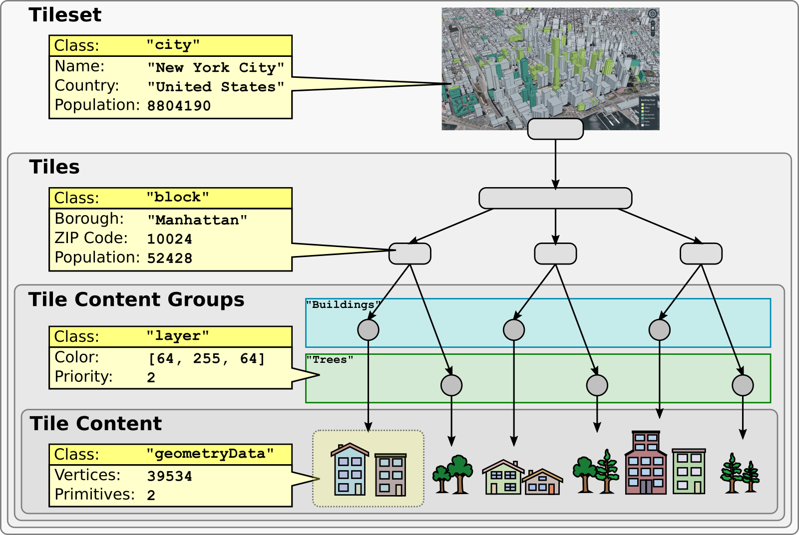

<!-- omit in toc -->
# 3DTILES_metadata Extension

<!-- omit in toc -->
## Contributors

* Sean Lilley, Cesium
* Peter Gagliardi, Cesium
* Sam Suhag, Cesium
* Patrick Cozzi, Cesium
* Bao Tran, Cesium

<!-- omit in toc -->
## Status

Draft

<!-- omit in toc -->
## Dependencies

Written against the 3D Tiles 1.0 specification.

Adds new functionality to the [`3DTILES_implicit_tiling` extension](../3DTILES_implicit_tiling). See [Implicit Tile Metadata](#implicit-tile-metadata).

<!-- omit in toc -->
## Optional vs. Required

This extension is optional, meaning it should be placed in the tileset JSON `extensionsUsed` list, but not in the `extensionsRequired` list.

<!-- omit in toc -->
## Contents

- [Overview](#overview)
- [Use Cases](#use-cases)
- [Compatibility Notes](#compatibility-notes)
- [Concepts](#concepts)
  - [Schemas](#schemas)
  - [Tileset Metadata](#tileset-metadata)
  - [Tile Metadata](#tile-metadata)
    - [Implicit Tile Metadata](#implicit-tile-metadata)
  - [Group Metadata](#group-metadata)
  - [Feature Metadata](#feature-metadata)
  - [Statistics](#statistics)
  - [Semantics](#semantics)
  - [Styling](#styling)
- [JSON Schema Reference](#json-schema-reference)
- [Revision History](#revision-history)

## Overview

This extension defines a standard mechanism for adding metadata to 3D Tiles. This includes:

* Tileset metadata - metadata about the tileset as a whole.
* Tile metadata - metadata about individual tiles.
* Group metadata - metadata about groups of content.
* Feature metadata - metadata about features. See the companion glTF extension [EXT_mesh_features](https://github.com/CesiumGS/glTF/tree/3d-tiles-next/extensions/2.0/Vendor/EXT_mesh_features).



A tileset defines a **schema**. A schema has a set of **classes** and **enums**. A class contains a set of **properties**, which may be numeric, boolean, string, enum, array, vector, or matrix types.

**Entities** (such as tiles, features, etc.) conform to classes and contain **property values**. Depending on the context, property values may be stored in JSON or binary.

**Statistics** provide aggregate information about the metadata. For example, statistics may include the min/max values of a numeric property for mapping property values to color ramps with the [declarative styling language](../../specification/Styling) or the number of enum occurrences for creating histograms.

By default, properties do not have any inherent meaning. A property may be assigned a **semantic**, an identifier that describes how the property should be interpreted. The full list of built-in semantics can be found in the [Cesium Metadata Semantic Reference](../../specification/Metadata/Semantics). Tileset authors may define their own application- or domain-specific semantics separately.

This extension implements the [Cesium 3D Metadata Specification](../../specification/Metadata), which describes the metadata format in full detail.

## Use Cases

_This section is non-normative_

This extension is designed with several new use cases in mind.

* An application can style tilesets using metadata stored at per-tileset, per-tile, per-group, and per-feature granularity
* An application can see what metadata is available before requesting content, e.g. for populating a UI
* Tileset authors can extend metadata with their own semantic data model
* Metadata schemas can be shared within a tileset and across different tilesets
* A runtime engine can optimize traversal algorithms by using per-tile metadata
* An application can create a layering system by adding show/hide or color styles for groups, as well as selectively loading groups on demand

## Compatibility Notes

This extension is independent of the [Batch Table](../../specification/TileFormats/BatchTable) used in the Batched 3D Model, Instanced 3D Model, and Point Cloud formats. Similarly, this extension is independent of the [`properties`](../../specification/schema/properties.schema.json) object in tileset JSON.

glTF models in Batched 3D Model or Instanced 3D Model content must not use the [EXT_mesh_features](https://github.com/CesiumGS/glTF/tree/3d-tiles-next/extensions/2.0/Vendor/EXT_mesh_features) extension. Instead use glTF content directly with [`3DTILES_content_gltf`](../3DTILES_content_gltf).

## Concepts

### Schemas

A schema defines a set of classes and enums used in a tileset. Classes serve as templates for entities - they provide a list of properties and the type information for those properties. Enums define the allowable values for enum properties. Schemas are defined in full detail in the [Cesium 3D Metadata Specification](../../specification/Metadata#schemas).

A schema may be embedded in the extension directly or referenced externally with the `schemaUri` property. Multiple tilesets and glTF contents may refer to the same external schema to avoid duplication.

This example shows a schema with a `building` class and `buildingType` enum. Later examples show how entities declare their class and supply property values.

```jsonc
{
  "extensions": {
    "3DTILES_metadata": {
      "schema": {
        "classes": {
          "building": {
            "properties": {
              "height": {
                "componentType": "FLOAT32"
              },
              "owners": {
                "description": "Names of the owners",
                "type": "ARRAY",
                "componentType": "STRING"
              },
              "buildingType": {
                "componentType": "ENUM",
                "enumType": "buildingType"
              }
            }
          }
        },
        "enums": {
          "buildingType": {
            "values": [
              {
                "name": "Residential",
                "value": 0
              },
              {
                "name": "Commercial",
                "value": 1
              },
              {
                "name": "Other",
                "value": 2
              }
            ]
          }
        }
      }
    }
  }
}
```

### Tileset Metadata

Metadata may be assigned to the tileset as a whole using the `tileset` object.

The `tileset` object may specify a `class` and contain property values. The `tileset` object may also specify a `name` and `description`.

Note that the optional property `country` is omitted in the example below.


```jsonc
{
  "extensions": {
    "3DTILES_metadata": {
      "schema": {
        "classes": {
          "city": {
            "properties": {
              "dateFounded": {
                "componentType": "STRING",
                "required": true
              },
              "population": {
                "componentType": "UINT32",
                "required": true
              },
              "country": {
                "componentType": "STRING"
              }
            }
          }
        }
      },
      "tileset": {
        "name": "Philadelphia",
        "description": "Point cloud of Philadelphia",
        "class": "city",
        "properties": {
          "dateFounded": "October 27, 1682",
          "population": 1579000
        }
      }
    }
  }
}
```

### Tile Metadata

Metadata may be assigned to individual tiles. Tile metadata often contains spatial information to optimize traversal algorithms. The example below uses the built-in semantic `TILE_HORIZON_OCCLUSION_POINT` from the [Cesium Metadata Semantic Reference](../../specification/Metadata/Semantics).

```jsonc
{
  "extensions": {
    "3DTILES_metadata": {
      "schema": {
        "classes": {
          "tile": {
            "properties": {
              "horizonOcclusionPoint": {
                "type": "ARRAY",
                "componentType": "FLOAT64",
                "componentCount": 3,
                "semantic": "TILE_HORIZON_OCCLUSION_POINT",
              },
              "countries": {
                "description": "The countries that this tile overlaps",
                "type": "ARRAY",
                "componentType": "STRING"
              }
            }
          }
        }
      }
    }
  },
  "root": {
    "refine": "ADD",
    "geometricError": 19266.834945,
    "boundingVolume": {
      "region": [-2.356194490192345, 0.0, -1.5707963267948966, 0.7853981633974483, -2119.1943359375, 5615.173828125]
    },
    "content": {
      "uri": "terrain.b3dm"
    },
    "extensions": {
      "3DTILES_metadata": {
        "class": "tile",
        "properties": {
          "horizonOcclusionPoint": [-0.4142135640377178, -1.0000000040187549, 0.44683832670325535],
          "countries": ["United States", "Canada", "Mexico"]
        }
      }
    }
  }
}
```

#### Implicit Tile Metadata

When using the [`3DTILES_implicit_tiling` extension](../3DTILES_implicit_tiling) tile metadata is stored in subtree buffers. Tile metadata only exists for available tiles and is tightly packed by increasing tile index. See [Implicit Tiling Availability](../3DTILES_implicit_tiling#availability) for details about tile ordering. To access individual tile metadata, implementations may create a mapping from tile indices to tile metadata indices.

Below is an example subtree JSON:

```jsonc
{
  "buffers": [
    {
      "byteLength": 99692
    }
  ],
  "bufferViews": [
    {
      "buffer": 0,
      "byteLength": 688,
      "byteOffset": 0
    },
    {
      "buffer": 0,
      "byteLength": 688,
      "byteOffset": 688
    },
    {
      "buffer": 0,
      "byteLength": 2048,
      "byteOffset": 1376
    },
    {
      "buffer": 0,
      "byteLength": 49152,
      "byteOffset": 3424
    },
    {
      "buffer": 0,
      "byteLength": 24576,
      "byteOffset": 50528
    },
    {
      "buffer": 0,
      "byteLength": 8196,
      "byteOffset": 75104
    },
    {
      "buffer": 0,
      "byteLength": 16388,
      "byteOffset": 83304
    }
  ],
  "tileAvailability": {
    "bufferView": 0
  },
  "contentAvailability": {
    "bufferView": 1
  },
  "childSubtreeAvailability": {
    "bufferView": 2
  },
  "extensions": {
    "3DTILES_metadata": {
      "class": "tile",
      "properties": {
        "horizonOcclusionPoint": {
          "bufferView": 3
        },
        "countries": {
          "bufferView": 4,
          "arrayOffsetBufferView": 5,
          "stringOffsetBufferView": 6
        }
      }
    }
  }
}
```

### Group Metadata

Metadata may be assigned to groups. Groups represent collections of contents. Contents are assigned to groups with the `3DTILES_metadata` content extension.

Group metadata can be paired with [`3DTILES_multiple_contents`](../3DTILES_multiple_contents) to assign multiple contents in a tile to different groups.

```jsonc
{
  "extensions": {
    "3DTILES_metadata": {
      "schema": {
        "classes": {
          "layer": {
            "properties": {
              "color": {
                "type": "ARRAY",
                "componentType": "UINT8",
                "componentCount": 3
              },
              "priority": {
                "componentType": "UINT32"
              }
            }
          }
        }
      },
      "groups": {
        "buildings": {
          "class": "layer",
          "properties": {
            "color": [128, 128, 128],
            "priority": 0
          }
        },
        "trees": {
          "class": "layer",
          "properties": {
            "color": [10, 240, 30],
            "priority": 1
          }
        }
      }
    }
  },
  "root": {
    "refine": "ADD",
    "geometricError": 32768.0,
    "boundingVolume": {
      "region": [-1.707, 0.543, -1.706, 0.544, -10.3, 253.113]
    },
    "children": [
      {
        "geometricError": 0.0,
        "boundingVolume": {
          "region": [-1.707, 0.543, -1.706, 0.544, -10.3, 253.113]
        },
        "content": {
          "uri": "buildings.b3dm",
          "extensions": {
            "3DTILES_metadata": {
              "group": "buildings"
            }
          }
        }
      },
      {
        "geometricError": 0.0,
        "boundingVolume": {
          "region": [-1.707, 0.543, -1.706, 0.544, -10.3, 253.113]
        },
        "content": {
          "uri": "trees.i3dm",
          "extensions": {
            "3DTILES_metadata": {
              "group": "trees"
            }
          }
        }
      }
    ]
  }
}
```

### Feature Metadata

A feature is an entity that has both geometry and metadata, such as a 3D building in a city. Features are the finest level of granularity within the tileset.

Metadata may be assigned to features using the glTF extension [`EXT_mesh_features`](https://github.com/CesiumGS/glTF/tree/3d-tiles-next/extensions/2.0/Vendor/EXT_mesh_features).

Feature metadata classes may be included in the `3DTILES_metadata` schema. This lets an application know what classes exist before requesting content.

### Statistics

Statistics provide aggregate information about entities in a tileset. Statistics are provided on a per-class basis.

* `count` is the number of entities that conform to the class
* `properties` contains statistics about property values

Properties have the following built-in statistics:

Name|Description|Type
--|--|--
`min`|The minimum property value|Single-value numeric types, fixed-length arrays of numeric types, vector, and matrix types
`max`|The maximum property value|...
`mean`|The arithmetic mean of the property values|...
`median`|The median of the property values|...
`standardDeviation`|The standard deviation of the property values|...
`variance`|The variance of the property values|...
`sum`|The sum of the property values|...
`occurrences`|Number of enum occurrences|Enums or fixed-length arrays of enums

Tileset authors may define their own additional semantics, like `mode` in the example below.

```jsonc
{
  "extensions": {
    "3DTILES_metadata": {
      "schema": {
        "classes": {
          "building": {
            "properties": {
              "height": {
                "componentType": "FLOAT32"
              },
              "owners": {
                "type": "ARRAY",
                "componentType": "STRING"
              },
              "buildingType": {
                "componentType": "ENUM",
                "enumType": "buildingType"
              }
            }
          }
        },
        "enums": {
          "buildingType": {
            "valueType": "UINT16",
            "values": [
              {
                "name": "Residential",
                "value": 0
              },
              {
                "name": "Commercial",
                "value": 1
              },
              {
                "name": "Hospital",
                "value": 2
              },
              {
                "name": "Other",
                "value": 3
              }
            ]
          }
        }
      },
      "statistics": {
        "classes": {
          "building": {
            "count": 100000,
            "properties": {
              "height": {
                "min": 3.9,
                "max": 341.7,
                "mode": 5.0
              },
              "buildingType": {
                "occurrences": {
                  "Residential": 50000,
                  "Commercial": 40950,
                  "Hospital": 50
                }
              }
            }
          }
        }
      }
    }
  }
}
```

### Semantics

By default properties do not have any inherent meaning. A property may be assigned a **semantic**, an identifier that describes how the property should be interpreted. The full list of built-in semantics can be found in the [Cesium Metadata Semantic Reference](../../specification/Metadata/Semantics).

Tileset authors may define their own application- or domain-specific semantics separately.

The example below uses two built-in semantics, `NAME` and `ID`, and one custom semantic, `_HEIGHT`.

```jsonc
{
  "extensions": {
    "3DTILES_metadata": {
      "schema": {
        "classes": {
          "building": {
            "properties": {
              "name": {
                "componentType": "STRING",
                "semantic": "NAME"
              },
              "id": {
                "componentType": "STRING",
                "semantic": "ID"
              },
              "height": {
                "componentType": "FLOAT32",
                "semantic": "_HEIGHT"
              }
            }
          }
        }
      }
    }
  }
}
```

### Styling

TODO - requires more experimentation in CesiumJS

TODO - use semantics in styling language

## Schema

* [tileset.3DTILES_metadata.schema.json](./schema/tileset.3DTILES_metadata.schema.json)
* [tile.3DTILES_metadata.schema.json](./schema/tile.3DTILES_metadata.schema.json)
* [content.3DTILES_metadata.schema.json](./schema/content.3DTILES_metadata.schema.json)

## Revision History

* **Version 0.0.0** November 6, 2020
  * Initial draft
* **Version 1.0.0** February 25, 2021
  * Changes to properties
    * Removed `FLOAT16` type
    * Removed `BLOB` type and `blobByteLength` property
    * Removed `stringByteLength` property
    * Added optional `semantic` property
    * Added enum support. Added `ENUM` to `type` and `componentType` and added `enumType` property.
    * `min` and `max` are now numbers instead of single-element arrays for non-`ARRAY` properties
  * Changes to `3DTILES_metadata` extension object
    * Added `schema` which contains `classes` and `enumas`
    * Added `schemaUri` which refers to an external schema JSON file
    * Added `groups` which contain metadata about groups of content. Contents are assigned to groups with the `3DTILES_metadata` content extension.
    * Added `statistics` which provide aggregate information about select properties within a tileset.
  * Added tile metadata. A tile may specify its class and property values with the `3DTILES_metadata` tile extension object.
  * Added support for tile metadata in the `3DTILES_implicit_tiling` extension. Tile metadata may be provided for each subtree in binary.
* **Version 2.0.0** October 2021
  * Removed `optional` and added `required`. Properties are now assumed to be optional unless `required` is true.
  * Added `noData` for specifying a sentinel value that indicates missing data
  * Removed `default`
  * `NaN` and `Infinity` are now explicitly disallowed as property values
  * Relaxed buffer view alignment to component size, rather than strict 8-byte boundaries
  * Added vector and matrix types: `VEC2`, `VEC3`, `VEC4`, `MAT2`, `MAT3`, `MAT4`
  * Refactored `type` and `componentType` to avoid overlap. Properties that store a single value now have a `type` of `SINGLE` and a `componentType` of the desired type (e.g. `type: "SINGLE", componentType: "UINT8"`)
  * Class IDs, enum IDs, property IDs, and group IDs must now contain only alphanumeric and underscore characters
  * Split `offsetType` into `arrayOffsetType` and `stringOffsetType`