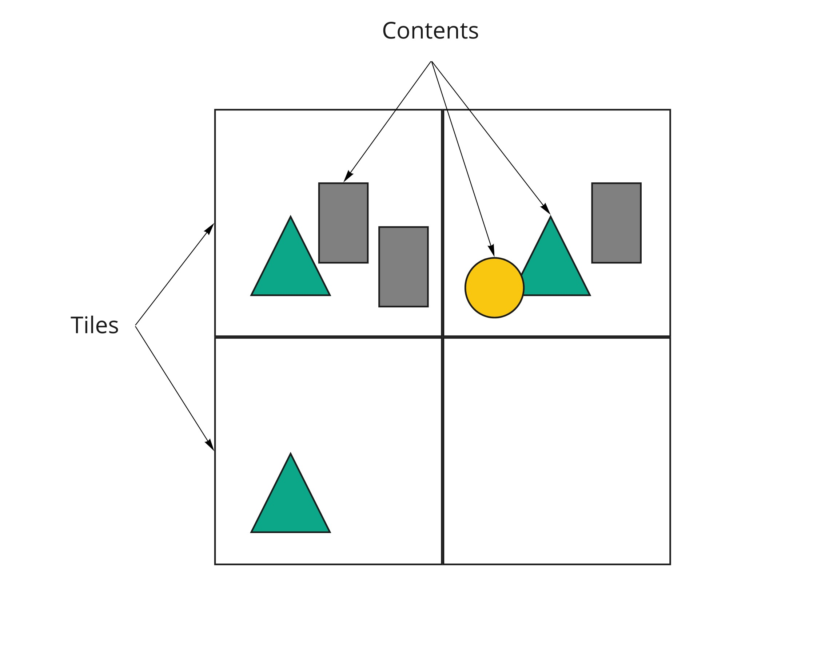
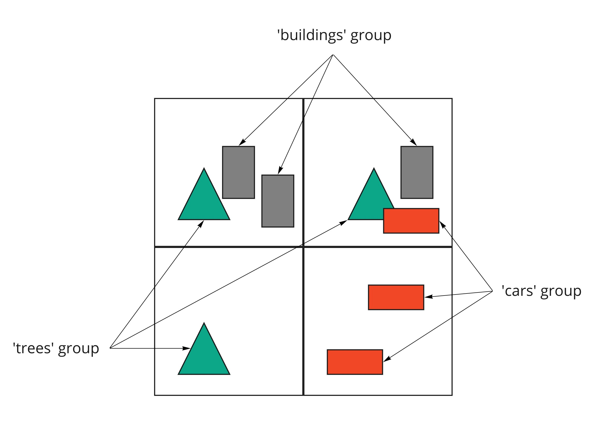

<!-- omit in toc -->
# 3DTILES_multiple_contents

<!-- omit in toc -->
## Contributors

* Sean Lilley, Cesium
* Peter Gagliardi, Cesium
* Sam Suhag, Cesium
* Patrick Cozzi, Cesium

<!-- omit in toc -->
## Status

Draft

<!-- omit in toc -->
## Dependencies

Written against the 3D Tiles 1.0 specification.

Adds new functionality to the [`3DTILES_implicit_tiling` extension](../3DTILES_implicit_tiling). See [Implicit Tiling](#implicit-tiling).

<!-- omit in toc -->
## Optional vs. Required

This extension is required, meaning it must be placed in both the `extensionsUsed` and `extensionsRequired` lists in the tileset JSON.

<!-- omit in toc -->
## Contents

- [Overview](#overview)
- [Concepts](#concepts)
  - [Metadata Groups](#metadata-groups)
  - [Implicit Tiling](#implicit-tiling)
- [Extension Schema Reference](#extension-schema-reference)
- [`3DTILES_implicit_tiling` Subtree JSON Reference](#3dtiles_implicit_tiling-subtree-json-reference)


## Overview

This extension adds support for multiple contents per tile. Examples of contents are Batched 3D Models, Point Clouds, or other [Tile Formats](../../specification#tile-format-specifications).



Multiple contents allows for more flexible tileset structures. For example, each tile could store two different representations of the same data using two contents: a point cloud and a triangle mesh, each representing the same surface. An application could selectively request only the point cloud contents.

When this extension is combined with [`3DTILES_metadata`](../3DTILES_metadata), contents can be organized into groups. Each group can have metadata associated with it.



In both cases, groups of contents can be used for selectively showing content or applying custom styling:


Besides styling, groups can also be used to filter out unused content resources to reduce bandwidth usage.

Multiple contents is also compatible with the [3DTILES_implicit_tiling](../3DTILES_implicit_tiling) extension. See the [Implicit Tiling](#implicit-tiling) section for more details.

## Concepts

A `tile` may be extended with the `3DTILES_multiple_contents` extension.

```jsonc
{
  "root": {
    "refine": "ADD",
    "geometricError": 0.0,
    "boundingVolume": {
      "region": [-1.707, 0.543, -1.706, 0.544, 203.895, 253.113]
    },
    "extensions": {
      "3DTILES_multiple_contents": {
        "content": [
          {
            "uri": "buildings.b3dm"
          },
          {
            "uri": "trees.i3dm"
          }
        ]
      }
    }
  }
}
```

When this extension is used the tile's `content` property must be omitted.

### Metadata Groups

This extension may be paired with the [`3DTILES_metadata` extension](../3DTILES_metadata) to assign metadata to each content.

```jsonc
{
  "extensions": {
    "3DTILES_metadata": {
      "schema": {
        "classes": {
          "layer": {
            "properties": {
              "color": {
                "type": "ARRAY",
                "componentType": "UINT8",
                "componentCount": 3
              },
              "order": {
                "componentType": "INT32"
              }
            }
          }
        }
      },
      "groups": {
        "buildings": {
          "class": "layer",
          "properties": {
            "color": [128, 128, 128],
            "order": 0
          }
        },
        "trees": {
          "class": "layer",
          "properties": {
            "color": [10, 240, 30],
            "order": 1
          }
        }
      }
    }
  },
  "root": {
    "refine": "ADD",
    "geometricError": 32768.0,
    "boundingVolume": {
      "region": [-1.707, 0.543, -1.706, 0.544, -10.3, 253.113]
    },
    "extensions": {
      "3DTILES_multiple_contents": {
        "content": [
          {
            "uri": "buildings.b3dm",
            "extensions": {
              "3DTILES_metadata": {
                "group": "buildings"
              }
            }
          },
          {
            "uri": "trees.i3dm",
            "extensions": {
              "3DTILES_metadata": {
                "group": "trees"
              }
            }
          }
        ]
      }
    }
  }
}
```

### Implicit Tiling

When using the [`3DTILES_implicit_tiling` extension](../3DTILES_implicit_tiling) `contentAvailability` is provided for each element in the content array. The subtree's top-level `contentAvailability` must be omitted.

Example tileset JSON:

```jsonc
{
  "root": {
    "refine": "ADD",
    "geometricError": 16384.0,
    "boundingVolume": {
      "region": [-1.707, 0.543, -1.706, 0.544, 203.895, 253.113]
    },
    "extensions": {
      "3DTILES_multiple_contents": {
        "content": [
          {
            "uri": "buildings/{level}/{x}/{y}.b3dm",
          },
          {
            "uri": "trees/{level}/{x}/{y}.i3dm",
          }
        ]    
      },
      "3DTILES_implicit_tiling": {
        "subdivisionScheme": "QUADTREE",
        "subtreeLevels": 10,
        "maximumLevel": 16,
        "subtrees": {
          "uri": "subtrees/{level}/{x}/{y}.subtree"
        }
      }
    }
  }
}
```

Example subtree JSON:

```jsonc
{
  "buffers": [
    {
      "byteLength": 262160
    }
  ],
  "bufferViews": [
    {
      "buffer": 0,
      "byteLength": 43691,
      "byteOffset": 0
    },
    {
      "buffer": 0,
      "byteLength": 131072,
      "byteOffset": 43696
    },
    {
      "buffer": 0,
      "byteLength": 43691,
      "byteOffset": 174768
    },
    {
      "buffer": 0,
      "byteLength": 43691,
      "byteOffset": 218464
    }
  ],
  "tileAvailability": {
    "bufferView": 0
  },
  "childSubtreeAvailability": {
    "bufferView": 1
  },
  "extensions": {
    "3DTILES_multiple_contents": {
      "contentAvailability": [
        {
          "bufferView": 2
        },
        {
          "bufferView": 3
        }
      ]
    }
  }
}
```

<!-- omit in toc -->
#### Metadata Groups in Implicit Tiling

If both the [`3DTILES_implicit_tiling`](../3DTILES_implicit_tiling) and [`3DTILES_metadata`](../3DTILES_metadata) extensions are used, each content template URI can be assigned to a metadata group.

Example tileset JSON:

```jsonc
{
  "extensions": {
    "3DTILES_metadata": {
      "schema": {
        "classes": {
          "layer": {
            "properties": {
              "color": {
                "type": "ARRAY",
                "componentType": "UINT8",
                "componentCount": 3
              },
              "order": {
                "componentType": "INT32"
              }
            }
          }
        }
      },
      "groups": {
        "buildings": {
          "class": "layer",
          "properties": {
            "color": [128, 128, 128],
            "order": 0
          }
        },
        "trees": {
          "class": "layer",
          "properties": {
            "color": [10, 240, 30],
            "order": 1
          }
        }
      }
    }
  },
  "root": {
    "refine": "ADD",
    "geometricError": 16384.0,
    "boundingVolume": {
      "region": [-1.707, 0.543, -1.706, 0.544, 203.895, 253.113]
    },
    "extensions": {
      "3DTILES_multiple_contents": {
        "content": [
          {
            "uri": "buildings/{level}/{x}/{y}.b3dm",
            "extensions": {
              "3DTILES_metadata": {
                "group": "buildings"
              }
            }
          },
          {
            "uri": "trees/{level}/{x}/{y}.i3dm",
            "extensions": {
              "3DTILES_metadata": {
                "group": "trees"
              }
            }
          }
        ]    
      },
      "3DTILES_implicit_tiling": {
        "subdivisionScheme": "QUADTREE",
        "subtreeLevels": 10,
        "maximumLevel": 16,
        "subtrees": {
          "uri": "subtrees/{level}/{x}/{y}.subtree"
        }
      }
    }
  }
}
```

## Extension Schema Reference

* [`3DTILES_multiple_contents tile extension`](#reference-3dtiles_multiple_contents-tile-extension) (root object)


---------------------------------------
<a name="reference-3dtiles_multiple_contents-tile-extension"></a>
<!-- omit in toc -->
#### 3DTILES_multiple_contents tile extension

Extends a tile to have multiple contents. When this extension is used the tile's `content` property must be omitted.

**`3DTILES_multiple_contents tile extension` Properties**

|   |Type|Description|Required|
|---|---|---|---|
|**content**|`array[1-*]`|An array of contents.| &#10003; Yes|

Additional properties are allowed.

<!-- omit in toc -->
##### 3DTILES_multiple_contents tile extension.content

An array of contents.

* **Type**: `array[1-*]`
* **Required**:  &#10003; Yes


## `3DTILES_implicit_tiling` Subtree JSON Reference

* [`3DTILES_multiple_contents extension for 3DTILES_implicit_tiling subtree`](#reference-3dtiles_multiple_contents-extension-for-3dtiles_implicit_tiling-subtree) (root object)

---------------------------------------
<a name="reference-3dtiles_multiple_contents-extension-for-3dtiles_implicit_tiling-subtree"></a>
<!-- omit in toc -->
### 3DTILES_multiple_contents extension for 3DTILES_implicit_tiling subtree

Content availability for the `3DTILES_multiple_contents` extension.

**`3DTILES_multiple_contents extension for 3DTILES_implicit_tiling subtree` Properties**

|   |Type|Description|Required|
|---|---|---|---|
|**contentAvailability**|`array[1-*]`|An array of content availability objects with a one-to-one mapping to the `content` array in the tile's `3DTILES_multiple_contents` extension object.| &#10003; Yes|

Additional properties are allowed.

<!-- omit in toc -->
#### 3DTILES_multiple_contents extension for 3DTILES_implicit_tiling subtree.contentAvailability

An array of content availability objects with a one-to-one mapping to the `content` array in the tile's `3DTILES_multiple_contents` extension object.

* **Type**: `array[1-*]`
* **Required**:  &#10003; Yes