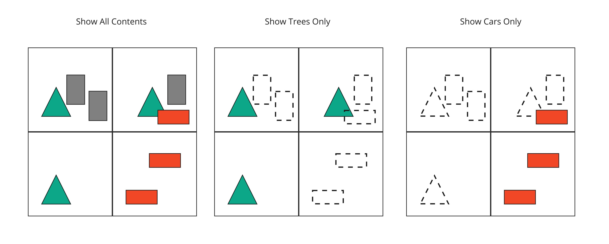

# 3DTILES_multiple_contents

## Contributors

* Sean Lilley, Cesium
* Peter Gagliardi, Cesium
* Marco Hutter, Cesium
* Don McCurdy, Independent
* Sam Suhag, Cesium
* Patrick Cozzi, Cesium

## Status

Draft

## Dependencies

Written against the 3D Tiles 1.0 specification.

## Optional vs. Required

This extension is required, meaning it must be placed in both the `extensionsUsed` and `extensionsRequired` lists in the tileset JSON.

## Overview

This extension allows storing more than one content per tile, and in effect, per single volume of space. Contents can be organized in various ways — e.g. as map layers or arbitrary groupings — which becomes particularly useful when combined with content group metadata defined by [3DTILES_metadata](../3DTILES_metadata).

Groups of contents can be used for selectively showing content or applying custom styling. Besides styling, groups can also be used to filter out unused content resources to reduce bandwidth usage.

When this extension is used the tile's `content` property must be omitted.




```jsonc
{
  "root": {
    "refine": "ADD",
    "geometricError": 0.0,
    "boundingVolume": {
      "region": [-1.707, 0.543, -1.706, 0.544, 203.895, 253.113]
    },
    "extensions": {
      "3DTILES_multiple_contents": {
        "content": [
          {
            "uri": "buildings.b3dm"
          },
          {
            "uri": "trees.i3dm"
          },
          {
            "uri": "cars.i3dm"
          }
        ]
      }
    }
  }
}
```
