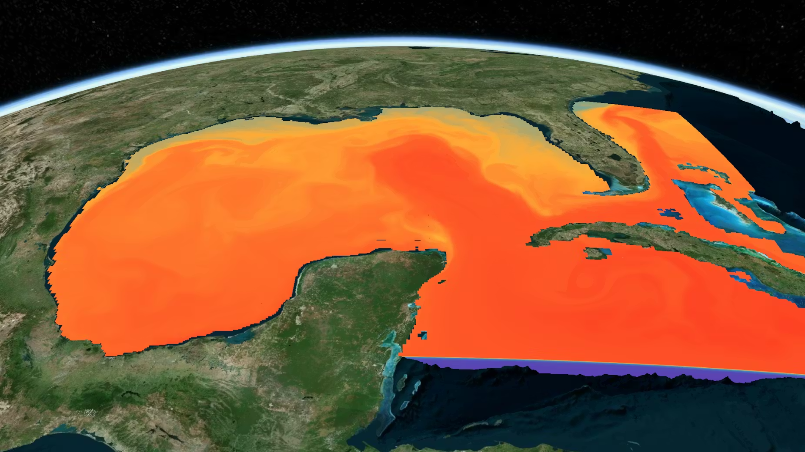
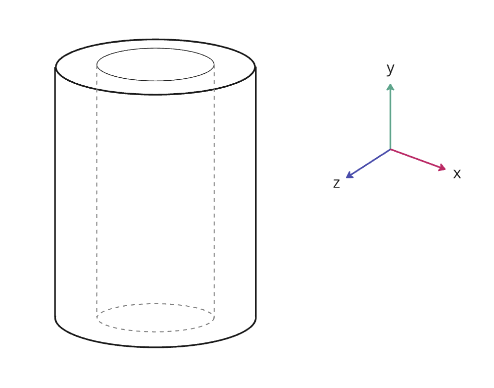
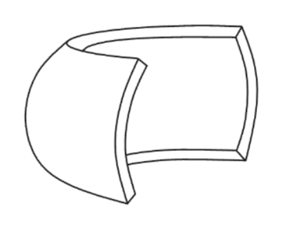
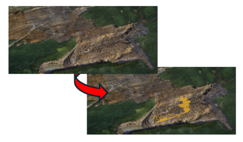
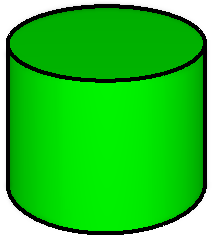
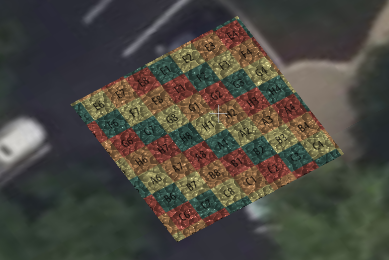
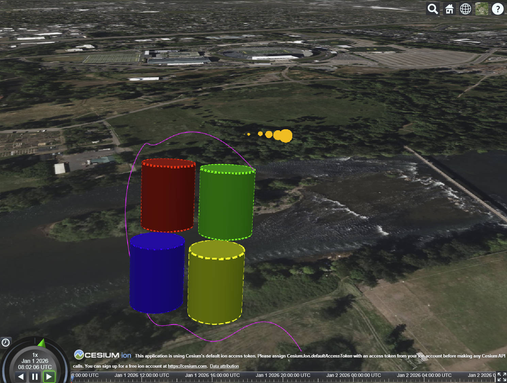
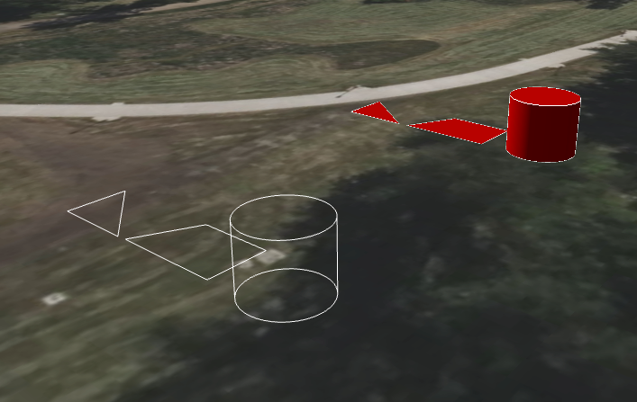
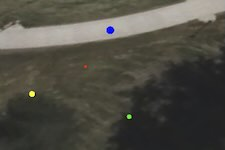

# 3D Tiles 2.0

**3D Tiles 2.0** continues the evolution of 3D Tiles, embracing new glTF concepts as well as bringing new features to 3D Tiles, including:

 - Vector Tiles
 - Voxels
 - Time Dynamic Tiles
 - AEC Extensions
 - 3D Gaussian Splatting

This folder and document provides links and information regarding these features and other 3D Tiles 2.0 information, as information becomes available.

## Vector Tiles

_**Overview:** Building upon 3D Tiles and glTF, 3D Tiles 2.0 uses a 3D-first approach allowing for a broad mix of both 2D and 3D use cases. This permits 3D Tiles to handle both AEC design model and Geospatial use cases such as road design projects, large-scale traditional maps, building footprints, and more._

_The addition of vector data within 3D Tiles doesn't replace existing formats but instead embraces interoperability with popular formats like Mapbox Vector Tiles, GeoJSON, and others. Styling is performed by using the declarative styling language that 3D Tiles users are already familiar with._

| | Extension |
| --- | --- |
| | [`KHR_mesh_primitive_restart`](https://github.com/KhronosGroup/glTF/pull/2569) (glTF 2.0 extension)   Allows selective relaxation of the prohibition against maximal index values in index buffers to allow use of primitive restart in glTF assets. This allows for more performant rendering of complex scenes. |
| | [`EXT_Mesh_polygon`](https://github.com/KhronosGroup/glTF/pull/2570) (glTF 2.0 extension)   Allows defining n-sided polygons optionally containing holes. |

## Voxels

_**Overview:** Much of what geospatial systems model, from weather and atmosphere to subsurface geology and ocean columns, doesn't live on a surface. Voxels are often the best representation for many of these systems, and in some cases, the only representation that makes sense. 3D Tiles 2.0 adds support for both dense and sparse voxels._

| | Extension |
| --- | --- |
|  | [`EXT_primitive_voxels`](https://github.com/KhronosGroup/glTF/pull/2496) (glTF 2.0 extension)   Enables support for volumetric data to be stored as voxels in glTF. Using this extension, a glTF mesh can define a uniform voxel grid with specified shapes and dimensions. The primitives attributes are inferred to fill the voxel grid as continuous data within the volume. |
|  | [`EXT_implicit_cylinder_region`](https://github.com/CesiumGS/glTF/tree/3d-tiles-next/extensions/2.0/Vendor/EXT_implicit_cylinder_region) (glTF 2.0 extension)   Adds support for implicit cylinder regions to the `KHR_implicit_shapes` extension for glTF. This is used by `EXT_primitive_voxels` for rendering voxels in a cylinder volume. |
|  | [`EXT_implicit_ellipsoid_region`](https://github.com/CesiumGS/glTF/tree/3d-tiles-next/extensions/2.0/Vendor/EXT_implicit_ellipsoid_region) (glTF 2.0 extension)   Adds support for implicit ellipsoid regions to the `KHR_implicit_shapes` extension for glTF. This is used by `EXT_primitive_voxes` for rendering voxels in an ellipsoidal region. |

## Time Dynamic Tiles

_**Overview:** Time-dynamic 3D Tiles is a major step forward for 3D Tiles and allows for time-dynamic visualizations. This work will open up the ability to see changes in topography, changes day-to-day of "fill" in construction sites, and many other needs of users._

| | Extension |
| --- | --- |
|  | [`3DTILES_content_conditional`](https://github.com/CesiumGS/3d-tiles/pull/834) (3D Tiles 1.1 extension)   Permits tiles to have conditional content that is selectable through `keys`, such as timestamps, revisions, or other _string_ values. |

## AEC Extensions

_**Overview:** To meet the requirements of the CAD-centric users of the AECO domain these extensions encode CAD rendering features that are typically required for accurate portrayal and optimizations to allow for the efficient encoding, decoding, and rendering of massive infrastructure design models._

| | Extension |
| --- | --- |
| | [`KHR_mesh_primitive_restart`](https://github.com/KhronosGroup/glTF/pull/2569) (glTF 2.0 extension)   Allows selective relaxation of the prohibition against maximal index values in index buffers to allow use of primitive restart in glTF assets. This allows for more performant rendering of complex scenes. |
|  | [`EXT_mesh_primitive_edge_visibility`](https://github.com/KhronosGroup/glTF/pull/2479) (glTF 2.0+ extension)   Augments a triangle mesh primitive with sufficient information to enable engines to produce non-photorealistic visualizations of 3D objects with visible edges. The edge visibility is encoded in a highly compact form to avoid excessively bloating the glTF asset. |
|  | [`EXT_texture_info_constant_lod`](https://github.com/CesiumGS/glTF/tree/vendor-extensions/extensions/2.0/Vendor/EXT_textureInfo_constant_lod) (glTF 2.0 extension)   Constant level-of-detail ("LOD") is a technique of texture coordinate generation which dynamically calculates texture coordinates to maintain a consistent texel-to-pixel ratio on screen, regardless of camera distance. This extension defines properties needed to calculate these dynamic texture coordinates: the number of times the texture is repeated per meter, an offset to shift the texture, and the minimum and maximum distance for which to clamp the texture. |
|  | [`BENTLEY_materials_line_style`](https://github.com/CesiumGS/glTF/pull/89) (glTF 2.0+ extension)   Defines a method for describing the visual style of lines within glTF material. It enables authors to specify line thickness and a repeating dash pattern. |
|  | [`BENTLEY_materials_planar_fill`](https://github.com/CesiumGS/glTF/tree/vendor-extensions/extensions/2.0/Vendor/BENTLEY_materials_planar_fill) (glTF 2.0 extension)   Two- and three-dimensional planar polygons with filled interiors are fundamental elements in many 3D modeling and computer-aided design (CAD) environments. This extension allows the behavior of a polygon's interior fill to be customized with the intent of being able to indicate a variety of meanings useful to CAD applications. |
|  | [`BENTLEY_materials_point_style`](https://github.com/CesiumGS/glTF/tree/vendor-extensions/extensions/2.0/Vendor/BENTLEY_materials_point_style) (glTF 2.0 extension)   Allows styling point primitives with custom diameters. Such diameter can be used to indicate a variety of meanings useful to CAD applications. |

## 3D Gaussian Splatting

_**Overview:** 3D Gaussian splatting is a neural rendering technique that offers high-fidelity, real-time novel view synthesis that is fast and efficient to train and render. This technology can capture details that traditional photogrammetry cannot, such as thin-structures like wires and cables._

| | Extension |
| --- | --- |
|  | [`KHR_gaussian_splatting`](https://github.com/KhronosGroup/glTF/tree/main/extensions/2.0/Khronos/KHR_gaussian_splatting) (glTF 2.0 extension)   Defines basic support for storing 3D Gaussian splats in glTF 2.0 and later assets, bringing structure and conformity to the 3D Gaussian splatting space. 3D Gaussian splatting uses fields of Gaussians that can be treated as a point cloud for the purposes of storage. |
| | [`KHR_gaussian_splatting_compression_spz_2`](https://github.com/KhronosGroup/glTF/pull/2531) (glTF 2.0 extension)   Defines support for SPZ compression of 3D Gaussian splats stored in glTF 2.0 or later. |

These extensions, combined with 3D Tiles hierarchical level-of-detail system, allow for efficient streaming of 3D Gaussian splats for a variety of use cases. Substations, bridges, radio masts, cell-phone towers, factories, and so many other common capture sites for the geospatial community that were difficult to model properly and accurately with traditional photogrammetry are now able to be represented by high-quality reconstructions that many users need.

## Presentations & Videos

 - [3D Tiles 2.0 presented at OGC Member Meeting](https://vimeo.com/1171949806?share=copy&fl=sv&fe=ci)
