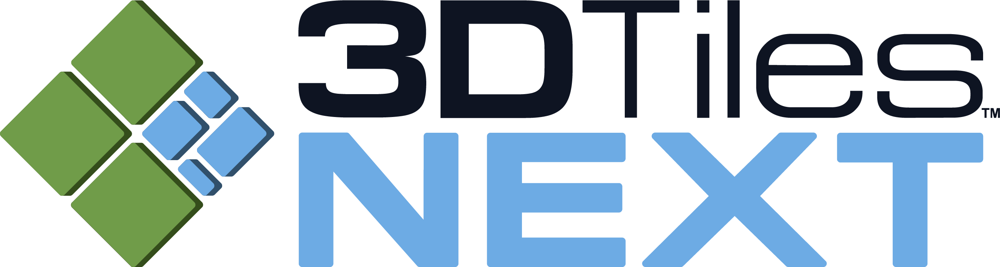
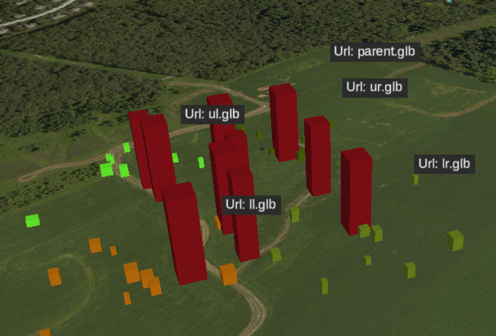
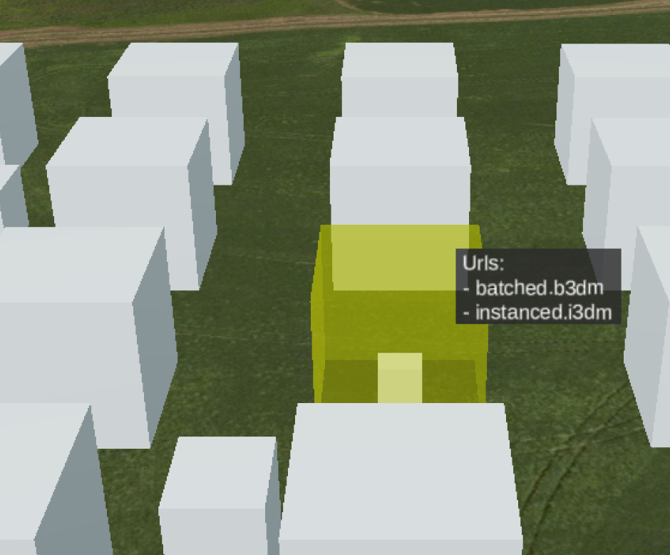
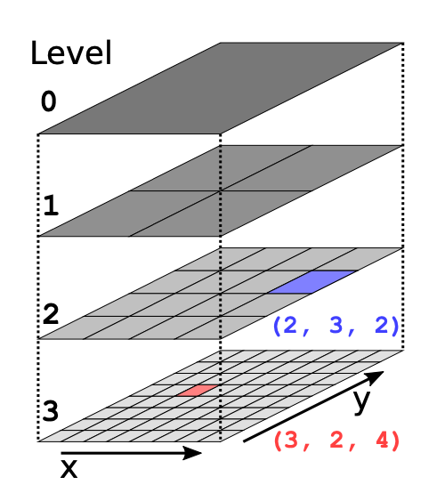
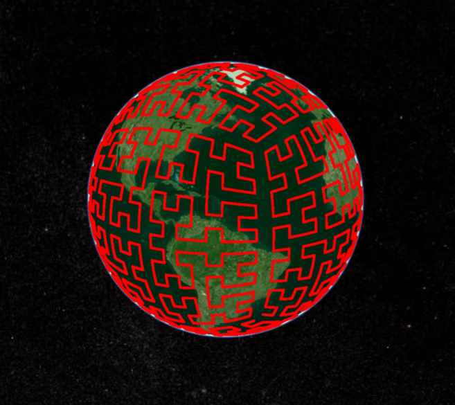
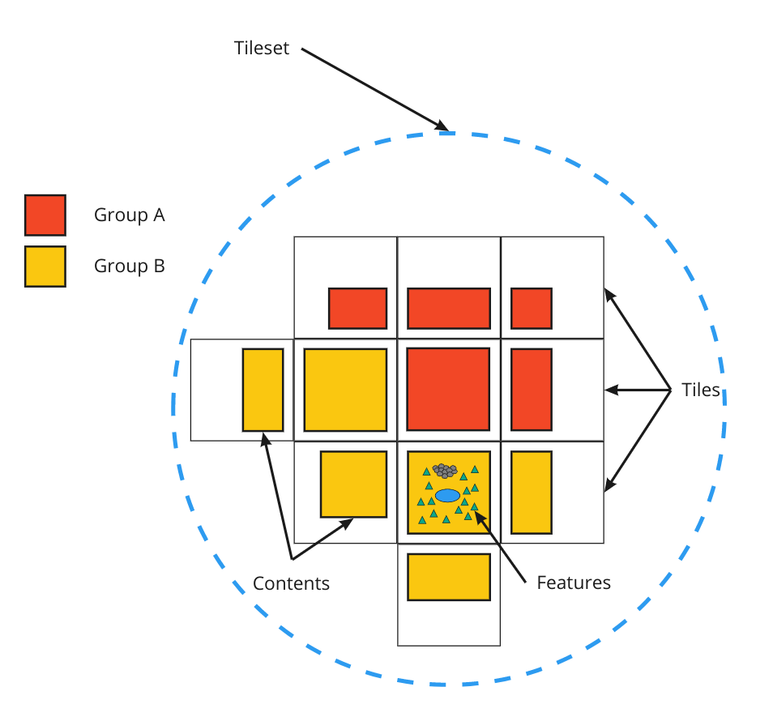
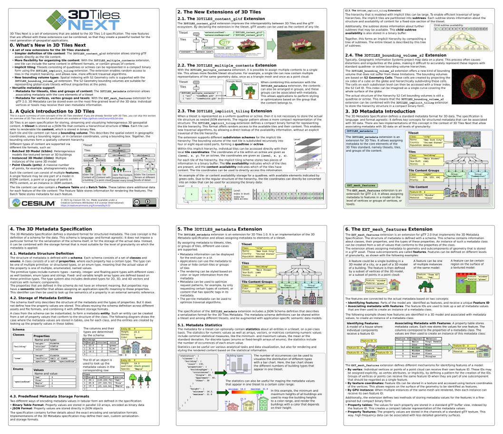

# 3D Tiles Next

> **Note:** ⚠️ **3D Tiles Next** is a set of draft extensions to the [3D Tiles 1.0](../specification) specification. These extensions have become part of the core specification in 3D Tiles 1.1. Please refer to the [main 3D Tiles 1.1 specification](../specification/README.md) for the latest information about 3D Tiles 1.1 ⚠️

## Tile Content

_**Overview:** glTF 2.0 assets may be used directly as tile content, without intermediate formats, improving interoperability with 3D content and tooling ecosystems. Tiles may reference multiple contents — for organization, styling, and filtering — and contents may be collected into groups similar to map layers in mapping applications._

|   | Extension |
|---|-----------|
|  | [`3DTILES_content_gltf`](../extensions/3DTILES_content_gltf) (3D Tiles 1.0 extension)   Allows references to glTF models (`.gltf`, `.glb`) directly in `tile.content`, without intermediate formats. Provides easier integration with a wider ecosystem of software producing glTF assets. |
|  | [`3DTILES_multiple_contents`](../extensions/3DTILES_multiple_contents) (3D Tiles 1.0 extension)   Allows storing more than one content model per tile, and in effect, per single volume of space. Contents can be organized in various ways — e.g. as map layers or arbitrary groupings — which becomes particularly useful when combined with content group metadata defined by `3DTILES_metadata`. |

glTF content is the future of 3D Tiles, and may be used in place of 3D Tiles 1.0 internal formats (`.b3dm`, `.i3dm`, `.pnts`) in the future. Those internal formats remain available, but glTF offers forward-compatibility with a wider ecosystem of 3D content tools, and with any current and future extensions developed for the glTF format. For technical details on switching to glTF tile content, see the developer [migration guide](../specification/TileFormats/glTF/README.md#appendix-a-migration-from-legacy-tile-formats).

## Implicit Tiling

_**Overview:** Common subdivision schemes and spatial index patterns may be declared without listing bounding volumes exhaustively. Reduces tileset size, and enables new optimizations including faster traversal, raycasting, random access, and spatial queries._

|   | Extension |
|---|-----------|
|  | [`3DTILES_implicit_tiling`](../extensions/3DTILES_implicit_tiling) (3D Tiles 1.0 extension)   Implicit tiling is an alternate method for describing tileset structure. Binary subtree files represent which tiles and contents exist within a fixed subdivision structure, such that tiles can be uniquely identified and streamed by their coordinates. The compact tree representation enables improved tree traversal algorithms, raycasting, and faster spatial queries. |
|  | [`3DTILES_bounding_volume_S2`](../extensions/3DTILES_bounding_volume_S2) (3D Tiles 1.0 extension)   Enables the use of [S2 Geometry](http://s2geometry.io/) as a bounding volume and tiling scheme. Particularly when combined with `3DTILES_implicit_tiling`, S2 is well suited for global scale tilesets, minimizing distortion near the poles. Cells at the same level of detail have approximately equal area. |

In addition to size and performance benefits, these extensions provide improved interoperability with geospatial formats and libraries such as CDB, TMS, WMTS, and S2.

## Metadata

_**Overview:** Metadata in 3D Tiles gains more expressiveness and flexibility, with a well-defined type system, new encoding options (e.g. JSON or binary), and a range of granularity options. Metadata may be associated with high-level objects like tilesets, tiles, or tile content groups, or with individual vertices and texels on glTF 2.0 geometry._

The foundation of these new metadata extensions is the format-agnostic [3D Metadata Specification](../specification/Metadata). The specification defines key concepts including schemas, property types, storage formats, and semantic meanings of properties. Extensions for metadata in 3D Tiles and glTF 2.0 are available now, and other formats can be extended to support the common format of the 3D Metadata Specification in the future.

|   | Extension |
|---|-----------|
|  | [`3DTILES_metadata`](../extensions/3DTILES_metadata) (3D Tiles 1.0 extension)   Defines 3D Metadata for tilesets, tiles, and tile content groups. Complements other 3D Tiles Next extensions with additional metadata-related features:   • In `3DTILES_implicit_tiling` tile metadata may be stored compactly in binary subtree files, allowing efficient streaming of large global tilesets and their metadata.  • In `3DTILES_multiple_contents` each tile content may be associated with a group and with group metadata, enabling improved content organization, styling, and filtering. |
|  | [`EXT_mesh_features`](https://github.com/CesiumGS/glTF/tree/3d-tiles-next/extensions/2.0/Vendor/EXT_mesh_features) (glTF 2.0 extension)   Defines 3D Metadata in glTF 2.0 assets. Combined with `3DTILES_content_gltf`, metadata is associated with subcomponents ("features") within a tile's content at various levels of granularity:   • *Per vertex:* Vertices may be grouped into features each having associated properties, similar to Batch Tables in 3D Tiles 1.0.  • *Per texel*: Textures storing property values and feature IDs allow detailed metadata even for optimized, low-poly geometry.  • *Per GPU instance:* GPU instances (defined by glTF extension `EXT_mesh_gpu_instancing`) may be assigned properties, similar to `.i3dm` files. |

The 3D Metadata Specification also provides a [Semantic Reference](../specification/Metadata/Semantics), used to describe the semantic meanings of properties. Semantics may be general-purpose (e.g. ID, name, or description), related to 3D Tiles (e.g. bounding volumes and occlusion data), or extended and customized for other domains.

For further use cases of feature metadata, see the [examples](https://github.com/CesiumGS/glTF/blob/proposal-EXT_mesh_features/extensions/2.0/Vendor/EXT_mesh_features/README.md#examples) in the `EXT_mesh_features` specification. Together, `3DTILES_metadata` and `EXT_mesh_features` allow flexible definitions of metadata at any level of granularity within a tileset. The illustration below provides an overview of these levels, in which the first levels ("Tileset", "Tiles", "Tile Content Groups") are provided by `3DTILES_metadata` and the lowest level ("Features") is provided by `EXT_mesh_features` in a glTF asset.

## 3D Tiles Next Reference Card

The [**3D Tiles Next Reference Card**](3d-tiles-next-reference-card.pdf) is an overview of the new extensions that are introduced with 3D Tiles Next. 

## Contributing

3D Tiles Next is an open specification, and contributions and feedback are encouraged. Over the next several months, our focus on 3D Tiles Next is to solidify the draft specifications and continue to facilitate ecosystem growth, keeping specification design pragmatic based on implementation experience.

Issues and pull requests are welcome on this repository. Please see our guidelines for contributing in [CONTRIBUTING.md](../CONTRIBUTING.md).

## Logo

The 3D Tiles next logo is available under the same usage terms of the [official Cesium logos](https://cesium.com/press) for the developer community to include in presentations, GitHub repos, etc - but this logo should not be for mainstream use since the **Next** suffix will be replaced with a version, [#556](https://github.com/CesiumGS/3d-tiles/issues/556).

The logo pack can be downloaded here: [3D-Tiles-Next-Logo.zip](https://github.com/CesiumGS/3d-tiles/raw/add-3d-tiles-next-logo-pack/next/logo/3D-Tiles-Next-Logo.zip)

