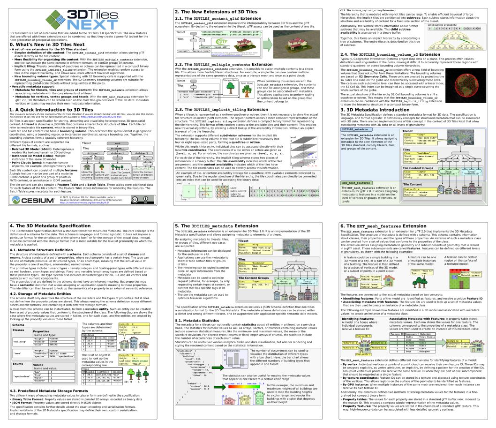

# 3D Tiles Next Overview

The [**3D Tiles Next Overview**](../3d-tiles-next-overview.pdf) is an overview of the new extensions that are introduced with 3D Tiles Next.

This guide augments the fully detailed [3D Tiles Next specification](https://github.com/CesiumGS/3d-tiles/tree/main/next).

## Changelog

* 2021-11-08: Initial release of version 1.0

## Source

The source files for generating the 3D Tiles Next reference card.

### Editing

The input files are SVG files, originally created with 
[Inkscape](https://inkscape.org/). They can be converted to PDF files either 
by opening them in Inkscape and saving them as PDF, or more conveniently,
using the `convertAllToPdf.bat` batch file: The file uses the command-line 
functionality of Inkscape to convert each SVG file from the input directory 
into a PDF file, which is then written into the `/output` subdirectory.

The resulting PDF files can be combined with any PDF tool, for example
[PDFtk Server](https://www.pdflabs.com/tools/pdftk-server/). The 
`combinePdfs.bat` batch file contains the call that combines all PDF files 
from the `/output` directory, and writes the result as into the base directory
as `3d-tiles-next-overview.pdf`.

### Resources 

The `/resources` subdirectory contains the images (screenshots and SVG versions
of the logos) that are used in the overview. They are not necessary for creating
the PDF files, but added here for reference. 
