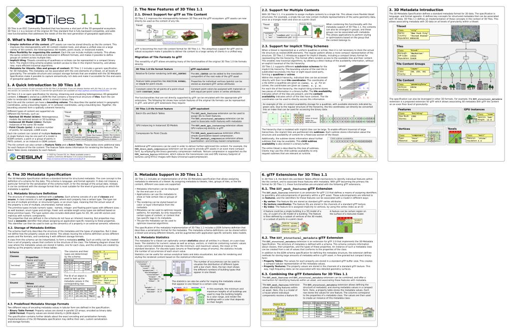

# 3D Tiles 1.1 Reference Card 

The [**3D Tiles 1.1 Reference Card**](../../3d-tiles-reference-card-1.1.pdf) is an overview of the new concepts that are introduced with 3D Tiles 1.1.

This guide augments the [3D Tiles 1.0 Reference Card](../../3d-tiles-reference-card.pdf) and the fully detailed [3D Tiles 1.1 specification](https://github.com/CesiumGS/3d-tiles/tree/draft-1.1/specification). 

## Source

This directory contains the source files for generating the 3D Tiles 1.1 reference card.

### Editing

The input files are SVG files, originally created with [Inkscape](https://inkscape.org/). They can be converted to PDF files either by opening them in Inkscape and saving them as PDF, or more conveniently, using the `convertAllToPdf.bat` batch file: The file uses the command-line functionality of Inkscape to convert each SVG file from the input directory into a PDF file, which is then written into the `/output` subdirectory.

The resulting PDF files can be combined with any PDF tool, for example [PDFtk Server](https://www.pdflabs.com/tools/pdftk-server/). The `combinePdfs.bat` batch file contains the call that combines all PDF files from the `/output` directory, and writes the result as into the base directory as `3d-tiles-reference-card-1.1.pdf`.

### Resources 

The `/resources` subdirectory contains the images (screenshots and SVG versions of the logos) that are used in the reference card. They are not necessary for creating the PDF files, but added here for reference.

## Acknowldgements

Thanks to [Marco Hutter](https://github.com/javagl), a long-time member of the glTF community, for designing the first version of the 3D Tiles 1.1 Reference Card.
