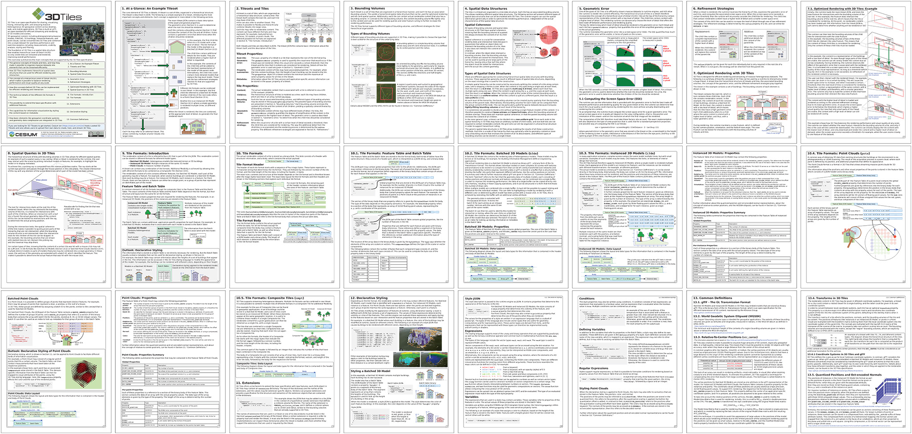

# 3D Tiles Reference Cards

The [**3D Tiles Reference Card**](../3d-tiles-reference-card.pdf) is an approachable and concise guide to learning about the main concepts in 3D Tiles.

The [**3D Tiles 1.1 Reference Card**](../3d-tiles-reference-card-1.1.pdf) presents the new concepts that have been introduced with 3D Tiles 1.1

### Versions

The following directories contain the sources for generating the reference cards:

- [1.0](1.0) - The sources for the 3D Tiles Reference Card
- [1.1](1.1) - The sources for the 3D Tiles 1.1 Reference Card

