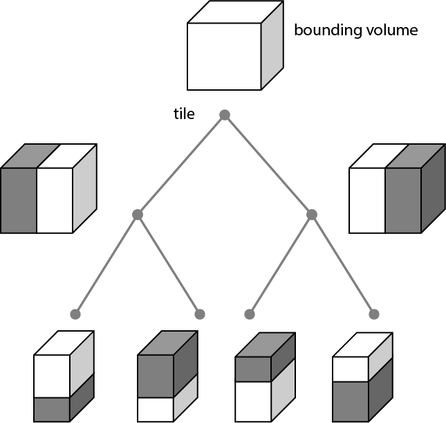

// Add the logo and introduction when this is shown on GitHub
ifdef::env-github[]

This document describes the specification for 3D Tiles, an open standard for streaming massive heterogeneous 3D geospatial datasets.
endif::[]

[#introduction]
== Introduction

// Definitions of the directory structure to ensure that relative
// links between ADOC files in sibling directories can be resolved.
ifdef::env-github[]
:url-specification: 
:url-specification-metadata: {url-specification}Metadata/
:url-specification-metadata-referenceimplementation: {url-specification-metadata}ReferenceImplementation/
:url-specification-metadata-referenceimplementation-schema: {url-specification-metadata-referenceImplementation}Schema/
:url-specification-metadata-semantics: {url-specification-metadata}Semantics/
:url-specification-styling: {url-specification}Styling/
endif::[]
ifndef::env-github[]
:url-specification:
:url-specification-metadata:
:url-specification-metadata-referenceimplementation:
:url-specification-metadata-referenceimplementation-schema:
:url-specification-metadata-semantics:
:url-specification-styling:
endif::[]

ifdef::env-github[]
// WARNING: Do not edit the URLs here. Update the url `extension-urls.adoc` and then run `update-urls.sh`!
// That will properly update the URLs across all documents.

// GITHUB_URL_START
:khronos-gltf-repo: https://github.com/KhronosGroup/glTF
:cesiumgs-gltf-repo-fork: https://github.com/CesiumGS/glTF
:3dtiles-extensions-url: {cesiumgs-gltf-repo-fork}/tree/3d-tiles-2.0/extensions/2.1/Vendor
:gltf-2_0-extensions-url: {cesiumgs-gltf-repo-fork}/tree/3d-tiles-2.0/extensions/2.0/Vendor
:bentley-extensions-url: {cesiumgs-gltf-repo-fork}/tree/vendor-extensions/extensions/2.0/Vendor

// 3DTILES Extensions
:gltf-ext-3dtiles_horizon_occlusion_point-url: {3dtiles-extensions-url}/3DTILES_horizon_occlusion_point/README.md 
:gltf-ext-3dtiles_implicit_tiling-url: {3dtiles-extensions-url}/3DTILES_implicit_tiling/README.md 
:gltf-ext-3dtiles_layers-url: {3dtiles-extensions-url}/3DTILES_layers/README.md 
:gltf-ext-3dtiles_shape_cylinder_region-url: {3dtiles-extensions-url}/3DTILES_shape_cylinder_region/README.md 
:gltf-ext-3dtiles_shape_ellipsoid_region-url: {3dtiles-extensions-url}/3DTILES_shape_ellipsoid_region/README.md 
:gltf-ext-3dtiles_shape_s2-url: {3dtiles-extensions-url}/3DTILES_shape_s2/README.md 
:gltf-ext-3dtiles_subtree-url: {3dtiles-extensions-url}/3DTILES_subtree/README.md 
:gltf-ext-3dtiles_tileset-url: {3dtiles-extensions-url}/3DTILES_tileset/README.md
:gltf-ext-3dtiles_tileset_vectors-url: {3dtiles-extensions-url}/3DTILES_tileset_vectors/README.md
:gltf-ext-3dtiles_tileset_voxels-url: {3dtiles-extensions-url}/3DTILES_tileset_voxels/README.md

// BENTLEY Extensions
:gltf-ext-bentley_materials_line_style-url: {bentley-extensions-url}/BENTLEY_materials_line_style/README.md
:gltf-ext-bentley_materials_point_style-url: {bentley-extensions-url}/BENTLEY_materials_point_style/README.md
:gltf-ext-bentley_materials_planar_fill-url: {bentley-extensions-url}/BENTLEY_materials_planar_fill/README.md

// EXT extensions
:gltf-ext-ext_georeference-url: {3dtiles-extensions-url}/EXT_georeference/README.md
:gltf-ext-ext_geospatial_crs-url: {3dtiles-extensions-url}/EXT_geospatial_crs/README.md
:gltf-ext-ext_geospatial_crs_wkid-url: {3dtiles-extensions-url}/EXT_geospatial_crs_wkid/README.md
:gltf-ext-ext_geospatial_crs_wkt2-url: {3dtiles-extensions-url}/EXT_geospatial_crs_wkt2/README.md
:gltf-ext-ext_instance_features-url: {3dtiles-extensions-url}/EXT_instance_features/README.md
:gltf-ext-ext_mesh_features-url: {3dtiles-extensions-url}/EXT_mesh_features/README.md
:gltf-ext-ext_mesh_polygon-url: {cesiumgs-gltf-repo-fork}/blob/donmccurdy/EXT_mesh_polygon/extensions/2.0/Vendor/EXT_mesh_polygon/README.md
:gltf-ext-ext_mesh_primitive_edge_visibility-url: {khronos-gltf-repo}/tree/main/extensions/2.0/Vendor/EXT_mesh_primitive_edge_visibility/README.md
:gltf-ext-ext_node_visibility_conditions-url: {3dtiles-extensions-url}/EXT_node_visibility_conditions/README.md
:gltf-ext-ext_node_visibility_volume-url: {3dtiles-extensions-url}/EXT_node_visibility_volume
:gltf-ext-ext_structural_metadata-url: {3dtiles-extensions-url}/EXT_structural_metadata/README.md 
:gltf-ext-ext_textureInfo_constant_lod-url: {bentley-extensions-url}/EXT_textureInfo_constant_lod/README.md
:gltf-ext-ext_voxels-url: {3dtiles-extensions-url}/EXT_voxels/README.md 

// KHR Extensions
:gltf-ext-khr_meshopt_compression-url: {khronos-gltf-repo}/tree/main/extensions/2.0/Khronos/KHR_meshopt_compression/README.md 
:gltf-ext-khr_mesh_primitive_restart-url: {cesiumgs-gltf-repo-fork}/tree/donmccurdy/KHR_mesh_primitive_restart/extensions/2.0/Khronos/KHR_mesh_primitive_restart/README.md
:gltf-ext-khr_gaussian_splatting_compression_spz_2-url: {cesiumgs-gltf-repo-fork}/tree/draft-splat-spz-split/extensions/2.0/Khronos/KHR_gaussian_splatting_compression_spz_2/README.md
:gltf-ext-khr_gaussian_splatting-url: {khronos-gltf-repo}/tree/main/extensions/2.0/Khronos/KHR_gaussian_splatting/README.md
:gltf-ext-khr_node_visibility-url: {khronos-gltf-repo}/tree/main/extensions/2.0/Khronos/KHR_node_visibility/README.md
// GITHUB_URL_END

endif::[]
ifndef::env-github[]
include::extension-urls.adoc[]
endif::[]

// Insert the introductory text from 'SCOPE.adoc' when this is viewed on GitHub
ifdef::env-github[]
3D Tiles is designed for streaming and rendering massive 3D geospatial content such as Photogrammetry, 3D Buildings, BIM/CAD, Instanced Features, Point Clouds, Gaussian Splats, Voxels, and Vector Data. It defines a hierarchical data structure built on glTF which delivers renderable content. 3D Tiles does not define explicit rules for visualization of the content; a client may visualize 3D Tiles data however it sees fit.
endif::[]

In 3D Tiles, a _tileset_ is a set of _tiles_ organized in a spatial data structure, the _tree_. Each tile may reference renderable _content_.

The content references a set of _features_, such as 3D models representing buildings or trees, or points in a point cloud. Each feature has position and appearance properties and additional application-specific properties. A client may choose to select features at runtime and retrieve their properties for visualization or analysis.

Tiles are organized in a tree which incorporates the concept of Hierarchical Level of Detail (HLOD) for optimal rendering of spatial data. Each tile has a _bounding volume_, an object defining a spatial extent completely enclosing its content. The tree has link:{gltf-ext-3dtiles_tileset-url}#spatial-coherence[spatial coherence]; the content for child tiles are completely inside the parent's bounding volume.

.A tree of tiles

A tileset may use a 2D spatial tiling scheme similar to raster and vector tiling schemes (like a Web Map Tile Service (WMTS) or XYZ scheme) that serve predefined tiles at several levels of detail (or zoom levels). However since the content of a tileset is often non-uniform or may not easily be organized in only two dimensions, the tree can be any link:{gltf-ext-3dtiles_tileset-url}#spatial-data-structures[spatial data structure] with spatial coherence, including k-d trees, quadtrees, octrees, and grids. link:{gltf-ext-3dtiles_tileset-url}#implicit-tiling[Implicit tiling] defines a concise representation of quadtrees and octrees.

Application-specific _metadata_ may be provided at multiple granularities within a tileset. Properties may be associated with high-level entities like tilesets, tiles, contents, or features, or with individual vertices and texels. Metadata conforms to a well-defined type system described by the xref:{url-specification-metadata}README.adoc#metadata-3d-metadata-specification[3D Metadata Specification], which may be extended with application- or domain-specific semantics.

3D Tiles supports a variety of content types and features through its alignment with glTF. This allows for rich, interactive 3D experiences. Some of these features include:

* Advanced rendering for architectural, engineering, and construction (AEC) models, including edge display, specialized line and point styles, and techniques to avoid visual artifacts for overlapping surfaces.
* Support for both 2D and 3D vector data using a 3D-native data model consistent with the rest of the standard and with glTF.
* Time-dynamic content, where a tileset can hold multiple representations for the same location. This enables visualizations over time, comparison of design revisions, or switching between different data types like meshes and point clouds.
* Support for volumetric data through voxels, optimized for streaming with support for sparse datasets and compression.
* Rendering of complex scenes using 3D Gaussian Splatting, which is fully compatible with the 3D Tiles level-of-detail hierarchy.

Optionally a xref:{url-specification-styling}README.adoc#styling-styling[3D Tiles Style], or _style_, may be applied to a tileset. A style defines expressions to be evaluated which modify how each feature is displayed.

[#alignment-with-gltf]
== Alignment with glTF

glTF™ is a royalty-free specification for the efficient transmission and loading of 3D scenes and models by engines and applications. glTF minimizes the size of 3D assets, and the runtime processing needed to unpack and use them. glTF defines an extensible publishing format that streamlines authoring workflows by enabling the interoperable use of 3D content across the industry.footnote:[https://www.khronos.org/gltf/]

3D Tiles is built on glTF 2.1. As such, many core concepts are inherited directly from the glTF 2.1 specification or defined through glTF extensions. JSON structure, URIs, and Units are defined in the glTF 2.1 specification.

The link:{gltf-ext-3dtiles_tileset-url}[3DTILES_tileset] extension is a normative part of the 3D Tiles 2.0 specification and defines the structure of the tileset.

[#file-extensions-and-media-types]
=== File Extensions and Media Types

File extensions and media types are defined by the glTF 2.1 specification.

The link:{gltf-ext-3dtiles_tileset-url}[3DTILES_tileset] extension has specific requirements for file extensions. Assets using this extension SHOULD use the `.tileset.gltf` or `.tileset.glb` file extensions. The entry tileset SHOULD be named `root.tileset.gltf`. See the link:{gltf-ext-3dtiles_tileset-url}[3DTILES_tileset] extension specification for more details. See the section titled link:{gltf-ext-3dtiles_tileset-url}#file-extensions[File Extensions in the 3DTILES_tileset] extension.

The link:{gltf-ext-3dtiles_subtree-url}[3DTILES_subtree] extension, used for implicit tiling, also has specific file extension requirements. Subtree assets for implicit tiling will use the `.subtree.gltf` file extension. See the section titled link:{gltf-ext-3dtiles_subtree-url}#file-extensions[File Extensions in the 3DTILES_subtree] extension.

[#gltf-extensions]
=== glTF Extensions

As a 3D Tiles tileset must be a valid glTF 2.1 asset, any extension compatible with glTF 2.1 may be used with 3D Tiles 2.0. There are some specific extensions that are normatively defined by 3D Tiles 2.0. These extensions use the `3DTILES_` prefix to differentiate them. Definitions as well as informative descriptions to the extensions can be found in the xref:{url-specification}glTF.adoc#gltf-extensions-for-3dtiles[glTF Extensions for 3D Tiles] section and the link:{gltf-ext-3dtiles_tileset-url}[3DTILES_tileset] extension.

[#concepts]
== Concepts

Core concepts are normatively defined within the link:{gltf-ext-3dtiles_tileset-url}[3DTILES_tileset] glTF extension. Additional details can be found in the xref:{url-specification}glTF.adoc#gltf-extensions-for-3dtiles[glTF Extensions for 3D Tiles] section and the extension specification.

[#declarative-styling-specification]
== Declarative styling specification

3D Tiles includes concise declarative styling defined with JSON and expressions written in a small subset of JavaScript augmented for styling.

For complete details, see the xref:{url-specification-styling}README.adoc#styling-styling[Declarative Styling] specification.
