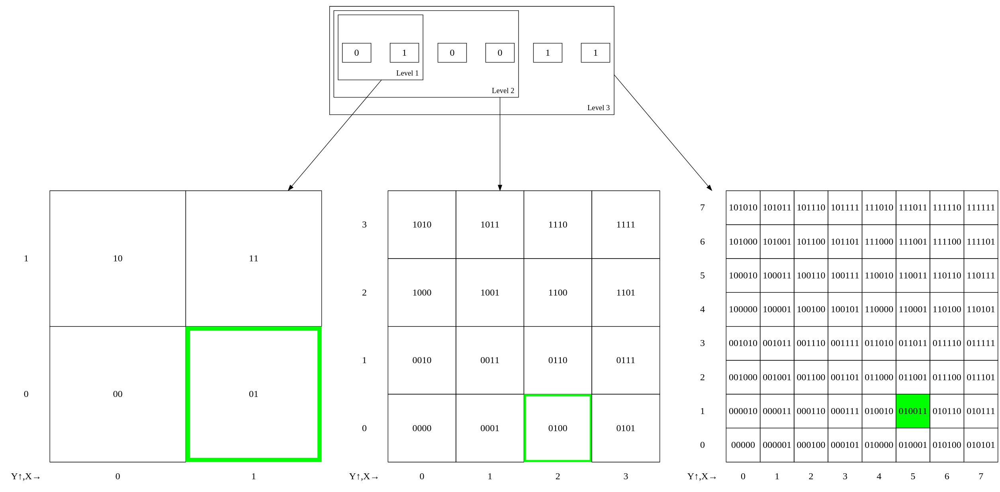
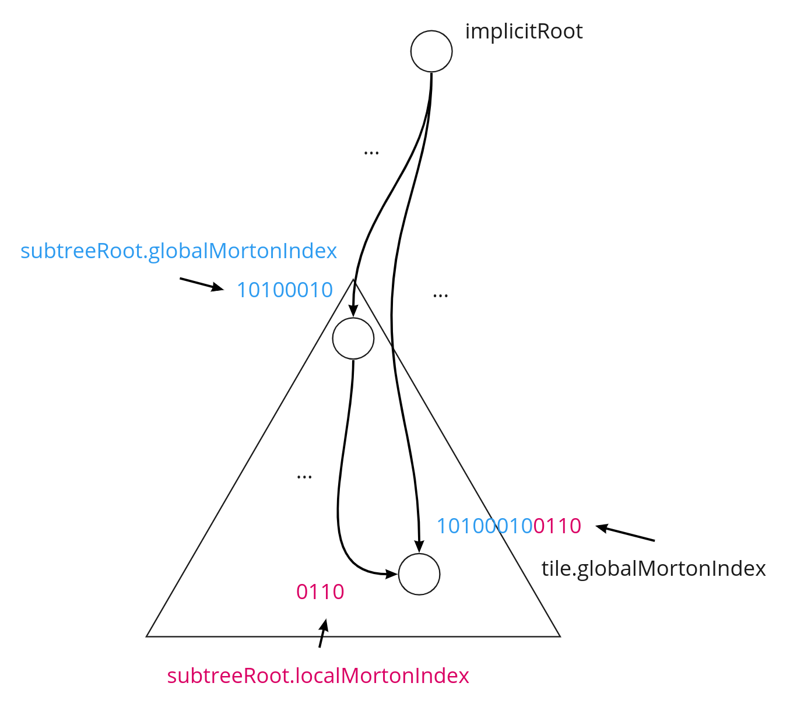
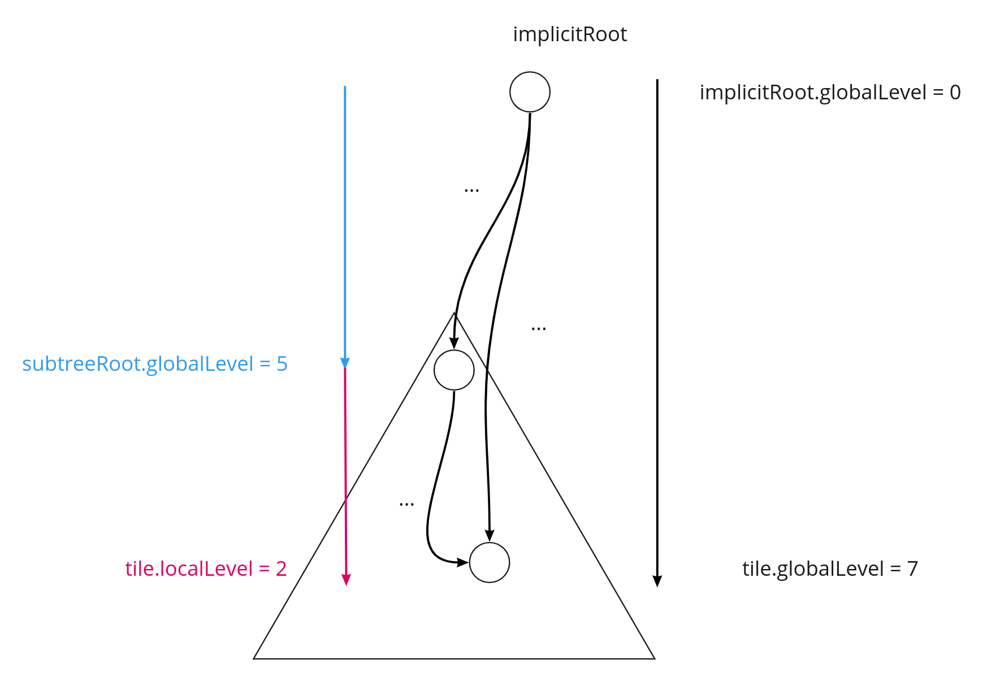
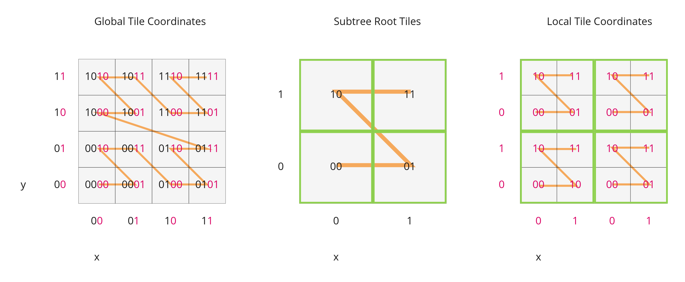
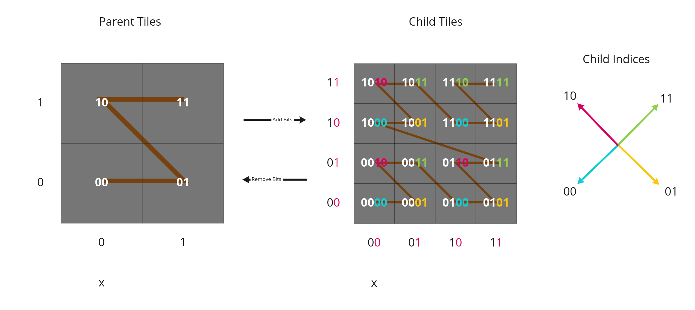

[#implicittiling-availability-indexing]
= Availability Indexing

[#implicittiling-converting-from-tile-coordinates-to-morton-index]
[discrete]
== Converting from Tile Coordinates to Morton Index

A https://en.wikipedia.org/wiki/Z-order_curve[Morton index] is computed by interleaving the bits of the `(x, y)` or `(x, y, z)` coordinates of a tile. Specifically:

----
quadtreeMortonIndex = interleaveBits(x, y)
octreeMortonIndex = interleaveBits(x, y, z)
----

For example:

----
// Quadtree
interleaveBits(0b11, 0b00) = 0b0101
interleaveBits(0b1010, 0b0011) = 0b01001110
interleaveBits(0b0110, 0b0101) = 0b00110110

// Octree
interleaveBits(0b001, 0b010, 0b100) = 0b100010001
interleaveBits(0b111, 0b000, 0b111) = 0b101101101
----

.An example for the computation of the Morton index based on the tile coordinates on three levels of a quadtree

[#implicittiling-availability-bitstream-lengths]
[discrete]
== Availability Bitstream Lengths

[cols="~,~,30%"]
|===
| Availability Type | Length (bits) | Description

| Tile availability
| `+(N^subtreeLevels - 1)/(N - 1)+`
| Total number of nodes in the subtree

| Content availability
| `+(N^subtreeLevels - 1)/(N - 1)+`
| Since there is at most one content per tile, this is the same length as tile availability

| Child subtree availability
| `+N^subtreeLevels+`
| Number of nodes one level deeper than the deepest level of the subtree
|===

Where `N` is 4 for quadtrees and 8 for octrees.

These lengths are in number of bits in a bitstream. To compute the length of the bitstream in bytes, the following formula is used:

----
lengthBytes = ceil(lengthBits / 8)
----

[#implicittiling-accessing-availability-bits]
[discrete]
== Accessing Availability Bits

For tile availability and content availability, the Morton index only determines the ordering within a single level of the subtree. Since the availability bitstream stores bits for every level of the subtree, a level offset must be computed.

Given the `(level, mortonIndex)` of a tile relative to the subtree root, the index of the corresponding bit can be computed with the following formulas:

[cols="~,~,30%"]
|===
| Quantity | Formula | Description

| `levelOffset`
| `+(N^level - 1) / (N - 1)+`
| This is the number of nodes at levels `+1, 2, ... (level - 1)+`

| `tileAvailabilityIndex`
| `levelOffset + mortonIndex`
| The index into the buffer view is the offset for the tile's level plus the morton index for the tile
|===

Where `N` is 4 for quadtrees and 8 for octrees.

Since child subtree availability stores bits for a single level, no levelOffset is needed, i.e. `childSubtreeAvailabilityIndex = mortonIndex`, where the `mortonIndex` is the Morton
index of the desired child subtree relative to the root of the current subtree.

[#implicittiling-global-and-local-tile-coordinates]
[discrete]
== Global and Local Tile Coordinates

When working with tile coordinates, it is important to consider which tile the coordinates are relative to. There are two main types used in implicit tiling:

* *global coordinates* - coordinates relative to the implicit root tile.
* *local coordinates* - coordinates relative to the root of a specific subtree.

Global coordinates are used for locating any tile in the entire implicit tileset. For example, template URIs use global coordinates to locate content files and subtrees. Meanwhile, local coordinates are used for locating data within a single subtree file.

In binary, a tile's global Morton index is the complete path from the implicit root tile to the tile. This is the concatenation of the path from the implicit root tile to the subtree root tile, followed by the path from the subtree root tile to the tile. This can be expressed with the following equation:

----
tile.globalMortonIndex = concatBits(subtreeRoot.globalMortonIndex, tile.localMortonIndex)
----

.Illustration of how to compute the global Morton index of a tile, from the global Morton index of the root of the containing subtree, and the local Morton index of the tile in this subtree

Similarly, the global level of a tile is the length of the path from the implicit root tile to the tile. This is the sum of the subtree root tile's global level and the tile's local level relative to the subtree root tile:

----
tile.globalLevel = subtreeRoot.globalLevel + tile.localLevel
----

.Illustration of how to compute the global level of a tile, from the global level of the root of the containing subtree, and the local level of the tile in this subtree

`(x, y, z)` coordinates follow the same pattern as Morton indices. The only difference is that the concatenation of bits happens component-wise. That is:

----
tile.globalX = concatBits(subtreeRoot.globalX, tile.localX)
tile.globalY = concatBits(subtreeRoot.globalY, tile.localY)

// Octrees only
tile.globalZ = concatBits(subtreeRoot.globalZ, tile.localZ)
----

.Illustration of the computation of the global tile coordinates, from the global coordinates of the containing subtree, and the local coordinates of the tile in this subtree.

[#implicittiling-finding-parent-and-child-tiles]
[discrete]
== Finding Parent and Child Tiles

The coordinates of a parent or child tile can also be computed with bitwise operations on the Morton index. The following formulas apply for both local and global coordinates.

----
childTile.level = parentTile.level + 1
childTile.mortonIndex = concatBits(parentTile.mortonIndex, childIndex)
childTile.x = concatBits(parentTile.x, childX)
childTile.y = concatBits(parentTile.y, childY)

// Octrees only
childTile.z = concatBits(parentTile.z, childZ)
----

Where:

* `childIndex` is an integer in the range `[0, N)` that is the index of the child tile relative to the parent.
* `childX`, `childY`, and `childZ` are single bits that represent which half of the parent's bounding volume the child is in in each direction.

.Illustration of the computation of the coordinates of parent- and child tiles

