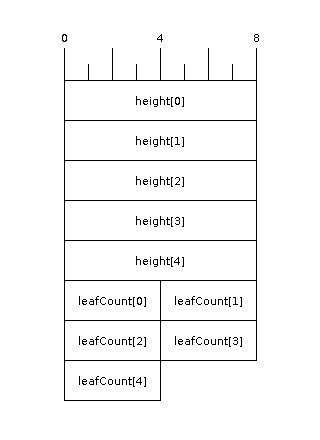
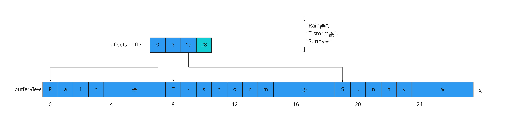
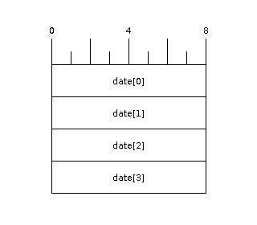
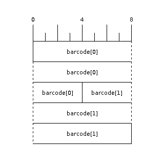
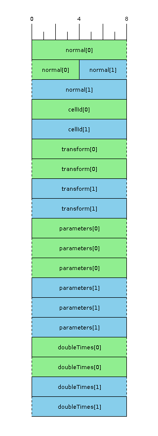
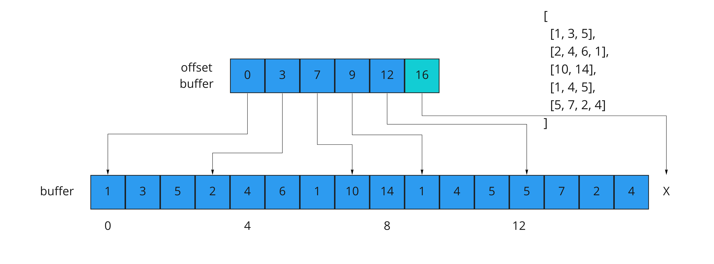
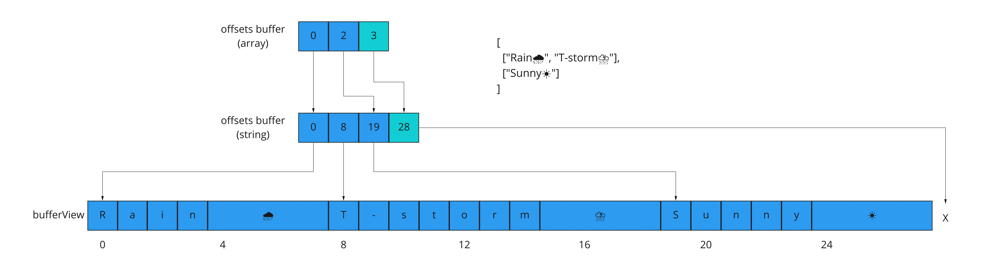
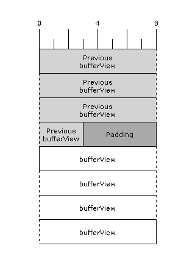
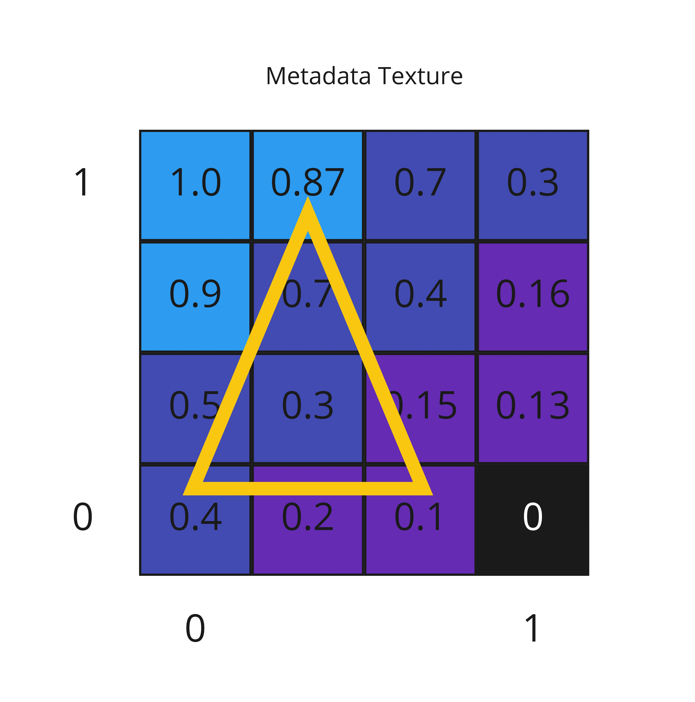
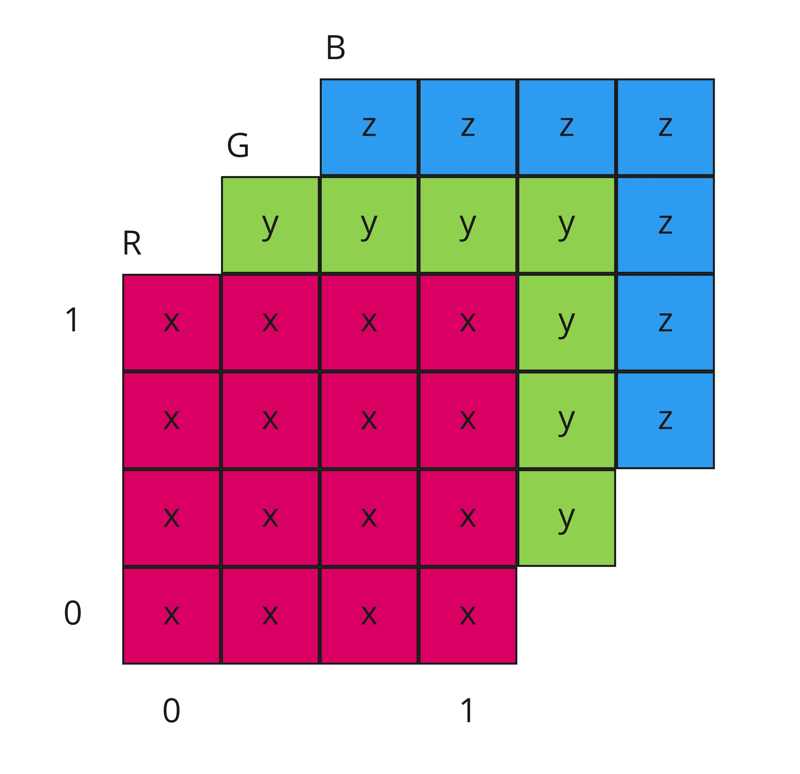

# Cesium 3D Metadata Specification

**Version 0.0.0** November 6, 2020

## Contributors

* Peter Gagliardi, Cesium
* Sean Lilley, Cesium
* Sam Suhag, Cesium
* Bao Tran, Cesium
* Samuel Vargas, Cesium
* Patrick Cozzi, Cesium

## Status

Draft

## Table of Contents

- [Cesium 3D Metadata Specification](#cesium-3d-metadata-specification)
  - [Contributors](#contributors)
  - [Status](#status)
  - [Table of Contents](#table-of-contents)
  - [Abstract](#abstract)
  - [Introduction](#introduction)
  - [Concepts](#concepts)
    - [Classes](#classes)
    - [Instances](#instances)
      - [Instance Tables](#instance-tables)
      - [JSON Encoding](#json-encoding)
      - [Binary Encoding](#binary-encoding)
      - [Metadata Texture Encoding](#metadata-texture-encoding)
      - [Comparison of Encodings](#comparison-of-encodings)
    - [Separate Class Definition from Instantiation](#separate-class-definition-from-instantiation)
  - [Class Definitions](#class-definitions)
    - [Basic Types](#basic-types)
    - [Normalized Properties](#normalized-properties)
    - [Arrays](#arrays)
    - [Optional and Default Properties](#optional-and-default-properties)
  - [Storage Encodings](#storage-encodings)
    - [JSON Encoding](#json-encoding-1)
      - [Basic Types](#basic-types-1)
      - [Bit Depth of Numeric Types](#bit-depth-of-numeric-types)
      - [Array Types](#array-types)
      - [Blob Base64 Encoding](#blob-base64-encoding)
      - [Fixed-length Strings and Blobs](#fixed-length-strings-and-blobs)
      - [Optional and Default Values](#optional-and-default-values)
      - [Single Instance Shorthand](#single-instance-shorthand)
    - [Binary Encoding](#binary-encoding-1)
      - [Numeric Types](#numeric-types)
      - [Strings and Blobs](#strings-and-blobs)
      - [Fixed-length Strings and Blobs](#fixed-length-strings-and-blobs-1)
      - [Arrays](#arrays-1)
      - [Variable-size Arrays](#variable-size-arrays)
      - [Boolean Data](#boolean-data)
      - [Binary Alignment Rules](#binary-alignment-rules)
    - [Metadata Texture Encoding](#metadata-texture-encoding-1)
      - [Numeric Textures](#numeric-textures)
      - [Array Textures](#array-textures)
      - [Implementation Notes](#implementation-notes)
  - [Glossary](#glossary)

## Abstract

This specification provides a standard format for adding metadata to Cesium 3D Tiles as well as glTF models. It provides a method for defining metadata, as well as methods for storing this metadata in JSON, binary, or texture encodings. This metadata format is shared by several Cesium specifications. This avoids repetition and enforces a consistent data layout. Specifications that reference this document must include at least one metadata encoding as described in this document, and must make clear which encodings are supported.

## Introduction

```
features = geometry + metadata
```

Using terminology from the geospatial industry, **features** are geometric entities in 3D space (**geometry**) and may have application specific properties associated with them (**metadata**). These properties may span a myriad of domains, such as the heights of buildings in a city, the names of different structures in a CAD model, the classification of different points in a point cloud, or the age of different trees in a forest of instanced tree models.

This specification adds a mechanism for storing metadata in existing 3D model formats such as Khronos Group's glTF or Cesium's 3D Tiles. Metadata can be applied at various granularities: per-vertex, per-texel, as well as larger structures from meshes to tilesets. This metadata can be used for analytics purposes, as well as styling in a 3D renderer.

Guiding principles for this specification include:

- Design a data format that allows for runtime efficiency, even for large datasets.
- Keep class definitions separate from instantiation. This allows for greater flexibility of data formats, and allows for reuse of metadata definitions.

## Concepts

### Classes

A **class** describes a collection of related pieces of metadata called **properties** and their respective data types. In some ways, this is similar to describing the columns of a database table. However, this analogy is not completely applicable, as this specification allows for texture storage, not just columnar formats.

A class definition describes what metadata is available. However, it does not describe how this metadata is stored. The section on [Instances](#instances) will provide more information.

The following example shows the basics of how classes describe the data types, without describing where the data is stored. The following section will show how to connect these classes to the actual metadata in various storage formats.


```json
{
  "classes": {
    "building": {
      "name": "Building",
      "properties": {
        "address": {
          "name": "Street Address",
          "type": "STRING"
        },
        "height": {
          "name": "Building Height (m)",
          "type": "FLOAT32"
        }
      }
    },
    "tree": {
      "properties": {
        "height": {
          "name": "Height (m)",
          "type": "FLOAT32",
        },
        "age": {
          "name": "Age (years)",
          "type": "UINT16"
        },
        "leafColor": {
          "name": "Leaf Color",
          "type": "STRING",
          "optional": true,
          "default": "green"
        }
      }
    }
  }
}
```

Above, we define a `building` class to describe the street address and height of various buildings in a 3D scene. Likewise, the `tree` class describes trees that have a height, age, and leaf color.

For a more detailed description of how classes are defined, see the [Class Definitions](#class-definitions) section below.

### Instances

A class definition is abstract, and only describes what metadata exists. Meanwhile, an **instance** is a concrete representation of the metadata for a single entity. Instance is a general concept; the concept of "feature" mentioned in the introduction is one example of an instance.

This specification provides two main ways for storing instances: a columnar format (**instance tables**) and a texture-based format (**metadata textures**). Instance tables are designed for a wide variety of use cases. Instance tables can be encoded in either JSON or binary.
Metadata textures are useful for properties that vary with position (e.g. elevation or temperature) and can benefit from image compression.

Whether an instance table or a metadata texture, the data must match one-to-one with a class definition. For example, in the previous section, the `building` class defined two properties, `address` and `height`. A corresponding instance table must include data for both `address` and `height`. The instance table may not have any extraneous properties. If more are desired, they can be defined in separate instance tables.

Below is an example of a well-formed instance table representing a class.

```json
{
  "classes": {
    "building": {
      "name": "Building",
      "properties": {
        "address": {
          "name": "Street Address",
          "type": "STRING"
        },
        "height": {
          "name": "Building Height (m)",
          "type": "FLOAT32"
        }
      }
    },
  },
  "instanceTables": {
    "buildingTable": {
      "class": "building",
      "count": 2,
      "properties": {
        "address": {
          "values": ["123 Somewhere St.", "456 Elsewhere St."]
        },
        "height": {
          "values": [13.0, 20.0]
        }
      }
    }
  }
}
```

A brief overview of each encoding follows to explain the concepts. The full details can be found further below in the [Storage Encodings](#storage-encodings) section.

#### Instance Tables

An instance table is a mapping of **instance IDs** to metadata values which are stored in parallel arrays called **property arrays**. Instance IDs are simply integer indices into these arrays. The `i-th` value of every property array in an instance table together makes up the metadata for the `i-th` instance. 

The instance table has two possible representations on disk: JSON and binary. The following sections compare the two encodings.

#### JSON Encoding

JSON Encoding is designed for readability and convenience for small datasets. Data values are directly encoded in JSON wherever possible.

The following table shows a possible JSON encoding for the `building` class
defined above.

```json
{
  "instanceTables": {
    "buildingTable": {
      "class": "building",
      "count": 2,
      "properties": {
        "address": {
          "values": ["123 Somewhere St.", "456 Elsewhere St."]
        },
        "height": {
          "values": [13.0, 20.0]
        }
      }
    }
  }
}
```

#### Binary Encoding

Binary encoding is the preferred encoding in most cases since it is designed for storage and runtime efficiency. It is designed with large datasets in mind.

The binary encoding is more involved than the JSON, as there are many considerations about how to pack and align the data efficiently. A detailed discussion of this can be found in the other [Binary Encoding](#binary-encoding-1) section further below
in this document. For now, here is a small example to show how the same `building` class described above would be described with an instance table.

```json
{
  "instanceTables": {
    "buildingTable": {
      "class": "building",
      "count": 2,
      "properties": {
        "address": {
          "bufferView": 2,
          "offsetBufferViews": [3],
        },
        "height": {
          "bufferView": 4,
        }
      }
    }
  }
}
```

#### Metadata Texture Encoding

The metadata texture encoding serves a different purpose than the other encodings. Instead of associating metadata with an instance, this encoding associates metadata with each individual texel in a texture. In this situation, values are indexed by texture coordinates rather than instance ID. This allows, among other things, interpolation of metadata values (at least for numeric types).

This is useful for continuous properties such as elevation, vegetation index, vector fields, and many other properties that vary with position. It also can be used for better compression of metadata values in some cases.

```json
{
  "classes": {
    "vegetation": {
      "properties": {
        "vegetationIndex": {
          "type": "UINT8",
          "normalized": true
        }
      }
    }
  },
  "metadataTextures": {
    "vegetationTexture": {
      "class": "vegetation",
      "properties": {
        "vegetationIndex": {
          "texture": {
            "index": 0,
            "texCoord": 0
          },
          "channels": "r"
        }
      }
    }
  }
}
```

#### Comparison of Encodings

This specification provides three different encodings for representing properties: JSON, binary and texture encodings. Each one is designed for different purposes, so it is important to familiarize oneself with the main differences.

JSON encoding is useful for encoding data where readability matters. This works well for small amounts of data, but does not scale well to large datasets. If the metadata is expected to grow large, binary encoding would be a better choice. One situation where JSON encoding is helpful is if metadata will be edited by hand, as JSON is easier for a human to understand than editing a binary buffer.

Binary encoding is designed for storage efficiency, and is designed for use with large datasets. Data is packed in parallel arrays, one per property. This allows for storage optimizations based on data type, such as storing boolean properties as a tightly packed bit vector. This encoding is more involved than the JSON encoding, but it is much preferred in most cases where performance is an important consideration.

These first two encodings are designed for discrete properties indexed by instance ID. In contrast, metadata textures are used when instances are identified by spatial position (i.e. texture coordinates within a texture). Heightmaps and vector fields are two examples. This type of per-texel metadata has many uses, but is also somewhat limited by the image formats used to store data.

Comparison table: 

|   | JSON | Binary | Texture |
|---|------|--------|---------|
| Supports large datasets | No | Yes | Yes |
| Supports small datasets | Yes | Yes | Yes |
| Is human-readable | Yes | No | No |
| Indexed by instance IDs | Yes | Yes | No |
| Indexed by texture coordinates | No | No | Yes |
| Supports Optional Values | Yes | No | No |


### Separate Class Definition from Instantiation

This specification keeps class definition separate from instantiation. While this adds a level of indirection, there are several reasons for this separation:

* It allows the class definition to be stored separately from the data itself. This is useful when one has a dataset that has many 3D models with the same type of metadata. Then instead of re-defining the class many times, a single definition can be shared across multiple models
* It allows greater flexibility for storing properties. For example, take the `elevation` property from the example above. The natural representation is to use a metadata texture. However, if the corresponding 3D model is a high-resolution terrain mesh, storing the elevations per-vertex may be more appropriate.

## Class Definitions

### Basic Types

A class is a collection of properties. Each class requires a unique UTF-8 string as a class ID. This allows the classes to be referenced elsewhere in the JSON. Within the class, one or more properties is defined. Each property must have an ID that is unique within the class. Like the class IDs, this is a UTF-8 string. Each property has a type associated with it. Some types have extra options; the sections below discuss such cases.

Also note that both classes and properties can be annotated with display names and descriptions, as in the following example:

```json
{
  "classes": {
    "ship": {
      "name": "Ship",
      "description": "Sailing ships seen in the ocean",
      "properties": {
        "length": {
          "name": "Length (m)",
          "type": "FLOAT64"
        },
        "name": {
          "name": "Name",
          "type": "STRING"
        }
      }
    },
    "fish": {
      "name": "Fish",
      "description": "Fish found in the ocean",
      "properties": {
        "length": {
          "name": "Length (cm)",
          "type": "FLOAT32"
        }
      }
    }
  }
}
```

### Normalized Properties

In many applications, it is helpful to transform values to a normalized range, usually `[0, 1]` or `[-1, 1]` depending on the circumstance.

In this specification, the following normalization rules are applied when the property has `normalized` set to `true`:
* For unsigned integer types (`UINT8, UINT16, UINT32, UINT64`), the values will be rescaled to the range `[0, 1]` (inclusive).
* For signed integer types (`INT8, INT16, INT32, INT64`), values will be rescaled to the range `[-1, 1]` (inclusive).

**Implementation Note:** Depending on the implementation and the chosen integer type, there may be some loss of precision in the normalized values. For example, if the implementation uses 32-bit floating point variables to represent the normalized value, there are only 23 bits in the mantissa. In this case, if the value to normalize is 32- or 64-bit, a number of lower bits will be truncated when normalized. Therefore, it is highly recommended that implementations use the highest precision floats available for representing the result, and make this choice clear.

### Arrays

Sometimes, it is desirable for each instance to store an array of values. This can be done with the `ARRAY` type. Through the options, it is possible to define both fixed-size and variable-length arrays.

For all arrays, set `type` to `ARRAY` and `componentType` to the desired type for each component. For fixed-size arrays, also set `componentCount` to a positive integer to denote the number of components. For variable length arrays, leave `componentCount` undefined.

For vector-valued types such as a `vec3` or `mat4` in OpenGL, use a fixed-size array. For example, a `vec3` is an `ARRAY` of `FLOAT32` (or appropriate precision) with `componentCount` set to `3`. Meanwhile, a `mat4` would have a `componentCount` of 16.

```json
{
  "classes": {
    "car": {
      "name": "Car",
      "properties": {
        "forwardDirection": {
          "name": "Forward Direction Vector",
          "description": "This is equivalent to a double-precision vec3",
          "type": "ARRAY",
          "componentType": "FLOAT64",
          "componentCount": 3
        },
        "passengers": {
          "name": "Passenger Names",
          "description": "There are a variable number of passengers because componentCount is undefined.",
          "type": "ARRAY",
          "componentType": "STRING",
        },
        "modelMatrix": {
          "name": "Model Matrix",
          "description": "mat4 example representing a custom matrix field",
          "type": "ARRAY",
          "componentType": "FLOAT32",
          "componentCount": 16
        }
      }
    }
  }
}
```

### Optional and Default Properties

Sometimes, it is desirable to mark cases where no data can be found. This can be accomplished by setting `optional: true` in the property definition. If a property has a default value, set `optional: true` and set a value for `default`. Default values are expressed as a single value in the same format as in the [JSON Encoding](#json-encoding).

Example:

```json
{
  "classes": {
    "vehicle": {
      "name": "Vehicle",
      "description": "Various vehicles on the road",
      "properties": {
        "driver": {
          "name": "Driver Name",
          "type": "STRING"
        },
        "passenger": {
          "name": "Passenger Name",
          "type": "STRING",
          "optional": true
        },
        "wheels": {
          "name": "Number of Wheels",
          "type": "UINT8",
          "optional": true,
          "default": 4
        }
      }
    }
  }
}
```

**Note**: optional properties are disallowed for the binary encoding in the interest of efficient runtime performance.

## Storage Encodings

The following sections provide a full description of each of the metadata encodings.

**Note**: Each instance table must use the same encoding for all properties contained within. For example, if one property in an instance table is stored using binary encoding, then all other properties in this table must do likewise. If a mix of JSON and binary metadata is desired, this can be accomplished by using multiple instance tables.

### JSON Encoding

The JSON encoding is the simplest encoding, designed to be human-readable.

#### Basic Types

For JSON encoding, basic types include integers, floating point numbers, booleans, and strings. These are encoded in whatever JSON type is most natural. Numeric types are represented as `number`, booleans as `boolean`, and strings as `string`.

The following example shows a few of these cases

```json
{
  "classes": {
    "basicTypes": {
      "properties": {
        "floatProperty": {
          "type": "FLOAT64"
        },
        "integerProperty": {
          "type": "INT32"
        },
        "booleanProperty": {
          "type": "BOOLEAN"
        },
        "stringProperty": {
          "type": "STRING"
        }
      }
    }
  },
  "instanceTables": {
    "basicTypesTable": {
      "class": "basicTypes",
      "count": 3,
      "properties": {
        "floatProperty": {
          "values": [0.0, 0.5, 1.0]
        },
        "integerProperty": {
          "values": [1000, 3000, 2500]
        },
        "booleanProperty": {
          "values": [true, false, false]
        },
        "stringProperty": {
          "values": ["Apple", "Orange", "Cherry"]
        }
      }
    }
  }
}
```

#### Bit Depth of Numeric Types

For numeric types like `UINT8` or `INT32`, the size in bits is made explicit. Even though JSON encoding only has a single `number` type for all integers and floating point numbers, the application that consumes the JSON may make a distinction. For example, C and C++ have several different integer types such as `uint8_t`, `uint32_t`. The application is responsible for interpreting the metadata using the type specified in the class definition.

#### Array Types

Array types are straightforward to encode into JSON: instead of a single array of values, use an array of arrays. When the array has a fixed size (i.e. `componentCount` is defined), each of the inner arrays must have the same length. Otherwise, the arrays are assumed to be variable-length.

The following example shows the usage for both fixed and variable size arrays:

```json
{
  "classes": {
    "basicTypes": {
      "properties": {
        "fixedArrayProperty": {
          "type": "ARRAY",
          "componentType": "UINT8",
          "componentCount": 2
        },
        "variableSizeArrayProperty": {
          "type": "ARRAY",
          "componentType": "STRING",
        }
      }
    }
  },
  "instanceTables": {
    "basicTypesTable": {
      "class": "basicTypes",
      "count": 3,
      "properties": {
        "fixedArrayProperty": {
          "values": [
            [3, 45],
            [128, 110],
            [63, 4]
          ]
        },
        "variableSizeArrayProperty": {
          "values": [
            ["plaster", "wood", "brick"],
            ["steel", "glass"],
            ["concrete"]
          ]
        }
      }
    }
  }
}
```

#### Blob Base64 Encoding

A Blob (Binary Large OBject) is a sequence of arbitrary bytes used for storing user-defined information. This is a flexible format for application-specific data. Some examples where this can be useful:

* A CAD design could be attached to a 3D model of a building.
* Points in a point cloud can be tagged with a proprietary format.
* If a property contains sensitive information, the values could be encrypted and stored as a blob.

Unlike the other data types, binary blobs do not have a straightforward JSON encoding. This is because JSON uses UTF-8 encoding, not arbitrary binary data. Raw binary values are often invalid UTF-8 sequences. This spec requires that binary blobs are Base64 encoded.

Base64 is easy to transmit as it only uses ASCII characters, but is not very efficient for storage. If large blobs are needed, it is highly recommended to use the binary metadata encoding instead.

```json
{
  "classes": {
    "basicTypes": {
      "properties": {
        "blobProperty": {
          "type": "BLOB"
        }
      }
    }
  },
  "instanceTables": {
    "basicTypesTable": {
      "class": "basicTypes",
      "count": 3,
      "properties": {
        "blobProperty": {
          "values": [
            "TG9va2luZyBmb3Igc2VjcmV0cw==",
            "WW91IGRlY29kZWQgdGhlIG1lc3NhZ2U=",
            "QnV0IG5vbmUgY291bGQgYmUgZm91bmQ="
          ]
        }
      }
    }
  }
}
```

#### Fixed-length Strings and Blobs

In some cases, strings have a known, fixed length. For example, an application may require dates to be entered in `YYYYMMDD` format, which will fit in exactly 8 bytes. For this,
the specification provides a `stringByteLength` property. In the JSON encoding, this byte length refers to the length of the string when UTF-8 encoded, regardless of how it is displayed.

`blobByteLength` is similar, but used for binary data. The length is measured as the _decoded_ binary length, not the length of the Base64 string.

```json
{
  "classes": {
    "basicTypes": {
      "properties": {
        "date": {
          "name": "Date (YYYYMMDD)",
          "type": "STRING",
          "stringByteLength": 8
        },
        "fixedBlobProperty": {
          "type": "BLOB",
          "blobByteLength": 4
        }
      }
    }
  },
  "instanceTables": {
    "basicTypesTable": {
      "class": "basicTypes",
      "count": 3,
      "properties": {
        "date": {
          "values": [
            "20201002",
            "20201103",
            "20201105"
          ]
        },
        "blobProperty": {
          "values": [
            "AAECAw==",
            "BAUGBw==",
            "CAkKCw=="
          ]
        }
      }
    }
  }
}
```

#### Optional and Default Values

In JSON, optional values can be expressed by using `null` in place of the value. This is true for each data type except for arrays which follow slightly different rules:

* To denote a missing array, use `[]` instead of `null`.
* To denote an array with a missing value, use `null` in place of the missing data. For example, `[1, 2, null, 4]`.


```json
{
  "classes": {
    "sensor": {
      "name": "Temperature Sensor",
      "properties": {
        "currentTemperature": {
          "name": "Current temperature",
          "description": "A basic example of using `null` for unknown values",
          "type": "FLOAT32",
          "optional": true
        },
        "history": {
          "name": "Previous 5 sensor readings",
          "description": "This example demonstrates the use of `[]` for null arrays as well as how `null` can be used for individual array components.",
          "type": "ARRAY",
          "componentType": "STRING",
          "optional": true,
        },
        "condition": {
          "name": "Sensor condition",
          "description": "This example shows how to use `default` to fill in `null` elements. In this case, `null` means `Good Condition`",
          "type": "STRING",
          "optional": true,
          "default": "Good Condition"
        }
      }
    }
  },
  "instanceTables": {
    "sensorTable": {
      "class": "sensor",
      "count": 3,
      "properties": {
        "currentTemperature": {
          "values": [
            0.9,
            0.8,
            null
          ]
        },
        "history": {
          "values": [
            [0.8, 0.9, 0.9, 0.8, 0.8],
            [null, null, 0.7, 0.6, 0.7],
            []
          ]
        },
        "condition": {
          "values": [
            null,
            null,
            "Malfunctioning. Needs maintenance"
          ]
        }
      }
    }
  }
}
```

#### Single Instance Shorthand

In most situations, there are several instances of a class. Therefore, an array is a natural choice for the JSON representation. In cases where only a single instance is used, this specification allows for a simpler property dictionary.

To enable this shorthand, omit the `count` field. Then `properties` is interpreted as a dictionary of property names to single values. This is more convenient than the usual behavior where a nested object is used for each property.

Optional properties may be omitted when using the shorthand, as in the case of the `company` field in the example below.

The following example compares the two formats of JSON encoding:

```json
{
  "classes": {
    "datasetInfo": {
      "properties": {
        "date": {
          "type": "STRING",
        },
        "authors": {
          "type": "ARRAY",
          "componentType": "STRING",
        },
        "company": {
          "type": "STRING",
          "optional": true
        }
      }
    }
  },
  "instanceTables": {
    "verboseTable": {
      "name": "Verbose property example",
      "description": "This is the typical way to represent properties, as it supports any number of instances.",
      "class": "datasetInfo",
      "count": 1,
      "properties": {
        "date": {
          "values": ["2020-11-03"]
        },
        "authors": {
          "values": [
            ["Jane Doe", "John Smith"]
          ]
        },
        "company": {
          "values": [null]
        }
      } 
    },
    "shorthandTable": {
      "name": "Shorthand property example",
      "description": "This is equivalent to the table above, just more concise",
      "class": "datasetInfo",
      "properties": {
        "date": "2020-11-03",
        "authors": ["Jane Doe", "John Smith"]
      }
    }
  }
}
```

### Binary Encoding

The binary encoding represents the columns of an instance table using parallel arrays called **property arrays**. These arrays are stored as **buffer views** in a binary **buffer**. A buffer is a contiguous array of bytes, while a buffer view is a subsequence of a buffer. Both buffers and buffer views correspond directly with [glTF concepts](https://github.com/KhronosGroup/glTF/tree/master/specification/2.0#buffers-and-buffer-views).

Buffer views are referred to by an integer index. There may be additional buffer views in a binary file not used for metadata. For example, in a glTF-based implementation, there may be other buffer views for storing the geometry of a 3D model.

#### Numeric Types 

In the binary encoding, numeric types (integers and floating point numbers) are the easiest to encode. Values are packed in little-endian format into one property array `bufferView`. This `bufferView` is subject to the [binary alignment rules](#binary-alignment-rules) (namely, align to 8-byte boundaries)

Here is an example of how to define an instance table for basic integer and float properties.

```json
{
  "classes": {
    "tree": {
      "properties": {
        "height": {
          "name": "Height (m)",
          "type": "FLOAT64"
        },
        "leafCount": {
          "name": "Number of Leaves (estimated)",
          "type": "UINT32"
        }
      }
    }
  },
  "instanceTables": {
    "treeTable": {
      "class": "tree",
      "count": 5,
      "properties": {
        "height": {
          "bufferView": 7,
        },
        "leafCount": {
          "bufferView": 8
        }
      }
    }
  }
}
```



_(lengths measured in bytes)_

#### Strings and Blobs

Strings and binary blobs are somewhat similar when represented in binary. They both represent a sequence of bytes treated as a single unit. However, the encoding and intent is different. Strings must be UTF-8 encoded, which means that each Unicode code point may take up 1-4 bytes. Meanwhile, binary blobs are an arbitrary sequence of bytes.

Strings and binary blobs are typically variable-length in terms of number of code points/bytes respectively. In order to store these efficiently in binary, some indirection is useful. The elements are packed tightly into a single `bufferView`. The index of this `bufferView` is referenced in the instance table's definition via the `bufferView` property.

Since the length of each element is not predictable, an **offset buffer** is used instead. If there are `N` strings/blobs in the property array, then the offset buffer has `N + 1` elements. The first `N` of these point to the start byte of each string/blob, while the last one points to the byte immediately after the last string/blob. This way, the length of the `i-th` string (0-indexed) can be determined with the formula `length = offsetBuffer[i + 1] - offsetBuffer[i]`. The offset buffer is referenced by adding the index to the `offsetBufferViews` array in the JSON. For strings and blobs, this will always be the **rightmost** index in the array. More on `offsetBufferViews` can be found in the [Variable-size Arrays](#variable-size-arrays) section below.

The size of each offset can be configured with `offsetComponentType`. It defaults to `UINT32`, but it can be made as small as `UINT8` for small datasets or as large as `UINT64` for datasets with a large number of elements.

For an example, let's suppose we have weather forecast data that stores the UTF-8 strings 

```json
[
  "Rain🌧️",
  "T-storm⛈️",
  "Sunny☀️"
]
```

The following code snippet and diagram show how this would be expressed using this metadata format.

```json
{
  "classes": {
    "weather": {
      "properties": {
        "forecast": {
          "type": "STRING"
        }
      }
    }
  },
  "instanceTables":  {
    "count": 3,
    "forecast": {
      "bufferView": 5,
      "offsetBufferViews": [6]
    }
  }
}
```



#### Fixed-length Strings and Blobs

For fixed-length strings and blobs, we can avoid the overhead of the offset buffer by specifying a constant length in bytes. Then the `bufferView` can be read using this constant size as a stride.

For strings, define the `stringByteLength` in the property definition. All strings must conform to this byte length **exactly** when UTF-8 encoded.

```json
{
  "classes": {
    "date": {
      "name": "Date YYYYMMDD",
      "type": "STRING",
      "stringByteLength": 8
    }
  }
}
```



_(lengths measured in bytes)_

For binary blobs, the usage is similar. Use `blobByteLength` to describe the fixed length of each blob.

```json
{
  "classes": {
    "barcode": {
      "name": "Barcode Bytes",
      "type": "BLOB",
      "blobByteLength": 20
    }
  }
}
```



_(lengths measured in bytes)_

#### Arrays

This specification allows both fixed-size arrays (this section) and [variable-sized arrays](#variable-size-arrays) to represent multiple values per-instance.

Fixed-length arrays are useful for representing vector and matrix types. Here are a few examples of how common computer graphics types are represented:

| Desired data type | `componentType` | `count` |
|------------------|-----|----|
| `vec3`  | `FLOAT32` | 3 |
| `ivec2` | `INT32` | 2 |
| `mat4`  | `FLOAT32` | 16 |
| `float[6]` | `FLOAT32` | 6 |
| `double[2]` | `FLOAT64` | 2 |

```jsonc
{
  "classes": {
    "graphicsExample": {
      "normal": {
        "type": "ARRAY",
        "description": "Example of a vec3",
        "componentType": "FLOAT32",
        "componentCount": 3
      },
      "cellId": {
        "type": "ARRAY",
        "description": "Example of an ivec2",
        "componentType": "INT32",
        "componentCount": 2
      },
      "transform": {
        "type": "ARRAY",
        "description": "Example of a mat4",
        "componentType": "FLOAT32",
        "componentCount": 16
      },
      "parameters": {
        "type": "ARRAY",
        "description": "Example of a float array with 6 components",
        "componentType": "FLOAT32",
        "componentCount": 6
      },
      "doubleTimes": {
        "type": "ARRAY",
        "description": "Example of an array of double-precision floats with 2 components",
        "componentType": "FLOAT64",
        "componentCount": 2
      }
    }
  },
  "instanceTables": {
    "graphicsTable": {
      "count": 2,
      "properties": {
        "normal": {
          "bufferView": 0
        },
        "cellId": {
          "bufferView": 1
        },
        "transform": {
          "bufferView": 2
        },
        "parameters": {
          "bufferView": 3
        },
        "doubleTimes": {
          "bufferView": 4
        }
      }
    }
  }
}
```

Since this example has many properties, the two instances are color-coded for clarity. The green sections of the array belong to the first instance, the blue sections belong to the second instance.



_(lengths measured in bytes)_

#### Variable-size Arrays

Variable-size arrays are arrays where the number of components can vary from instance to instance. Variable-size arrays use a similar offset buffer technique like [strings and blobs](#strings-and-blobs) do, with one main difference. Instead of storing a _byte_ offset, array offset buffers store _array index_ offsets. For example, if this was an array of `FLOAT32`, an offset of `3` would correspond to element `3`. The byte offset would be `3 * sizeof(FLOAT32) = 12`.

Offset buffers are defined in the instance table using an `offsetBufferViews` array. This array may contain references to 1-2 `bufferViews`. There are three possible configurations:

| Type | `offsetBufferViews` |
|------|---------------------|
| `ARRAY` (of numeric or boolean) | 1x - Offsets indicate start index of each array |
| `STRING` or `BLOB` | 1x - Offsets indicate start byte of each element|
| `ARRAY` of `STRING`/`BLOB` | 2x - First buffer indicates start index of each array, second buffer indicates start byte of each string | 

Below are two examples of variable length arrays. The first is an array of integers, while the second shows the most involved case of an array of string.

This example represents the following metadata:

```json
[
  [1, 3, 5],
  [2, 4, 6, 1],
  [10, 14],
  [1, 4, 5],
  [5, 7, 2, 4]
]
```

```json
{
  "classes": {
    "arrayExample": {
      "properties": {
        "arrayProperty": {
          "type": "ARRAY",
          "componentType": "UINT8"
        }
      }
    }
  },
  "instanceTables": {
    "arrayExampleTable": {
      "class": "arrayExample",
      "count": 5,
      "properties": {
        "arrayProperty": {
          "bufferView": 7,
          "offsetBufferViews": [8]
        }
      }
    }
  }
}
```



The second example is a continuation of the weather example
described in the [Strings and Blobs](#strings-and-blobs) section. The three strings are the same, but this time they are grouped into two arrays.

This example represents the following metadata:

```json
[
  ["Rain🌧️", "T-storm⛈️"],
  ["Sunny☀️"]
]
```

```jsonc
{
  "classes": {
    "weather": {
      "properties": {
        "forecastHistory": {
          "type": "ARRAY",
          "componentType": "STRING"
        }
      }
    }
  },
  "instanceTables":  {
    "count": 2,
    "forecast": {
      "bufferView": 5,
      // bufferView 6 is the array index offsets
      // bufferView 7 is the string byte offsets
      "offsetBufferViews": [6, 7]
    }
  }
}
```



#### Boolean Data

All types of boolean properties (even arrays) are packed into bit vectors.
A single property will always have a single bit vector for all values.
Conceptually, the bits of a bit vector are arranged from left to right, with the
first bit on the left:

```
10100011110110  - bit value
012345...       - bit index
```

However, when storing this, the sequence of bits is divided up into a sequence of bytes. Within each byte, the bits are numbered from right to left, as this is more straightforward to implement using bitwise operations.

```
10100011110110
   |
 split into bytes
   |
   v
10100011 110110xx <-- x indicates an unused bit
   |
   |
 bits are numbered from right to left:
   v
11000101 xx011011 - bit value
           1111
76543210   321098 - bit index (0-13 in this case)
```

For an `ARRAY` of `BOOLEAN`, `componentCount` refers to the number of _bits_ per element. These bits are counted out from the overall bit vector sequence.

In the case of a `VARIABLE_SIZE_ARRAY` of `BOOLEAN`, the offset buffer represents
the _bit_ offsets, rather than the usual byte offsets. Again, the offsets are counted relative to the overall bit vector sequence.

#### Binary Alignment Rules

Due to the possibility of 64-bit data types, this extension requires that each `bufferView` is aligned to a multiple of 8 bytes for efficient reads. This alignment requirement is always measured from the start of the binary file. This alignment requirement only applies to the start of each bufferView used for metadata.

Note that to meet this alignment requirement, padding or other data must go between the `bufferView`s so that each starts on an 8-byte boundary.



_(lengths measured in bytes)_

### Metadata Texture Encoding

For per-texel metadata, data values can be stored in textures rather than `bufferView`s. This metadata is then directly accessed via texture coordinates without having to refer to an instance table.



#### Numeric Textures

Numeric values like `UINT8` are encoded directly in a single channel of a texture. For fixed-size array values, each texture channel must correspond to a single component of the array. Furthermore, while a multi-channel texture may be used to define multiple metadata textures, an array property cannot be split across multiple textures.

In the following example, a single-channel image is used to encode surface temperature data.

```json
{
  "classes": {
    "ocean": {
      "properties": {
        "temperature": {
          "name": "Surface Temperature (°C)",
          "type": "UINT8",
          "normalized": "true"
        }
      }
    }
  },
  "metadataTextures": {
    "oceanTexture": {
      "class": "ocean",
      "properties": {
        "depth": {
          "texture": {
            "index": 0,
            "texCoord": 0
          },
          "channels": "r"
        }
      }
    }
  }
}
```

#### Array Textures

Fixed-size (but not variable-size) arrays can be stored as a multi-channel texture. This is useful for encoding vector-valued properties.

This is accomplished by defining the property as an `ARRAY` type with `componentCount` no more than 4 (corresponding to the 4 RGBA channels).

The example below demonstrates representing a `vec3` using a 3-channel image. The red channel stores the x-component, the green channel stores the y-component, and the blue channel stores the z-component.

```json
{
  "classes": {
    "wind": {
      "properties": {
        "velocity": {
          "type": "ARRAY",
          "componentType": "UINT8",
          "normalized": "true",
          "componentCount": 3,
        },
      }
    }
  },
  "metadataTextures": {
    "windTexture": {
      "class": "wind",
      "properties": {
        "velocity": {
          "texture": {
            "index": 0,
            "texCoord": 0
          },
          "channels": "rgb"
        }
      }
    }
  }
}
```



#### Implementation Notes

In implementations that only support PNG and JPEG images such as glTF, the available data types for textures is somewhat limited. Only data types based on `UINT8` (including normalized `UINT8` and/or fixed-length arrays) are straightforward to implement for PNG/JPEG images. Other data types such as floats or signed integers may require additional extensions of the underlying data format. Cases like these are left to the implementation to define.

## Glossary

* **feature** - A combination of a single piece of geometry and corresponding metadata.
* **geometry** - Any geometric entity such as a vertex, texel, or larger structures like meshes or patches of texels.
* **metadata** - Application-specific properties associated with geometry.
* **class** - A high-level description of one or more associated pieces of metadata (called properties).
* **property** - A description of a single piece of metadata. This includes information such as a datatype.
* **instance** - A concrete representation of a class consisting of a value for every property.
* **instance table** - A mapping of instance IDs to metadata for each instance. The values are stored in parallel property arrays.
* **buffer** - a contiguous sequence of bytes used for storing binary data. This is equivalent to the [glTF `buffer` concept](https://github.com/KhronosGroup/glTF/tree/master/specification/2.0#buffers-and-buffer-views).
* **buffer view** or `bufferView` - A subsequence of a buffer that represents a single array. A buffer view is completely contained within a buffer. This is equivalent to the [glTF `bufferView` concept](https://github.com/KhronosGroup/glTF/tree/master/specification/2.0#buffers-and-buffer-views), though this specification uses bufferViews for a broader set of data types.
* **property array** - A single array that stores values for one property.  
* **element** (of a property array) - a single entry of a property array. This stores the value of one property for a single instance.
* **component** (of an element) - For elements of type `ARRAY`, the values contained within are called components. In other words, a property array contains elements which contain components. 
* **metadata texture** - A texture that represents a property directly, no instance table needed
* **encoding** - A method of storing metadata on disk in a format such as JSON, binary, or texture encodings.