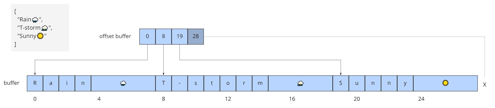
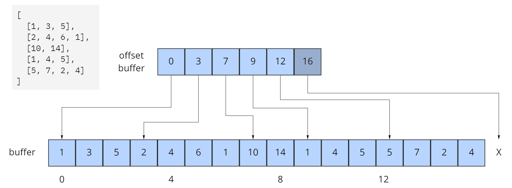

<!-- omit in toc -->
# Cesium 3D Metadata Specification

**Version 1.0.0** [TODO: date]

<!-- omit in toc -->
## Contributors

* Peter Gagliardi, Cesium
* Sean Lilley, Cesium
* Sam Suhag, Cesium
* Patrick Cozzi, Cesium
* Bao Tran, Cesium

<!-- omit in toc -->
## Status

Draft

<!-- omit in toc -->
## Contents

- [Overview](#overview)
- [Concepts](#concepts)
- [Schemas](#schemas)
  - [Classes and Properties](#classes-and-properties)
  - [Property Types](#property-types)
  - [Arrays](#arrays)
  - [Enums](#enums)
  - [Normalized Properties](#normalized-properties)
  - [Minimum and Maximum Values](#minimum-and-maximum-values)
  - [Optional Properties and Default Values](#optional-properties-and-default-values)
  - [Semantics](#semantics)
- [Storage Formats](#storage-formats)
  - [Table Format](#table-format)
    - [Binary Encoding](#binary-encoding)
      - [Numbers](#numbers)
      - [Boolean](#boolean)
      - [Strings](#strings)
      - [Enums](#enums-1)
      - [Arrays](#arrays-1)
    - [JSON Encoding](#json-encoding)
      - [Numbers](#numbers-1)
      - [Booleans](#booleans)
      - [Strings](#strings-1)
      - [Enums](#enums-2)
      - [Arrays](#arrays-2)
  - [Raster Format](#raster-format)
    - [Numbers](#numbers-2)
    - [Enums](#enums-3)
    - [Arrays](#arrays-3)
    - [Implementation Notes](#implementation-notes)

## Overview

The Cesium 3D Metadata Specification defines a standard metadata format for 3D data. This spans a myriad of domains, such as heights of buildings in a city, names of different structures in a CAD model, material properties for textured surfaces, and classification codes for point clouds.

This specification defines a set of core concepts to be used by multiple 3D formats. It is language and format independent. This document occasionally uses JSON examples for illustrating concepts but does not define a JSON schema.

For usage see:

* [`3DTILES_metadata`](../../../extensions/3DTILES_metadata) - 3D Tiles extension that assigns metadata to various components of 3D Tiles
* [`EXT_feature_metadata`](https://github.com/CesiumGS/glTF/tree/master/extensions/2.0/Vendor/EXT_feature_metadata/1.0.0) - glTF extension that assigns metadata to features in a model on a per-vertex or per-texel basis


This specification does not assign semantic meaning to metadata; instead separate specifications must define semantics for their particular application or domain. One example is the [Cesium Metadata Semantic Reference](../Semantics/README.md) which defines built-in semantics for 3D Tiles and glTF.

## Concepts

This specification provides a method for defining metadata schemas as well as methods for encoding metadata.

A **schema** contains a set of **classes** and **enums**. A class contains a set of **properties**, which may be numeric, boolean, string, enum, or array types.

An **entity** is a specific instantiation of class containing **property values**. There is a one-to-one mapping between property values in the entity and properties defined in the class. An entity must not have extraneous property values.

A schema describes what properties are available. However, it does not describe how property values are stored. This allows the schema to be defined separately from the data itself. This has several benefits:

* An application can know what metadata is present before requesting content.
* A single schema can be shared across multiple assets. This is useful when one has many assets with the same types of metadata.
* It allows greater flexibility for storing metadata. A property such as "elevation" may be stored per-vertex or per-texel depending on the use case, while conforming to the same property definition.

Property values are formatted in specific ways depending on the use case. Two formats are defined for storing large collections of property values:

* **Table format** - property values are stored in parallel 1D arrays
* **Raster format** - property values are stored in channels of a 2D grid of pixels

The table format is suitable for general purpose metadata storage. This is similar in concept to a database table where entities are rows and properties are columns. The raster format is for storing fine-grained metadata in images. Entities correspond to pixels and properties correspond to channels. This format is especially useful when texture mapping high frequency data, like material properties, to less detailed 3D surfaces. The raster format can also take advantage of image compression techniques.

Table Format|Raster Format
--|--
|| |


Each format may have any number of **encodings**. Two encodings are defined for the table format: a **binary encoding** and a **JSON encoding**. A specification that references Cesium 3D Metadata must state which format and encoding it uses and is free to define its own formats and encodings. For example, while this specification does not define any raster encodings, the [`EXT_feature_metadata`](https://github.com/CesiumGS/glTF/tree/master/extensions/2.0/Vendor/EXT_feature_metadata/1.0.0) glTF extension may use any image formats supported by glTF for storing per-texel metadata, including PNG and JPEG.

## Schemas

A schema is a collection of classes and enums that describe the types of metadata available in a dataset. An application may use this information to populate a UI or assign specific behavior to entities.

### Classes and Properties

A class is a collection of one or more properties. Each property declares a type, which may be a numeric, boolean, string, enum, or array type.

Each class has a unique ID within the schema and each property has a unique ID within the class. This allows the class and properties to be referenced externally. 

The following example shows the basics of how classes describe the types of metadata. A `building` class describes the heights of various buildings in a dataset. Likewise, the `tree` class describes trees that have a height, species, and leaf color.


```jsonc
{
  "schema": {
    "classes": {
      "building": {
        "properties": {
          "height": {
            "type": "FLOAT32"
          }
        }
      },
      "tree": {
        "properties": {
          "height": {
            "type": "FLOAT32"
          },
          "species": {
            "type": "STRING",
          },
          "leafColor": {
            "type": "STRING",
            "optional": true,
            "default": "green"
          }
        }
      }
    }
  }
}
```

### Property Types

The following property types are supported:

Name|Type
--|--
INT8 | Signed integer in the range `[-128, 127]`
UINT8 | Unsigned integer in the range `[0, 255]`
INT16 | Signed integer in the range `[-32768, 32767]`
UINT16 | Unsigned integer in the range `[0, 65535]`
INT32 | Signed integer in the range `[-2147483648, 2147483647]`
UINT32 | Unsigned integer in the range `[0, 4294967295]`
INT64 | Signed integer in the range `[-9223372036854775808, 9223372036854775807]`
UINT64 | Unsigned integer in the range `[0, 18446744073709551615]`
FLOAT32 | A number that can be represented as 32-bit IEEE floating point
FLOAT64 | A number that can be represented as 64-bit IEEE floating point
BOOLEAN | True or false
STRING | A sequence of characters
ENUM | An enumerated type
ARRAY | An array of components

### Arrays

The `ARRAY` type is used to define fixed- or variable-length arrays. Each element in the array is called a **component**.

An array property must declare a component type, which is the type of each component in the array. A component type may be any type from the table above with the exception of `ARRAY`; arrays of arrays are not supported.

A component count denotes the number of components for fixed-length arrays. It must be a value greater than one. If a component count is not specified the array is considered to be a variable-length array. Variable-length arrays may be any length, including zero-length.

Arrays can be used to represent vector and matrix properties as shown in the example below.

```jsonc
{
  "schema": {
    "classes": {
      "car": {
        "properties": {
          "forwardDirection": {
            "description": "A forward direction vector",
            "type": "ARRAY",
            "componentType": "FLOAT64",
            "componentCount": 3
          },
          "passengers": {
            "name": "Passenger Names",
            "description": "There are a variable number of passengers because componentCount is undefined.",
            "type": "ARRAY",
            "componentType": "STRING",
          },
          "modelMatrix": {
            "description": "A 4x4 model matrix",
            "type": "ARRAY",
            "componentType": "FLOAT32",
            "componentCount": 16
          }
        }
      }
    }
  }
}
```

### Enums

Enum properties are denoted by the `ENUM` type. An enum property must provide the ID of the specific enum it uses.

Enums are defined in the schema alongside classes. An enum consists of a set of named integer values. Integer values may be positive or negative. Additionally, an enum may specify a value type that limits the range of possible enum values, allowing for efficient binary encoding.

The following enum value types are supported: `INT8`, `UINT8`, `INT16`, `UINT16`, `INT32`, `UINT32`, `INT64`, and `UINT64`. See [Property Types](#property-types).

Duplicate names or integer values within the same enum are not allowed.

In the example below each tree can be classified as one of four tree species.

```jsonc
{
  "schema": {
    "enums": {
      "species": {
        "valueType": "INT8",
        "values": [
          {
            "name": "Oak",
            "value": 0
          },
          {
            "name": "Pine",
            "value": 1
          },
          {
            "name": "Maple",
            "value": 2
          },
          {
            "name": "Unknown",
            "value": -1
          }
        ]
      }
    },
    "classes": {
      "tree": {
        "properties": {
          "height": {
            "type": "FLOAT32"
          },
          "species": {
            "type": "ENUM",
            "enumType": "species"
          },
          "leafColor": {
            "type": "STRING",
            "optional": true,
            "default": "green"
          }
        }
      }
    }
  }
}
```

### Normalized Properties

In many applications, it is helpful to transform values to a normalized range, usually `[0.0, 1.0]` or `[-1.0, 1.0]` depending on the use case.

An integer property may be marked as normalized. Property values are stored in their original integer form, but when accessed are transformed to normalized form. 

The following normalization rules are applied when the property is normalized:

* For unsigned integer types (`UINT8`, `UINT16`, `UINT32`, `UINT64`), the values will be rescaled to the range `[0.0, 1.0]` (inclusive).
* For signed integer types (`INT8`, `INT16`, `INT32`, `INT64`), values will be rescaled to the range `[-1.0, 1.0]` (inclusive).

> **Implementation Note:** Depending on the implementation and the chosen integer type, there may be some loss of precision in the normalized values. For example, if the implementation uses 32-bit floating point variables to represent the normalized value, there are only 23 bits in the mantissa. In this case, if the value to normalize is 32- or 64-bit, a number of lower bits will be truncated when normalized. Therefore, it is recommended that implementations use the highest precision floats available for representing the result.

### Minimum and Maximum Values

Numeric properties may specify a minimum and maximum allowed value. For example a property storing GPS coordinates would define a range of `[-180, 180]` degrees for longitude values and `[-90, 90]` degrees for latitude values.

### Optional Properties and Default Values

Properties can be marked as optional. Optional properties do not need to have associated property values.

A property may specify a default value to be used when property values do not exist. The default value must match the property definition, e.g. if `type` is `UINT8` the default value must be an unsigned integer in the range `[0, 255]`. If the property is normalized, the default value is provided in its original integer form, not the normalized form.

Individual components in an array cannot be marked as optional; only the array property itself can be marked as optional.

### Semantics

As mentioned earlier, a property does not have inherent meaning. However it may be assigned a semantic, an identifier that describes how this property should be interpreted in an external semantic specification.

## Storage Formats

A schema provides the pattern for creating entities. This section covers the various formats and encodings for storing entity metadata. Additional formats and encoding may be defined outside of this specification.

The two formats are defined:

* Table format - property values are stored in parallel 1D arrays
* Raster format - property values are stored in channels of a 2D grid of pixels

Both formats are designed for storing metadata for a large number of entities.

### Table Format

The table format is general purpose and is conceptually similar to a database table. Each column represents one of the properties of the class. Each row represents a single entity conforming to the class.

The rows of a table are addressed by an integer index called an **entity ID**. Entity IDs are always numbered `0, 1, ..., N - 1` where `N` is the number of rows in the table.

The metadata values are stored in parallel arrays called **property arrays**, one per column. Each property array stores values for a single property. The `i-th` value of each property array is the value of that property for the entity with an entity ID of `i`.

Two encodings are defined for the table format: **binary encoding** and **JSON encoding**.

Binary encoding is designed to be runtime efficient, and scalable to large quantities of metadata. Since a property array stores elements of a single type, this allows storage optimizations such as storing boolean values in a tightly packed bitstream, or data type-aware compression.

JSON encoding is useful for storing a small number of entities in human readable form.

#### Binary Encoding

Property vales are encoded in binary according to their type, in little-endian format. Values are tightly packed: there is no padding between values.

##### Numbers

Numeric types are encoded as follows:

Name|Description
--|--
INT8 | 8-bit two's complement signed integer
UINT8 | 8-bit unsigned integer
INT16 | 16-bit two's complement signed integer
UINT16 | 16-bit unsigned integer
INT32 | 32-bit two's complement signed integer
UINT32 | 32-bit unsigned integer
INT64 | 64-bit two's complement signed integer
UINT64 | 64-bit unsigned integer
FLOAT32 | 32-bit IEEE floating point
FLOAT64 | 64-bit IEEE floating point

##### Boolean

A boolean value is encoded as a single bit, either 0 (`false`) or 1 (`true`). Multiple boolean values are packed into a bitstream.

To access the boolean value for entity ID `i`:

```
byteIndex = floor(i / 8)
bitIndex = i % 8
bitValue = (buffer[byteIndex] >> bitIndex) & 1
value = bitValue == 1
```

##### Strings

A string value is a UTF-8 encoded byte sequence. Multiple strings are packed tightly in the same buffer.

Since strings byte lengths may vary, an **offset buffer** is used to identify strings in the buffer. If there are `N` strings in the property array, the offset buffer has `N + 1` elements. The first `N` of these point to the start byte of each string, while the last one points to the byte immediately after the last string. The byte length of the `i-th` string (0-indexed) is given by `offsetBuffer[i + 1] - offsetBuffer[i]`.

The size of each offset can be configured with an offset type, which may be `UINT8`, `UINT16`, `UINT32`, or `UINT64`.

The following example shows how UTF-8 strings are encoded in binary:



##### Enums

Enums are encoded as integer values according to the enum value type (see [Enums](#enums)).

##### Arrays

Array values are encoded according to their component type. Components are tightly packed.

Variable-length arrays use a similar offset buffer technique like [strings](#strings) do, with one main difference. Instead of storing _byte_ offsets, array offset buffers store _array index_ offsets. For example, for an array of `FLOAT32`, an offset of `3` would correspond to element `3`. The byte offset would be `3 * sizeof(FLOAT32) = 12`. For an array of `BOOLEAN` an offset of `3` would correspond to a _bit_ offset of 3.

This example shows how to encode a variable-length array of integers.



```jsonc
{
  "schema": {
    "classes": {
      "arrayExample": {
        "properties": {
          "arrayProperty": {
            "type": "ARRAY",
            "componentType": "UINT8"
          }
        }
      }
    }
  },
  "entityTable": {
    "count": 5,
    "class": "arrayExample",
    "properties": {
      "arrayProperty": {
        "buffer": {...},
        "arrayOffsetBuffer": {...}
      }
    }
  }
}
```

This example shows how to encode a variable-length array of strings.


```jsonc
{
  "schema": {
    "classes": {
      "weather": {
        "properties": {
          "forecastHistory": {
            "type": "ARRAY",
            "componentType": "STRING"
          }
        }
      }
    }
  },
  "entityTable":  {
    "count": 2,
    "class": "weather",
    "properties": {
      "forecastHistory": {
        "buffer": {...},
        "arrayOffsetBuffer": {...},
        "stringOffsetBuffer": {...}
      }
    }
  }
}
```

#### JSON Encoding

Property values are encoded as their corresponding JSON types: numeric types are represented as `number`, booleans as `boolean`, strings as `string`, enums as `string`, and arrays as `array`.

The following example demonstrates usage for both fixed and variable size arrays:

_Schema_
```jsonc
{
  "schema": {
    "enums": {
      "basicEnum": {
        "values": [
          {
            "name": "Enum A",
            "value": 0
          },
          {
            "name": "Enum B",
            "value": 1
          },
          {
            "name": "Enum C",
            "value": 2
          }
        ]
      }
    },
    "classes": {
      "basicClass": {
        "properties": {
          "floatProperty": {
            "type": "FLOAT64"
          },
          "integerProperty": {
            "type": "INT32"
          },
          "booleanProperty": {
            "type": "BOOLEAN"
          },
          "stringProperty": {
            "type": "STRING"
          },
          "enumProperty": {
            "type": "ENUM",
            "enumType": "basicEnum"
          },
          "floatArrayProperty": {
            "type": "ARRAY",
            "componentType": "FLOAT32",
            "componentCount": 3
          },
          "stringArrayProperty": {
            "type": "ARRAY",
            "componentType": "STRING"
          },
          "optionalProperty": {
            "type": "FLOAT32",
            "optional": true
          }
        }
      }
    }
  }
}
```

_A single entity encoded in JSON. Note that the optional property is omitted in this example._
```jsonc
{
  "entity": {
    "class": "basicClass",
    "properties": {
      "floatProperty": 1.5,
      "integerProperty": -90,
      "booleanProperty": true,
      "stringProperty": "x123",
      "enumProperty": "Enum B",
      "floatArrayProperty": [1.0, 0.5, -0.5],
      "stringArrayProperty": ["abc", "12345", "おはようございます"]
    }
  }
}
```

_A collection of entities encoded in JSON_

```jsonc
{
  "entityTable": {
    "count": 3,
    "class": "basicClass",
    "properties": {
      "floatProperty": [1.5, 0.9, -0.1],
      "integerProperty": [-90, 90, 180],
      "booleanProperty": [true, false, false],
      "stringProperty": ["x123", "x437", "x910"],
      "enumProperty": ["Enum B", "Enum A", "Enum C"],
      "floatArrayProperty": [
        [1.0, 0.5, -0.5],
        [-0.5, 0.0, 0.1],
        [0.9, 0.3, -0.2]
      ],
      "stringArrayProperty": [
        ["abc", "12345", "おはようございます"],
        ["☺", "value 0", "", "value 1"],
        []
      ]
    }
  }
}
```

##### Numbers

All numeric types (`INT8`, `UINT8`, `INT16`, `UINT16`, `INT32`, `UINT32`, `INT64`, `UINT64`, `FLOAT32`, and `FLOAT64`) are encoded as JSON numbers. Floating point numbers must be representable as IEEE floating point.

> **Implementation Note:** For numeric types the size in bits is made explicit. Even though JSON only has a single `number` type for all integers and floating point numbers, the application that consumes the JSON may make a distinction. For example, C and C++ have several different integer types such as `uint8_t`, `uint32_t`. The application is responsible for interpreting the metadata using the type specified in the property definition.

##### Booleans

Booleans are encoded as a JSON boolean, either `true` or `false`.

##### Strings

Strings are encoded as JSON strings.

##### Enums

Enums are encoded as JSON strings using the name the enum value rather than the integer value. Therefore the enum value type, if specified, is ignored for the JSON encoding.

##### Arrays

Arrays are encoded as JSON arrays, where each component is encoded according to the component type. When a component count is specified, the length of the JSON array must match the component count. Otherwise, for variable-length arrays, the JSON array may be any length, including zero-length.

### Raster Format

The raster format is designed for high frequency metadata encoded in images. Metadata is directly accessed via pixel coordinates. Entities correspond to pixels and properties correspond to image channels. Implementations must specify the image format. This flexibility allows for a wide range of image formats and compression techniques.

#### Numbers

Numeric values like `UINT8` are encoded directly in channels of an image.

In the following example, a single-channel image is used to encode ocean temperature data.

```jsonc
{
  "schema": {
    "classes": {
      "ocean": {
        "properties": {
          "temperature": {
            "type": "UINT8",
            "normalized": "true"
          }
        }
      }
    }
  },
  "oceanTexture": {
    "class": "ocean",
    "image": "ocean.png",
    "properties": {
      "temperature": {
        "channels": "0"
      }
    }
  }
}
```

In this example temperature, salinity, and ship count are encoded in separate channels of the same image.

```jsonc
{
  "schema": {
    "classes": {
      "ocean": {
        "properties": {
          "temperature": {
            "type": "UINT8",
            "normalized": "true"
          },
          "salinity": {
            "type": "UINT8",
            "normalized": "true"
          },
          "shipCount": {
            "type": "UINT8"
          }
        }
      }
    }
  },
  "oceanTexture": {
    "class": "ocean",
    "image": "ocean.png",
    "properties": {
      "temperature": {
        "channels": "0"
      },
      "salinity": {
        "channels": "1"
      },
      "shipCount": {
        "channels": "2"
      }
    }
  }
}
```

#### Enums

Enum values may also be encoded in images. Enums are encoded as integer values according to their enum value type (see [Enums](#enums)).


#### Arrays

Fixed-length arrays can be stored in a multi-channel texture. This is useful for encoding vector-valued properties.

The example below demonstrates encoding vector properties using a 3-channel image. Channel 0 stores the x-component, channel 1 stores the y-component, and channel 2 stores the z-component.

```jsonc
{
  "schema": {
    "classes": {
      "wind": {
        "properties": {
          "velocity": {
            "type": "ARRAY",
            "componentType": "UINT8",
            "componentCount": 3,
            "normalized": "true"
          }
        }
      }
    }
  },
  "windTexture": {
    "class": "wind",
    "image": "wind.png",
    "properties": {
      "velocity": {
        "channels": "012"
      }
    }
  }
}
```

#### Implementation Notes

The data type and bit depth of the image should be compatible with the property type. In the examples above, the ocean surface temperature should be encoded in an 8-bit per-channel image. Likewise, a floating point property should use a floating point-compatible image format like TIFF or KTX2. Aside from these guidelines, implementations have a large degree of freedom in determining how raster data is encoded.
