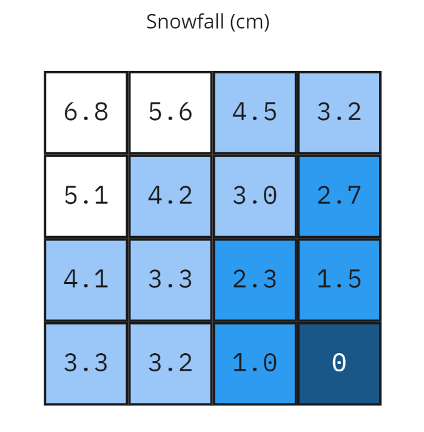

<!-- omit in toc -->
# Cesium 3D Metadata Specification

<!-- omit in toc -->
## Contributors

* Peter Gagliardi, Cesium
* Sean Lilley, Cesium
* Sam Suhag, Cesium
* Don McCurdy, Independent
* Bao Tran, Cesium
* Patrick Cozzi, Cesium

<!-- omit in toc -->
## Status

Draft

<!-- omit in toc -->
## Contents

- [Overview](#overview)
- [Concepts](#concepts)
- [Schemas](#schemas)
  - [Version](#version)
  - [Enums](#enums)
  - [Classes](#classes)
  - [Properties](#properties)
    - [ID](#id)
    - [Name](#name)
    - [Description](#description)
    - [Semantic](#semantic)
    - [Type](#type)
    - [Component Type](#component-type)
    - [Normalized Values](#normalized-values)
    - [Minimum and Maximum Values](#minimum-and-maximum-values)
    - [Required Properties and No Data Values](#required-properties-and-no-data-values)
- [Storage Formats](#storage-formats)
  - [Table Format](#table-format)
    - [Binary Encoding](#binary-encoding)
      - [Numbers](#numbers)
      - [Booleans](#booleans)
      - [Strings](#strings)
      - [Enums](#enums-1)
      - [Arrays](#arrays)
    - [JSON Encoding](#json-encoding)
      - [Numbers](#numbers-1)
      - [Booleans](#booleans-1)
      - [Strings](#strings-1)
      - [Enums](#enums-2)
      - [Arrays](#arrays-1)
  - [Raster Format](#raster-format)
    - [Numbers](#numbers-2)
    - [Enums](#enums-3)
    - [Arrays](#arrays-2)
    - [Implementation Notes](#implementation-notes)
- [Revision History](#revision-history)

## Overview

The Cesium 3D Metadata Specification defines a standard format for structured metadata in 3D content. Metadata — represented as entities and properties — may be closely associated with parts of 3D content, with data representations appropriate for large, distributed datasets. For the most detailed use cases, properties allow vertex- and texel-level associations; higher-level property associations are also supported.

Many domains benefit from structured metadata — typical examples include historical details of buildings in a city, names of components in a CAD model, descriptions of regions on textured surfaces, and classification codes for point clouds.

The specification defines core concepts to be used by multiple 3D formats, and is language and format agnostic. This document defines concepts with purpose and terminology, but does not impose a particular schema or serialization format for implementation. For use of the format outside of abstract conceptual definitions, see:

* [`3DTILES_metadata`](../../extensions/3DTILES_metadata/) - 3D Tiles extension that assigns metadata to various components of 3D Tiles
* [`EXT_feature_metadata`](https://github.com/CesiumGS/glTF/tree/3d-tiles-next/extensions/2.0/Vendor/EXT_feature_metadata) - glTF extension that assigns metadata to features in a model on a per-vertex, per-texel, or per-instance basis

The specification does not enumerate or define the semantic meanings of metadata, and assumes that separate specifications will define semantics for their particular application or domain. One example is the [Cesium Metadata Semantic Reference](./Semantics/) which defines built-in semantics for 3D Tiles and glTF. Identifiers for externally-defined semantics can be stored within the Cesium 3D Metadata Specification.

## Concepts

This specification defines metadata schemas and methods for encoding metadata.

**Schemas** contain a set of **classes** and **enums**. Class represents a category of similar entities, defined as a set of **properties**. Each property describes values of a particular type. Enums defines a set of named values representing a single value type, and may be referenced by class properties. Schema definitions do not describe how entities or properties are stored, and may be represented in a file format in various ways. Schemas can be reused across multiple assets or even file formats.

**Entities** are instantiations of class, populated with **property values** conforming to the class definition. Every property value of an entity must be defined by its class, and an entity must not have extraneous property values. Properties of a class may be required, in which case all entities instantiating the class are required to include them.

>  **Implementation note:** Entities may be defined at various levels of abstraction. Within a large dataset, individual vertices or texels may represent entities with granular metadata properties. Vertices and texels may be organized into higher-order groups (such as meshes, scene graphs, or tilesets) having their own associated properties.

**Metadata**, as used throughout this specification, refers to any association of 3D content with entities and properties, such that entities represent meaningful units within an overall structure. Other common definitions of metadata, particularly in relation to filesystems or networking as opposed to 3D content, remain outside the scope of the document.

Property values are stored with flexible representations to allow compact transmission and efficient lookups. This specification defines two such representations, a **Table Format** and a **Raster format**.

## Schemas

A schema defines the organization and types of metadata used in 3D content, represented as a set of classes and enums. Class definitions are referenced by entities whose metadata conforms to the class definition, providing a consistent and machine-readable structure for all entities in a dataset.

### Version

Schema version (`version`) is an application-specific identifier for a given schema revision. Version must be a string, and should be syntactically compatible with [SemVer](https://semver.org/).

> **Example:** Valid semantic versions include strings like `0.1.2`, `1.2.3`, and `1.2.3-alpha`.

### Enums

An enum consists of a set of named values, represented as `string: integer` pairs. The following enum value types are supported: `INT8`, `UINT8`, `INT16`, `UINT16`, `INT32`, `UINT32`, `INT64`, and `UINT64`. See [Property Types](#type) for definitions of each. Smaller enum types limit the range of possible enum values, and allow more efficient binary encoding. For unsigned value types, enum values most be non-negative. Duplicate names or values within the same enum are not allowed.

The example below defines a "species" enum with three possible tree species, as well as an "Unknown" value.

| name      | value |
|-----------|------:|
| "Oak"     |     0 |
| "Pine"    |     1 |
| "Maple"   |     2 |
| "Unknown" |    -1 |

### Classes

Classes represent categories of similar entities, and are defined by a collection of one or more properties shared by the entities of a class. Each class has a unique ID within the schema, and each property has a unique ID within the class, to be used for references within the schema and externally.

### Properties

Properties describe the type and structure of values that may be associated with entities of a class. Entities may omit values for a property, unless the property is required. Entities must not contain values other than those defined by the properties of their class.

> **Example:** The following example shows the basics of how classes describe the types of metadata. A `building` class describes the heights of various buildings in a dataset. Likewise, the `tree` class describes trees that have a height, species, and leaf color.
>
> **building**
>
> | property | componentType | required | noData |
> |:---------|:--------------|:---------|:-------|
> | height   | "FLOAT32"     | ✓        |        |
>
> **tree**
>
> | property  | componentType | required | noData    |
> |:----------|:--------------|:---------|:----------|
> | height    | "FLOAT32"     | ✓        |           |
> | species   | "STRING"      |          | "Unknown" |
> | leafColor | "STRING"      | ✓        |           |

#### ID

IDs (`id`) uniquely identify a property within a class, and must contain only alphanumeric characters and underscores. IDs should be human-readable (wherever possible) and camel-case. When IDs subject to these restrictions are not sufficiently clear for human readers, applications should also provide a property *name*.

#### Name

Names (`name`) provide a human-readable label for a property, and must be unique to a property within a class. Names must be valid UTF-8 strings, and should be written in natural language. Property names do not have inherent meaning; to provide such a meaning, a property must also define a [semantic](#semantic).

> **Example:** A typical ID / Name pair, in English, would be `localTemperature` and `"Local Temperature"`. In Japanese, the name might be represented as "きおん". Because IDs are restricted to alphanumeric characters and underscores, use of helpful property names is essential for clarity in many languages.

> **Example:**

#### Description

Descriptions (`description`) provide a human-readable explanation of a property, its purpose, or its contents. Typically at least a phrase, and possibly several sentences or paragraphs. To provide a machine-readable semantic meaning, a property must also define a [semantic](#semantic).

#### Semantic

Property IDs, names, and descriptions do not impute meaning. To provide such a meaning, properties may be assigned a semantic identifier string (`semantic`), indicating how the property's content should be interpreted. Semantic identifiers may be defined by the [Cesium Metadata Semantic Reference](./Semantics/) or by external semantic references, and may be application-specific. Identifiers should be uppercase, with underscores as word separators.

> **Example:** Common semantic definitions might include temperature in degrees Celsius (e.g. `TEMPERATURE_DEGREES_CELSIUS`), time in milliseconds (e.g. `TIME_MILLIS`), or mean squared error (e.g. `MSE`). These examples are only illustrative.

#### Type

A property's type (`type`) describes the structure of the value given for each entity. Most commonly a single value, a property may also represent a fixed- or variable-length array, or vector and matrix types:

| name   | type                                                    |
|--------|---------------------------------------------------------|
| SINGLE | Single-component value or scalar                        |
| ARRAY  | Fixed- or variable-length array of arbitrary components |
| VEC2   | Fixed-length vector with two (2) numeric components     |
| VEC3   | Fixed-length vector with three (3) numeric components   |
| VEC4   | Fixed-length vector with four (4) numeric components    |
| MAT2   | 2x2 matrix                                              |
| MAT3   | 3x3 matrix                                              |
| MAT4   | 4x4 matrix                                              |

The `ARRAY` type is used to define a fixed- or variable-length array of components. For fixed-length arrays, a component count denotes the number of components in each array, and must be ≥2. Variable-length arrays do not define a component count, and arrays may have any length, including zero.

The `VECN` and `MATN` types represent specific subsets of the fixed-length `ARRAY` type, where `VECN` is a vector with `N` numeric components and `MATN` is an `N x N` matrix with `N²` numeric components in column-major order. Where applicable, authoring implementations should choose these more specific types. Schema representations may choose to make component counts for `VECN` and `MATN` types implicit, rather than storing a `componentCount` descriptor for `VECN` and `MATN` types.

> **Example:** This example defines a `car` class with three array-like properties. The `passengers` property is a variable-length array, because `componentCount` is undefined.
>
> | property         | description                |  type   | componentType | componentCount |
> |:-----------------|:---------------------------|:-------:|:-------------:|---------------:|
> | forwardDirection | "Forward direction vector" | "VEC3"  |   "FLOAT64"   |              3 |
> | passengers       | "Passenger names"          | "ARRAY" |   "STRING"    |                |
> | modelMatrix      | "4x4 model matrix"         | "MAT4"  |   "FLOAT32"   |             16 |

#### Component Type

Properties may be comprised of one component (`SINGLE`) or many components (`ARRAY`, `VECN`, `MATN`), depending on the property `type`. Each component is an instance of the property's component type (`componentType`), with the following component types supported:

| name    | componentType                                                             |
|---------|---------------------------------------------------------------------------|
| INT8    | Signed integer in the range `[-128, 127]`                                 |
| UINT8   | Unsigned integer in the range `[0, 255]`                                  |
| INT16   | Signed integer in the range `[-32768, 32767]`                             |
| UINT16  | Unsigned integer in the range `[0, 65535]`                                |
| INT32   | Signed integer in the range `[-2147483648, 2147483647]`                   |
| UINT32  | Unsigned integer in the range `[0, 4294967295]`                           |
| INT64   | Signed integer in the range `[-9223372036854775808, 9223372036854775807]` |
| UINT64  | Unsigned integer in the range `[0, 18446744073709551615]`                 |
| FLOAT32 | A number that can be represented as 32-bit IEEE floating point            |
| FLOAT64 | A number that can be represented as 64-bit IEEE floating point            |
| BOOLEAN | True or false                                                             |
| STRING  | A sequence of characters                                                  |
| ENUM    | An enumerated type                                                        |

Floating-point properties (`FLOAT32` and `FLOAT64`) must not include values `NaN`, `+Infinity`, or `-Infinity`.

[Enum properties](#enums) are denoted by `ENUM`. An enum property must additionally provide the ID of the specific enum it uses, referred to as its enum type (`enumType`).

#### Normalized Values

Normalized properties (`normalized`) provide a compact alternative to larger floating-point types. Normalized values are stored as integers, but when accessed are transformed to floating-point form according to the following rules:

* Unsigned integer values (`UINT8`, `UINT16`, `UINT32`, `UINT64`) must be rescaled to the range `[0.0, 1.0]` (inclusive)
* Signed integer values (`INT8`, `INT16`, `INT32`, `INT64`) must be rescaled to the range `[-1.0, 1.0]` (inclusive)

> **Implementation Note:** Depending on the implementation and the chosen integer type, there may be some loss of precision in the normalized values. For example, if the implementation uses 32-bit floating point variables to represent the normalized value, there are only 23 bits in the mantissa. In this case, if the value to normalize is 32- or 64-bit, a number of lower bits will be truncated when normalized. Therefore, it is recommended that implementations use the highest precision floats available for representing the result.

#### Minimum and Maximum Values

Properties representing numeric values, fixed-length numeric arrays, and vectors may specify a minimum (`minimum`) and maximum (`maximum`). Minimum and maximum values may represent bounds of the valid range for a property, or the exact minimum and maximum values found in the dataset.

> **Example:** A property storing GPS coordinates might define a range of `[-180, 180]` degrees for longitude values and `[-90, 90]` degrees for latitude values. If the dataset contains GPS coordinates only in a small region, more specific ranges may be given instead.

#### Required Properties and No Data Values

When associated property values must exist for all entities of a class, a property is considered required (`required`).

Properties may optionally specify a No Data value (`noData`, or "sentinel value") to be used when property values do not exist. This value must match the property definition, e.g. if `type` is `UINT8` the `noData` value must be an unsigned integer in the range `[0, 255]`. If the property is normalized, the `noData` value is given in its original integer form, not the normalized form.

Individual components in an array cannot be marked as optional; only the array property itself can be marked as optional.

For `ARRAY`, `VECN`, and `MATN` types, `noData` is an array-typed value indicating that the entire array represents a missing value. For example, `[-1, -1, -1]` might be used as a `noData` value for a `VEC3` property. When an array-typed property is required or includes a `noData` value, this has no effect on the interpretation of individual array elements. When variable-length arrays are required, an empty array is still valid.

For `ENUM` component types, a `noData` value should contain the name of the enum value as a string, rather than its integer value.

> **Example:** In the example below, a "tree" class is defined with `noData` indicating a specific enum value to be interpreted as missing data.
>
> | property  | componentType | required | noData    |
> |:----------|:--------------|:---------|:----------|
> | height    | "FLOAT32"     | ✓        |           |
> | species   | "ENUM"        |          | "Unknown" |
> | leafColor | "STRING"      | ✓        |           |

## Storage Formats

A schema provides the pattern for creating entities. This section covers the various formats and encodings for storing entity metadata. Additional formats and encoding may be defined outside of this specification.

* **Table format** - property values are stored in parallel 1D arrays
* **Raster format** - property values are stored in channels of pixel-based formats (usually images)

The table format is suitable for general purpose metadata storage. This is similar in concept to a database table where entities are rows and properties are columns. The raster format is for storing fine-grained metadata in pixel-based formats such as images and video. Entities correspond to pixels and properties correspond to channels. This format is especially useful when texture mapping high frequency data, like material properties, to less detailed 3D surfaces. The raster format can also take advantage of image compression techniques.

Both formats are designed for storing metadata for a large number of entities.

Table Format|Raster Format
--|--
|| |


Each format may have any number of **encodings**. Two encodings are defined for the table format: a **binary encoding** and a **JSON encoding**. A specification that references Cesium 3D Metadata must state which format and encoding it uses and is free to define its own formats and encodings. For example, while this specification does not define any raster encodings, the [`EXT_feature_metadata`](https://github.com/CesiumGS/glTF/tree/3d-tiles-next/extensions/2.0/Vendor/EXT_feature_metadata) glTF extension may use any image formats supported by glTF for storing per-texel metadata, including PNG and JPEG.

### Table Format

The table format is general purpose and is conceptually similar to a database table. Each column represents one of the properties of the class. Each row represents a single entity conforming to the class.

The rows of a table are addressed by an integer index called an **entity ID**. Entity IDs are always numbered `0, 1, ..., N - 1` where `N` is the number of rows in the table.

The metadata values are stored in parallel arrays called **property arrays**, one per column. Each property array stores values for a single property. The `i-th` value of each property array is the value of that property for the entity with an entity ID of `i`.

Two encodings are defined for the table format: **binary encoding** and **JSON encoding**.

Binary encoding is designed to be runtime efficient, and scalable to large quantities of metadata. Since a property array stores elements of a single type, this allows storage optimizations such as storing boolean values in a tightly packed bitstream, or data type-aware compression.

JSON encoding is useful for storing a small number of entities in human readable form.

#### Binary Encoding

Property vales are encoded in binary according to their type, in little-endian format. Values are tightly packed: there is no padding between values.

##### Numbers

Numeric types are encoded as follows:

| Name    | Description                            |
|---------|----------------------------------------|
| INT8    | 8-bit two's complement signed integer  |
| UINT8   | 8-bit unsigned integer                 |
| INT16   | 16-bit two's complement signed integer |
| UINT16  | 16-bit unsigned integer                |
| INT32   | 32-bit two's complement signed integer |
| UINT32  | 32-bit unsigned integer                |
| INT64   | 64-bit two's complement signed integer |
| UINT64  | 64-bit unsigned integer                |
| FLOAT32 | 32-bit IEEE floating point number      |
| FLOAT64 | 64-bit IEEE floating point number      |

##### Booleans

A boolean value is encoded as a single bit, either 0 (`false`) or 1 (`true`). Multiple boolean values are packed into a bitstream.

To access the boolean value for entity ID `i`:

```
byteIndex = floor(i / 8)
bitIndex = i % 8
bitValue = (buffer[byteIndex] >> bitIndex) & 1
value = bitValue == 1
```

##### Strings

A string value is a UTF-8 encoded byte sequence. Multiple strings are packed tightly in the same buffer.

Since strings byte lengths may vary, an **offset buffer** is used to identify strings in the buffer. If there are `N` strings in the property array, the offset buffer has `N + 1` elements. The first `N` of these point to the start byte of each string, while the last one points to the byte immediately after the last string. The byte length of the `i-th` string (0-indexed) is given by `offsetBuffer[i + 1] - offsetBuffer[i]`.

The size of each offset can be configured with an offset type, which may be `UINT8`, `UINT16`, `UINT32`, or `UINT64`.

The following example shows how UTF-8 strings are encoded in binary:


##### Enums

Enums are encoded as integer values according to the enum value type (see [Enums](#enums)).

##### Arrays

Array values are encoded according to their component type. Components are tightly packed.

Variable-length arrays use a similar offset buffer technique like [strings](#strings) do, with one main difference. Instead of storing _byte_ offsets, array offset buffers store _array index_ offsets. For example, for an array of `FLOAT32`, an offset of `3` would correspond to element `3`. The byte offset would be `3 * sizeof(FLOAT32) = 12`. For an array of `BOOLEAN` an offset of `3` would correspond to a _bit_ offset of 3.

This example shows how to encode a variable-length array of integers.


**schema → classes → arrayExample**

| property        | type    | componentType |
|-----------------|---------|---------------|
| "arrayProperty" | "ARRAY" | "UINT8"       |

**table**

- count: `5`
- class: `"arrayExample"`
- properties
  - `"arrayProperty"`
    - buffer: `[1, 3, 5, ...]`
    - arrayOffsetBuffer: `[0, 3, 7, ...]`

This example shows how to encode a variable-length array of strings.


**schema → classes → weather**

| property          | type    | componentType |
|-------------------|---------|---------------|
| "forecastHistory" | "ARRAY" | "STRING"      |

**table**

- count: `2`
- class `"weather"`
- properties
  - `"forecastHistory"`
    - buffer: `['R', 'a', 'i', 'n', ...]`
    - arrayOffsetBuffer: `[0, 2, 3]`
    - stringOffsetBuffer: `[0, 8, 19, 28]`

#### JSON Encoding

Property values are encoded as their corresponding JSON types: numeric types are represented as `number`, booleans as `boolean`, strings as `string`, enums as `string`, and arrays as `array`.

The following example demonstrates usage for both fixed and variable size arrays:

_Schema_
```jsonc
{
  "schema": {
    "enums": {
      "basicEnum": {
        "values": [
          {
            "name": "Enum A",
            "value": 0
          },
          {
            "name": "Enum B",
            "value": 1
          },
          {
            "name": "Enum C",
            "value": 2
          }
        ]
      }
    },
    "classes": {
      "basicClass": {
        "properties": {
          "floatProperty": {
            "type": "FLOAT64"
          },
          "integerProperty": {
            "type": "INT32"
          },
          "booleanProperty": {
            "type": "BOOLEAN"
          },
          "stringProperty": {
            "type": "STRING"
          },
          "enumProperty": {
            "type": "ENUM",
            "enumType": "basicEnum"
          },
          "floatArrayProperty": {
            "type": "ARRAY",
            "componentType": "FLOAT32",
            "componentCount": 3
          },
          "stringArrayProperty": {
            "type": "ARRAY",
            "componentType": "STRING"
          },
          "optionalProperty": {
            "type": "FLOAT32",
            "optional": true
          }
        }
      }
    }
  }
}
```

_A single entity encoded in JSON. Note that the optional property is omitted in this example._
```jsonc
{
  "entity": {
    "class": "basicClass",
    "properties": {
      "floatProperty": 1.5,
      "integerProperty": -90,
      "booleanProperty": true,
      "stringProperty": "x123",
      "enumProperty": "Enum B",
      "floatArrayProperty": [1.0, 0.5, -0.5],
      "stringArrayProperty": ["abc", "12345", "おはようございます"]
    }
  }
}
```

_A collection of entities encoded in JSON_

```jsonc
{
  "entityTable": {
    "count": 3,
    "class": "basicClass",
    "properties": {
      "floatProperty": [1.5, 0.9, -0.1],
      "integerProperty": [-90, 90, 180],
      "booleanProperty": [true, false, false],
      "stringProperty": ["x123", "x437", "x910"],
      "enumProperty": ["Enum B", "Enum A", "Enum C"],
      "floatArrayProperty": [
        [1.0, 0.5, -0.5],
        [-0.5, 0.0, 0.1],
        [0.9, 0.3, -0.2]
      ],
      "stringArrayProperty": [
        ["abc", "12345", "おはようございます"],
        ["☺", "value 0", "", "value 1"],
        []
      ]
    }
  }
}
```

##### Numbers

All numeric types (`INT8`, `UINT8`, `INT16`, `UINT16`, `INT32`, `UINT32`, `INT64`, `UINT64`, `FLOAT32`, and `FLOAT64`) are encoded as JSON numbers. Floating point numbers must be representable as IEEE floating point.

> **Implementation Note:** For numeric types the size in bits is made explicit. Even though JSON only has a single `number` type for all integers and floating point numbers, the application that consumes the JSON may make a distinction. For example, C and C++ have several different integer types such as `uint8_t`, `uint32_t`. The application is responsible for interpreting the metadata using the type specified in the property definition.

##### Booleans

Booleans are encoded as a JSON boolean, either `true` or `false`.

##### Strings

Strings are encoded as JSON strings.

##### Enums

Enums are encoded as JSON strings using the name the enum value rather than the integer value. Therefore the enum value type, if specified, is ignored for the JSON encoding.

##### Arrays

Arrays are encoded as JSON arrays, where each component is encoded according to the component type. When a component count is specified, the length of the JSON array must match the component count. Otherwise, for variable-length arrays, the JSON array may be any length, including zero-length.

### Raster Format

The raster format is designed for high frequency metadata encoded in images. Metadata is directly accessed via pixel coordinates. Entities correspond to pixels and properties correspond to image channels. Implementations must specify the image format. This flexibility allows for a wide range of image formats and compression techniques.

#### Numbers

Numeric values like `UINT8` are encoded directly in channels of an image.

In the following example, a single-channel image is used to encode ocean temperature data.

```jsonc
{
  "schema": {
    "classes": {
      "ocean": {
        "properties": {
          "temperature": {
            "type": "UINT8",
            "normalized": "true"
          }
        }
      }
    }
  },
  "oceanTexture": {
    "class": "ocean",
    "image": "ocean.png",
    "properties": {
      "temperature": {
        "channels": "0"
      }
    }
  }
}
```

In this example temperature, salinity, and ship count are encoded in separate channels of the same image.

```jsonc
{
  "schema": {
    "classes": {
      "ocean": {
        "properties": {
          "temperature": {
            "type": "UINT8",
            "normalized": "true"
          },
          "salinity": {
            "type": "UINT8",
            "normalized": "true"
          },
          "shipCount": {
            "type": "UINT8"
          }
        }
      }
    }
  },
  "oceanTexture": {
    "class": "ocean",
    "image": "ocean.png",
    "properties": {
      "temperature": {
        "channels": "0"
      },
      "salinity": {
        "channels": "1"
      },
      "shipCount": {
        "channels": "2"
      }
    }
  }
}
```

#### Enums

Enum values may also be encoded in images. Enums are encoded as integer values according to their enum value type (see [Enums](#enums)).


#### Arrays

Fixed-length arrays can be stored in a multi-channel texture. This is useful for encoding vector-valued properties.

The example below demonstrates encoding vector properties using a 3-channel image. Channel 0 stores the x-component, channel 1 stores the y-component, and channel 2 stores the z-component.

```jsonc
{
  "schema": {
    "classes": {
      "wind": {
        "properties": {
          "velocity": {
            "type": "ARRAY",
            "componentType": "UINT8",
            "componentCount": 3,
            "normalized": "true"
          }
        }
      }
    }
  },
  "windTexture": {
    "class": "wind",
    "image": "wind.png",
    "properties": {
      "velocity": {
        "channels": "012"
      }
    }
  }
}
```

#### Implementation Notes

The data type and bit depth of the image should be compatible with the property type. In the examples above, the ocean surface temperature should be encoded in an 8-bit per-channel image. Likewise, a floating point property should use a floating point-compatible image format like TIFF or KTX2. Aside from these guidelines, implementations have a large degree of freedom in determining how raster data is encoded.

## Revision History

* **Version 0.0.0** November 6, 2020
  * Initial draft
* **Version 1.0.0** February 25, 2021
  * The specification has been revised to focus on the core concepts of schemas (including classes, enums, and properties) and formats for encoding metadata. It is now language independent. The JSON schema has been removed.
  * Added schemas which contain classes and enums
  * Added enum support
  * Added ability to assign a semantic identifiers to properties
  * Removed blob support
  * Removed special handling for fixed-length strings