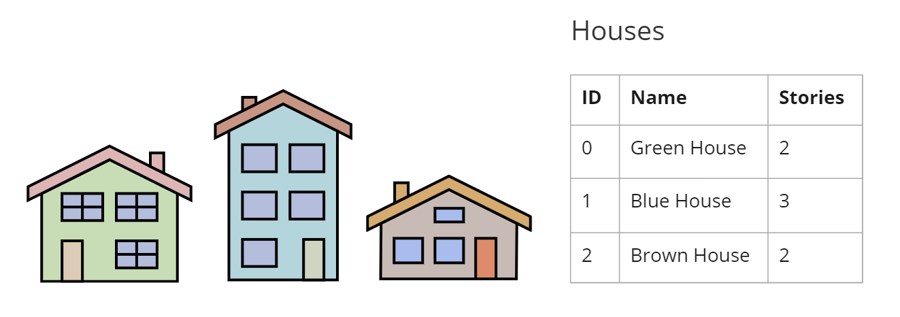
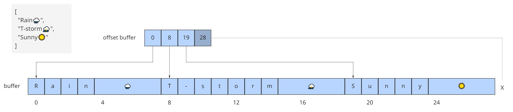
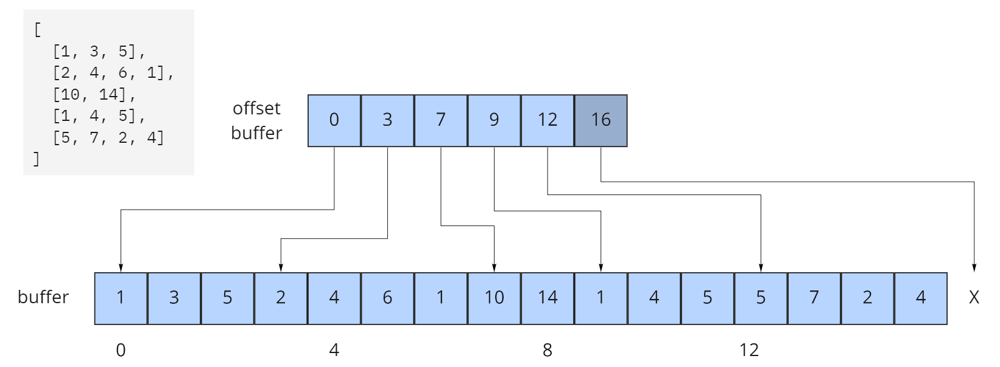
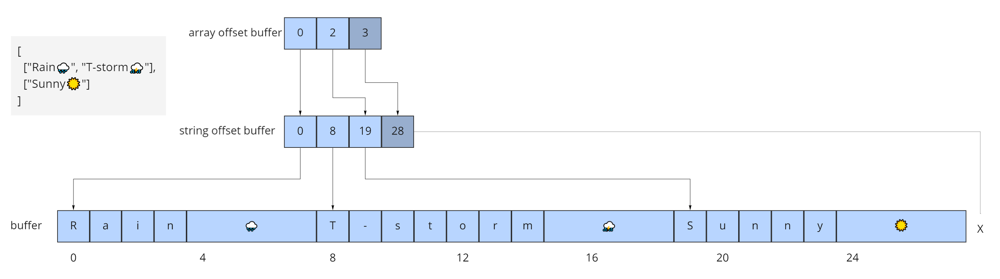

<!-- omit in toc -->
# 3D Metadata Specification

<!-- omit in toc -->
## Contributors

* Sean Lilley, Cesium
* Peter Gagliardi, Cesium
* Marco Hutter, Cesium
* Don McCurdy, Independent
* Sam Suhag, Cesium
* Bao Tran, Cesium
* Patrick Cozzi, Cesium

<!-- omit in toc -->
## Status

Draft

<!-- omit in toc -->
## Contents

- [Overview](#overview)
- [Concepts](#concepts)
- [Schemas](#schemas)
  - [Schema](#schema)
    - [ID](#id)
    - [Version](#version)
    - [Name](#name)
    - [Description](#description)
    - [Enums](#enums)
    - [Classes](#classes)
  - [Enum](#enum)
    - [ID](#id-1)
    - [Name](#name-1)
    - [Description](#description-1)
    - [Values](#values)
  - [Class](#class)
    - [ID](#id-2)
    - [Name](#name-2)
    - [Description](#description-2)
    - [Properties](#properties)
  - [Property](#property)
    - [Overview](#overview-1)
    - [ID](#id-3)
    - [Name](#name-3)
    - [Description](#description-3)
    - [Semantic](#semantic)
    - [Type](#type)
    - [Component Type](#component-type)
    - [Enum Type](#enum-type)
    - [Arrays](#arrays)
    - [Normalized Values](#normalized-values)
    - [Offset and Scale](#offset-and-scale)
    - [Minimum and Maximum Values](#minimum-and-maximum-values)
    - [Required Properties, No Data Values, and Default Values](#required-properties-no-data-values-and-default-values)
- [Storage Formats](#storage-formats)
  - [Overview](#overview-2)
  - [Binary Table Format](#binary-table-format)
    - [Overview](#overview-3)
    - [Scalars](#scalars)
    - [Vectors](#vectors)
    - [Matrices](#matrices)
    - [Booleans](#booleans)
    - [Strings](#strings)
    - [Enums](#enums-1)
    - [Fixed-Length Arrays](#fixed-length-arrays)
    - [Variable-Length Arrays](#variable-length-arrays)
  - [JSON Format](#json-format)
    - [Overview](#overview-4)
    - [Scalars](#scalars-1)
    - [Vectors](#vectors-1)
  - [Matrices](#matrices-1)
    - [Booleans](#booleans-1)
    - [Strings](#strings-1)
    - [Enums](#enums-2)
    - [Arrays](#arrays-1)

## Overview

The 3D Metadata Specification defines a standard format for structured metadata in 3D content. Metadata — represented as entities and properties — may be closely associated with parts of 3D content, with data representations appropriate for large, distributed datasets. For the most detailed use cases, properties allow vertex- and texel-level associations; higher-level property associations are also supported.

Many domains benefit from structured metadata — typical examples include historical details of buildings in a city, names of components in a CAD model, descriptions of regions on textured surfaces, and classification codes for point clouds.

The specification defines core concepts to be used by multiple 3D formats, and is language and format agnostic. This document defines concepts with purpose and terminology, but does not impose a particular schema or serialization format for implementation. For use of the format outside of abstract conceptual definitions, see:

* [`3DTILES_metadata`](../../extensions/3DTILES_metadata) (3D Tiles 1.0) — Assigns metadata to tilesets, tiles, groups, and contents
* [`EXT_structural_metadata`](TODO) (glTF 2.0) —  Assigns metadata to vertices, texels, and features in a glTF asset

The specification does not enumerate or define the semantic meanings of metadata, and assumes that separate specifications will define semantics for their particular application or domain. One example is the [3D Metadata Semantic Reference](./Semantics/) which defines built-in semantics for 3D Tiles and glTF. Identifiers for externally-defined semantics can be stored within the 3D Metadata Specification.

## Concepts

This specification defines metadata schemas and methods for encoding metadata.

**Schemas** contain a set of **classes** and **enums**. A class represents a category of similar entities, and is defined as a set of **properties**. Each property describes values of a particular type. An enum defines a set of named values representing a single value type, and may be referenced by class properties. Schema definitions do not describe how entities or properties are stored, and may be represented in a file format in various ways. Schemas can be reused across multiple assets or even file formats.

**Entities** are instantiations of a class, populated with **property values** conforming to the class definition. Every property value of an entity must be defined by its class, and an entity must not have extraneous property values. Properties of a class may be required, in which case all entities instantiating the class are required to include them.

>  **Implementation note:** Entities may be defined at various levels of abstraction. Within a large dataset, individual vertices or texels may represent entities with granular metadata properties. Vertices and texels may be organized into higher-order groups (such as meshes, scene graphs, or tilesets) having their own associated properties.

**Metadata**, as used throughout this specification, refers to any association of 3D content with entities and properties, such that entities represent meaningful units within an overall structure. Other common definitions of metadata, particularly in relation to filesystems or networking as opposed to 3D content, remain outside the scope of the document.

Property values are stored with flexible representations to allow compact transmission and efficient lookups. This specification defines two possible [storage formats](#storage-formats).

## Schemas

### Schema

A schema defines the organization and types of metadata used in 3D content, represented as a set of classes and enums. Class definitions are referenced by entities whose metadata conforms to the class definition. This provides a consistent and machine-readable structure for all entities in a dataset.

Components of a schema are listed below, and implementations may define additional components.

#### ID

IDs (`id`) uniquely identify a schema, and must contain only alphanumeric characters and underscores. IDs should be camel case strings that are human-readable (wherever possible). When IDs subject to these restrictions are not sufficiently clear for human readers, applications should also provide a `name`.

#### Version

Schema version (`version`) is an application-specific identifier for a given schema revision. Version must be a string, and should be syntactically compatible with [SemVer](https://semver.org/).

When a schema has multiple versions, the `(id, version)` pair uniquely identifies a particular schema and revision.

> **Example:** Valid semantic versions include strings like `0.1.2`, `1.2.3`, and `1.2.3-alpha`.

#### Name

Names (`name`) provide a human-readable label for a schema, and are not required to be unique. Names must be valid Unicode strings, and should be written in natural language.

#### Description

Descriptions (`description`) provide a human-readable explanation of a schema, its purpose, or its contents. Typically at least a phrase, and possibly several sentences or paragraphs. Descriptions must be valid Unicode strings.

#### Enums

Unordered set of [enums](#enum).

#### Classes

Unordered set of [classes](#class).

***

### Enum

An enum consists of a set of named values, represented as `(string, integer)` pairs. Each enum is identified by a unique ID.

> **Example:** A "species" enum with three possible tree species, as well as an "Unknown" value.
>
> - **ID:** "species"
> - **Name:** "Species"
> - **Description:** "Common tree species identified in the study."
> - **Value type:** `INT32`
>
> | name        | value   |
> |-------------|---------|
> | `"Oak"`     |     `0` |
> | `"Pine"`    |     `1` |
> | `"Maple"`   |     `2` |
> | `"Unknown"` |    `-1` |

#### ID

IDs (`id`) uniquely identify an enum within a schema, and must contain only alphanumeric characters and underscores. IDs should be camel case strings that are human-readable (wherever possible). When IDs subject to these restrictions are not sufficiently clear for human readers, applications should also provide a `name`.

#### Name

Names (`name`) provide a human-readable label for an enum, and are not required to be unique within a schema. Names must be valid Unicode strings, and should be written in natural language.

#### Description

Descriptions (`description`) provide a human-readable explanation of an enum, its purpose, or its contents. Typically at least a phrase, and possibly several sentences or paragraphs. Descriptions must be valid Unicode strings.

#### Values

An enum consists of a set of named values, represented as `(string, integer)` pairs. The following enum value types are supported: `INT8`, `UINT8`, `INT16`, `UINT16`, `INT32`, `UINT32`, `INT64`, and `UINT64`. See the [Component Type](#component-type) section for definitions of each. Smaller enum types limit the range of possible enum values, and allow more efficient binary encoding. Duplicate names or values within the same enum are not allowed.

***

### Class

Classes represent categories of similar entities, and are defined by a collection of one or more properties shared by the entities of a class. Each class has a unique ID within the schema, and each property has a unique ID within the class, to be used for references within the schema and externally.

#### ID

IDs (`id`) uniquely identify a class within a schema, and must contain only alphanumeric characters and underscores. IDs should be camel case strings that are human-readable (wherever possible). When IDs subject to these restrictions are not sufficiently clear for human readers, applications should also provide a `name`.

#### Name

Names (`name`) provide a human-readable label for a class, and are not required to be unique within a schema. Names must be valid Unicode strings, and should be written in natural language.

#### Description

Descriptions (`description`) provide a human-readable explanation of a class, its purpose, or its contents. Typically at least a phrase, and possibly several sentences or paragraphs. Descriptions must be valid Unicode strings.

#### Properties

Unordered set of [properties](#property).

***

### Property

#### Overview

Properties describe the type and structure of values that may be associated with entities of a class. Entities may omit values for a property, unless the property is required. Entities must not contain values other than those defined by the properties of their class.

> **Example:** The following example shows the basics of how classes describe the types of metadata. A `building` class describes the heights of various buildings in a dataset. Likewise, the `tree` class describes trees that have a height, species, and leaf color.
>
> **building**
>
> | property | type     | componentType |
> |----------|----------|---------------|
> | height   | `SCALAR` | `FLOAT32`     |
>
> **tree**
>
> | property  | type     | componentType | enumType   |
> |-----------|----------|---------------|------------|
> | height    | `SCALAR` | `FLOAT32`     |            |
> | species   | `ENUM`   |               | `species`  |
> | leafColor | `STRING` |               |            |

#### ID

IDs (`id`) uniquely identify a property within a class, and must contain only alphanumeric characters and underscores. IDs should be camel case strings that are human-readable (wherever possible). When IDs subject to these restrictions are not sufficiently clear for human readers, applications should also provide a `name`.

#### Name

Names (`name`) provide a human-readable label for a property, and must be unique to a property within a class. Names must be valid Unicode strings, and should be written in natural language. Property names do not have inherent meaning; to provide such a meaning, a property must also define a [semantic](#semantic).

> **Example:** A typical ID / Name pair, in English, would be `localTemperature` and `"Local Temperature"`. In Japanese, the name might be represented as "きおん". Because IDs are restricted to alphanumeric characters and underscores, use of helpful property names is essential for clarity in many languages.

#### Description

Descriptions (`description`) provide a human-readable explanation of a property, its purpose, or its contents. Typically at least a phrase, and possibly several sentences or paragraphs. Descriptions must be valid Unicode strings. To provide a machine-readable semantic meaning, a property must also define a [semantic](#semantic).

#### Semantic

Property IDs, names, and descriptions do not have an inherent meaning. To provide a machine-readable meaning, properties may be assigned a semantic identifier string (`semantic`), indicating how the property's content should be interpreted. Semantic identifiers may be defined by the [3D Metadata Semantic Reference](./Semantics/) or by external semantic references, and may be application-specific. Identifiers should be uppercase, with underscores as word separators.

> **Example:** Semantic definitions might include temperature in degrees Celsius (e.g. `TEMPERATURE_DEGREES_CELSIUS`), time in milliseconds (e.g. `TIME_MILLISECONDS`), or mean squared error (e.g. `MEAN_SQUARED_ERROR`). These examples are only illustrative.

#### Type

A property's type (`type`) describes the structure of the value given for each entity.

| name    | type                                                  |
|---------|-------------------------------------------------------|
| SCALAR  | Single numeric component                              |
| VEC2    | Fixed-length vector with two (2) numeric components   |
| VEC3    | Fixed-length vector with three (3) numeric components |
| VEC4    | Fixed-length vector with four (4) numeric components  |
| MAT2    | 2x2 matrix with numeric components                    |
| MAT3    | 3x3 matrix with numeric components                    |
| MAT4    | 4x4 matrix with numeric components                    |
| STRING  | A sequence of characters                              |
| BOOLEAN | True or false                                         |
| ENUM    | An enumerated type                                    |

#### Component Type

Scalar, vector, and matrix types comprise of numeric components. Each component is an instance of the property's component type (`componentType`), with the following component types supported:

| name    | componentType                                                             |
|---------|---------------------------------------------------------------------------|
| INT8    | Signed integer in the range `[-128, 127]`                                 |
| UINT8   | Unsigned integer in the range `[0, 255]`                                  |
| INT16   | Signed integer in the range `[-32768, 32767]`                             |
| UINT16  | Unsigned integer in the range `[0, 65535]`                                |
| INT32   | Signed integer in the range `[-2147483648, 2147483647]`                   |
| UINT32  | Unsigned integer in the range `[0, 4294967295]`                           |
| INT64   | Signed integer in the range `[-9223372036854775808, 9223372036854775807]` |
| UINT64  | Unsigned integer in the range `[0, 18446744073709551615]`                 |
| FLOAT32 | A number that can be represented as a 32-bit IEEE floating point number   |
| FLOAT64 | A number that can be represented as a 64-bit IEEE floating point number   |

Floating-point properties (`FLOAT32` and `FLOAT64`) must not include values `NaN`, `+Infinity`, or `-Infinity`.

> **Implementation Note:** Developers of authoring tools should be aware that many JSON implementations support only numeric values that can be represented as IEEE-754 double precision floating point numbers. Floating point numbers should be representable as double precision IEEE-754 floats when encoded in JSON. When those numbers represent property values (such as `noData`, `min`, or `max`) having lower precision (e.g. single-precision float, 8-bit integer, or 16-bit integer), the values should be rounded to the same precision in JSON to avoid any potential mismatches. Numeric property values encoded in binary storage are unaffected by these limitations of JSON implementations.

#### Enum Type

[Enum properties](#enums) are denoted by `ENUM`. An enum property must additionally provide the ID of the specific enum it uses, referred to as its enum type (`enumType`).

#### Arrays

A property can be declared to be a fixed- and variable-length array, consisting of elements of the given type. For fixed-length arrays, a count (`count`) denotes the number of elements in each array, and must be greater than or equal to 2. Variable-length arrays do not define a count and may have any length, including zero.

#### Normalized Values

Normalized properties (`normalized`) provide a compact alternative to larger floating-point types. Normalized values are stored as integers, but when accessed are transformed to floating-point according to the following equations:

| componentType | int to float                               | float to int                            |
|---------------|--------------------------------------------|-----------------------------------------|
| INT8          | `f = max(i / 127.0, -1.0)`                 | `i = round(f * 127.0)`                  |
| UINT8         | `f = i / 255.0`                            | `i = round(f * 255.0)`                  |
| INT16         | `f = max(i / 32767.0, -1.0)`               | `i = round(f * 32767.0)`                |
| UINT16        | `f = i / 65535.0`                          | `i = round(f * 65535.0)`                |
| INT32         | `f = max(i / 2147483647.0, -1.0)`          | `i = round(f * 2147483647.0)`           |
| UINT32        | `f = i / 4294967295.0`                     | `i = round(f * 4294967295.0)`           |
| INT64         | `f = max(i / 9223372036854775807.0, -1.0)` | `i = round(f * 9223372036854775807.0)`  |
| UINT64        | `f = i / 18446744073709551615.0`           | `i = round(f * 18446744073709551615.0)` |

`normalized` is only applicable to scalar, vector, and matrix types with integer component types.

> **Implementation Note:** Depending on the implementation and the chosen integer type, there may be some loss of precision in values after denormalization. For example, if the implementation uses 32-bit floating point variables to represent the value of a normalized 32-bit integer, there are only 23 bits in the mantissa of the float, and lower bits will be truncated by denormalization. Client implementations should use higher precision floats when appropriate for correctly representing the result.

#### Offset and Scale

A property may declare an offset (`offset`) and scale (`scale`) to apply to property values. This is useful when mapping property values to a different range. The following equation is used to transform property values:

`transformedValue = offset + scale * value`

Offset and scale may also be used in conjunction with normalized properties:

`transformedValue = offset + scale * normalize(value)`

Offset and scale values must match the property type, e.g. if `type` is `SCALAR` the value must be a single number and if `type` is `VEC3` the value must be an array-typed value with three numbers. If the property is a fixed-length array the value must be an array with elements corresponding to the given `type`. Offset and scale are only applicable to scalar, vector, and matrix types, and fixed-length arrays thereof. Offset and scale values are not required to match the `componentType`. Transform operations are applied component-wise, both for array elements and for vector and matrix components.

When offset is not provided, a default offset with all `0.0` values is used. When scale is not provided, a default scale with all `1.0` values is used.

> **Example:** A property storing quantized temperature values in the range -10.5°C to 44°C would have `SCALAR` type, `UINT8` component type, `normalized` true, `offset` of -10.5, and `scale` of 54.5. Integer values from 0 to 255 would be remapped to values from -10.5 to 44.0.

#### Minimum and Maximum Values

Properties representing numeric values — such scalar, vector, and matrix types — may specify a minimum (`minimum`) and maximum (`maximum`). Minimum and maximum values represent component-wise bounds of the valid range for a property.

Minimum and maximum values must match the property type and component type, e.g. if `type` is `SCALAR` and `componentType` is `UINT8` the value must be an unsigned integer in the range `[0, 255]` and if `type` is `VEC3` and `componentType` is `FLOAT32` the value must be an array-typed value with three floats. If the property is a fixed-length array the value must be an array with elements corresponding to the given `type` and `componentType`. Minimum and maximum are only applicable to scalar, vector, and matrix types, and fixed-length arrays thereof. The property's `normalized`, `scale` and `offset` attributes have no affect on the value.

> **Example:** A property storing GPS coordinates might define a range of `[-180, 180]` degrees for longitude values and `[-90, 90]` degrees for latitude values.

Property values outside the `[minimum, maximum]` range are not allowed, with the exception of `noData` values.

#### Required Properties, No Data Values, and Default Values

When associated property values must exist for all entities of a class, a property is considered required (`required`).

Individual elements in an array or individual components in a vector or matrix cannot be marked as required; only the property itself can be marked as required.

Properties may optionally specify a No Data value (`noData`, or "sentinel value") to be used when property values do not exist. This value must match the property definition, e.g. if `type` is `SCALAR` and `componentType` is `UINT8` the `noData` value must be an unsigned integer in the range `[0, 255]` and if `type` is `VEC3` and `componentType` is `FLOAT32` the value must be an array-typed value with three floats. If the property is a fixed-length array the value must be an array with elements corresponding to the given `type` and `componentType`. The property's `normalized`, `scale` and `offset` attributes have no affect on the value. A `noData` value may be provided for any `type` except `BOOLEAN`. For `ENUM` types, a `noData` value should contain the name of the enum value as a string, rather than its integer value.

`noData` values are especially useful when only some entities in a property table are missing property values (see [Binary Table Format](#binary-table-format)). Otherwise if all entities are missing property values the column may be omitted from the table and a `noData` value need not be provided. Entities encoded in the [JSON Format](#json-format) may omit the property instead of providing a `noData` value. `noData` values and omitted properties are functionally equivalent.

A default value (`defaultValue`) may be provided for missing property values. This value must match the property definition and may be provided for any `type`. For `ENUM` types, a `defaultValue` value should contain the name of the enum value as a string, rather than its integer value. If a default value is not provided, the behavior when encountering missing property values is implementation-defined.

> **Example:** In the example below, a "tree" class is defined with `noData` indicating a specific enum value to be interpreted as missing data.
>
> | property  | componentType   | required | noData      |
> |-----------|-----------------|----------|-------------|
> | height    | `FLOAT32`       | ✓        |             |
> | species   | `ENUM`          |          | `"Unknown"` |
> | leafColor | `STRING`        | ✓        |             |

## Storage Formats

### Overview

Schemas provide templates for entities, but creating an entity requires specific property values and storage. This section covers two storage formats for entity metadata:

* **Binary Table Format** - property values are stored in parallel 1D arrays, encoded as binary data
* **JSON Format** - property values are stored in key/value dictionaries, encoded as JSON objects

Both formats are suitable for general purpose metadata storage. Binary formats may be preferable for larger quantities of metadata.

Additional serialization methods may be defined outside of this specification. For example, property values could be stored in texture channels or retrieved from a REST API as XML data.

> **Implementation note:** Any specification that references 3D Metadata must state explicitly which storage formats are supported, or define its own serialization. For example, the [`EXT_structural_metadata`](TODO) glTF extension implements the binary table format described below, and defines an additional image-based format for per-texel metadata.

### Binary Table Format

#### Overview

The binary table format is similar to a database table where entities are rows and properties are columns. Each column represents one of the properties of the class. Each row represents a single entity conforming to the class.



The rows of a table are addressed by an integer index called an **entity ID**. Entity IDs are always numbered `0, 1, ..., N - 1` where `N` is the number of rows in the table.

Property values are stored in parallel arrays called **property arrays**, one per column. Each property array stores values for a single property. The `i-th` value of each property array is the value of that property for the entity with an entity ID of `i`.

Binary encoding is efficient for runtime use, and scalable to large quantities of metadata. Because property arrays contain elements of a single type, bitstreams may be tightly packed or may use compression methods appropriate for a particular data type.

Property values are binary-encoded according to their data type, in little-endian format. Values are tightly packed: there is no padding between values.

#### Scalars

A scalar value is encoded based on the `componentType`. Multiple values are packed tightly in the same buffer. The following data types are supported:

| Name    | Description                            |
|---------|----------------------------------------|
| INT8    | 8-bit two's complement signed integer  |
| UINT8   | 8-bit unsigned integer                 |
| INT16   | 16-bit two's complement signed integer |
| UINT16  | 16-bit unsigned integer                |
| INT32   | 32-bit two's complement signed integer |
| UINT32  | 32-bit unsigned integer                |
| INT64   | 64-bit two's complement signed integer |
| UINT64  | 64-bit unsigned integer                |
| FLOAT32 | 32-bit IEEE floating point number      |
| FLOAT64 | 64-bit IEEE floating point number      |

#### Vectors

Vector components are tightly packed and encoded based on the `componentType`.

#### Matrices

Matrix components are tightly packed in column-major order and encoded based on the `componentType`.

#### Booleans

A boolean value is encoded as a single bit, either 0 (`false`) or 1 (`true`). Multiple boolean values are packed tightly in the same buffer. These buffers of tightly-packed bits are sometimes referred to as bitstreams.

For a table with `N` rows, the buffer that stores these boolean values will consist of `ceil(N / 8)` bytes. When `N` is not divisible by 8, then the unused bits of the last byte of this buffer must be set to 0.

> **Implementation note:** Example accessing a boolean value for entity ID `i`.
>
> ```js
> byteIndex = floor(i / 8)
> bitIndex = i % 8
> bitValue = (buffer[byteIndex] >> bitIndex) & 1
> value = bitValue == 1
> ```

#### Strings

A string value is a UTF-8 encoded byte sequence. Multiple strings are packed tightly in the same buffer.

Because string lengths may vary, a **string offset** buffer is used to identify strings in the buffer. If there are `N` strings in the property array, the string offset buffer has `N + 1` elements. The first `N` of these point to the first byte of each string, while the last points to the byte immediately after the last string. The number of bytes in the `i-th` string is given by `stringOffset[i + 1] - stringOffset[i]`. UTF-8 encodes each character as 1-4 bytes, so string offsets do not necessarily represent the number of characters in the string.

The data type used for offsets is defined by a **string offset type**, which may be `UINT8`, `UINT16`, `UINT32`, or `UINT64`.

> **Example:** Three UTF-8 strings, binary-encoded in a buffer.
>
> 

#### Enums

Enums are encoded as integer values according to the enum value type (see [Enums](#enums)). Any integer data type supported for [Scalars](#scalars) may be used for enum values.

#### Fixed-Length Arrays

A fixed-length array value is encoded as a tightly packed array of `count` elements, where each element is encoded according to the `type`.

#### Variable-Length Arrays

Variable-length arrays use an additional **array offset** buffer. The `i-th` value in the array offset buffer is an element index — not a byte offset — identifying the beginning of the `i-th` array. String values within an array may have inconsistent lengths, requiring both array offset and **string offset** buffers (see: [Strings](#strings)).

The data type used for offsets is defined by an **array offset type**, which may be `UINT8`, `UINT16`, `UINT32`, or `UINT64`.

If there are `N` arrays in the property array, the array offset buffer has `N + 1` elements. The first `N` of these point to the first element of an array within the property array, or within a string offset buffer for string component types. The last value points to a (non-existent) element immediately following the last array element.

For each case below, the offset of an array element `i` within its binary storage is expressed in terms of entity ID `id` and element index `i`.

| Type            | Offset type | Offset                              |
|-----------------|-------------|-------------------------------------|
| `STRING`        | byte offset | `stringOffset[arrayOffset[id] + i]` |
| All other types | array index | `arrayOffset[id] + i`               |

Each expression in the table above defines an index into the underlying property array. For a property array of `SCALAR` elements with `FLOAT32` component type, index `3` corresponds to byte offset `3 * sizeof(FLOAT32)`. For a property array of `VEC4` elements with `FLOAT32` component type, index `3` corresponds to byte offset `3 * 4 * sizeof(FLOAT32) = 48`. For an array of `BOOLEAN` elements, offset `3` would correspond to <u>_bit_</u> offset `3`.

> **Example:** Five variable-length arrays of UINT8 components, binary-encoded in a buffer. The associated property definition would be `type = "SCALAR"`, `componentType = "UINT8"`, and `array = true`.
>
> 

> **Example:** Two variable-length arrays of strings, binary-encoded in a buffer. The associated property definition would be `type = "STRING"` and `array = true` (variable-length). Observe that the last element of the array offset buffer points to the last element of the string offset buffer. This is because the last valid string offset is the next-to-last element of the string offset buffer.
>
> 

### JSON Format

#### Overview

JSON encoding is useful for storing a small number of entities in human readable form.

Each entity is represented as a JSON object with its `class` identified by a string ID. Property values are defined in a key/value `properties` dictionary, having property IDs as its keys. Property values are encoded as corresponding JSON types: numeric types are represented as `number`, booleans as `boolean`, strings as `string`, enums as `string`, vectors and matrices as `array` of `number`, and arrays as `array` of the containing type.

> **Example:** The following example demonstrates usage for both fixed- and variable-length arrays:
>
> _An enum, "basicEnum", composed of three `(name: value)` pairs:_
>
> | name       | value |
> |------------|-------|
> | `"Enum A"` | `0`   |
> | `"Enum B"` | `1`   |
> | `"Enum C"` | `2`   |
>
> _A class, "basicClass", composed of ten properties. `stringArrayProperty` count is undefined and therefore variable-length._
>
> | id                  | type      | componentType | array   | count | enumType    | required |
> |---------------------|-----------|---------------|---------|-------|-------------|----------|
> | floatProperty       | `SCALAR`  | `FLOAT64`     | `false` |       |             | ✓        |
> | integerProperty     | `SCALAR`  | `INT32`       | `false` |       |             | ✓        |
> | vectorProperty      | `VEC2`    | `FLOAT32`     | `false` |       |             | ✓        |
> | floatArrayProperty  | `SCALAR`  | `FLOAT32`     | `true`  | 3     |             | ✓        |
> | vectorArrayProperty | `VEC2`    | `FLOAT32`     | `true`  | 2     |             | ✓        |
> | booleanProperty     | `BOOLEAN` |               | `false` |       |             | ✓        |
> | stringProperty      | `STRING`  |               | `false` |       |             | ✓        |
> | enumProperty        | `ENUM`    |               | `false` |       | `basicEnum` | ✓        |
> | stringArrayProperty | `STRING`  |               | `true`  |       |             | ✓        |
> | optionalProperty    | `STRING`  |               | `false` |       |             |          |
>
> _A single entity encoded in JSON. Note that the optional property is omitted in this example._
> ```jsonc
> {
>   "entity": {
>     "class": "basicClass",
>     "properties": {
>       "floatProperty": 1.5,
>       "integerProperty": -90,
>       "vectorProperty": [0.0, 1.0],
>       "floatArrayProperty": [1.0, 0.5, -0.5],
>       "vectorArrayProperty": [[0.0, 1.0], [1.0, 2.0]],
>       "booleanProperty": true,
>       "stringProperty": "x123",
>       "enumProperty": "Enum B",
>       "stringArrayProperty": ["abc", "12345", "おはようございます"]
>     }
>   }
> }
> ```

#### Scalars

All component types (`INT8`, `UINT8`, `INT16`, `UINT16`, `INT32`, `UINT32`, `INT64`, `UINT64`, `FLOAT32`, and `FLOAT64`) are encoded as JSON numbers. Floating point values must be representable as IEEE floating point numbers.

> **Implementation Note:** For numeric types the size in bits is made explicit. Even though JSON only has a single `number` type for all integers and floating point numbers, the application that consumes the JSON may make a distinction. For example, C and C++ have several different integer types such as `uint8_t`, `uint32_t`. The application is responsible for interpreting the metadata using the type specified in the property definition.

#### Vectors

Vectors are encoded as a JSON array of numbers.

### Matrices

Matrices are encoded as a JSON array of numbers in column-major order.

#### Booleans

Booleans are encoded as a JSON boolean, either `true` or `false`.

#### Strings

Strings are encoded as JSON strings.

#### Enums

Enums are encoded as JSON strings using the name of the enum value rather than the integer value. Therefore the enum value type, if specified, is ignored for the JSON encoding.

#### Arrays

Arrays are encoded as JSON arrays, where each element is encoded according to the `type`. When a count is specified, the length of the JSON array must match the count. Otherwise, for variable-length arrays, the JSON array may be any length, including zero-length.
